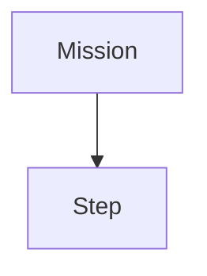

# Contributing to RaccoonOS Documentation

Thanks for helping improve the docs. This guide covers everything you need to add or edit pages — from front matter to prose style to the review process.

---

## Quick start

```bash
git clone https://github.com/htl-stp-ecer/documentation.git
cd documentation
hugo server -D          # live preview at http://localhost:1313
```

---

## Where to put things

Each top-level folder under `content/` is a section. The numeric prefix controls sidebar order — don't change it unless you're reshuffling the whole section.

| Section | Covers |
|---------|--------|
| `00-quick-start/` | First-time setup |
| `01-botui/` | BotUI web dashboard |
| `02-programming/` | LibSTP SDK — missions, steps, sensors, drive |
| `02-programming/algorithms/` | Self-contained algorithm explanations |
| `03-web-ide/` | Web IDE panels and workflows |
| `04-raccoon-cli/` | One page per `raccoon` CLI command |
| `05-api-reference/` | Auto-generated — do not edit by hand |
| `06-firmware/` | Firmware internals — SPI, motor control, data pipeline |

If your page doesn't fit anywhere, open an issue first and discuss where it belongs.

---

## Creating a page

Use `hugo new` to get a correctly stamped file:

```bash
hugo new 02-programming/my-topic.md
```

This creates a draft with the right front matter. Open it and fill in the fields:

```yaml
---
title: "My Topic"
author: "Your Name"
date: 2026-04-12       # YYYY-MM-DD
draft: false           # set to false when ready to publish
weight: 60             # lower = earlier in the sidebar
description: "One sentence — shown in search and in llms.txt."
---
```

`weight` slots your page into the section's order. Look at neighbouring pages' weights to pick a sensible number. Gaps of 10 between pages make it easy to insert later.

### Section index pages

Each folder can have an `_index.md` that renders as the section landing page. If you add a new section, include one with a table linking to every page in the section — see `content/02-programming/_index.md` for the pattern.

---

## Writing style

The docs voice is: **second person, present tense, concrete**.

**Do**

- Lead with what the reader is about to do. "You define a robot..." not "This section explains how to define a robot..."
- Show the artefact. If a command produces files, include the directory tree. If it produces a class, include the class body.
- Use tables for flags and options. Use prose for behaviour and concepts.
- Use `` for internal links — never hard-code absolute URLs.
- Use blockquotes as callout boxes for notes and warnings. The default `>` blockquote renders as an amber-bordered card.

**Don't**

- Summarise at the end. The reader just read the page.
- Use exclamation marks, emoji, or marketing language.
- Put a heading immediately after another heading without any prose in between.
- Bold entire sentences. Bold is for one or two words that the eye must catch.

### Code blocks

Always specify a language for syntax highlighting:

````markdown
```python
drive_forward(25).until(on_black(Defs.front.right))
```

```bash
raccoon run MyMission
```
````

File paths and CLI commands inline use backticks: `raccoon connect`, `robot.py`, `data/dsl_steps.json`.

### Front matter dates

Use absolute `YYYY-MM-DD` dates. Never "last week" or "recently".

---

## Shortcodes

The site ships two custom shortcodes:

### `dsl-steps`

Renders the auto-generated DSL step catalog from `raccoon-lib`. Accepts an optional `tag` filter:

```

```

Without a tag it renders all public steps. Used on `05-api-reference/01-available-steps.md`.

### Mermaid diagrams

Fenced code blocks with language `mermaid` render as diagrams:

````markdown

````

---

## Submitting a change

1. Fork the repo and create a branch: `git checkout -b my-topic`
2. Write your page, run `hugo server -D` locally, and check it looks right.
3. Commit with a clear message: `Add IR shielding section to sensors page`
4. Open a pull request against `main`. Describe what you added and why.
5. CI will build the site — a green check means Hugo accepted your Markdown.
6. A maintainer will review and merge. Changes go live within a minute of merge.

### Things that will block a merge

- `draft: true` left in front matter
- Broken internal links (Hugo errors at build time)
- Pages that duplicate content already covered elsewhere without linking back
- Prose that references unreleased or undocumented behaviour

---

## Updating the design

See [DESIGN.md](DESIGN.md) for the full design system — colours, typography, components, and voice. The CSS source of truth is `static/css/style.css`.

If you change layout files under `layouts/`, test with `hugo server` and check both mobile and desktop widths.

---

## Questions

Open an issue on GitHub. For anything urgent, reach out to the maintainers listed in `content/contributors/_index.md`.
