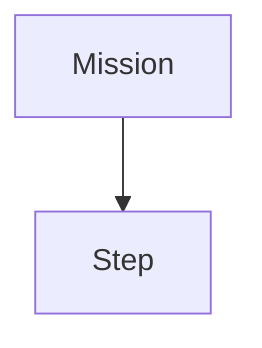

<div align="center">
  
</div>

---

## Quick start

**Prerequisites:** Hugo **extended edition** is required — the standard edition will fail with CSS errors. Install it with:

```bash
# macOS
brew install hugo

# Debian/Ubuntu (installs extended by default on recent releases)
sudo apt install hugo

# Windows
winget install Hugo.Hugo.Extended
```

Then clone and serve:

```bash
git clone https://github.com/htl-stp-ecer/documentation.git
cd documentation
hugo server -D          # live preview at http://localhost:1313
```

### Local development note — `data/dsl_steps.json`

`data/dsl_steps.json` is the step catalog that powers the Available Steps page. It is **committed to this repository**, so it works on a fresh clone. However, in CI the file is overwritten by the latest release artifact from `raccoon-lib` (CI workflow step "Fetch library API docs"). This means the committed file may lag slightly behind the very latest library release.

If you want to regenerate the catalog from local source:

1. Clone (or have) the `raccoon-lib` repo alongside this one.
2. From its root, run:

   ```bash
   python3 docs/generate_dsl_catalog.py
   ```

3. Copy the output to this repo:

   ```bash
   cp raccoon-lib/docs/_build/dsl-steps.json documentation/data/dsl_steps.json
   ```

The Available Steps page will then reflect your local library version.

---

## Where to put things

Each top-level folder under `content/` is a section. The numeric prefix controls sidebar order — don't change it unless you're reshuffling the whole section.

| Section | Covers |
|---------|--------|
| `00-quick-start/` | First-time setup |
| `01-botui/` | BotUI web dashboard |
| `02-programming/` | raccoon SDK — missions, steps, sensors, drive |
| `02-programming/algorithms/` | Self-contained algorithm explanations |
| `03-web-ide/` | Web IDE panels and workflows |
| `04-raccoon-cli/` | One page per `raccoon` CLI command |
| `05-api-reference/` | Auto-generated — do not edit by hand |
| `06-firmware/` | Firmware internals — SPI, motor control, data pipeline |

If your page doesn't fit anywhere, open an issue first and discuss where it belongs.

---

## Creating a page

```bash
hugo new 02-programming/my-topic.md
```

Fill in the front matter:

```yaml
---
title: "My Topic"
author: "Your Name"
date: 2026-04-12       # YYYY-MM-DD
draft: false           # set false when ready to publish
weight: 60             # lower = earlier in the sidebar
description: "One sentence — shown in search and in llms.txt."
---
```

Pick `weight` by looking at neighbouring pages. Gaps of 10 make it easy to insert later.

### Section index pages

Each folder can have an `_index.md` that renders as the section landing page. If you add a new section, include one with a table linking every page — see `content/02-programming/_index.md` for the pattern.

---

## Writing style

The docs voice is second person, present tense, and concrete.

**Do**

- Lead with what the reader is about to do: "You define a robot..." not "This section explains..."
- Show the artefact. If a command produces files, include the directory tree. If it produces a class, include the class body.
- Use tables for flags and options, prose for behaviour and concepts.
- Use `` for internal links — never hard-code absolute URLs to other doc pages.
- Use `>` blockquotes as callout boxes for notes and warnings — they render as amber-bordered cards.

**Don't**

- Summarise at the end. The reader just read the page.
- Use exclamation marks, emoji, or marketing language.
- Put a heading immediately after another heading without prose between them.
- Bold entire sentences. Bold is for one or two words the eye must catch.

### Code blocks

Always specify a language:

````markdown
```python
drive_forward(25).until(on_black(Defs.front.right))
```

```bash
raccoon run MyMission
```
````

File paths and CLI commands inline use backticks: `raccoon connect`, `robot.py`.

---

## Shortcodes

### `dsl-steps`

Renders the auto-generated step catalog from `raccoon-lib`. Accepts an optional `tag` filter:

```

```

Used on `05-api-reference/01-available-steps.md`. Don't use it elsewhere.

### Mermaid diagrams

Fenced code blocks with language `mermaid` render as diagrams:

````markdown

````

---

## Submitting a change

1. Fork the repo and create a branch: `git checkout -b my-topic`
2. Write your page and verify it locally with `hugo server -D`.
3. Commit with a clear message: `Add IR shielding section to sensors page`
4. Open a pull request against `main`. Describe what you added and why.
5. CI builds the site — a green check means Hugo accepted your Markdown.
6. A maintainer will review and merge. Changes go live within a minute.

### What blocks a merge

- `draft: true` left in front matter
- Broken internal links (Hugo errors at build time)
- Pages duplicating content already covered elsewhere without cross-linking
- Prose referencing unreleased or undocumented behaviour

---

## Design

See [DESIGN.md](DESIGN.md) for colours, typography, components, and voice. The CSS source of truth is `static/css/style.css`. If you change anything under `layouts/`, test at both mobile and desktop widths.

---

## Questions

Open an issue on GitHub or reach out to the maintainers listed in `content/contributors/_index.md`.
