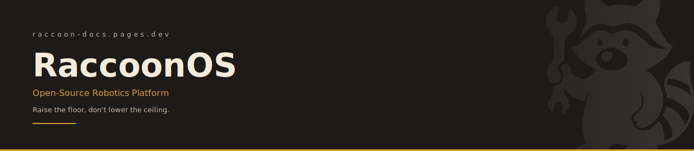

<div align="center">
  
</div>

<div align="center">

[](https://github.com/htl-stp-ecer/documentation/actions/workflows/hugo.yml)
[](LICENSE)
[](https://raccoon-docs.pages.dev)

</div>

---

Source for the [RaccoonOS](https://raccoon-docs.pages.dev) documentation site — an open-source robotics platform for Botball competitions. Built with [Hugo](https://gohugo.io/) and deployed to Cloudflare Pages on every push to `main`.

---

## Local development

**Prerequisites:** Hugo extended edition.

```bash
# macOS
brew install hugo

# Debian/Ubuntu
sudo apt install hugo

# Windows
winget install Hugo.Hugo.Extended
```

**Run the dev server:**

```bash
git clone https://github.com/htl-stp-ecer/documentation.git
cd documentation
hugo server -D
```

Open `http://localhost:1313`. The server reloads on every file save. `-D` renders draft pages.

**Build for production:**

```bash
hugo --minify --cleanDestinationDir
```

Output lands in `public/`.

---

## Content structure

```
content/
  00-quick-start/       Getting started guide
  01-botui/             BotUI web interface
  02-programming/       raccoon SDK and DSL reference
    algorithms/         Algorithm deep-dives (line following, lineup, etc.)
  03-web-ide/           Web IDE usage
  04-raccoon-cli/       raccoon CLI command reference
  05-api-reference/     Auto-generated from raccoon-lib CI — do not edit
  06-firmware/          Firmware internals
  contributors/         Contributor listing
```

Section folders use numeric prefixes to control sidebar order. Pages use `weight` in front matter to control order within a section.

---

## Adding a page

```bash
hugo new 02-programming/my-new-topic.md
```

Edit the generated front matter:

```yaml
---
title: "My New Topic"
author: "Your Name"
date: 2026-04-12
draft: false
weight: 60
description: "One sentence shown in search and in llms.txt."
---
```

Then open a pull request against `main`. See [CONTRIBUTING.md](CONTRIBUTING.md) for style rules, shortcodes, and the full review process.

---

## AI / LLM access

Every build produces two machine-readable files:

| File | Purpose |
|------|---------|
| [`/llms.txt`](https://raccoon-docs.pages.dev/llms.txt) | Index — title, URL, description for every page |
| [`/llms-full.txt`](https://raccoon-docs.pages.dev/llms-full.txt) | Full content of every page in one file |

These follow the [llms.txt spec](https://llmstxt.org/) so AI assistants can read the docs without scraping HTML.

---

## License

Content is licensed under [CC BY 4.0](https://creativecommons.org/licenses/by/4.0/) — see [LICENSE](LICENSE).
Copyright (C) 2026 Tobias Madlberger and contributors.
