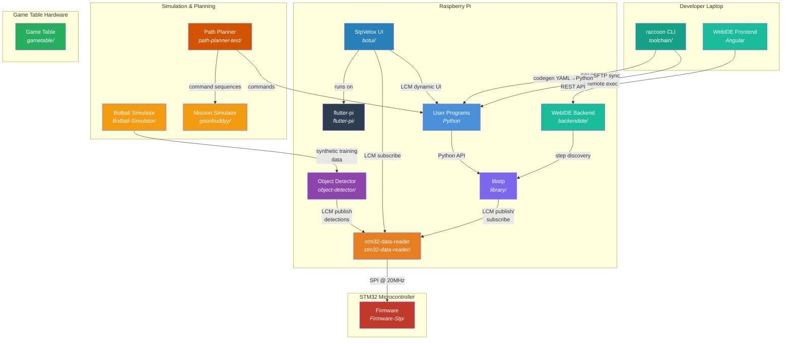
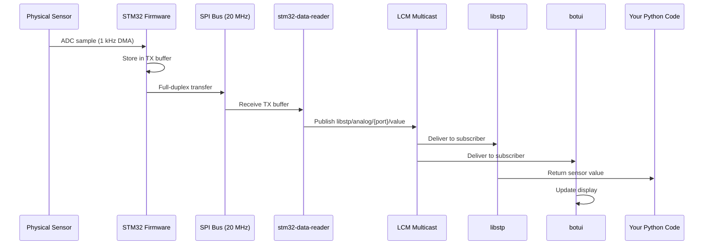
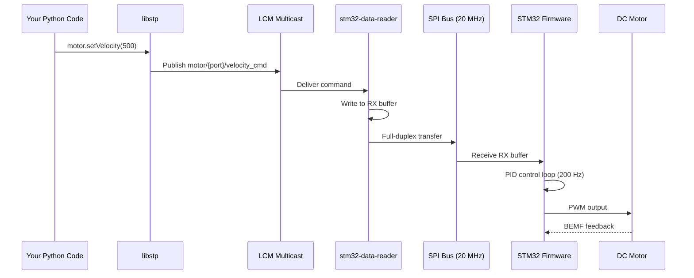
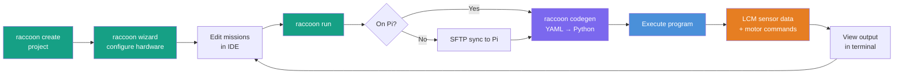
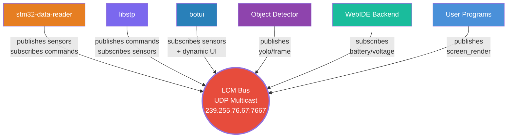

# Raccoon System Architecture

## The Big Picture

Raccoon is a layered system where each component has a clear responsibility. Data flows from hardware sensors up through firmware, across SPI to the Raspberry Pi, then out via LCM messaging to any consumer -- the library, UI, simulators, or vision systems.

```mermaid
block-beta
    columns 1
    block:user["User Programs (Python) — Missions, Steps, Motion Commands"]
    end
    space
    block:lib["libstp (C++20 + Python bindings) — Drive, Motion, Kinematics, Odometry, Calibration"]
    end
    space
    block:bridge["stm32-data-reader (C++20, runs on Pi) — SPI ↔ LCM bridge"]
    end
    space
    block:fw["STM32 Firmware (bare-metal C) — Motor PID 200Hz, BEMF, IMU fusion, ADC, Servos"]
    end
    space
    block:hw["Physical Hardware — 4 DC Motors, 4 Servos, MPU9250 IMU, Analog/Digital Sensors"]
    end

    user --> lib
    lib --> bridge
    bridge --> fw
    fw --> hw

    style user fill:#4a90d9,color:#fff
    style lib fill:#7b68ee,color:#fff
    style bridge fill:#e67e22,color:#fff
    style fw fill:#c0392b,color:#fff
    style hw fill:#27ae60,color:#fff
```

## How the Repositories Connect

This diagram shows how all 12 repositories in the Raccoon system interact:



## Data Flow: Sensor Reading

When your program reads a sensor value, here's what happens across the full stack:



## Data Flow: Motor Command

When your program commands a motor, the data flows in the opposite direction:



## Development Workflow

How the toolchain supports the development cycle:



## LCM Communication Hub

LCM (Lightweight Communications and Marshalling) is the central nervous system. All components communicate through it via UDP multicast:



## Component Overview

### Hardware Layer

| Component | Chip | Role |
|-----------|------|------|
| Microcontroller | STM32F427VIT6 (Cortex-M4, 180 MHz) | Real-time motor control, sensor sampling |
| IMU | MPU9250 (9-axis) | Orientation, angular velocity, acceleration |
| Companion Computer | Raspberry Pi 4 | Runs all high-level software |
| Display | 800x480 touchscreen | Flutter UI for operator interaction |

### Software Stack

| Layer | Component | Language | Purpose |
|-------|-----------|----------|---------|
| Firmware | Firmware-Stp | C | Motor PID, BEMF, IMU, SPI slave |
| Bridge | stm32-data-reader | C++20 | SPI master, LCM publisher/subscriber |
| Library | libstp | C++20 + Python | Motion control, kinematics, calibration |
| Toolchain | raccoon CLI | Python | Project management, code generation |
| UI | botui (StpVelox) | Dart/Flutter | Touchscreen interface |
| UI Engine | flutter-pi | C | Flutter embedder for Raspberry Pi |
| IDE Backend | backendide | Python/FastAPI | WebIDE API, step discovery |
| Simulator | Botball-Simulator | C#/Unity | 3D physics simulation |
| Vision | object-detector | Python/PyTorch | YOLO object detection |
| Path Planning | path-planner-test | Python | Correction-aware navigation |

## Key Design Decisions

### LCM for Inter-Process Communication

All components communicate via LCM (Lightweight Communications and Marshalling) -- a UDP multicast publish-subscribe system. This means:

- Any number of consumers can subscribe to any channel
- The UI, library, and logging tools all see the same data simultaneously
- Components can be started, stopped, and restarted independently
- Adding new functionality doesn't require modifying existing components

### Separation of Real-Time and Application Logic

The STM32 handles all time-critical operations (motor PID at 200 Hz, BEMF sampling, IMU fusion at 50 Hz). The Raspberry Pi handles high-level logic (path planning, vision, mission sequencing). This split ensures motor control never misses a deadline, regardless of what the Pi is doing.

### Python for User Code, C++ for Performance

User-facing robot programs are written in Python for simplicity. Performance-critical code (kinematics, PID, odometry) is written in C++20 and exposed via pybind11 bindings. This gives users the ease of Python with the speed of C++.

## Repository Map

All repositories live under the Botball project directory:

| Directory | Repository | Description |
|-----------|-----------|-------------|
| `Firmware-Stp/` | STM32 firmware | Bare-metal motor control and sensor sampling |
| `stm32-data-reader/` | Pi-side SPI bridge | Reads STM32 data, publishes/subscribes via LCM |
| `library/` | libstp | Core robotics library (C++ + Python) |
| `toolchain/` | raccoon CLI | Developer tools, project scaffolding, remote dev |
| `backendide/` | WebIDE backend | FastAPI server for the web-based IDE |
| `botui/` | StpVelox UI | Flutter touchscreen interface |
| `flutter-pi/` | Flutter embedder | Runs Flutter apps on Raspberry Pi without X11 |
| `Botball-Simulator/` | 3D simulator | Unity physics simulation |
| `goonbuddyy/` | Mission simulator | Unity + Angular mission testing |
| `object-detector/` | Vision system | YOLO object detection pipeline |
| `path-planner-test/` | Path planner | Correction-aware path planning |
| `gametable/` | Game table | ESP32 firmware + Next.js web interface |
