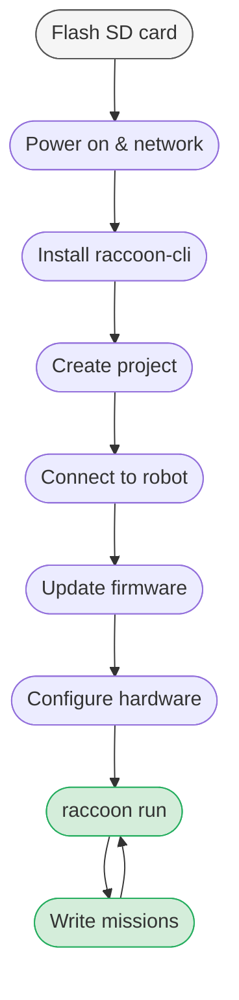

# Quick Start

From unboxed hardware to a driving robot in as few steps as possible.

---

## The zero-to-running-robot journey

Before diving into steps, here is the full picture of what you are about to do and where each piece fits:



The loop at the end is your normal development cycle: write code, run it on the robot, observe, refine. Everything else (flash, connect, update) is one-time setup.

---

## What You Need

**Hardware:**
- Wombat controller with RaccoonOS flashed to the SD card
- Battery pack
- At least 2 DC motors wired to motor ports
- **USB keyboard** — needed once to enter WiFi password on the Wombat

**On your laptop:**
- Python 3.13 or newer
- A terminal

---

## Step 1 — Flash the SD Card

Download the latest **RaccoonOS** image from:

> **[github.com/htl-stp-ecer/raccoon-image/releases](https://github.com/htl-stp-ecer/raccoon-image/releases)**

Grab the `.img.xz` file from the most recent release. Then flash it to your SD card:

Use **[Raspberry Pi Imager](https://www.raspberrypi.com/software/)** (Windows, macOS, Linux):
1. Click **Choose OS** → **Use custom** → select the `.img.xz` file
2. Click **Choose Storage** → select your SD card
3. Click **Next** and confirm — it will flash and verify automatically

Alternatively, [Balena Etcher](https://etcher.balena.io/) works just as well: **Flash from file** → select the `.img.xz` → **Select target** → **Flash!**

Then unscrew the lid on the **back** of the Wombat, insert the SD card, and close it up again.

> If your SD card was pre-flashed (e.g. at a workshop), skip to Step 2.

> **Important:** After flashing a new SD card, the Wombat's STM32 co-processor firmware also needs to be updated. Once you've completed setup and can reach the robot, run `raccoon update` (see [Step 6](#step-6--update)) to flash the latest STM32 firmware.

---

## Step 2 — Power On & Connect to a Network

Connect the battery and power on the Wombat. After a few seconds the **BotUI** touchscreen dashboard appears — that's your confirmation it booted correctly.

The Wombat supports three connection modes. Open **Settings → WiFi** in BotUI to choose one:

| Mode | When to use |
|------|-------------|
| **WiFi Client** | Join your existing WiFi network |
| **Hotspot** | Wombat creates its own network — your laptop connects to it |
| **LAN** | Plug in an ethernet cable (peer-to-peer also works) |

For **WiFi Client** mode:
1. Select **WiFi Client** from the dropdown and click **Connect to WiFi**
2. Scroll to your network and tap it
3. Enter the password using a **USB keyboard** plugged into the Wombat
4. When the status turns green, go back and tap **Device Info** to see the IP address

> Note the IP — you'll need it shortly. Example: `192.168.178.124`

**If the robot isn't reachable after connecting:** this is a known network manager issue. Reboot the Wombat and it will reconnect.

→ See [BotUI documentation]() for full detail on all connection modes.

---

## Step 3 — Install raccoon-cli

raccoon-cli is the tool you use to manage projects, generate code, and run programs on the robot.

**Requires Python 3.13+.**

Install from PyPI:

```bash
pip install raccoon-cli
```

> **Ubuntu/Debian:** pip may refuse with `externally-managed-environment`. Add `--break-system-packages`:
> ```bash
> pip install --break-system-packages raccoon-cli
> ```

If you explicitly need release artifacts instead of PyPI, use the wheels from:

> **[github.com/htl-stp-ecer/raccoon-cli/releases](https://github.com/htl-stp-ecer/raccoon-cli/releases)**

> **"raccoon: command not found"** after installing? Make sure Python's script directory is in your `$PATH`.

Verify it worked:

```bash
raccoon -h
```

You should see a list of available commands.

---

## Step 4 — Create a Project

raccoon only works inside a project folder. Create one first:

```bash
raccoon create project MyRobot
cd MyRobot
```

The `raccoon create project` wizard asks for your drivetrain type, motor ports, and other basics. This generates the complete project skeleton:

```
MyRobot/
├── raccoon.project.yml       # top-level config — includes all sub-configs
├── config/
│   ├── hardware.yml          # sensors, motors, servos
│   ├── motors.yml            # motor port assignments and calibration
│   ├── missions.yml          # ordered list of missions to run
│   └── robot.yml             # kinematics, PID, physical dimensions
└── src/
    ├── main.py               # entry point: Robot().start()
    ├── hardware/
    │   ├── defs.py           # auto-generated hardware definitions
    │   └── robot.py          # auto-generated robot class
    └── missions/
        └── m000_setup_mission.py
```

→ See [Project Structure]() for a full explanation of every generated file.

---

## Step 5 — Connect to the Robot

```bash
raccoon connect 192.168.178.124
```

Replace the IP with the one shown on your Wombat's screen.

On first connect, raccoon will attempt SSH key authentication. If that fails it asks:
> *"Set up SSH key authentication now?"*

Say **yes**. When prompted for a password, use the Wombat's default credentials:
- **User:** `pi`
- **Password:** `raspberrypi`

raccoon will create an SSH key, copy it to the Wombat, and save an API token. From here on, no password is needed.

> **Security:** Change the default password once your setup is complete.

If the robot's IP ever changes, just re-run `raccoon connect <new-IP>`.

---

## Step 6 — Update

If raccoon warns about a version mismatch between your laptop and the robot, run:

```bash
raccoon update
```

This checks both sides against the current bundle target and updates anything that's out of date.

---

## Step 7 — Configure Your Hardware

`raccoon create project` already asked you for basic hardware settings (drivetrain type, motor ports, etc.) during project creation. If you need to change anything later, run the interactive wizard:

```bash
raccoon wizard
```

It walks you through drivetrain type, motor ports, inversion, and robot dimensions. Answers are saved to `raccoon.project.yml` and the `config/` files.

**The most critical setting:** all motors must spin **forward** when given a positive power command. Decide which direction is "forward" for your robot, then set `inverted: true` in `config/motors.yml` for any motor that spins the wrong way.

> The Wombat can be mounted in any orientation — the software accounts for it.

→ See [Robot Definition]() for the full YAML reference.

---

## Step 8 — Run It

```bash
raccoon run
```

This does everything in one command:
1. Saves a local checkpoint (safety snapshot)
2. Runs code generation **locally on your laptop** — generates `defs.py` and `robot.py` from your YAML config
3. Syncs your files (including the generated ones) to the robot
4. Executes `src/main.py` on the robot, streaming output to your terminal
5. Pulls any files updated on the robot back to your laptop

You should see the robot boot, run the setup mission, and wait. Press **Ctrl+C** to stop.

A fresh project has no missions yet — you'll see:
```
warning  | [Robot]: Robot does not have any missions attached
```
That's expected. The robot is running correctly.

---

## Step 9 — Test Basic Motion

Create a smoke test mission:

```bash
raccoon create mission M010SmokeMission
```

Mission names use a **three-digit** zero-padded prefix. `M000` is reserved for the setup mission, `M999` for shutdown, and regular missions start at `M010` and increment by 10 (`M010`, `M020`, `M030`, …).

Open the generated file in `src/missions/m010_smoke_mission.py` and add a simple sequence:

```python
from raccoon import *


class M010SmokeMission(Mission):
    def sequence(self) -> Sequential:
        return seq([
            drive_forward(30),   # drive 30 cm forward
            turn_right(90),      # turn 90° right
        ])
```

Then register it in `config/missions.yml`:

```yaml
- M000SetupMission: setup
- M010SmokeMission
```

Run it:

```bash
raccoon run
```

The robot should drive forward and turn. Distance and straightness may be off — that's fine for now. What matters is that it moves in the right direction.

**If it doesn't move at all:** check `config/motors.yml` — are the port numbers correct, and is `inverted` set correctly for each motor?

→ See [Missions]() and [Steps]() for the full API.

---

## What Comes Next

Your robot is running. Here's where to go from here:

| Topic | Where |
|-------|-------|
| Make it drive accurately | [Calibration]() |
| Add sensors, servos, and other hardware | [Robot Definition]() — edit `raccoon.project.yml` |
| Writing real missions | [Missions]() |
| Stop conditions, chaining, timing | [Stop Conditions]() |
| Sensors, servos, drive system | [Programming Guide]() |
| Configure sensor positions visually | [Web IDE]() — run with `raccoon web` |
| All CLI commands explained | [raccoon-cli reference]() |
| What you can do from the touchscreen | [BotUI]() |

---

## A real first mission from a competition robot

The examplebot (a real competition entry) uses this exact pattern for a simple three-mission run. Its setup mission homes the arm, calibrates sensors, and waits for the light — all in one method:

```python
from raccoon import *
from src.hardware.defs import Defs


class M000SetupMission(SetupMission):
    def sequence(self) -> Sequential:
        return seq([
            # Home hardware to known starting positions
            Defs.arm_servo.up(),
            Defs.claw_servo.open(),

            # Calibrate distance accuracy and IR sensors.
            # distance_cm=50 gives more accurate results than the default 30 cm.
            calibrate(distance_cm=50),

            # wait_for_light() is injected automatically by SetupMission
            # after sequence() returns — do not call it here.
        ])
```

The robot then drives, grabs an object, and returns — building up from `drive_forward` to `parallel()` and `.until()` stop conditions. When you are ready to build a real mission sequence, the [Programming Guide]() has everything.

---

## Optional: IDE Setup

Open the project folder in your preferred IDE (PyCharm, VS Code, etc.). You'll have full tab completion on all `raccoon` types out of the box — no special interpreter configuration needed. Stubs are provided for the `raccoon.*` namespace and are installed alongside the library.
