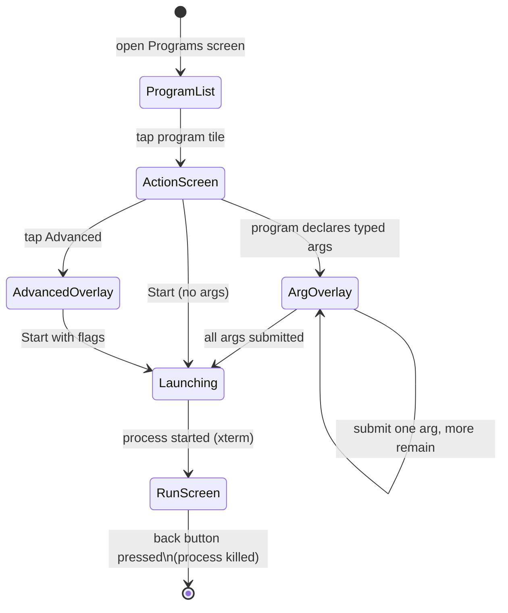

# Programs

The Programs screen lists all executable robot programs stored on the Pi. Tap any tile to open its detail screen and launch it.


## Concept

A "program" in BotUI is any directory under the programs folder that contains a `run.sh` script. BotUI does not know about raccoon missions, steps, or Python — it simply launches `run.sh` and streams the process output to a terminal widget. The raccoon toolchain (`raccoon sync`) is responsible for placing the right code there; BotUI just exposes a launch button and a console.

The one thing BotUI adds on top of raw script execution is **sync state visibility**: the version chip on each program tile shows whether the code was pushed by the raccoon toolchain and when. This is the primary competition-day check that you are running the code you think you are.

### Program Launch Lifecycle



## Project Descriptors

BotUI discovers programs by scanning the programs directory for subdirectories. Each subdirectory is treated as one program. BotUI reads metadata from project descriptor files in the following priority order:

1. **`raccoon.project.yml`** (preferred) — YAML file that defines the program `name`. The run script is always `run.sh` when this file is present.
2. **`project.json`** (fallback) — JSON file that can define `name`, `run_script` (defaults to `run.sh` if absent or empty), and typed launch `args`.

If neither descriptor exists, BotUI uses the directory name as the program name and `run.sh` as the run script.

Example `raccoon.project.yml`:

```yaml
name: "Autonomous Mission A"
```

Example `project.json` (legacy format, also supports typed arguments):

```json
{
  "name": "Autonomous Mission A",
  "run_script": "run.sh",
  "args": [
    { "type": "boolean", "name": "skip_intro" },
    { "type": "number",  "name": "target_score" }
  ]
}
```

## Sync State Version Chip

Every program tile displays a small version chip in its bottom-right corner:

- **`v3`** (green) — the program has been pushed from a development machine at least once, and the displayed number is the push counter (incremented by `raccoon sync` on every verified push).
- **`NOT SYNCED`** (red) — no `.raccoon/sync_state.json` file exists, meaning this program has never been pushed through the raccoon toolchain. The files on the Pi may be manually placed or stale.

The same chip appears in the top-right corner of the program's detail and run screens. When a synced program is open, a **Sync Details Card** below the Start button shows the full version number, last sync timestamp, who pushed it (e.g. `tobias@laptop`), and the SHA-256 content fingerprint. Always verify this information before running a program in competition — it confirms you are executing the code that was last verified and pushed.

The sync state is read from `<programDir>/.raccoon/sync_state.json` at startup. This file is written by `raccoon sync` on the toolchain side and is never modified by BotUI itself.

## Starting a Program

Tapping a program tile on the selection screen opens **ProgramActionScreen**, which shows a single large **Start** button alongside the Sync Details Card.

Tapping **Start** may show one or more **argument overlay** screens if the program declares typed arguments in `project.json`. Each overlay presents one argument at a time with an appropriate input widget (toggle for boolean, number pad for numeric). Tap **Submit** on each overlay to advance. Once all arguments are filled in, the program launches.

### Terminal Output

When the program is running, the screen switches to a full-screen **xterm terminal view** that streams the program's stdout/stderr output in real time. The terminal uses 14 pt DejaVu Sans Mono font. Navigating away from the screen (using the back button) stops the program.

## Advanced Launch Options

In addition to **Start**, the program run screen also has an **Advanced** button (grey, tune icon). Tapping it opens an overlay with two toggle switches:

| Flag | Default | Effect |
|------|---------|--------|
| `--dev` | Off | Passes `--dev` to the program's run script, enabling development-mode behaviour (defined by the program itself). |
| `--no-calibrate` | Off | Passes `--no-calibrate` to the run script, skipping any hardware calibration step the program would otherwise perform at startup. |

After toggling the desired flags, tap **Start** inside the Advanced overlay to launch with those flags applied. Tap **Cancel** to dismiss the overlay without launching.

Use `--no-calibrate` when you need a fast restart during testing and the calibration step has already been completed in an earlier run. Use `--dev` to activate verbose logging or other developer conveniences your program implements.

> **Note:** `--dev` and `--no-calibrate` are forwarded to `run.sh` as command-line arguments. They only have an effect if `run.sh` reads and acts on `$@`. The raccoon scaffold's `run.sh` passes all arguments to the Python entry point, where `--no-calibrate` suppresses `SetupMission.sequence()` calibration steps.


