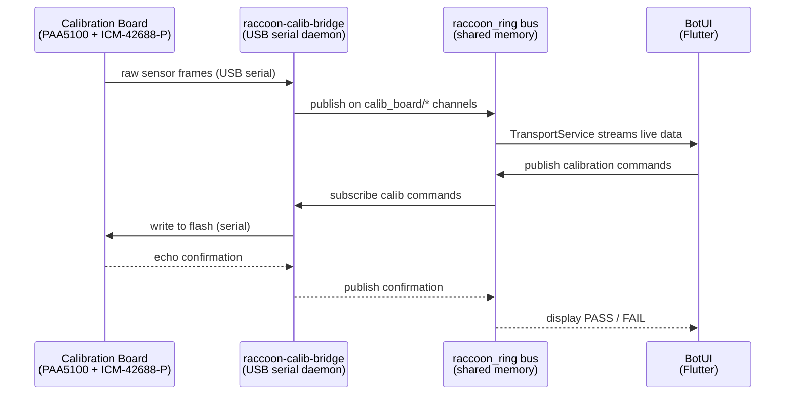

# Calibration Board

The Calibration Board is an external USB-C–connected daughterboard that carries additional sensors used for precision odometry and IMU calibration. It connects via a serial bridge (`raccoon-calib-bridge`) that publishes sensor data and accepts calibration commands over LCM.

## Concept

### Why a Separate Board?

The Wombat's built-in IMU gives heading and orientation, but it cannot measure lateral displacement directly. The Calibration Board adds a **PAA5100 optical-flow sensor** (like the sensor in a computer mouse, facing down at the floor) and an **ICM-42688-P 6-DoF IMU**. Together these two sensors feed a position estimator that reports robot pose in 2D without wheel encoders — useful for mecanum-drive robots where wheel-encoder odometry is unreliable.

BotUI is the calibration interface for these sensors. The values you save here are written to the board's own flash memory and are loaded automatically by the raccoon odometry subsystem when the board is connected.

### Data Flow



The board's **Calib Board** tile is always visible on the Sensors & Actors selection screen. Its visual state tells you whether the board is reachable:

| Tile state | Meaning |
|---|---|
| Green / "ok" | Board is connected and the bridge reports the port (e.g. `/dev/ttyACM0`) |
| Grey / "USB-C not connected" | Board is absent or the bridge has not yet reported a connection |

You do not need to restart BotUI after connecting the board. The status updates live as the bridge publishes on its status channel.

Source: `botui/lib/features/sensors/presentation/screens/sensor_selection_screen.dart:124-142`

---

## Top-Level Sub-Menu

Tapping the Calib Board tile opens `CalibBoardScreen`, which presents four sub-tiles. The AppBar displays the currently connected USB port.

```
┌─────────────────┬──────────────────┐
│  Optical Flow   │   ICM (IMU)      │
│  (PAA5100)      │   (ICM-42688-P)  │
├─────────────────┼──────────────────┤
│  Odometry       │   BNO (Fusion)   │
│  PAA + IMU      │   ⚠ not present  │
└─────────────────┴──────────────────┘
```

Each tile has a status indicator inherited from the bridge:

| Tile | Chip / feature | Status source |
|---|---|---|
| **Optical Flow** | PAA5100 optical-flow sensor | `calibBoardStatusProvider.paa` |
| **ICM (IMU)** | ICM-42688-P 6-DoF IMU | `calibBoardStatusProvider.icm` |
| **Odometry** | PAA + ICM fusion (available when ICM is ok) | Mirrors `icm` state |
| **BNO (Fusion)** | BNO08x — hardware not present on current boards | Always `unavailable` |

Only tiles whose status is `ok` are interactive. Grey tiles are displayed but cannot be tapped.

Source: `botui/lib/features/calib_board/presentation/screens/calib_board_screen.dart`

---

## Optical Flow — PAA5100

Tapping **Optical Flow** opens `CalibPaaScreen`, a 6-tile grid giving access to every diagnostic and calibration sub-screen for the PAA5100 downward-facing optical-flow sensor.

### PAA5100 Sub-Screens

#### Delta (dx / dy)

`CalibPaaDeltaScreen` shows a dual-line rolling chart of the raw sensor output: `dX` (red) and `dY` (green) in sensor counts per sample. The Y-axis is fixed at ±32 counts, which covers typical robot motion. Values above this clip at the chart boundary.

A live readout chip above the chart shows the instantaneous dx and dy values.

Use this screen to verify that the sensor is tracking correctly and to observe the sign convention of each axis relative to robot motion.

#### SQUAL (Surface Quality)

`CalibPaaSqualScreen` shows the PAA5100's surface-quality metric, an integer in the range 0–169. Higher values mean the sensor is detecting more trackable features on the surface beneath it.

| SQUAL value | Verdict | Bar colour |
|---|---|---|
| ≥ 60 | Good | Green |
| 40–59 | Acceptable | Orange |
| < 40 | Poor tracking | Red |

Poor SQUAL usually means the surface is too shiny, too dark, too uniform, or the sensor is mounted at the wrong height. The calibration wizard (see below) requires a SQUAL above 40 to record a clean move.

#### Shutter

`CalibPaaShutterScreen` shows the PAA5100's 16-bit shutter (exposure) register over time. The Y-axis spans 0–65535. A consistently high shutter value indicates a dark surface or incorrect sensor height.

#### Track

`CalibPaaTrackScreen` shows accumulated optical-flow accumulator values in raw counts, useful for verifying the sensor is incrementing monotonically during a straight-line move.

#### Calibration (Scale Wizard)

`CalibPaaCalibrationScreen` is a guided 6-step wizard that measures and saves the **counts-per-centimetre** scale factors for the X and Y axes.

**Why this matters:** the robot's odometry converts raw optical-flow counts to centimetre displacements using cx and cy scale factors. If these are wrong, every distance the robot believes it has travelled will be proportionally off. The wizard measures the true scale empirically using physical robot movement.

**Setup parameters** (adjusted before the wizard starts):

| Parameter | Default | Range | Description |
|---|---|---|---|
| Distance | 30 cm | 5–200 cm | Physical distance you will push the robot each trial |
| Sensor height | 19.0 mm | 5–50 mm | Mounting height of the PAA5100 above the floor |
| Tries / axis | 3 | 1–5 | Number of trials averaged together per axis |

**Wizard steps:**

1. **Setup** — Review current calibration values (`cx`/`cy` counts/cm or "Not calibrated yet"), set the three parameters above, tap **Start**.
2. **Move X** — Push the robot along its X axis by the chosen distance. The screen shows live dX and dY counts and highlights which sensor axis is dominant. If the move is too short (< 100 counts net) or diagonal (secondary/primary > 0.75), a warning is shown and the **Record move** button is disabled. Tap **Record move** once the indicator shows "Ready". Repeat for each trial.
3. **Move Y** — Same procedure along the Y axis. The wizard checks that the Y move activates a different sensor axis than X (i.e. the robot was rotated 90° between measurements); if the same axis fires, it prompts "Same channel as X — turn the robot 90°".
4. **Save** — Review the averaged cx and cy values (counts/cm) and the sensor height. Tap **Save to flash** to write the calibration to the board's non-volatile flash.
5. **Saving** — A spinner is displayed while BotUI waits for the board to confirm the write by echoing the values back on its status channel.
6. **Done** — Confirmation showing the persisted cx, cy, and height. A **Run again** button restarts the wizard.

Source: `botui/lib/features/calib_board/presentation/screens/calib_paa_calibration_screen.dart`

#### Offset (Rotation-Centre Correction)

`CalibPaaOffsetScreen` configures the X/Y offset of the PAA5100 sensor from the robot's true centre of rotation (in millimetres, body frame).

**Why this matters:** when the robot rotates in place, a sensor not mounted at the centre of rotation sees apparent linear movement. This creates false odometry drift proportional to the sensor's offset from the rotation centre. Entering the correct offset allows the bridge's odometry integrator to subtract the rotation-induced artefact.

**Workflow:**

1. Tap the X-offset or Y-offset field to select it, then use the on-screen numeric keypad to enter the value in mm. Use the ± button to toggle the sign.
2. Tap **Save to flash**. BotUI waits for the board to confirm the value (within 0.05 mm tolerance).
3. After saving, a **Verify** step appears: tap **Start rotation test**, spin the robot in place by at least 360°, then tap **Stop**. BotUI shows:
   - **Drift now** (current distance from origin, cm)
   - **Worst drift** (maximum distance seen during the test, cm)
   - **Rotated** (accumulated heading change, °)
   - A PASS / FAIL verdict: PASS if worst drift ≤ 2.0 cm after ≥ 360° of rotation.

If the test fails, tap **Edit offset** to adjust and retry.

Source: `botui/lib/features/calib_board/presentation/screens/calib_paa_offset_screen.dart`

---

## ICM IMU — ICM-42688-P

Tapping **ICM (IMU)** opens `CalibIcmScreen`, a 5-tile grid for the ICM-42688-P 6-DoF IMU on the calibration board. All sub-tiles are enabled when the ICM status is `ok` and greyed-out otherwise.

### ICM Sub-Screens

#### Accelerometer

`CalibIcmAccelScreen` shows a three-axis rolling chart of the ICM accelerometer output. The Y-axis is fixed at ±2 g, which covers the expected range for a Botball robot (rarely exceeds 1.5 g under normal operation).

A live readout row shows X, Y, Z in g and the vector magnitude ‖a‖. The chart samples at 60 Hz UI update rate.

#### Gyroscope

`CalibIcmGyroScreen` shows a three-axis rolling chart of the ICM gyroscope output. The Y-axis is fixed at ±500 dps. The live readout shows X, Y, Z in degrees per second.

Note: the values shown here are the **bias-corrected** rates output by the firmware's EMA filter, not raw sensor output. To observe the raw bias, use the Calibration sub-screen.

#### Temperature

`CalibIcmTempScreen` shows the ICM die temperature over a 60-second rolling history (sampled at 10 Hz). The Y-axis spans 20–60 °C. The current temperature is shown as a large numeric readout at the top.

IMU temperature is relevant because gyroscope bias drifts with temperature. The Calibration sub-screen allows you to save the bias at operating temperature.

#### Orientation

`CalibIcmOrientationScreen` presents a full-screen **attitude indicator** (artificial horizon) driven by the Madgwick-filter Euler angles from the ICM:

- The blue/brown horizon rotates and pitches to reflect Roll and Pitch.
- A pitch scale (10° tick marks) overlays the horizon.
- A fixed aircraft symbol remains centred.
- A compass rose in the top-right corner shows Yaw with a north marker.

Numeric readouts for Roll, Pitch, and Yaw (all in degrees) are displayed below the horizon.

Use this screen to verify IMU mounting orientation and filter convergence without needing to read raw quaternion values.

Source: `botui/lib/features/calib_board/presentation/screens/calib_icm_orientation_screen.dart`

#### Calibration (Gyro Bias)

`CalibIcmCalibrationScreen` exposes the firmware's automatic gyro-bias learning and allows saving the current bias to flash.

**How the firmware learns bias:** The firmware module `imu_fusion` continuously monitors the ICM output. When gyro magnitude is below 1.5 dps **and** accelerometer magnitude is approximately 1 g for at least 800 ms, the board declares itself "at rest" and begins converging the gyro bias via an exponential moving average (EMA, α = 0.001 at 1 kHz → ~1 s time constant).

**Screen elements:**

- **AT REST / MOVING banner** — Green when the board is stationary enough for calibration to run; orange while in motion.
- **Live gyro bias readout** — Shows the current EMA bias for X, Y, Z axes in dps (degrees per second) with 4 decimal places. Labelled "persisted in flash" or "not saved".

**Workflow:**

1. Place the calibration board (and robot) on a flat, vibration-free surface.
2. Wait for the banner to turn green (AT REST).
3. Wait 5–10 seconds for the bias values to stabilise.
4. Tap **Save to flash** (only enabled when AT REST). The firmware persists the current EMA values and confirms via the status channel.
5. Tap **Reset (RAM)** at any time to zero the in-RAM bias without touching flash — useful for resetting a bad estimate before re-converging.

Source: `botui/lib/features/calib_board/presentation/screens/calib_icm_calibration_screen.dart`

---

## Odometry

The **Odometry** tile opens `CalibOdometryScreen`, which shows the robot's estimated 2D pose computed by fusing PAA5100 optical-flow data with ICM quaternion orientation.

**What is displayed:**

- Live readouts of **X** (cm, world frame), **Y** (cm, world frame), **Heading** (°, yaw), and **‖p‖** (distance from origin, cm).
- A 2D path plot that traces the robot's trajectory from the moment the screen was opened (or last reset). The plot auto-scales with 15 % padding and enforces a square aspect ratio to prevent distortion.
- A heading arrow (orange) at the robot's current position, pointing in the direction of travel.

**Reset button:** The reset button in the AppBar sends `sendOdomReset()` and `sendResetPosition()` to the bridge, zeroing both the accumulated odometry pose and the PAA position counter. The path trace is also cleared on-screen.

**Availability:** The Odometry tile is enabled whenever ICM is available (`status.icm == ok`). PAA data contributes to the X/Y displacement; if PAA is absent, displacement is computed from IMU integration only (which drifts faster).

Source: `botui/lib/features/calib_board/presentation/screens/calib_odometry_screen.dart`

---

## BNO08x (Fusion) — Not Present

The **BNO (Fusion)** tile is always shown in the calibration board sub-menu but is permanently in the `unavailable` state on current hardware. The BNO08x chip on the board is not functional. Tapping the tile opens a placeholder screen that explains:

> BNO08x not available — Chip is dead, firmware module disabled.

No calibration or data screens are accessible through this tile.

Source: `botui/lib/features/calib_board/presentation/screens/calib_bno_screen.dart`

---

## Complete Screen Hierarchy

```
Calib Board (CalibBoardScreen)
├── Optical Flow / PAA5100 (CalibPaaScreen)
│   ├── Delta dx/dy          (CalibPaaDeltaScreen)
│   ├── SQUAL                (CalibPaaSqualScreen)
│   ├── Shutter              (CalibPaaShutterScreen)
│   ├── Track                (CalibPaaTrackScreen)
│   ├── Calibration wizard   (CalibPaaCalibrationScreen)
│   └── Offset               (CalibPaaOffsetScreen)
├── ICM IMU / ICM-42688-P (CalibIcmScreen)
│   ├── Accelerometer        (CalibIcmAccelScreen)
│   ├── Gyroscope            (CalibIcmGyroScreen)
│   ├── Temperature          (CalibIcmTempScreen)
│   ├── Orientation          (CalibIcmOrientationScreen)
│   └── Calibration (bias)   (CalibIcmCalibrationScreen)
├── Odometry (CalibOdometryScreen)
└── BNO08x — not present (CalibBnoScreen)
```

Source directory: `botui/lib/features/calib_board/presentation/screens/`

---

## Calibration Workflow Summary

For a freshly assembled or repositioned robot, perform calibration in this order:

1. **ICM Gyro Bias** — Calibrate first while the robot is cold and stationary.
2. **PAA Scale (Calibration wizard)** — Measure counts/cm by pushing the robot in X then Y.
3. **PAA Offset** — Measure and enter the sensor's offset from the rotation centre.
4. **Odometry verification** — Open the Odometry screen and drive the robot in a known shape (e.g. a square) to verify the fused pose matches reality.

All calibration values are written to the calibration board's own flash memory and persist across reboots without any action required in BotUI.

> **Cross-link:** The raccoon odometry subsystem that consumes these values is described in the [Programming — Odometry]() page.
