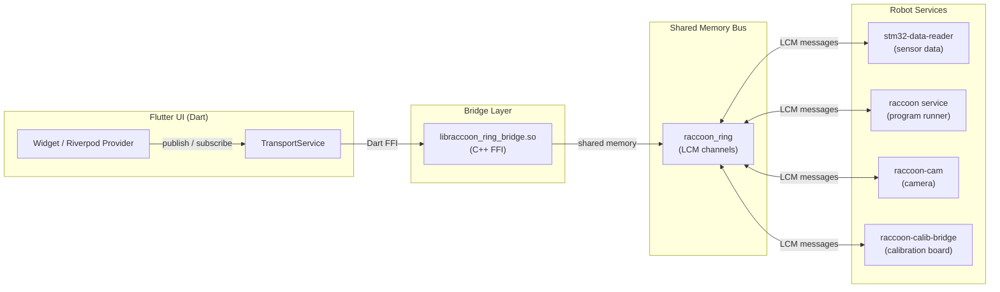
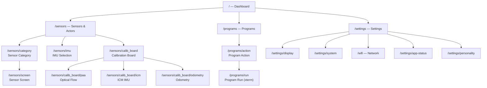

# Bot UI

BotUI is the on-robot Flutter touchscreen application that runs on the Raspberry Pi inside every RaccoonOS robot. It gives you access to all robot features — sensor graphs, program execution, network settings, and system management — directly from the robot's display, without needing a laptop or SSH session.

## What BotUI Is

Think of BotUI as the robot's cockpit. It is the only process on the Pi that has a screen, and it acts as a real-time window into every other service running in the RaccoonOS stack. It does not implement robot logic itself; instead it reads and writes to the shared-memory transport bus that all raccoon services communicate through.

BotUI is implemented in Flutter (targeting `flutter-pi` on ARM64 Linux) and communicates with the rest of the stack exclusively through `raccoon_ring` — the same shared-memory IPC mechanism used by raccoon-lib and stm32-data-reader. There is no REST API, no WebSocket, and no inter-process call: everything is publish/subscribe over named LCM channels.

## How BotUI Talks to the Robot

The data path between BotUI's Flutter widgets and the robot's hardware services has three distinct layers:



The `libraccoon_ring_bridge.so` is a thin C++ shared library compiled for ARM64 and bundled with every BotUI build. It wraps the `raccoon_ring` C++ API and exposes a C-ABI that the Dart `dart:ffi` layer calls directly. From Flutter's perspective, `TransportService` (a `keepAlive` Riverpod provider) is the single entry point: every widget subscribes to or publishes on a named channel and the bridge takes care of the rest.

The spin timer inside `RaccoonRingTransport` drains the bridge's receive queue into Dart streams at 33 ms intervals (~30 fps). The bridge's C++ poll thread queues frames as they arrive via a futex-woken loop; the Dart spin timer simply reads from that queue — it does not block or poll hardware.

## Screen / Navigation Map

BotUI uses `go_router` for declarative navigation. The application starts at `/` (Dashboard) and all navigation is push/pop on a single `Navigator` stack:



Every screen can be reached by pressing back to return toward the Dashboard. The back arrow in the top bar is present on every sub-screen. The screensaver lives at `/robot-face` and is pushed automatically from the Dashboard when idle.

## Two-Tier Settings Model

Settings in BotUI follow a two-tier model that is worth understanding before navigating the Settings section:

- **Persisted on the Pi (SharedPreferences):** Screen rotation, screensaver toggle, touch calibration matrix. These survive reboots and are written by BotUI itself.
- **Persisted by system services:** Wi-Fi credentials (NetworkManager), service autostart (systemd). BotUI issues commands to the OS (via shell commands over SSH or direct syscalls) and the OS persists them.

The Settings screen at `/settings` is the gateway to both tiers. Neither tier stores anything in raccoon's Python configuration files — settings here are Pi-level, not project-level.

## Section Overview

| Page | What you will find |
|------|--------------------|
| [Dashboard]() | Entry screen, tile layout, and screensaver behaviour |
| [Sensors & Actors]() | All sensor graph views, motor/servo control, and system health |
| [Programs]() | Browsing, launching, and monitoring robot programs |
| [Settings]() | Network, display, system services, and robot personality |
| [Calibration Board]() | USB-C external board for precision odometry and IMU calibration |

---

## Installation

### Requirements

The Flutter toolchain is version-pinned via **FVM (Flutter Version Management)**. The exact version is declared in `botui/.fvmrc`:

```json
{
  "flutter": "3.32.7"
}
```

Install FVM and activate the pinned version before doing anything else:

```bash
dart pub global activate fvm
fvm install    # reads .fvmrc and installs 3.32.7
fvm use        # activates it for this project
```

The `build.sh` script automatically detects FVM and prefixes all Flutter commands with `fvm`. If `fvm` is not on `PATH` it falls back to the system-installed `flutter`, which is appropriate for CI environments that provision Flutter 3.32.7 directly.

Additional tools required:

| Tool | Purpose |
|------|---------|
| Python 3 | `install.py` deployment script |
| SSH & SCP | Uploading the build to the Raspberry Pi |
| `flutterpi_tool` | ARM64 cross-compile for flutter-pi (installed by `build.sh` automatically) |
| Git (SSH key configured) | Fetching Git-hosted dependencies (e.g. `sleek_circular_slider`) |
| C cross-compiler (`aarch64-linux-gnu-gcc`) | Building `libraccoon_ring_bridge.so` (see below) |

Dart SDK constraint is `^3.5.4` (`>=3.5.4 <4.0.0`), as declared in `pubspec.yaml`.

### Clone the Repository

The project uses Git submodules for `raccoon-transport`. Always clone with `--recurse-submodules`:

```bash
git clone https://github.com/htl-stp-ecer/botui.git --recurse-submodules
```

Via SSH:

```bash
git clone git@github.com:htl-stp-ecer/botui.git --recurse-submodules
```

Via GitHub CLI:

```bash
gh repo clone htl-stp-ecer/botui -- --recurse-submodules
```

If you already cloned without `--recurse-submodules`, initialise submodules manually:

```bash
git submodule update --init --recursive
```

### Project Setup

Fetch Flutter and Dart dependencies. Use `flutter pub get` (not `dart pub get`) so that Flutter plugin registration is performed correctly:

```bash
fvm flutter pub get
```

### Code Generation

BotUI uses `riverpod_generator`, `freezed`, and `json_serializable` for code generation. Run the build runner once after cloning (and again whenever you change annotated files):

```bash
fvm flutter pub run build_runner build -d
```

The `-d` flag deletes conflicting outputs from previous runs.

### Build & Deployment

Use `build.sh` to compile and `install.py` to deploy. The two are combined in `deploy.sh`:

```bash
chmod +x deploy.sh
./deploy.sh
```

Internally `build.sh`:
1. Runs `flutter pub get` and `build_runner`.
2. Cross-compiles the app for ARM64 using `flutterpi_tool build --arch=arm64 --cpu=pi3 --release`.
3. Cross-compiles `libraccoon_ring_bridge.so` — the shared library that embeds `raccoon_ring` (the shared-memory transport from the `raccoon-transport` submodule) — and copies it into the build output directory. This `.so` is required at runtime; the build will fail with an error if it cannot be produced.

`install.py` then:
1. Stops the `flutter-ui` systemd service on the Pi via SSH.
2. Copies the entire build output to `/home/pi/stp-velox` on the Pi using SCP.
3. Writes a `version` file so `raccoon-server` can report the UI version.
4. Installs or updates the systemd unit file.
5. Enables and starts `flutter-ui.service`.

#### Environment Variables

| Variable | Default | Description |
|----------|---------|-------------|
| `RPI_HOST` | `192.168.68.110` | IP address of the target Raspberry Pi |
| `RPI_USER` | `pi` | SSH user on the Pi |

Override them on the command line if your Pi is on a different address:

```bash
RPI_HOST=192.168.1.42 ./deploy.sh
```
