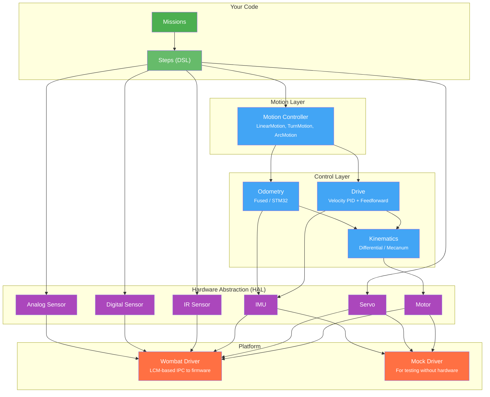
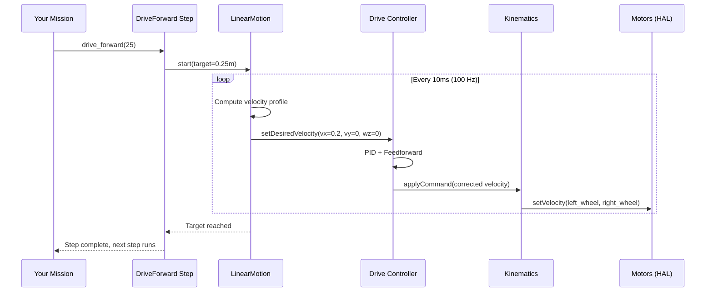

# Architecture Overview

`raccoon` is a modular robotics SDK written in C++20 with Python bindings. It runs on a Raspberry Pi inside the Wombat controller. You write mission code in Python; the heavy lifting (control loops at 100 Hz, kinematics math, motor drivers) happens in compiled C++ underneath.

> **Always use `from raccoon import *`** in mission and step files. The older `from libstp import *` still works but emits a `DeprecationWarning` — `libstp` is a compatibility shim that will be removed in a future version. If you see `libstp` in older project files (such as the examplebot), replace the import with `raccoon`.

## The Layer Cake

Every piece of robot code sits on a specific layer. Higher layers are simpler to use but less flexible. Lower layers give you full control.

## What Each Layer Does

### Missions & Steps (Green) — Your Code
This is where you spend 90% of your time. Missions define *what* the robot should do. Steps are the building blocks — `drive_forward(25)`, `turn_right(90)`, `servo(arm, 160)`. You compose them into sequences without worrying about control theory.

### Motion Layer (Blue) — Trajectory Execution
When you call `drive_forward(25)`, the motion layer plans a trapezoidal velocity profile (accelerate → cruise → decelerate) and feeds velocity targets to the drive system at 100 Hz. You don't interact with this layer directly unless you're tuning performance.

### Control Layer (Blue) — Velocity & Position
- **Drive**: Takes a desired chassis velocity (forward, lateral, angular) and uses PID + feedforward control to achieve it
- **Kinematics**: Translates chassis velocity into individual wheel speeds (and back). Knows the geometry of your drivetrain — differential (2 wheels) or mecanum (4 wheels)
- **Odometry**: Tracks the robot's position on the field by integrating wheel encoder ticks and IMU heading

### Hardware Abstraction Layer (Purple)
Abstract interfaces (`Motor`, `Servo`, `IMU`, `IRSensor`, etc.) that hide platform-specific details. The same mission code works whether you're running on a real Wombat or a mock driver for testing.

### Platform Layer (Orange)
Concrete drivers that talk to actual hardware. The Wombat driver communicates with the STM32 firmware through the `raccoon_transport` layer (a custom IPC transport). The mock driver returns simulated values for testing.

## Module Map

Internally, the library is split into many `libstp-*` implementation modules, each with its own headers, source, and optional Python bindings. Those internal module names are still used in the repo, even though the public Python API is now `raccoon`.

| Module | Layer | Purpose |
|--------|-------|---------|
| `libstp-foundation` | Core | Types (`Pose`, `ChassisVelocity`), PID, math, logging |
| `libstp-hal` | HAL | Abstract hardware interfaces |
| `libstp-platforms` | Platform | Wombat and Mock drivers |
| `libstp-transport-core` | Platform | Low-level IPC transport layer (`raccoon_transport`) used by Wombat driver |
| `libstp-drive` | Control | Chassis velocity controller |
| `libstp-kinematics` | Control | Differential and mecanum kinematic models (`DifferentialKinematics`, `MecanumKinematics`) |
| `libstp-odometry` | Control | Position tracking |
| `libstp-motion` | Motion | Linear, turn, arc, and spline motion profiles; line-follow; lineup |
| `libstp-sensor-ir` | Sensor | IR line sensor with calibration |
| `libstp-sensor-et` | Sensor | Additional sensor types |
| `libstp-servo` | Actuator | Servo control |
| `libstp-arm` | Actuator | Arm inverse-kinematics system (`ArmChain`, `ArmPreset`); named position motion |
| `libstp-button` | Input | Digital button handling |
| `libstp-cam` | Sensor | Camera interface (`CamSensor`) |
| `libstp-calibration-store` | Support | Persistent calibration data |
| `libstp-timing` | Support | Timing, checkpoint synchronization |
| `libstp-async` | Support | Async/coroutine utilities |
| `libstp-kmeans` | Algorithm | K-means clustering for IR threshold calibration |
| `libstp-debug` | Support | Debug utilities |
| `libstp-screen` | Output | Display rendering |
| `libstp-step` | Framework | Step execution framework (Python) |
| `libstp-mission` | Framework | Mission lifecycle (`Mission`, `SetupMission`) |
| `libstp-robot` | Framework | Robot integration point (`GenericRobot`) |
| `libstp-localization` | Navigation | Particle-filter localization (`Localization`, `LocalizationConfig`) |
| `libstp-map` | Navigation | Field map geometry (`WorldMap`, `MapSegment`) |
| `libstp-sim` | Testing | Hardware simulator with physics model |
| `libstp-testing` | Testing | Simulator test harness (`raccoon.testing.sim`) |
| `libstp-threading` | Support | Thread-safe concurrency primitives |
| `libstp-autotune` | Calibration | Automated PID and motion profile tuning |

## Data Flow: What Happens When You Call `drive_forward(25)`

## Getting Started

If you haven't set up a robot yet, follow the [Quick Start]() guide first. It walks you through creating a project, configuring hardware in the YAML file, generating code, calibrating, and running your first mission.

## Key Design Decisions

**Python-first API, C++ core**: You never need to write C++ to build a competition robot. The Python API exposes everything you need. C++ is used where performance matters (100 Hz control loops, real-time odometry).

**DSL with factory functions**: Instead of `DriveForward(cm=25, speed=0.8)`, you write `drive_forward(25, 0.8)`. The underlying classes are hidden — you interact with clean factory functions that return builder objects. This keeps the API surface small and discoverable.

**Platform abstraction**: The HAL layer means your code doesn't depend on the Wombat hardware. You can test mission logic against mock drivers, and the same code runs on any future platform that implements the HAL interfaces.

**Composition over inheritance**: Missions are composed of steps. Steps are composed of smaller steps via `Sequential` and `parallel`. There's no deep class hierarchy to learn — just combine building blocks.
