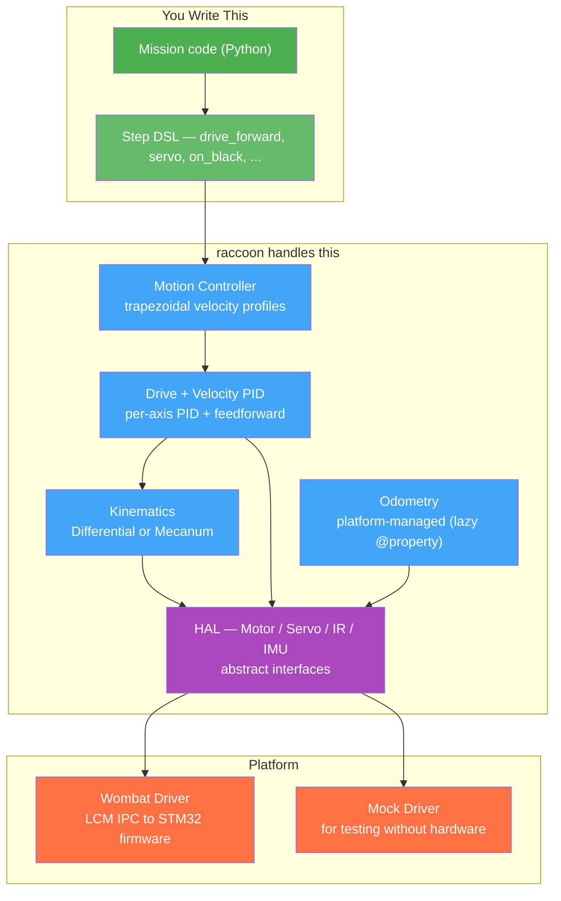
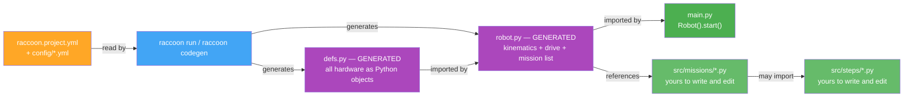
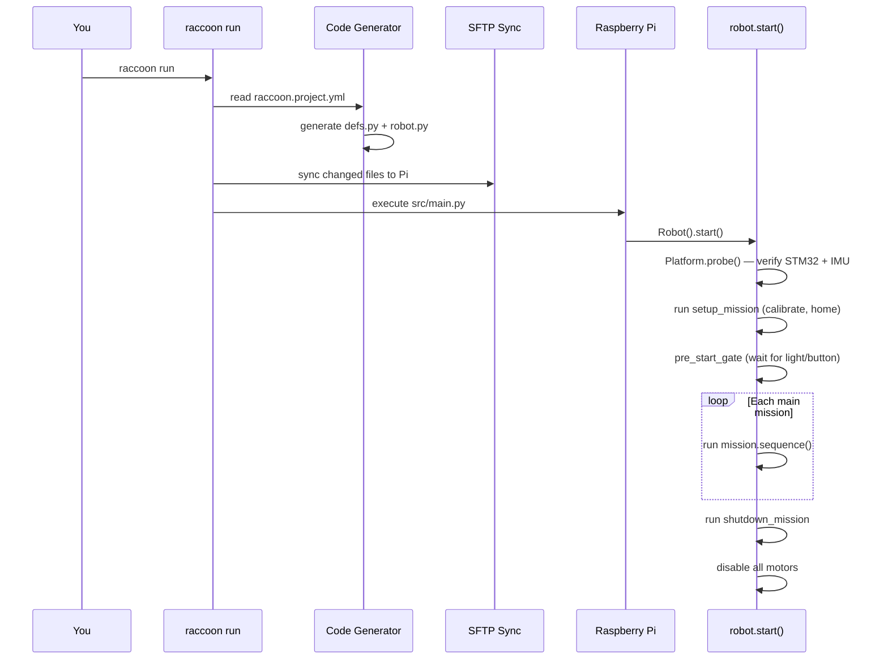
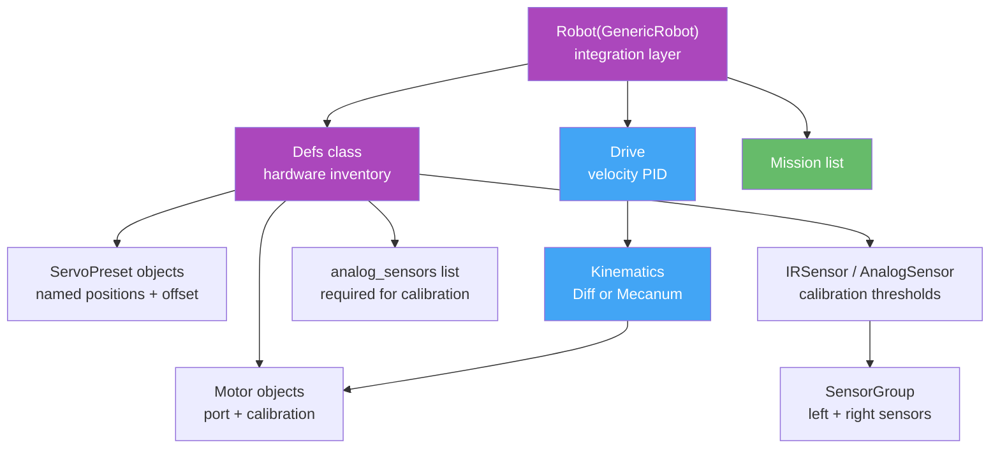
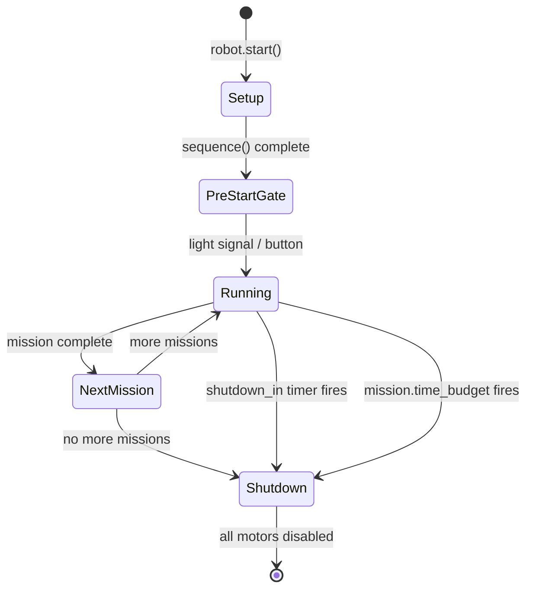

# Architecture & Project Model

This page explains how `raccoon` is structured as a framework and how a project maps onto the running robot. Read this before diving into individual features — the mental model pays for itself many times over.

---

## The Layered Stack



You spend 90% of your time in the top two layers. The layers below run automatically at 100 Hz during every drive step; you interact with them only when tuning PIDs or writing advanced custom steps.

---

## The Project Model

Every raccoon project has the same structure. The key mental model is:

> **YAML is the single source of truth. Python is generated from YAML. You own the missions.**



**Rules:**
- Edit `raccoon.project.yml` (and `config/*.yml`) to change hardware, kinematics, PIDs, or physical geometry.
- Run `raccoon run` — it regenerates `defs.py` and `robot.py` automatically, then executes.
- Write missions and steps freely — the codegen never touches those files.
- **Never edit `defs.py` or `robot.py` by hand** — your changes will be overwritten.

---

## From YAML to Running Robot

Here is what happens from the moment you type `raccoon run` to the moment the robot moves:



The probe step (`Platform.probe()`) verifies that the STM32 firmware and IMU are reachable before any motors move. It fails fast so you find hardware problems immediately, not mid-mission.

---

## The Robot Definition: `Defs` + `Robot`

Two Python classes form the backbone of every project:

### `Defs` — Hardware Registry

A plain Python class with every physical component as a **class-level attribute**. You never instantiate `Defs` — you reference `Defs.front_left_motor` directly:

```python
class Defs:
    imu = IMU()
    button = DigitalSensor(port=10)
    front_left_motor = Motor(port=0, inverted=False, calibration=MotorCalibration(...))
    front_right_ir = IRSensor(port=0)
    front = SensorGroup(right=front_right_ir)
    arm = ServoPreset(Servo(port=1), positions={"up": 32, "down": 160})
    analog_sensors = [front_right_ir]   # REQUIRED for IR calibration
```

> **`analog_sensors` is required.** The `RobotDefinitionsProtocol` mandates it. Without it, `calibrate()` silently skips IR sensor calibration.

### `Robot` — Integration Layer

A subclass of `GenericRobot` that wires kinematics, drive, odometry, and missions together. The `odometry` attribute is a lazy `@property` that calls `Platform.create_odometry(kinematics)` on first access — never a manually constructed object:

```python
class Robot(GenericRobot):
    defs = Defs()
    kinematics = DifferentialKinematics(...)
    drive = Drive(kinematics=kinematics, ...)
    # odometry: @property — platform-managed, not listed here
    shutdown_in = 120
    missions = [M010FirstMission()]
    setup_mission = M000SetupMission()
    shutdown_mission = M999ShutdownMission()
```

### Defs Relationship Diagram



---

## Mission Execution Lifecycle



Key rules:
- **Setup mission** must subclass `SetupMission` (not `Mission`). If you get `TypeError: setup_mission must be a SetupMission`, this is why.
- **`shutdown_in`** is a last-resort safety timer (required by Botball rules). Your missions should complete well before it fires.
- **`time_budget`** on a `Mission` subclass adds a per-mission watchdog. When it fires, the shutdown mission runs and subsequent missions are skipped.

---

## Import Convention

Always use `from raccoon import *` in mission and step files. The older `from libstp import *` is a compatibility shim that will be removed:

```python
# Correct — use this in all new code
from raccoon import *
from src.hardware.defs import Defs

# Deprecated — still works but emits DeprecationWarning
from libstp import *   # ← do not use
```

---

## Further Reading

| Topic | Page |
|-------|------|
| Full YAML reference for `raccoon.project.yml` | [Configuration Reference]() |
| `Defs` class patterns, `ServoPreset`, `SensorGroup` | [Robot Definition]() |
| Writing your first mission | [Your First Robot Program]() |
| YAML includes and `!include-merge` | [YAML Includes]() |
| Motion profiles and control loop internals | [Motion Flow and Kinematics]() |
