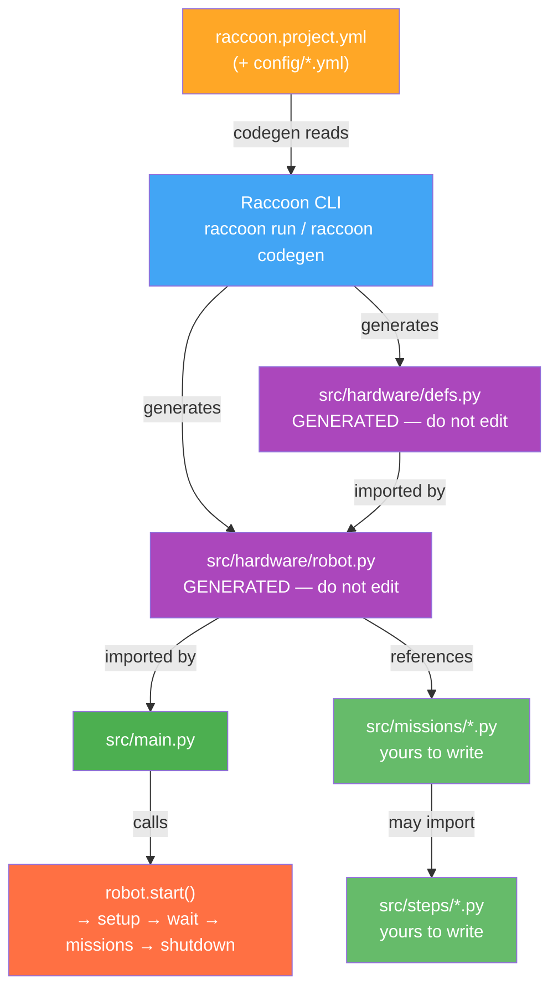

# Project Structure

## Concept

Every raccoon project has the same file layout: YAML config declares what hardware you have, the CLI generates Python from it, and your missions describe what the robot does. Understanding this split is the key to working efficiently — when something is wrong with hardware behavior, you fix the YAML and re-run; when something is wrong with the robot's actions, you fix the mission.

The three categories of files:
- **YAML config** (`raccoon.project.yml`, `config/*.yml`) — edit freely; the CLI reads these
- **Generated Python** (`src/hardware/defs.py`, `src/hardware/robot.py`) — never edit; the CLI overwrites these
- **Mission/step Python** (`src/missions/*.py`, `src/steps/*.py`) — edit freely; the CLI never touches these

Everything else on this page explains what lives where and why.

## See It First

Before reading the rest of this page, it helps to have a real project open in front of you.

**[raccoon-example](https://github.com/htl-stp-ecer/raccoon-example)** is a clean reference robot built specifically for documentation purposes — no competition pressure, no half-finished experiments. It demonstrates every concept on this page in a single, readable project:

```bash
git clone https://github.com/htl-stp-ecer/raccoon-example.git
```

Open it alongside this page. The file layout, naming conventions, and patterns described below all map directly to files in that repository.

---

## Creating a Project

Use the Raccoon CLI to scaffold a new project:

```bash
raccoon create project MyRobot
```

This command **clones the [raccoon-example](https://github.com/htl-stp-ecer/raccoon-example) repository** at the tag matching your installed CLI version (falling back to the default branch if no matching tag exists), then patches the project name and a fresh UUID into `raccoon.project.yml` and `pyproject.toml`. This gives you a fully working reference project as a starting point rather than an empty skeleton.

After cloning, the CLI optionally launches `raccoon wizard` to walk you through hardware configuration interactively. Pass `--no-wizard` to skip that step.

See [Raccoon CLI]() for details on all CLI commands.

> **Note:** You can also clone the example repo manually and rename it, but `raccoon create project` handles the UUID patching and git history initialization automatically.

## Directory Layout

A typical project generated by the Raccoon CLI looks like this:

```
my-robot/
├── raccoon.project.yml          # Project configuration (hardware, drive, missions)
├── racoon.calibration.yml       # Sensor and motor calibration data (note: single 'c')
├── config/                      # Split config files (included by project.yml)
│   ├── robot.yml
│   ├── hardware.yml
│   ├── missions.yml
│   └── connection.yml
└── src/
    ├── __init__.py              # Required for Python imports
    ├── main.py                  # Entry point — creates Robot, calls start()
    ├── hardware/
    │   ├── __init__.py          # Required for Python imports
    │   ├── defs.py              # Hardware definitions (motors, servos, sensors) — GENERATED
    │   ├── defs.pyi             # Type stub for IDE autocomplete — GENERATED
    │   └── robot.py             # Robot class (kinematics, drive, missions) — GENERATED
    ├── missions/
    │   ├── __init__.py          # Required for Python imports
    │   ├── m000_setup_mission.py # Runs before the match (calibration, homing)
    │   ├── m010_first_task.py    # First autonomous mission
    │   ├── m020_second_task.py   # Second autonomous mission
    │   └── m999_shutdown.py      # Cleanup after timeout
    └── steps/
        ├── __init__.py          # Required for Python imports
        └── my_custom_steps.py   # Reusable custom step functions
```

> **Important:** Every directory under `src/` needs an `__init__.py` file (can be empty) for Python imports to work. The Raccoon CLI creates these automatically, but if you add directories manually, don't forget them or you'll get `ModuleNotFoundError`.

## Key Files Explained

### `raccoon.project.yml` — Project Configuration

This is the central configuration file. It defines your robot's hardware, drive parameters, physical dimensions, and mission list. The Raccoon CLI and BotUI both read this file.

```yaml
name: ConeBot
uuid: a1b2c3d4-e5f6-7890-abcd-ef1234567890

robot: !include 'config/robot.yml'
missions: !include 'config/missions.yml'
definitions: !include 'config/hardware.yml'
connection: !include 'config/connection.yml'
```

The `!include` tags split configuration across multiple files to keep things manageable. You can also put everything in a single file — here's what the expanded version looks like (from a real project):

```yaml
name: PackingBot
uuid: 322a6cb2-b54d-4ad2-bb55-14d157403ae7

robot:
  shutdown_in: 120                    # Emergency stop after 120 seconds
  drive:
    kinematics:
      type: mecanum                   # or "differential"
      wheel_radius: 0.0375
      track_width: 0.2
      wheelbase: 0.125
      front_left_motor: front_left_motor
      front_right_motor: front_right_motor
      back_left_motor: rear_left_motor
      back_right_motor: rear_right_motor
    # ... PID and velocity config ...
  physical:
    width_cm: 23.5
    length_cm: 29.6
    rotation_center:
      x_cm: 11.75
      y_cm: 18.5

definitions:
  front_left_motor:
    type: Motor
    port: 1
    inverted: false
  imu:
    type: IMU
  front_right_light_sensor:
    type: IRSensor
    port: 4
  # ... more hardware ...

missions:
  - M000SetupMission: setup
  - M999ShutdownMission: shutdown

connection:
  pi_address: 192.168.100.237
  pi_port: 8421
  pi_user: pi
```

### `racoon.calibration.yml` — Calibration Data

Stores calibration values measured on the actual robot. This file is updated automatically when you run calibration steps. Don't edit it by hand — use the calibration workflow instead (see [Calibration]()).

```yaml
root:
  ir-calibration:
    default:
      white_tresh: 1469.84
      black_tresh: 2490.58
    default_port4:
      white_tresh: 543.45
      black_tresh: 3647.12
```

### `src/main.py` — Entry Point

The simplest file in the project. Creates the robot and starts execution:

```python
from src.hardware.robot import Robot

robot = Robot()

if __name__ == "__main__":
    robot.start()
```

`robot.start()` handles everything: initializing hardware, running the setup mission, waiting for the start signal, executing main missions in sequence, and running the shutdown mission when time expires.

### `src/hardware/defs.py` — Hardware Definitions (Generated)

> **This file is auto-generated** from the `definitions:` section of `raccoon.project.yml` by the Raccoon CLI. **Never edit this file by hand** — it gets overwritten every time code generation runs. Always make changes in the YAML file instead.

Here's what the generated code looks like (imports are emitted per-class by the codegen; never write these by hand):

```python
from raccoon import DigitalSensor, IRSensor, Motor, MotorCalibration, Servo
from raccoon import IMU
from raccoon.step.motion.sensor_group import SensorGroup
from raccoon.step.servo.preset import ServoPreset


class Defs:
    # IMU and start button
    imu = IMU()
    button = DigitalSensor(port=10)

    # Drive motors
    front_left_motor = Motor(
        port=0, inverted=False,
        calibration=MotorCalibration(
            ticks_to_rad=1.947e-05, vel_lpf_alpha=1.0
        ),
    )
    front_right_motor = Motor(
        port=1, inverted=False,
        calibration=MotorCalibration(
            ticks_to_rad=1.689e-05, vel_lpf_alpha=1.0
        ),
    )

    # Sensors
    front_right_ir = IRSensor(port=0)
    front = SensorGroup(right=front_right_ir)

    # Servos with named positions (YAML type: Servo + positions: block)
    claw = ServoPreset(Servo(port=2), positions={"closed": 135, "open": 30})
    arm = ServoPreset(Servo(port=1), positions={"up": 32, "down": 160})

    # List of analog sensors for calibration
    analog_sensors = [front_right_ir]
```

> **Never write these imports by hand.** The codegen resolves the correct module path for each class and emits the import automatically. In particular, `SensorGroup` is not exported from the top-level `raccoon` package — `from raccoon import SensorGroup` raises `ImportError`. Use codegen to manage `defs.py`.

> **`defs.pyi` — IDE stub file.** The codegen also produces `src/hardware/defs.pyi` alongside `defs.py`. This stub gives IDE autocompletion the exact method signatures for `ServoPreset` named positions (e.g. `Defs.arm.up()`, `Defs.claw.closed()`) and `ArmPreset` positions. The `.pyi` file is regenerated on every codegen run and should not be edited by hand.

See [Robot Definition]() for details on each component type.

### `src/hardware/robot.py` — Robot Class (Generated)

> **This file is also auto-generated** from the `robot:` section of `raccoon.project.yml`. The kinematics type, wheel dimensions, PID gains, axis constraints, physical dimensions, and sensor positions all come from the YAML. **Never edit this file by hand** — it gets overwritten every time code generation runs.

Here's what the generated code looks like:

```python
from raccoon import (
    DifferentialKinematics, Drive,
    GenericRobot, PidGains, Feedforward,
    UnifiedMotionPidConfig,
    # ... additional imports per configuration ...
)
from src.hardware.defs import Defs
from src.missions.m000_setup_mission import M000SetupMission
from src.missions.m010_first_mission import M010FirstMission


class Robot(GenericRobot):
    defs = Defs()

    kinematics = DifferentialKinematics(
        left_motor=defs.front_left_motor,
        right_motor=defs.front_right_motor,
        wheel_radius=0.0345,
        wheelbase=0.16,
    )

    drive = Drive(kinematics=kinematics, vel_config=..., imu=defs.imu)

    # odometry is a @property generated by codegen — not a class attribute.
    # It calls Platform.create_odometry(self.kinematics) on first access,
    # returning the platform-canonical IOdometry implementation.
    # FusedOdometry and Stm32Odometry are no longer user-visible.

    shutdown_in = 120  # seconds
    missions = [M010FirstMission()]
    setup_mission = M000SetupMission()
    shutdown_mission = None
```

> **`FusedOdometry` is not imported.** Odometry is now platform-managed. The generated `robot.py` exposes an `odometry` `@property` that calls `Platform.create_odometry(self.kinematics)` lazily on first access. You do not select `FusedOdometry` or `Stm32Odometry` in the YAML — that choice is made by the platform driver. If you add `odometry:` to `robot.yml`, the codegen logs a warning and ignores it.

> **Migration:** If you have an older `robot.py` that imports `FusedOdometry`, run `raccoon codegen` to regenerate it. Keeping a stale generated file causes an `ImportError` on current raccoon-lib versions.

See [Robot Definition]() for the full breakdown.

## How It All Connects



The YAML configuration is the **single source of truth** for your robot's hardware and drive setup. The Raccoon CLI generates `defs.py` and `robot.py` from it automatically — these files are overwritten on every code generation run. **Never edit `defs.py` or `robot.py` by hand.** If you need to change motors, servos, kinematics, or PID config, edit `raccoon.project.yml` and let the CLI regenerate the Python files.

Mission files (`missions/*.py`) and custom step files (`steps/*.py`) are yours to write and edit freely — code generation does not touch them.

### Splitting hardware config across files

Large projects split hardware config into sub-files using `!include-merge`:

```yaml
# config/hardware.yml
button:
  type: DigitalSensor
  port: 10
imu:
  type: IMU
front_right_ir_sensor:
  type: IRSensor
  port: 0

# These two keys pull in motors.yml and servos.yml as if the keys were defined inline.
# The underscore prefix (_motors, _servos) is a merge-anchor convention —
# those keys are not exposed to codegen; only the merged-in definitions are.
_motors: !include-merge 'motors.yml'
_servos: !include-merge 'servos.yml'
```

After merging, the codegen sees `front_left_motor`, `front_right_motor`, etc. directly in the hardware namespace, as if they had been defined in `hardware.yml` directly. See [YAML Includes]() for the full `!include` / `!include-merge` reference.

## Naming Conventions

### Classes — PascalCase (Java-style)

All class names use PascalCase with no underscores:

| What | Example | Notes |
|------|---------|-------|
| Mission classes | `M010DriveToConeMission` | 3-digit prefix matches file number |
| Robot class | `Robot` | Always `Robot` |
| Hardware defs | `Defs` | Always `Defs` |
| Custom step classes | `WaitForAnalogRange` | Descriptive, verb-first |
| Custom screens | `CalibrationScreen` | Suffix with `Screen` |
| Services | `HeadingReferenceService` | Suffix with `Service` |
| Result types | `CalibrationResult` | Suffix with `Result` |

### Functions and Variables — snake_case (Python-style)

All function names, variable names, and hardware definition attributes use lowercase with underscores:

| What | Example                             | Notes |
|------|-------------------------------------|-------|
| Step DSL functions | `drive_forward()`, `turn_right()`   | Verb-first, describes the action |
| Custom step functions | `down_cone_container()`             | Same pattern as built-in steps |
| Hardware attributes | `front_left_motor`                  | Position + side + component type |
| Sensor groups | `front`, `rear`                     | Short — they're used constantly |
| Servo presets | `claw`, `pom_arm`, `shiethe ld`     | Named by the mechanism, not the port |
| Servo positions | `"open"`, `"closed"`, `"above_pom"` | Descriptive of the physical state |
| Calibration sets | `"default"`, `"upper"`              | Named by the surface/context |

### File Names — snake_case

All Python files use lowercase with underscores. No hyphens, no spaces:

| What | Pattern | Example |
|------|---------|---------|
| Mission files | `m{NNN}_{description}_mission.py` | `m010_drive_to_cone_mission.py` |
| Setup mission | `m000_setup_mission.py` | Always `m000` (reserved) |
| Shutdown mission | `m999_shutdown_mission.py` | Always `m999` (reserved) |
| Custom step files | `{description}_steps.py` | `cone_container_steps.py` |
| Hardware defs | `defs.py` | Always `defs.py` (generated) |
| Robot class | `robot.py` | Always `robot.py` (generated) |
| Entry point | `main.py` | Always `main.py` |

### Mission Numbering

Missions use a **three-digit** zero-padded prefix as a strong convention (`M000`, `M010`, `M999`). `raccoon create mission` always generates three-digit prefixes. Tooling and documentation assume this format — using two-digit prefixes like `M00` or `M01` can cause unexpected ordering behavior and should be avoided in new projects.

| Range | Purpose |
|-------|---------|
| `m000` | Reserved — setup mission |
| `m010`–`m998` | Main missions |
| `m999` | Reserved — shutdown mission |

`raccoon create mission MyMission` assigns the next available number (starting at `M010`, then `M020`, `M030`, etc.) and creates the file `src/missions/m010_my_mission.py` with class `M010MyMission`. Numbers `0` and `999` are reserved and cannot be used for main missions.

**Inserting missions between existing ones** — you are not limited to decade steps. Non-decade numbers like `M001`, `M025`, or `M027` are valid. The CLI only requires three digits; the gap between `M020` and `M030` is yours to use:

```yaml
missions:
  - M000SetupMission: setup
  - M010GrabPomsMission
  - M025SecondPickupMission      # inserted mid-competition at M025
  - M030DriveToBasketMission
  - M999ShutdownMission: shutdown
```

Execution order is determined **solely** by the `missions:` list in `raccoon.project.yml`, not the file number. The number is purely for human readability and file sorting. A mission named `m042_foo.py` that appears first in the YAML list runs first.

**Temporarily disabling missions** — YAML comments are the safest way to disable a mission mid-competition without deleting it:

```yaml
missions:
  - M000SetupMission: setup
  - M010GrabPomsMission
  #- M020HazardousMission        # ← disabled: commented out, easy to re-enable
  - M030DriveToBasketMission
  - M999ShutdownMission: shutdown
```

Comment the line out and the mission is skipped; uncomment it and it runs again. No file deletion, no class-name changes.

### Hardware Naming Pattern

Hardware attributes in `Defs` follow a consistent `{position}_{side}_{type}` pattern:

```
front_left_motor          # position: front, side: left, type: motor
front_right_ir_sensor     # position: front, side: right, type: ir_sensor
rear_right_light_sensor   # position: rear, side: right, type: light_sensor
cone_arm_servo            # mechanism: cone_arm, type: servo
cone_arm_down_button      # mechanism: cone_arm, state: down, type: button
wait_for_light_sensor     # purpose: wait_for_light, type: sensor
```

Be descriptive — when you're debugging at 2am before competition, `front_left_motor` is much clearer than `motor0`.

### YAML Keys

YAML configuration keys use `snake_case` to match the Python attributes they generate:

```yaml
definitions:
  front_left_motor:        # becomes Defs.front_left_motor
    type: Motor
    port: 1
  front_right_light_sensor:  # becomes Defs.front_right_light_sensor
    type: IRSensor
    port: 4
```
