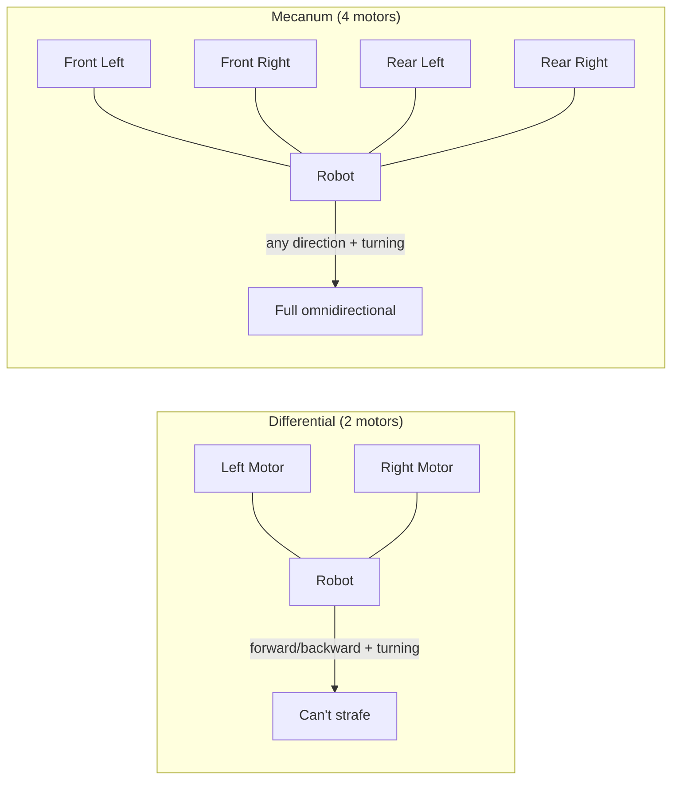
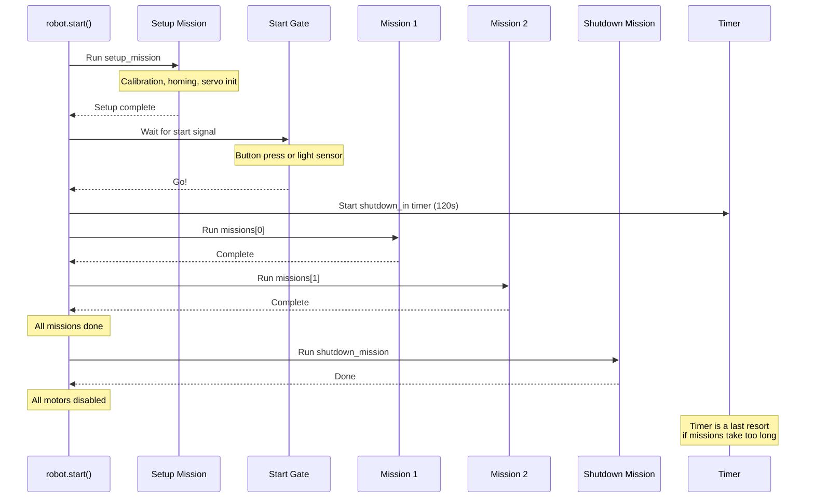

# Robot Definition

Before you write a single mission, you need to tell `raccoon` what hardware your robot has and how it's arranged. This is configured in `raccoon.project.yml` — the Raccoon CLI then generates two Python files from it:

- **`defs.py`** — hardware inventory (motors, servos, sensors)
- **`robot.py`** — how those parts work together (kinematics, drive, odometry)

> **Important:** You define hardware in `raccoon.project.yml` and code generation produces `defs.py` and `robot.py` automatically. **Never edit these files by hand** — they are overwritten every time code generation runs. Always make changes in the YAML.

This page explains what the generated code looks like and what each part means, so you understand what to configure in the YAML.

## Hardware Definitions (`defs.py`)

The `Defs` class is a flat list of every physical component on your robot. Each attribute maps to a port on the Wombat controller.

### Motors

```python
from raccoon import Motor, MotorCalibration

front_left_motor = Motor(
    port=0,                    # Wombat motor port (0-3)
    inverted=False,            # True if motor spins backwards
    calibration=MotorCalibration(
        ticks_to_rad=1.947e-05,   # Encoder ticks → radians (set by calibration)
        vel_lpf_alpha=1.0,        # Velocity low-pass filter (1.0 = no filtering)
    ),
)
```

**Parameters:**
- `port`: Physical motor port on the Wombat (0–3)
- `inverted`: Set to `True` if the motor is mounted backwards (spins the wrong way relative to the expected direction)
- `calibration`: Conversion factors measured during [calibration](). You generally don't set these by hand — they're populated by the calibration step

### Servos

Servos can be created plain or with named presets:

```python
from raccoon import Servo, ServoPreset

# Plain servo — you specify angles in your mission code
plain_servo = Servo(port=0)

# Servo with presets — named positions you can call directly
claw = ServoPreset(
    Servo(port=2),
    positions={"closed": 135, "open": 30}
)

# Multi-position servo
arm = ServoPreset(
    Servo(port=1),
    positions={
        "down": 10,
        "above_pom": 55,
        "up": 105,
        "start": 160,
    }
)
```

With `ServoPreset`, you can move to named positions directly in your missions:
```python
Defs.claw.open()       # Moves to angle 30
Defs.arm.above_pom()   # Moves to angle 55
Defs.arm.up(300)       # Moves to angle 105 at 300 degrees/sec (slow servo)
```

### Sensors

```python
from raccoon import IRSensor, DigitalSensor, AnalogSensor, SensorGroup
from raccoon import IMU as Imu

# Inertial measurement unit (one per robot, no port needed)
imu = Imu()

# Infrared line sensors — used for line detection and following
front_right_ir = IRSensor(port=0)
front_left_ir = IRSensor(port=1)

# Digital sensors — buttons, limit switches (returns True/False)
button = DigitalSensor(port=10)
arm_down_limit = DigitalSensor(port=0)

# Analog sensors — raw analog readings
light_sensor = AnalogSensor(port=2)
```

### Sensor Groups

A `SensorGroup` bundles two IR sensors (left and right) and exposes convenience methods for common operations:

```python
front = SensorGroup(left=front_left_ir, right=front_right_ir)
rear = SensorGroup(right=rear_right_ir)  # Single sensor is fine too
```

Sensor groups give you shorthand methods you can call directly in missions:
```python
Defs.front.drive_until_black()          # Drive forward until either sensor sees black
Defs.front.drive_over_line()            # Drive forward over a black line
Defs.front.follow_right_edge(cm=50)     # Follow the right edge of a line for 50 cm
Defs.front.strafe_left_until_black()    # Strafe left until sensor sees black
Defs.front.lineup_on_black()            # Align both sensors on a black line
```

### Required Attributes: `button` and `wait_for_light_sensor`

The `RobotDefinitionsProtocol` expects specially-named attributes in your `Defs` class:

```python
from raccoon import DigitalSensor, AnalogSensor

button = DigitalSensor(port=10)                    # Required — exact name
wait_for_light_sensor = AnalogSensor(port=2)       # Optional — exact name
```

These names are **not arbitrary** — the framework looks for them by name:

- **`button`** (required): Registered as the system-wide primary button. Used by `wait_for_button()`, UI interactions, and any step that needs physical button input. Must be named exactly `button`.
- **`wait_for_light_sensor`** (optional): Used by the pre-start gate to detect the competition start light. If not present, the robot can only start via button press. For competition, you need this so the robot can start with the light signal. Must be named exactly `wait_for_light_sensor`.

Both are defined in the YAML `definitions:` section with these exact names:

```yaml
definitions:
  button:
    type: DigitalSensor
    port: 10
  wait_for_light_sensor:       # Optional, but needed for competition start
    type: AnalogSensor
    port: 2
```

### The `analog_sensors` List

Include all IR/analog sensors in an `analog_sensors` list. The calibration system uses this to know which sensors need calibrating:

```python
class Defs:
    # ... all your hardware above ...
    analog_sensors = [front_right_ir, front_left_ir]
```

---

## Robot Class (`robot.py`)

The `robot.py` file is **entirely code-generated** from the `robot:` section of `raccoon.project.yml`. It wires together your hardware definitions, drive system, kinematics, odometry, motion PID, physical dimensions, and mission list. **Never edit this file by hand** — all configuration goes through the YAML.

Here's what each part of the generated code does and which YAML section it comes from:

### Generated Attributes Reference

| Attribute | What It Does | YAML Source |
|-----------|-------------|-------------|
| `defs` | Hardware definitions instance | `definitions:` |
| `kinematics` | Translates chassis velocity to/from wheel speeds | `robot.drive.kinematics` |
| `drive` | Velocity controller (PID + feedforward per axis) | `robot.drive.vel_config` |
| `odometry` | Tracks robot position and heading on the field | `robot.odometry` |
| `motion_pid_config` | Controls trajectory following accuracy (distance/heading PID, axis constraints) | `robot.motion_pid` |
| `shutdown_in` | Emergency stop timer in seconds | `robot.shutdown_in` |
| `setup_mission` | Mission that runs before the start signal | `missions:` (entry tagged `setup`) |
| `missions` | Main missions, run in order after start | `missions:` (untagged entries) |
| `shutdown_mission` | Mission that runs when timer expires | `missions:` (entry tagged `shutdown`) |
| `width_cm`, `length_cm` | Physical robot dimensions | `robot.physical` |
| `rotation_center_forward_cm`, `rotation_center_strafe_cm` | Offset from geometric center to rotation center | `robot.physical.rotation_center` |
| `_sensor_positions` | Where each sensor is mounted relative to rotation center | `robot.physical.sensors` |
| `_wheel_positions` | Where each wheel is mounted (mecanum only) | Derived from kinematics geometry |

### YAML → Generated Code

Here's how the YAML maps to the generated `robot.py`. You configure everything on the left; code generation produces the right:

```yaml
# raccoon.project.yml
robot:
  shutdown_in: 120

  drive:
    kinematics:
      type: differential          # or "mecanum"
      wheel_radius: 0.0345
      wheelbase: 0.16
      left_motor: front_left_motor
      right_motor: front_right_motor

    vel_config:
      vx:
        pid: { kp: 0.0, ki: 0.0, kd: 0.0 }
        ff: { kS: 0.0, kV: 1.0, kA: 0.0 }

  odometry:
    type: FusedOdometry           # or "Stm32Odometry"

  motion_pid:
    distance: { kp: 7.875, ki: 0.0, kd: 0.0 }
    heading: { kp: 7.875, ki: 0.0, kd: 0.0625 }
    linear:
      max_velocity: 0.2368
      acceleration: 0.2798
      deceleration: 2.0532
    angular:
      max_velocity: 2.9424
      acceleration: 14.6122
      deceleration: 7156.1491

  physical:
    width_cm: 13.0
    length_cm: 19.0
    rotation_center:
      x_cm: 2.5
      y_cm: 5.5
    sensors:
      - name: front_right_ir_sensor
        x_cm: 14.0
        y_cm: 7.5
        clearance_cm: 1.0

missions:
  - M00SetupMission: setup
  - M01DriveToConeMission
  - M99ShutdownMission: shutdown
```

All the PID values, axis constraints, kinematics parameters, and physical dimensions are set in the YAML. Code generation turns them into the Python `Robot` class. Auto-tune and calibration steps update these YAML values automatically.

### Kinematics: Differential vs. Mecanum



| Feature | Differential | Mecanum |
|---------|-------------|---------|
| Motors | 2 | 4 |
| Can drive forward/backward | Yes | Yes |
| Can turn in place | Yes | Yes |
| Can strafe sideways | No | Yes |

In competition, you typically use both: one differential and one mecanum robot. Set `type: differential` or `type: mecanum` in the YAML kinematics section accordingly.

### Mission Lifecycle



**Setup mission** runs before the start signal — use it for calibration, homing servos, and any pre-match preparation.

**Main missions** run in order after the start signal. Each mission runs to completion before the next one starts.

**Shutdown mission** runs when all main missions have completed **or** when the `shutdown_in` timer expires — whichever comes first. Most of the time, your missions finish normally and shutdown runs as the final cleanup step. Use it for controlled shutdown (lowering arms, releasing objects). If no shutdown mission is set, all motors are simply disabled.

### The `shutdown_in` Timer

`shutdown_in = 120` means the robot will force-stop 120 seconds after the start signal. This is a **last resort safety mechanism** required by Botball competition rules — your missions should normally finish well before the timer fires. When the timer does fire:

1. The currently running mission is cancelled
2. The shutdown mission runs (if defined)
3. All motors are disabled
4. The program exits

Plan your missions to finish within the time limit. If everything goes well, your robot completes all missions, runs the shutdown mission, and stops cleanly — without ever hitting the timer.
