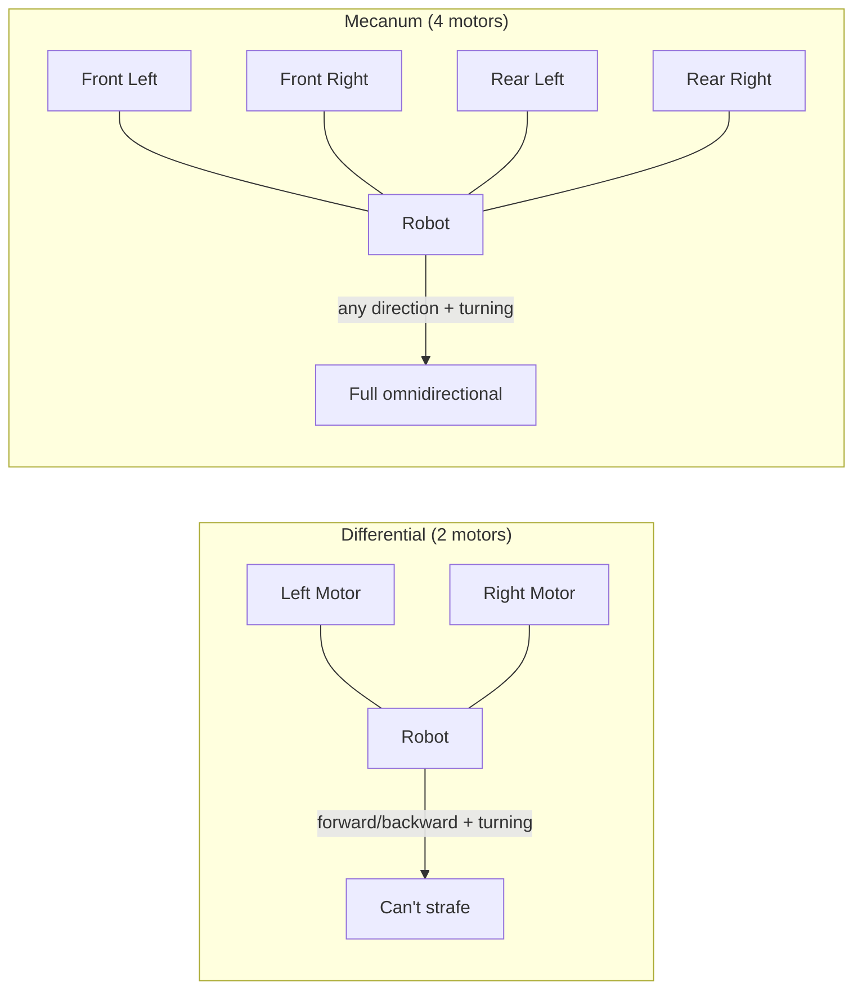
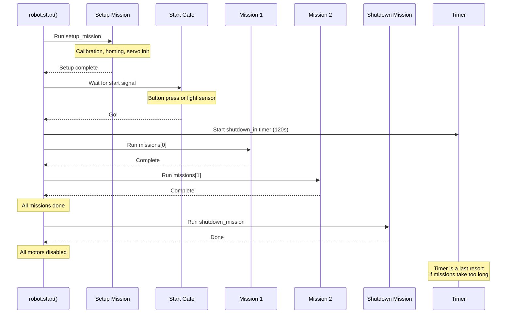

# Robot Definition

Before you write a single mission, you need to tell `raccoon` what hardware your robot has and how it's arranged. This is configured in `raccoon.project.yml` — the Raccoon CLI then generates two Python files from it:

- **`defs.py`** — hardware inventory (motors, servos, sensors)
- **`robot.py`** — how those parts work together (kinematics, drive, odometry)

> **Important:** You define hardware in `raccoon.project.yml` and code generation produces `defs.py` and `robot.py` automatically. **Never edit these files by hand** — they are overwritten every time code generation runs. Always make changes in the YAML.

This page explains what the generated code looks like and what each part means, so you understand what to configure in the YAML.

## Hardware Definitions (`defs.py`)

The `Defs` class is a flat list of every physical component on your robot. Each attribute maps to a port on the Wombat controller.

### Motors

```python
from raccoon import Motor, MotorCalibration

front_left_motor = Motor(
    port=0,                    # Wombat motor port (0-3)
    inverted=False,            # True if motor spins backwards
    calibration=MotorCalibration(
        ticks_to_rad=1.947e-05,   # Encoder ticks → radians (set by calibration)
        vel_lpf_alpha=1.0,        # Velocity low-pass filter (1.0 = no filtering)
    ),
)
```

**Parameters:**
- `port`: Physical motor port on the Wombat (0–3)
- `inverted`: Set to `True` if the motor is mounted backwards (spins the wrong way relative to the expected direction)
- `calibration`: Conversion factors measured during [calibration](). You generally don't set these by hand — they're populated by the calibration step

### Servos

Servos can be created plain or with named presets:

```python
from raccoon import Servo, ServoPreset

# Plain servo — you specify angles in your mission code
plain_servo = Servo(port=0)

# Servo with presets — named positions you can call directly
claw = ServoPreset(
    Servo(port=2),
    positions={"closed": 135, "open": 30}
)

# Multi-position servo
arm = ServoPreset(
    Servo(port=1),
    positions={
        "down": 10,
        "above_pom": 55,
        "up": 105,
        "start": 160,
    }
)
```

With `ServoPreset`, you can move to named positions directly in your missions:
```python
Defs.claw.open()       # Moves to angle 30
Defs.arm.above_pom()   # Moves to angle 55
Defs.arm.up(300)       # Moves to angle 105 at 300 degrees/sec (slow servo)
```

### Sensors

```python
from raccoon import IRSensor, DigitalSensor, AnalogSensor, IMU
from raccoon.step.motion import SensorGroup   # SensorGroup is NOT in raccoon top-level

# Inertial measurement unit (one per robot, no port needed)
imu = IMU()

# Infrared line sensors — used for line detection and following
front_right_ir = IRSensor(port=0)
front_left_ir = IRSensor(port=1)

# Digital sensors — buttons, limit switches (returns True/False)
button = DigitalSensor(port=10)
arm_down_limit = DigitalSensor(port=0)

# Analog sensors — raw analog readings
light_sensor = AnalogSensor(port=2)
```

### Sensor Groups

A `SensorGroup` bundles two IR sensors (left and right) and exposes convenience methods for common operations:

```python
front = SensorGroup(left=front_left_ir, right=front_right_ir)
rear = SensorGroup(right=rear_right_ir)  # Single sensor is fine too
```

Sensor groups give you shorthand methods you can call directly in missions:
```python
Defs.front.drive_until_black()          # Drive forward until either sensor sees black
Defs.front.drive_over_line()            # Drive forward over a black line
Defs.front.follow_right_edge(cm=50)     # Follow the right edge of a line for 50 cm
Defs.front.strafe_left_until_black()    # Strafe left until sensor sees black
Defs.front.lineup_on_black()            # Align both sensors on a black line
```

### Required and Reserved Attributes

The `RobotDefinitionsProtocol` expects several specially-named attributes in your `Defs` class. The codegen emits these automatically when you use the correct YAML keys:

```python
from raccoon import DigitalSensor, AnalogSensor

button = DigitalSensor(port=10)                    # Required — exact name
wait_for_light_sensor = AnalogSensor(port=2)       # Optional — exact name

# Auto-generated from wait_for_light_sensor YAML config:
wait_for_light_mode = "auto"                       # "auto" or "legacy"
wait_for_light_drop_fraction = 0.15               # Detection sensitivity
```

These names are **not arbitrary** — the framework looks for them by name:

- **`button`** (required): Registered as the system-wide primary button. Used by `wait_for_button()`, UI interactions, and any step that needs physical button input. Must be named exactly `button`.
- **`wait_for_light_sensor`** (optional): Used by the pre-start gate to detect the competition start light. If not present, the robot falls back to button-only start. For competition, you need this so the robot can start with the light signal. Must be named exactly `wait_for_light_sensor`.
- **`wait_for_light_mode`** (auto-generated): Controls how the light sensor interprets the signal. `"auto"` uses a Kalman-filter-based drop detector; `"legacy"` uses a fixed threshold. Default is `"auto"`.
- **`wait_for_light_drop_fraction`** (auto-generated): Sensitivity for `"auto"` mode — the minimum fractional drop in sensor reading that counts as "light off". Lower values are more sensitive. Default is `0.15`.

`wait_for_light_mode` and `wait_for_light_drop_fraction` are generated automatically by the codegen when `wait_for_light_sensor` is present. You configure them via YAML sub-keys:

```yaml
definitions:
  button:
    type: DigitalSensor
    port: 10
  wait_for_light_sensor:       # Optional, but needed for competition start
    type: AnalogSensor
    port: 2
    mode: auto                 # "auto" (default) or "legacy"
    drop_fraction: 0.15        # Optional; default 0.15
```

### The `analog_sensors` List

Include all IR/analog sensors in an `analog_sensors` list. The calibration system uses this to know which sensors need calibrating:

```python
class Defs:
    # ... all your hardware above ...
    analog_sensors = [front_right_ir, front_left_ir]
```

---

## Robot Class (`robot.py`)

The `robot.py` file is **entirely code-generated** from the `robot:` section of `raccoon.project.yml`. It wires together your hardware definitions, drive system, kinematics, odometry, motion PID, physical dimensions, and mission list. **Never edit this file by hand** — all configuration goes through the YAML.

Here's what each part of the generated code does and which YAML section it comes from:

### Generated Attributes Reference

| Attribute | What It Does | YAML Source |
|-----------|-------------|-------------|
| `defs` | Hardware definitions instance | `definitions:` |
| `kinematics` | Translates chassis velocity to/from wheel speeds | `robot.drive.kinematics` |
| `drive` | Velocity controller (PID + feedforward per axis) | `robot.drive.vel_config` |
| `odometry` | `@property` — lazily returns platform-managed odometry via `Platform.create_odometry(kinematics)` | Platform-managed; **no YAML key** |
| `motion_pid_config` | Controls trajectory following accuracy (distance/heading PID, axis constraints) | `robot.motion_pid` |
| `shutdown_in` | Emergency stop timer in seconds | `robot.shutdown_in` |
| `setup_mission` | Mission that runs before the start signal | `missions:` (entry tagged `setup`) |
| `missions` | Main missions, run in order after start | `missions:` (untagged entries) |
| `shutdown_mission` | Mission that runs when timer expires | `missions:` (entry tagged `shutdown`) |
| `width_cm`, `length_cm` | Physical robot dimensions | `robot.physical` |
| `rotation_center_forward_cm`, `rotation_center_strafe_cm` | Offset from geometric center to rotation center | `robot.physical.rotation_center` |
| `_sensor_positions` | Where each sensor is mounted relative to rotation center | `robot.physical.sensors` |
| `_wheel_positions` | Where each wheel is mounted (mecanum only) | Derived from kinematics geometry |

### YAML → Generated Code

Here's how the YAML maps to the generated `robot.py`. You configure everything on the left; code generation produces the right:

```yaml
# raccoon.project.yml
robot:
  shutdown_in: 120

  drive:
    kinematics:
      type: differential          # or "mecanum"
      wheel_radius: 0.0345
      wheelbase: 0.16
      left_motor: front_left_motor
      right_motor: front_right_motor

    vel_config:
      vx:
        pid: { kp: 0.0, ki: 0.0, kd: 0.0 }
        ff: { kS: 0.0, kV: 1.0, kA: 0.0 }

  # NOTE: Do NOT add an "odometry:" key here.
  # Odometry is now platform-managed. The codegen emits an @property
  # that calls Platform.create_odometry(kinematics) at runtime.
  # If you add "odometry:" the codegen logs a warning and ignores it.

  motion_pid:
    distance: { kp: 7.875, ki: 0.0, kd: 0.0 }
    heading: { kp: 7.875, ki: 0.0, kd: 0.0625 }
    linear:
      max_velocity: 0.2368
      acceleration: 0.2798
      deceleration: 2.0532
    angular:
      max_velocity: 2.9424
      acceleration: 14.6122
      deceleration: 7156.1491

  physical:
    width_cm: 13.0
    length_cm: 19.0
    rotation_center:
      x_cm: 2.5
      y_cm: 5.5
    sensors:
      - name: front_right_ir_sensor
        x_cm: 14.0
        y_cm: 7.5
        clearance_cm: 1.0

missions:
  - M000SetupMission: setup
  - M010DriveToConeMission
  - M999ShutdownMission: shutdown
```

All the PID values, axis constraints, kinematics parameters, and physical dimensions are set in the YAML. Code generation turns them into the Python `Robot` class. Auto-tune and calibration steps update these YAML values automatically.

### Kinematics: Differential vs. Mecanum



| Feature | Differential | Mecanum |
|---------|-------------|---------|
| Motors | 2 | 4 |
| Can drive forward/backward | Yes | Yes |
| Can turn in place | Yes | Yes |
| Can strafe sideways | No | Yes |

In competition, you typically use both: one differential and one mecanum robot. Set `type: differential` or `type: mecanum` in the YAML kinematics section accordingly.

### Mission Lifecycle



**Setup mission** runs before the start signal — use it for calibration, homing servos, and any pre-match preparation. The setup mission **must** be a `SetupMission` subclass (see below).

**Main missions** run in order after the start signal. Each mission runs to completion before the next one starts.

**Shutdown mission** runs when all main missions have completed **or** when the `shutdown_in` timer expires — whichever comes first. It also runs after a per-mission `time_budget` watchdog fires and cancels a mission. Most of the time, your missions finish normally and shutdown runs as the final cleanup step. Use it for controlled shutdown (lowering arms, releasing objects). If no shutdown mission is set, all motors are simply disabled.

### The `shutdown_in` Timer

`shutdown_in = 120` means the robot will force-stop 120 seconds after the start signal. This is a **last resort safety mechanism** required by Botball competition rules — your missions should normally finish well before the timer fires. When the timer does fire:

1. The currently running mission is cancelled
2. The shutdown mission runs (if defined)
3. All motors are disabled
4. The program exits

Plan your missions to finish within the time limit. If everything goes well, your robot completes all missions, runs the shutdown mission, and stops cleanly — without ever hitting the timer.

---

## `SetupMission` — Not `Mission`

> **This is the most common beginner mistake.** If you define your setup class as `class M000SetupMission(Mission)` instead of `class M000SetupMission(SetupMission)`, `robot.start()` raises:
>
> ```
> TypeError: setup_mission must be a SetupMission instance, got M000SetupMission.
>            Subclass SetupMission instead of Mission for setup missions.
> ```

`SetupMission` is a subclass of `Mission` that adds two extra capabilities:

| Feature | Description |
|---------|-------------|
| `setup_time: int = 0` | Seconds to display as a countdown timer on every UI screen during the setup sequence. Set to `0` to disable. |
| `pre_start_gate(robot)` | Async method called after `sequence()` completes and before main missions start. Override to customize or skip the wait-for-light/button gate. |

**Correct pattern:**

```python
from raccoon import *


class M000SetupMission(SetupMission):
    setup_time = 120   # Show a 2-minute countdown on the UI

    def sequence(self) -> Sequential:
        return seq([
            Defs.arm.up(),
            Defs.claw.closed(),
            calibrate(distance_cm=50),
        ])
```

**`pre_start_gate` override** — by default the pre-start gate waits for the light sensor or button press. To skip it (e.g. in a testing scenario where you want to start immediately):

```python
class M000SetupMission(SetupMission):
    def sequence(self) -> Sequential:
        return seq([calibrate(distance_cm=50)])

    async def pre_start_gate(self, robot) -> None:
        pass   # Skip all waiting — start immediately after setup
```

---

## Platform Probe (`Platform.probe()`)

Before any mission code runs, `robot.start()` calls `Platform.probe()` to verify that the STM32 bridge and IMU are reachable. If any component fails:

```
RuntimeError: Platform probe failed: stm32, imu
  - stm32: FAIL (no response)
  - imu: FAIL (timeout)
```

The probe fails fast so you discover hardware problems immediately — not mid-mission when the robot is already moving.

**Bypassing the probe for offline development:**

```bash
LIBSTP_SKIP_PROBE=1 raccoon run
```

Set the environment variable `LIBSTP_SKIP_PROBE=1` to skip the probe. Useful when developing mission logic on a laptop without the robot attached, or in headless CI tests where no hardware is present. Never set this on the actual robot during a competition run.

---

## `Mission.time_budget` — Per-Mission Watchdog

Every `Mission` subclass can set a `time_budget` class attribute (float, in seconds). If the mission runs longer than its budget, `WatchdogManager` fires, cancels the mission, and routes through the normal shutdown path:

```python
class M010GrabObjectMission(Mission):
    time_budget = 30.0   # Cancel this mission if it takes more than 30 seconds

    def sequence(self) -> Sequential:
        return seq([
            drive_forward(50),
            Defs.arm.down(),
            # ...
        ])
```

When a budget fires:
1. The current step is cancelled
2. The shutdown mission runs (if defined)
3. Subsequent main missions do **not** run

Use `time_budget` to guarantee that a stuck or misbehaving mission cannot consume the rest of the robot's runtime. The default is `None` (no budget — mission can run indefinitely until the global `shutdown_in` fires).

---

## `robot.localization` — Automatic Localization Wiring

`GenericRobot` exposes a `localization` property that auto-wires a particle-filter localization service on first access:

```python
# In a mission or custom step:
loc = robot.localization   # Returns a Localization instance
```

**How auto-wiring works:**

1. On first access, the framework calls `robot.odometry` to get the odometry source.
2. It calls `robot.table_map` to get the field map (can be `None`).
3. It constructs `Localization(odometry, LocalizationConfig(), table_map=table_map)`.
4. The instance is cached in `robot._localization` and returned on every subsequent access.

**`LocalizationNotWiredError`** is raised when auto-wiring fails. Common causes:

| Cause | Error message |
|-------|--------------|
| `libstp-localization` C++ extension missing from the build | `raccoon.localization is not importable` |
| `robot.odometry` itself failed to construct | `robot.odometry raised during construction` |
| `Localization()` constructor threw | `Localization() constructor failed` |

**Disabling localization** — if your robot has no localization (e.g. a headless test setup), override the property in your `Robot` class to raise or return a stub:

```python
class Robot(GenericRobot):
    @property
    def localization(self):
        raise LocalizationNotWiredError("No localization in this build")
```

**Do not set `self._localization = None`** — that is treated as a wiring error and also raises `LocalizationNotWiredError`. Override the property instead.

---

## `type: ArmChain` — Inverse-Kinematics Arm Definition

For multi-joint robotic arms, use `type: ArmChain` in the YAML instead of individual `type: Servo` entries. The codegen solves inverse kinematics at code-generation time using `ikpy`, emits pre-solved servo angles as literals in `defs.py`, and wraps the result in an `ArmPreset`. **No IK library is needed on the Wombat at runtime.**

```yaml
definitions:
  arm:
    type: ArmChain
    joints:
      - servo: shoulder_servo    # References another definition name
        link_length_cm: 12.0
        angle_offset_deg: 0.0
        min_deg: 0
        max_deg: 180
      - servo: elbow_servo
        link_length_cm: 10.0
        angle_offset_deg: 0.0
        min_deg: 10
        max_deg: 170
    positions:
      home:
        x_cm: 15.0
        y_cm: 0.0
        z_cm: 8.0
      grab:
        x_cm: 20.0
        y_cm: 0.0
        z_cm: 2.0
    workspace:               # Optional: constrain IK to a safe volume
      z_min_cm: 1.0
      z_max_cm: 25.0
      reach_max_cm: 22.0
    forbidden_zones:         # Optional: joint-angle safety guards
      - name: self_collision
        condition: "shoulder_servo_deg < 20 and elbow_servo_deg > 160"
```

The codegen:
1. Builds an `ikpy` chain from the joints.
2. Solves IK for each named `position` (x, y, z in cm).
3. Validates workspace bounds and forbidden zones — raises `ValueError` at codegen time if violated.
4. Emits an `ArmPreset(shoulder_servo, elbow_servo, positions={...})` expression in `defs.py` with literal angle values.

In mission code, use named positions the same way as servo presets:

```python
seq([
    Defs.arm.home(),    # Move to home position (pre-solved angles)
    Defs.arm.grab(),    # Move to grab position
])
```

The `defs.pyi` stub file provides full IDE autocomplete for all named positions on `ArmPreset` instances.
