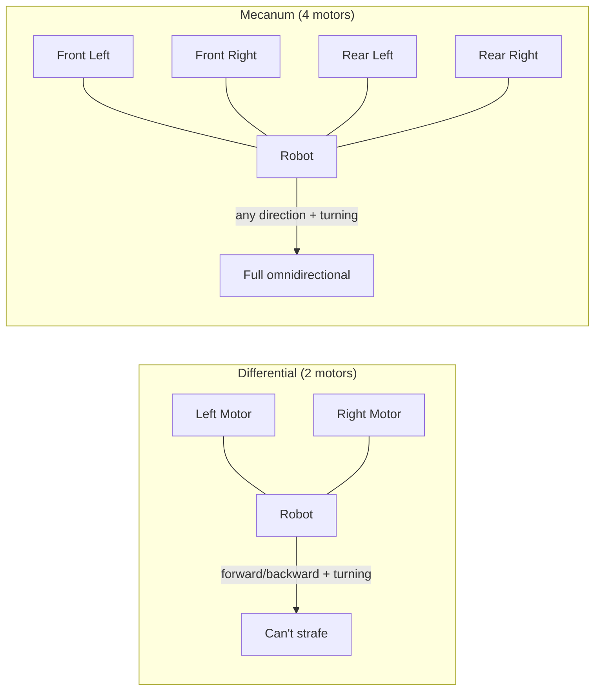
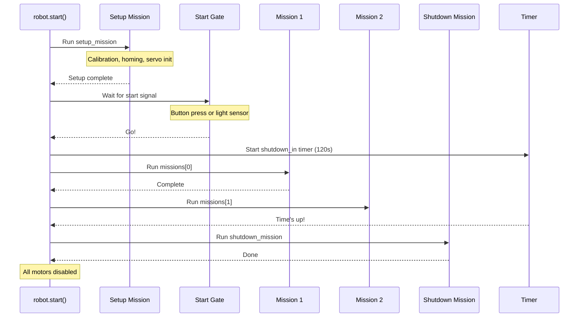

# Robot Definition

Before you write a single mission, you need to tell LibSTP what hardware your robot has and how it's arranged. This is configured in `raccoon.project.yml` — the Raccoon CLI then generates two Python files from it:

- **`defs.py`** — hardware inventory (motors, servos, sensors)
- **`robot.py`** — how those parts work together (kinematics, drive, odometry)

> **Important:** You define hardware in `raccoon.project.yml` and code generation produces `defs.py` and `robot.py` automatically. **Never edit these files by hand** — they are overwritten every time code generation runs. Always make changes in the YAML.

This page explains what the generated code looks like and what each part means, so you understand what to configure in the YAML.

## Hardware Definitions (`defs.py`)

The `Defs` class is a flat list of every physical component on your robot. Each attribute maps to a port on the Wombat controller.

### Motors

```python
from libstp import Motor, MotorCalibration

front_left_motor = Motor(
    port=0,                    # Wombat motor port (0-3)
    inverted=False,            # True if motor spins backwards
    calibration=MotorCalibration(
        ticks_to_rad=1.947e-05,   # Encoder ticks → radians (set by calibration)
        vel_lpf_alpha=1.0,        # Velocity low-pass filter (1.0 = no filtering)
    ),
)
```

**Parameters:**
- `port`: Physical motor port on the Wombat (0–3)
- `inverted`: Set to `True` if the motor is mounted backwards (spins the wrong way relative to the expected direction)
- `calibration`: Conversion factors measured during [calibration](). You generally don't set these by hand — they're populated by the calibration step

### Servos

Servos can be created plain or with named presets:

```python
from libstp import Servo, ServoPreset

# Plain servo — you specify angles in your mission code
plain_servo = Servo(port=0)

# Servo with presets — named positions you can call directly
claw = ServoPreset(
    Servo(port=2),
    positions={"closed": 135, "open": 30}
)

# Multi-position servo
arm = ServoPreset(
    Servo(port=1),
    positions={
        "down": 10,
        "above_pom": 55,
        "up": 105,
        "start": 160,
    }
)
```

With `ServoPreset`, you can move to named positions directly in your missions:
```python
Defs.claw.open()       # Moves to angle 30
Defs.arm.above_pom()   # Moves to angle 55
Defs.arm.up(300)       # Moves to angle 105, waits 300ms for travel
```

### Sensors

```python
from libstp import IRSensor, DigitalSensor, AnalogSensor, SensorGroup
from libstp import IMU as Imu

# Inertial measurement unit (one per robot, no port needed)
imu = Imu()

# Infrared line sensors — used for line detection and following
front_right_ir = IRSensor(port=0)
front_left_ir = IRSensor(port=1)

# Digital sensors — buttons, limit switches (returns True/False)
button = DigitalSensor(port=10)
arm_down_limit = DigitalSensor(port=0)

# Analog sensors — raw analog readings
light_sensor = AnalogSensor(port=2)
```

### Sensor Groups

A `SensorGroup` bundles two IR sensors (left and right) and exposes convenience methods for common operations:

```python
front = SensorGroup(left=front_left_ir, right=front_right_ir)
rear = SensorGroup(right=rear_right_ir)  # Single sensor is fine too
```

Sensor groups give you shorthand methods you can call directly in missions:
```python
Defs.front.drive_until_black()          # Drive forward until either sensor sees black
Defs.front.drive_over_line()            # Drive forward over a black line
Defs.front.follow_right_edge(cm=50)     # Follow the right edge of a line for 50 cm
Defs.front.strafe_left_until_black()    # Strafe left until sensor sees black
Defs.front.lineup_on_black()            # Align both sensors on a black line
```

### Wait-for-Light Sensor

If you're using the Botball competition start light, declare an analog sensor for it:

```python
from libstp import AnalogSensor

wait_for_light_sensor = AnalogSensor(port=2)
```

The `GenericRobot` base class looks for `defs.wait_for_light_sensor`. If present, the pre-start gate uses the light sensor. If absent, it falls back to a button press. For competition, you almost always want a light sensor.

### The `analog_sensors` List

Include all IR/analog sensors in an `analog_sensors` list. The calibration system uses this to know which sensors need calibrating:

```python
class Defs:
    # ... all your hardware above ...
    analog_sensors = [front_right_ir, front_left_ir]
```

---

## Robot Class (`robot.py`)

The `Robot` class extends `GenericRobot` and wires together hardware, drive system, odometry, and missions.

### Minimal Example (Differential Drive)

This is a real, working robot definition from the Ecer2026 ConeBot:

```python
from libstp import (
    DifferentialKinematics, Drive, FusedOdometry, FusedOdometryConfig,
    GenericRobot, PidConfig, PidGains, Feedforward,
    AxisVelocityControlConfig, ChassisVelocityControlConfig,
    AxisConstraints, UnifiedMotionPidConfig, SensorPosition,
)
from src.hardware.defs import Defs
from src.missions.m00_setup_mission import M00SetupMission
from src.missions.m01_drive_to_cone_mission import M01DriveToConeMission


class Robot(GenericRobot):
    defs = Defs()

    # --- Kinematics: how wheel speeds map to robot motion ---
    kinematics = DifferentialKinematics(
        left_motor=defs.front_left_motor,
        right_motor=defs.front_right_motor,
        wheel_radius=0.0345,     # meters
        wheelbase=0.16,          # distance between wheels, meters
    )

    # --- Drive: velocity controller ---
    # ChassisVelocityControlConfig fields (vx, vy, wz) are set after construction
    @staticmethod
    def _build_vel_config(vx=None, vy=None, wz=None):
        cfg = ChassisVelocityControlConfig()
        if vx: cfg.vx = vx
        if vy: cfg.vy = vy
        if wz: cfg.wz = wz
        return cfg

    drive = Drive(
        kinematics=kinematics,
        vel_config=_build_vel_config(
            vx=AxisVelocityControlConfig(
                pid=PidGains(kp=0.0, ki=0.0, kd=0.0),
                ff=Feedforward(kS=0.0, kV=1.0, kA=0.0),
            ),
        ),
        imu=defs.imu,
    )

    # --- Odometry: position tracking ---
    odometry = FusedOdometry(
        imu=defs.imu,
        kinematics=kinematics,
        config=FusedOdometryConfig(bemf_trust=1.0),
    )

    # --- Motion PID: how accurately the robot follows trajectories ---
    motion_pid_config = UnifiedMotionPidConfig(
        distance=PidConfig(kp=7.875, ki=0.0, kd=0.0, ...),
        heading=PidConfig(kp=7.875, ki=0.0, kd=0.0625, ...),
        linear=AxisConstraints(
            max_velocity=0.2368,       # m/s
            acceleration=0.2798,       # m/s^2
            deceleration=2.0532,       # m/s^2
        ),
        angular=AxisConstraints(
            max_velocity=2.9424,       # rad/s
            acceleration=14.6122,      # rad/s^2
            deceleration=7156.1491,    # rad/s^2
        ),
        # ... tolerance and saturation settings ...
    )

    # --- Lifecycle ---
    shutdown_in = 120  # Kill switch: stop everything after 120 seconds
    setup_mission = M00SetupMission()
    missions = [M01DriveToConeMission()]
    shutdown_mission = None

    # --- Physical dimensions (used by geometry system) ---
    width_cm = 13.0
    length_cm = 19.0
    rotation_center_forward_cm = -4.0  # Offset from geometric center
    rotation_center_strafe_cm = 0.0

    # --- Sensor positions (for odometry compensation) ---
    _sensor_positions = {
        defs.front_right_ir_sensor: SensorPosition(
            forward_cm=7.5, strafe_cm=-7.25, clearance_cm=1.0
        ),
    }
```

### Mecanum Drive Example

The PackingBot uses a 4-wheel mecanum drive that can strafe sideways:

```python
from libstp import MecanumKinematics, Stm32Odometry, WheelPosition

class Robot(GenericRobot):
    defs = Defs()

    kinematics = MecanumKinematics(
        front_left_motor=defs.front_left_motor,
        front_right_motor=defs.front_right_motor,
        back_left_motor=defs.rear_left_motor,
        back_right_motor=defs.rear_right_motor,
        track_width=0.2,       # distance between left and right wheels
        wheel_radius=0.0375,
        wheelbase=0.125,       # distance between front and rear axles
    )

    odometry = Stm32Odometry(imu=defs.imu, kinematics=kinematics)

    _wheel_positions = {
        defs.front_left_motor: WheelPosition(forward_cm=6.25, strafe_cm=10.0),
        defs.front_right_motor: WheelPosition(forward_cm=6.25, strafe_cm=-10.0),
        defs.rear_left_motor: WheelPosition(forward_cm=-6.25, strafe_cm=10.0),
        defs.rear_right_motor: WheelPosition(forward_cm=-6.25, strafe_cm=-10.0),
    }
```

### Kinematics: Differential vs. Mecanum



| Feature | Differential | Mecanum |
|---------|-------------|---------|
| Motors | 2 | 4 |
| Can drive forward/backward | Yes | Yes |
| Can turn in place | Yes | Yes |
| Can strafe sideways | No | Yes |
| Typical use | Simple robots | Complex manipulation robots |

Choose `DifferentialKinematics` for a 2-wheel robot, `MecanumKinematics` for a 4-wheel omnidirectional robot.

### Mission Lifecycle



**Setup mission** runs before the start signal — use it for calibration, homing servos, and any pre-match preparation.

**Main missions** run in order after the start signal. Each mission runs to completion before the next one starts.

**Shutdown mission** runs when the `shutdown_in` timer expires. Use it for controlled shutdown (lowering arms, releasing objects). If no shutdown mission is set, all motors are simply disabled.

### The `shutdown_in` Timer

`shutdown_in = 120` means the robot will force-stop 120 seconds after the start signal. This is a safety feature required by Botball competition rules. When the timer fires:

1. The currently running mission is cancelled
2. The shutdown mission runs (if defined)
3. All motors are disabled
4. The program exits

This happens regardless of what the robot is doing. Plan your missions to finish within the time limit.
