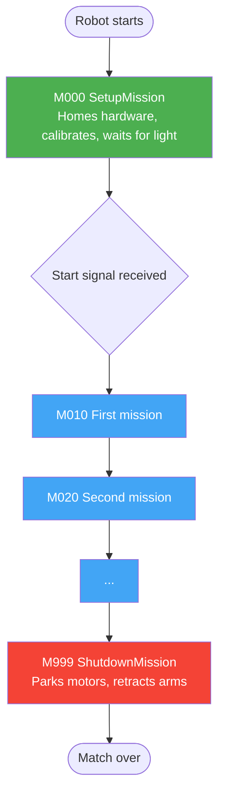

# Missions

## Concept: What a Mission Is

A mission is a self-contained task: "drive to the cone and pick it up", "follow the line to the basket", "go home". In RaccoonOS, a match is a **sequence of missions** — the runner executes them in declaration order, one at a time. When a mission's `sequence()` returns, the next mission starts immediately.

The overall shape of every match looks like this:



Every robot has exactly one setup mission (M000), zero or more game missions (M010–M990), and exactly one shutdown mission (M999). This triple role — setup / game / shutdown — is why the framework recognizes three-digit mission prefixes with slots for insertion (`M010, M020, …`) without renumbering.

> **Execution order comes from `missions.yml`, not from class-name prefixes.** The number in the name is a convention for readability and sorting on disk. The runner reads the list in `config/missions.yml` and respects exactly that order.

> **You can comment out a mission in `missions.yml` to disable it without deleting code.** This is a standard competition workflow — use YAML `#` comments when you want to quickly enable or disable a task mid-competition.

## Writing a Mission

Every mission extends the `Mission` base class and implements a `sequence()` method that returns a step tree:

```python
from raccoon import *
from src.hardware.defs import Defs


class M010DriveToConeMission(Mission):
    def sequence(self) -> Sequential:
        return seq([
            drive_forward(25),
            turn_right(90),
            drive_forward(15),
            Defs.claw.open(),
        ])
```

That's it. The framework handles execution, timing, error handling, and hardware cleanup.

## Real-World Example: ConeBot

Here's the actual mission from the Ecer2026 ConeBot that drives to a cone on the game table:

```python
from raccoon import *
from src.hardware.defs import Defs


class M010DriveToConeMission(Mission):
    def sequence(self) -> Sequential:
        return seq([
            # Start position: against the wall
            Defs.cone_arm_servo.up(),
            drive_backward(3),
            turn_right(55),

            # Align against the back wall
            wall_align_backward(accel_threshold=0.3),
            drive_forward(2),

            # Sweep to check for cone
            Defs.cone_arm_servo.down(),
            turn_left(25),
            turn_right(25),
            Defs.cone_arm_servo.up(),

            # Drive to the line and follow it
            Defs.front.drive_until_black(),
            forward_single_lineup(
                Defs.front.right,
                entry_threshold=0.9,
                exit_threshold=0.7,
                correction_side=CorrectionSide.RIGHT,
                forward_speed=1.0,
            ),

            # Drive along the line to the cone
            drive_forward(27),
            turn_right(90),
            Defs.front.drive_until_black(),
        ])
```

Notice how the mission reads almost like natural language: "raise arm, back up, turn, align against wall, find the line, follow it, drive to the cone."

## Composing Steps

### Sequential Execution

`seq([...])` runs steps one after another. Each step must finish before the next one starts:

```python
seq([
    drive_forward(25),     # Step 1: drive 25 cm
    turn_right(90),        # Step 2: turn 90 degrees (after step 1 finishes)
    drive_forward(25),     # Step 3: drive 25 cm (after step 2 finishes)
])
```

### Parallel Execution

`parallel(...)` runs multiple things at the same time. Each argument is an independent track:

```python
parallel(
    drive_forward(50),                          # Track 1: drive forward
    seq([                                        # Track 2: arm movement
        wait_until_distance(20),                 #   wait until 20cm traveled
        Defs.arm.down(),                         #   then lower the arm
    ]),
)
```

Parallel finishes when **all tracks** complete. You can pass individual steps, lists of steps (implicitly sequential), or explicit `seq([...])` blocks.

**Resource safety**: Parallel validates that no two tracks use the same hardware resource. You can't drive forward and turn at the same time, because both need the drive system. The framework will raise an error before execution if it detects a conflict.

### Real Parallel Example

From the PackingBot — driving forward while operating a grabber:

```python
parallel(
    # Track 1: Follow the line edge
    Defs.front.follow_right_edge(999).until(
        after_cm(125) & on_black(Defs.front.right)
    ),

    # Track 2: Grab POMs during the drive
    seq([
        wait_until_distance(35),      # Wait until we've traveled 35cm
        Defs.pom_grab.closed(),       # Close grabber
        Defs.pom_arm.up(),            # Lift arm
    ]),

    # Track 3: Put arm back down after passing edge
    seq([
        wait_until_distance(45),
        Defs.pom_arm.down(),
    ]),

    # Track 4: Pre-adjust grabber width
    Defs.pom_grab.slightly_open(),
)
```

Four things happening simultaneously: line following, grabbing objects at the right moment, repositioning the arm, and adjusting the grabber width.

## Stop Conditions

Many steps accept a `.until(condition)` clause that controls when the step finishes:

```python
drive_forward(speed=0.8).until(on_black(Defs.front.right))
drive_forward(speed=1.0).until(on_black(Defs.front.right) | after_cm(50))
drive_forward(speed=1.0).until(after_cm(10) + on_black(Defs.front.right))
```

Conditions can be combined with `|` (OR), `&` (AND), `+` (THEN), and grouped with parentheses for complex logic. See **[Stop Conditions]()** for the full reference.

## Control Flow

### Looping

```python
# Repeat a step 5 times
loop_for(drive_forward(10), iterations=5)

# Repeat forever (use inside do_while_active to stop it)
loop_forever(seq([
    drive_forward(10),
    turn_right(90),
]))
```

### Do While Active

Run a task that stops when a reference step finishes:

```python
do_while_active(
    reference_step=drive_forward(100),  # This controls the lifetime
    task=loop_forever(                   # This runs alongside and gets cancelled
        seq([
            Defs.arm.up(),
            wait_for_seconds(0.5),
            Defs.arm.down(),
            wait_for_seconds(0.5),
        ])
    ),
)
```

### Conditional Branching with `if_then()`

`if_then()` evaluates a predicate at runtime and executes one of two branches. The predicate receives the robot instance and must return a boolean quickly — it runs synchronously and should not do long-running work.

```python
from raccoon import *

# Sensor-gated branch: take different paths depending on what the robot detects
if_then(
    lambda robot: robot.defs.front_right_ir.read() > 500,
    then_step=turn_left(90),    # sensor above threshold: go left
    else_step=turn_right(90),   # sensor below threshold: go right
)
```

The `else_step` is optional — omitting it means "do nothing on the false branch":

```python
# Only open the claw if we're close enough
if_then(
    lambda robot: robot.defs.distance_sensor.read() < 300,
    then_step=Defs.claw.open(),
)
```

Resource validation spans both branches, because either may execute. If both branches claim the same hardware, the framework raises at validation time.

### Background Steps

`background()` starts a step asynchronously and returns immediately, letting the next step in the sequence proceed while the background step runs concurrently. Use `wait_for_background()` to synchronize later:

```python
from raccoon import *

seq([
    # Launch the servo move, then immediately start driving — no waiting
    background(Defs.arm.down(), name="arm"),
    drive_forward(30),
    # Wait for the arm to finish before continuing
    wait_for_background("arm"),
    Defs.claw.open(),
])
```

Background steps differ from `parallel()` in two ways:

- They do **not** block the sequence — execution continues to the next step immediately.
- They are **preemptable**: if a later foreground step claims a resource that the background step holds, the background step is cancelled with a warning. The foreground step takes priority.

`wait_for_background()` without a name waits for **all** currently running background steps:

```python
seq([
    background(scan_step()),
    background(servo_step()),
    do_something_else(),
    wait_for_background(),   # wait for both scan_step and servo_step
])
```

If a background step finishes before `wait_for_background()` is reached, the wait returns immediately.

#### Cross-Mission Background Synchronization

Named background tasks are **run-scoped, not mission-scoped**. A task started with `background(step, name="x")` at the end of one mission can be awaited with `wait_for_background("x")` at the start of the *next* mission. This is the standard idiom for overlapping arm motion with a mission transition — the arm keeps moving while the runner starts loading the next mission.

The following is adapted from the Ecer2026 ClawBot — M030 kicks off a tray-return background move, and M040 awaits it at its own beginning while already doing other work:

```python
# --- M030CollectDrumsMission ---
class M030CollectDrumsMission(Mission):
    def sequence(self) -> Sequential:
        return seq([
            # ... collect drums ...
            return_tray_to_tray_holder_phase1(),
            # Kick off phase 2 in the background — it will continue into M040
            background(
                return_tray_to_tray_holder_phase2(),
                name="return_tray",
            ),
        ])


# --- M040CollectBotguyMission ---
class M040CollectBotguyMission(Mission):
    def sequence(self) -> Sequential:
        return seq([
            drive_backward().until(on_white(Defs.front.left)),
            backward_line_follow().until(
                after_cm(30) + over_line(Defs.front.right) + after_cm(2)
            ),
            line_follow().until(on_black(Defs.front.right)),
            # Now wait for the tray return that was started in M030
            wait_for_background("return_tray"),
            # ... continue ...
        ])
```

The key insight: `background()` and `wait_for_background()` work across mission boundaries because background handles are keyed by name in the robot's run context, which persists for the entire match.

### Timeout Steps

Wrap any step with a hard time limit using `timeout()`. If the step completes within the budget it finishes normally; if it exceeds the limit, the step is cancelled and `TimeoutError` propagates up the sequence, stopping the mission:

```python
from raccoon import *

# Give the arm motor 5 seconds to reach position — cancel if it stalls
timeout(
    motor_move_to(Defs.arm_motor, position=300, velocity=800),
    seconds=5.0,
)

# Ensure the operator presses the button within 30 seconds
timeout(wait_for_button(), seconds=30.0)
```

Use `timeout_or()` when you want a recovery action instead of an error:

```python
from raccoon import *

# Try driving 30 cm; if stuck after 3 s, back up 5 cm instead
timeout_or(
    drive_forward(30),
    seconds=3.0,
    fallback=drive_backward(5),
)
```

`timeout_or()` never raises — if the primary step times out, the fallback runs and the sequence continues normally.

**Real example:** The Ecer2026 ClawBot wraps a sensor-guided forward step with a tight timeout to guard against missing the line — if the line isn't found within 0.5 seconds, the sequence moves on rather than driving indefinitely:

```python
parallel(
    timeout(
        drive_forward().until(on_black(Defs.front.left)),
        seconds=0.5,
    ),
    arm.move_angles(-90, 40, -30),
)
```

| Function | Timeout behavior |
|----------|-----------------|
| `timeout(step, seconds)` | Raises `TimeoutError` — mission stops |
| `timeout_or(step, seconds, fallback)` | Runs `fallback` — mission continues |

### Watchdog Timers

Watchdogs are keepalive timers that cancel the mission if they are not "fed" within a deadline. Use them to detect stuck hardware: arm a watchdog before a critical phase, feed it after each step that must complete, and disarm it when the phase is done. If any step hangs and the feed never arrives, the watchdog fires, the mission is cancelled, and the shutdown mission runs.

```python
from raccoon import *

seq([
    start_watchdog("scoring", timeout=5.0),  # Arm: cancel if not fed within 5 s
    drive_forward(30),
    feed_watchdog("scoring"),                 # Feed: reset the deadline
    drive_forward(30),
    feed_watchdog("scoring"),                 # Feed again for the next step
    stop_watchdog("scoring"),                 # Disarm: phase complete
])
```

| Step | Parameters | What it does |
|------|-----------|-------------|
| `start_watchdog(name, timeout)` | `name: str = "default"`, `timeout: float` | Arms a watchdog; fires after `timeout` seconds if not fed |
| `feed_watchdog(name)` | `name: str = "default"` | Resets the deadline to `now + timeout` |
| `stop_watchdog(name)` | `name: str = "default"` | Disarms the watchdog; no expiry can fire after this |

Multiple watchdogs can run simultaneously by using distinct names. Feeding or stopping a non-existent watchdog logs a warning but does not raise.

The `WatchdogManager` behind these steps is also used internally by the robot runner for `Mission.time_budget` deadlines (see the [Mission Budget](#mission-time-budget) section below). On expiry, the watchdog cancels the main-mission task via the same code path as the global `shutdown_in` timer — the shutdown mission still runs, motors are stopped, and the process exits cleanly.

### Environment-Gated Steps

`run_if_env()` and its named shortcuts let you conditionally skip steps based on the flags `raccoon run` was launched with. The gate is evaluated at execution time (not when the step tree is built), so it always reflects the actual run mode:

| Guard step | Runs when... | CLI flag it mirrors |
|-----------|-------------|---------------------|
| `run_unless_no_calibrate(step)` | `--no-calibrate` was **not** passed | `raccoon run --no-calibrate` |
| `run_unless_no_checkpoints(step)` | `--no-checkpoints` was **not** passed | `raccoon run --no-checkpoints` |
| `run_if_debug(step)` | `--debug` was passed | `raccoon run --debug` |
| `run_if_dev(step)` | `--dev` was passed | `raccoon run --dev` |
| `run_if_env(step, var, equals, negate)` | Custom env-var gate | (any variable) |

```python
from raccoon import *

class M000SetupMission(SetupMission):
    setup_time = 120

    def sequence(self) -> Sequential:
        return seq([
            # Skip calibration on fast development runs
            run_unless_no_calibrate(calibrate(distance_cm=50)),

            # Only show an interactive pause in debug mode
            run_if_debug(wait_for_button("Check arm position")),

            # A dev-only sanity hop
            run_if_dev(drive_forward(5)),
        ])
```

The typical workflow: develop and iterate with `raccoon run --no-calibrate --no-checkpoints` to skip the slow setup steps. Run without flags on the competition robot.

The generic `run_if_env()` lets you gate on any environment variable:

```python
from raccoon.step.logic import run_if_env

# Only run when MY_FLAG=1
run_if_env(some_step(), "MY_FLAG")

# Only run when DEMO_MODE is unset
run_if_env(some_step(), "DEMO_MODE", equals=None)

# Run unless MY_FLAG=1 (inverted)
run_if_env(some_step(), "MY_FLAG", negate=True)
```

### Inline Code with `run()`

Execute arbitrary Python code as a step:

```python
seq([
    drive_forward(25),
    run(lambda robot: print("Reached the cone!")),
    Defs.claw.open(),
])
```

`run()` accepts sync or async callables:

```python
async def check_sensor(robot):
    value = robot.defs.front_right_ir.read()
    if value > 2000:
        print("On black line")

seq([
    run(check_sensor),
    drive_forward(10),
])
```

### Deferred Steps

Build a step at runtime based on robot state:

```python
def choose_direction(robot):
    if robot.defs.front_right_ir.read() > 2000:
        return turn_left(90)
    else:
        return turn_right(90)

seq([
    drive_forward(25),
    defer(choose_direction),   # Decides at runtime
    drive_forward(25),
])
```

**Why `defer()` instead of `if_then()`?** The key difference is when the step tree is *built* vs when it *runs*. The entire `seq([...])` list is constructed before the mission starts — any Python that reads sensor state at module level runs too early. `defer()` receives a factory function that is called at the moment the step executes, so it always sees live robot state.

**Real example from the PackingBot** — a sensor-gated strafe that only fires if the robot detects it landed in the wrong position:

```python
def drive_if_sensor_triggered(sensor):
    def _build(robot):
        if sensor.read() > 500:     # live sensor read at execution time
            return seq([drive_forward(35)])
        else:
            return seq([])           # no-op branch
    return defer(_build)
```

The comment in the source is explicit: "`defer` = evaluate `_build` function at runtime and not compile-time." When in doubt, use `if_then()` for simple boolean branches and `defer()` when you need to inspect any live state to pick among multiple step trees.

## Setup Mission

### Extending `SetupMission`

The setup mission runs before the match starts. It **must** extend `SetupMission`, not plain `Mission`. The robot runner enforces this with a `TypeError` at startup if it receives a plain `Mission` instance:

```python
from raccoon import *
from src.hardware.defs import Defs


class M000SetupMission(SetupMission):
    setup_time = 120  # 2-minute countdown shown on the UI

    def sequence(self) -> Sequential:
        return seq([
            # Home all servos to known positions
            motor_off(Defs.cone_container_motor),
            Defs.claw.closed(),
            Defs.arm.up(),

            # Run distance calibration (skip with raccoon run --no-calibrate)
            run_unless_no_calibrate(calibrate(distance_cm=50)),
        ])
```

> `calibrate()` defaults to `distance_cm=30.0`. The example above passes `50` explicitly for a more accurate run — pass whatever distance your table allows.

**Full competition setup pattern** (adapted from the Ecer2026 ConeBot): disable servos so the operator can reposition them, gate on a button press, release any actuated motors, home all servos, calibrate for both table surfaces, then activate the ground-level calibration set:

```python
class M000SetupMission(SetupMission):
    setup_time = 120

    def sequence(self) -> Sequential:
        return seq([
            # 1. Go limp — operator repositions mechanisms physically
            fully_disable_servos(),
            wait_for_button("Move Servos"),

            # 2. Release motor so container can be set manually
            motor_off(Defs.cone_container_motor),

            # 3. Home all servos to known positions
            Defs.claw_servo.closed(),
            Defs.cone_arm_servo.container_pos(),

            # 4. Calibrate IR sensors for both floor and ramp surfaces in one pass
            calibrate(distance_cm=50, calibration_sets=["default", "upper"]),
            switch_calibration_set("default"),  # start on ground level

            # 5. Park arm for competition start
            Defs.cone_arm_servo.handl_hight(),
        ])
```

The `fully_disable_servos()` → `wait_for_button()` → servo homing sequence is the standard idiom for robots where the arm needs to be repositioned by the operator before the match.

### `setup_time`: Countdown Timer

Set `setup_time` (seconds, integer) as a class attribute to display a countdown in the UI during the entire setup phase. The clock ticks independently on the robot — no LCM messages required.

```python
class M000SetupMission(SetupMission):
    setup_time = 120   # 120 seconds shown on every UI screen during setup
```

Set `setup_time = 0` (the default) to disable the timer.

### Controlling the Timer with Steps

By default the countdown starts the moment the setup mission begins. Use the timer control steps to defer the start until you are physically ready:

| Step | What it does |
|------|-------------|
| `pause_setup_timer()` | Freezes the clock at its current remaining value |
| `start_setup_timer()` | Resets to `setup_time` and starts counting (full duration from now) |
| `resume_setup_timer()` | Unpauses the clock without resetting — continues from where it stopped |

```python
from raccoon import *

class M000SetupMission(SetupMission):
    setup_time = 120

    def sequence(self) -> Sequential:
        return seq([
            # Freeze the clock — time is not running yet
            pause_setup_timer(),

            # Prepare hardware without burning setup time
            Defs.claw.closed(),
            Defs.arm.up(),

            # Operator presses button: clock starts NOW, full 120 s remaining
            wait_for_button("Ready? Press to start timer"),
            start_setup_timer(),

            # Run calibration while the countdown is live
            calibrate(distance_cm=50),
        ])
```

All three steps are no-ops outside a `SetupMission` — you can leave them in shared step functions without worrying about calling context.

### `pre_start_gate()`: Customizing the Wait-for-Light

After the setup sequence completes, the robot normally waits for the start light signal before running main missions. Override `pre_start_gate()` to customize or bypass this:

```python
class M000SetupMission(SetupMission):
    setup_time = 120

    def sequence(self) -> Sequential:
        return seq([calibrate(distance_cm=50)])

    async def pre_start_gate(self, robot) -> None:
        # Wait for a button press instead of the light sensor
        from raccoon.step import wait_for_button
        await wait_for_button("Press to start").run_step(robot)

class QuickTestSetup(SetupMission):
    def sequence(self) -> Sequential:
        return seq([motor_off(Defs.arm_motor)])

    async def pre_start_gate(self, robot) -> None:
        pass  # Start immediately — no waiting
```

The default `pre_start_gate()` delegates to the robot's built-in wait-for-light / wait-for-button logic defined in `robot.physical`.

**Extending the gate without replacing it:** The most useful override pattern is adding behavior *before* the standard wait-for-light, then explicitly calling back into the base class to preserve the gate. This is how the Ecer2026 DrumBot injects a custom calibration step before the light:

```python
class M000SetupMission(SetupMission):
    setup_time = 120

    def sequence(self) -> Sequential:
        return seq([...])

    async def pre_start_gate(self, robot) -> None:
        # Run our project-specific calibration gate first
        await calibration_gate().run_step(robot)
        # Then hand off to the standard wait-for-light — DON'T skip this
        await robot._pre_start_gate()
```

Call `robot._pre_start_gate()` (single underscore — it is a protected method on `GenericRobot`) to invoke the built-in gate. If you omit this call, the robot will not wait for the start light and the match will begin immediately after your setup sequence.

## Mission Time Budget

Each mission can declare a `time_budget` (seconds) as a class-level attribute. If the mission runs longer than its budget, the `WatchdogManager` cancels it and routes through the shutdown path — the shutdown mission still runs, subsequent missions do not.

```python
class M010ScoringMission(Mission):
    time_budget = 30.0   # Cancel this mission if it exceeds 30 s

    def sequence(self) -> Sequential:
        return seq([
            drive_forward(50),
            Defs.claw.open(),
            drive_backward(25),
        ])
```

`time_budget = None` (the default) means no deadline. The budget watchdog is armed automatically by the robot runner — you do not need to call `start_watchdog()` manually for this use case.

## Mission Registration

Missions are registered in the Robot class. This is also automatically generated for you. **Don't edit this!** To change it, edit the `raccoon.project.yml` file:

```python
class Robot(GenericRobot):
    # ...
    setup_mission = M000SetupMission()        # Runs before start signal
    missions = [                               # Run in order after start
        M010DriveToConeMission(),
        M020CollectConeMission(),
        M030CollectBotguyMission(),
    ]
    shutdown_mission = M99ShutdownMission()    # Always runs at the end
```

Missions execute in list order. If mission 1 finishes, mission 2 starts immediately.

The **shutdown mission always runs** — both when all main missions complete normally and when the `shutdown_in` timer fires mid-mission. Use it for guaranteed cleanup (park motors, retract arms, turn off LEDs) regardless of how the match ended. Do not rely on it as an error-only path; it executes unconditionally.

> If the `shutdown_in` timer fires during a mission, that mission is cancelled first, and then the shutdown mission runs.

## Related Pages

- **[Stop Conditions]()** — full reference for `.until()` conditions and operators
- **[Steps DSL]()** — how step builders, `@dsl_step`, and `@dsl` work
- **[Custom Steps]()** — writing your own steps and motion steps
- **[Synchronizing Two Robots]()** — `wait_for_checkpoint()` and cross-robot timing
