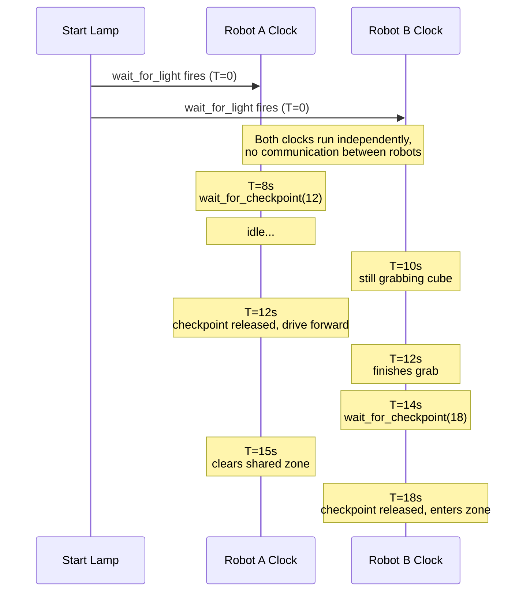

# Synchronizing Two Robots

## Concept

In a Botball match, your two robots run completely separate programs on separate Wombats — they don't talk to each other over the network, they don't share sensors, and neither one knows where the other is. What they **do** share is a common start signal: the **wait-for-light gate** on both robots fires the instant the start lamp turns on, and at that exact moment both mission clocks start measuring from T=0. From there on, each robot's clock ticks forward in lockstep with the other — not because they're communicating, but because they were both kicked off by the same physical event in the room.

`wait_for_checkpoint()` uses that shared timeline to coordinate the two robots without any communication. You pick absolute mission times — *"enter the shared zone at T=20s"*, *"drop the cube at T=35s"* — and bake them into both robots' missions. As long as each robot started at the same moment, they'll arrive at the same wall-clock time even though neither knows what the other is doing.

Think of the two robots as dancers who can't see each other, performing the same choreography to a shared song. Neither one is listening for the other — they're both listening to the beat. If both start when the music starts, step 1 at bar 4 and step 2 at bar 8 will line up perfectly, even though neither dancer has any idea where the other is on the stage.

`wait_for_checkpoint()` is the beat. Your mission is the choreography.

## How the Clock Works



Both robots look at their own clock. They never look at each other.

Every robot has a `synchronizer` attached to it. The synchronizer captures `T=0` the moment the wait-for-light gate fires — i.e. the instant the start lamp is detected. This is what ties the two robots' clocks together: because the lamp turns on for both robots at the same physical moment, both synchronizers latch `T=0` at (nearly) the same instant, and `wait_for_checkpoint(20.0)` on Robot A fires at (nearly) the same wall-clock moment as `wait_for_checkpoint(20.0)` on Robot B.

From that moment on, `wait_for_checkpoint(checkpoint_seconds)` pauses the current sequence until the mission clock reaches that absolute time.

While waiting, a full-screen countdown is shown on the robot's display — the remaining seconds tick down in large digits so you can see at a glance when the robot will resume. The display automatically returns to the normal mission screen when the checkpoint fires.

> If your robot is started by button press instead of a light (e.g. during development, or because the `wait_for_light_sensor` is not defined), the synchronizer latches `T=0` on the button press instead. See **[Making Your Robot Competition Ready]()** for how to enable the light-start gate.

```python
from raccoon.step.timing import wait_for_checkpoint

seq([
    drive_forward(30),
    wait_for_checkpoint(15.0),   # Don't continue before T=15s
    drive_forward(20),
    wait_for_checkpoint(30.0),   # Don't continue before T=30s
    Defs.claw.open(),
])
```

The key word is **"before"**. If the robot arrives early, it waits. If the previous steps already ran long and the checkpoint has passed, the step logs a warning and returns immediately — it never rewinds the clock. Think of it as a *"no earlier than"* gate, not a precise trigger.

> The synchronizer clock is **mission-relative**, not wall-clock. It starts at zero when your first mission begins and counts up from there. T=20.0 means "20 seconds after start", not "20 seconds past the minute".

## A Realistic Scenario

Say Robot A has to cross the center of the table on its way to a scoring zone, and Robot B has to drop a cube into a bin that sits on the same center line. Both robots pass through the shared area, but at different times. They must not collide.

Sit down with your partner before the match and agree on a timeline:

| Time | Robot A | Robot B |
|------|---------|---------|
| T=0–12s | Drives from start to the center edge | Collects the cube from the home zone |
| T=12s | **Crosses the center line** | Still in its own zone |
| T=15s | Clear of the shared area | Finishing grab |
| T=18s | Working the scoring zone | **Enters the shared area to drop** |
| T=25s | Returning home | Clear of the shared area |

The two risky moments are **T=12s** (A is in the middle) and **T=18s** (B is in the middle). Everything else is safe.

**Robot A's mission:**

```python
class M010CrossCenterMission(Mission):
    def sequence(self) -> Sequential:
        return seq([
            drive_forward(40),
            # A can cross the center no earlier than T=12s.
            # By this time, we know B is still grabbing.
            wait_for_checkpoint(12.0),
            drive_forward(30),             # Cross the center
            turn_right(90),
            drive_forward(20),             # Enter scoring zone
        ])
```

**Robot B's mission:**

```python
class M010DropCubeMission(Mission):
    def sequence(self) -> Sequential:
        return seq([
            drive_forward(20),
            Defs.claw.closed(),            # Grab cube
            # B must wait until A is out of the shared area.
            # A clears the center by T=15s; we leave 3s of margin.
            wait_for_checkpoint(18.0),
            drive_forward(25),
            Defs.claw.open(),              # Drop cube
            drive_backward(25),            # Back out
        ])
```

Neither robot knows where the other is. They only agree on *when* each action is allowed to happen. As long as both start at T=0 together, the checkpoints do the rest.

## Single-Robot Timing Gates

`wait_for_checkpoint()` is not exclusively for two-robot coordination. It works equally well as a **single-robot timing gate** — holding one robot until a known safe window, even if that window is driven purely by elapsed time rather than by the partner robot's state.

The Ecer2026 ConeBot uses it to avoid a dangerous backward drive across a shared area until T=87s — the arithmetic in the argument (`60 + 27`) makes the intent readable in source:

```python
# ConeBot M040DriveToRampMission
drive_backward().until(
    after_cm(10) + over_line(Defs.front.right) + after_cm(20)
),
wait_for_checkpoint(60 + 27),    # Wait until T=87s before continuing
drive_backward().until(after_cm(70)),
```

If your robot simply needs to avoid a zone until a certain game time — regardless of the partner — this is the right tool. No second robot needed.

## Reading the Clock Inside a Step

Custom steps can read the current match time directly from `robot.synchronizer.get_time()`. This is useful when you need checkpoint-relative timing logic that is too fine-grained for a separate `wait_for_checkpoint()` step — for example, computing how much time remains before an expected drum arrival.

The synchronizer may not have latched T=0 yet (if the step runs before the start light fires), so always guard the read:

```python
import asyncio
from raccoon import Step, GenericRobot

class WaitForDrumStep(Step):
    async def _execute_step(self, robot: GenericRobot) -> None:
        target_arrival = 45.0  # drums expected at T=45s
        try:
            elapsed = robot.synchronizer.get_time()
            remaining = target_arrival - elapsed
        except (TypeError, AttributeError):
            remaining = 0.0   # pre-latch: assume checkpoint already passed
        if remaining > 0:
            await asyncio.sleep(remaining)
```

*(Adapted from the Ecer2026 DrumBot — `WaitForDrumStep`.)*

## Choosing Checkpoint Times

This is the part that matters, and it's where most teams get it wrong. A checkpoint you overshoot on a bad run is a checkpoint that does nothing — the warning in the log is your only hint that timing slipped. A checkpoint that fires too early defeats the point of the synchronization. Picking the right numbers is a measurement problem, not a guessing problem.

### Measure First, Then Gate

Run the mission a few times **without** checkpoints and note how long each phase actually takes. Write it down. Then add the checkpoints with margin.

For example, you might find:

- Robot A reaches the center in 8–11 seconds depending on how cleanly it follows the line.
- Robot B finishes grabbing the cube in 13–17 seconds, depending on whether the cube is stuck against the wall.

Given those numbers, `wait_for_checkpoint(12.0)` for A is tight (bad runs already arrive at 11s). Bump it to 13s. And `wait_for_checkpoint(18.0)` for B is only 1 second of margin past the worst case — bump it to 19s or 20s.

### Add Margin to the Slower Robot

The checkpoint should be *after* the worst-case finish time of whichever robot's action blocks the other. If Robot B's grab usually finishes by T=14s but occasionally stretches to T=17s, set the checkpoint to at least T=18s — ideally T=19s or T=20s. Two to three seconds of slack is a good starting point.

### Checkpoint Just Before the Risky Action

Place the `wait_for_checkpoint()` call **immediately before** the step that could collide, not at the start of the sequence. You want the pause to absorb any earlier slowdowns, so the robot arrives at the dangerous action exactly on schedule.

```python
# BAD — checkpoint is too early
seq([
    wait_for_checkpoint(12.0),    # Gate here...
    drive_forward(40),             # ...but this takes variable time
    drive_forward(30),             # Might enter shared zone any time between T=12 and T=25
])

# GOOD — checkpoint right before the risky step
seq([
    drive_forward(40),
    wait_for_checkpoint(12.0),    # Gate immediately before the risky step
    drive_forward(30),             # Always enters shared zone at exactly T=12+
])
```

### Use It Sparingly

Every checkpoint is a hard synchronization point. Two or three well-placed checkpoints per mission is usually enough. Gating every step is a recipe for missed checkpoints and wasted time — if the first checkpoint slips, every subsequent one does too, and the log fills up with warnings you'll ignore.

## Catching Collisions Before They Happen

Sketching out a timeline on paper is fine, but it's easy to miss a conflict when two missions are long and both involve sweeping arms, wide turns, or shared lanes. The **Web IDE** can do this check for you.

If you open both robots' projects in the Web IDE, it can replay each mission against the simulated game table, time-stamp every motion step based on the mission clock, and overlay the two paths on the same timeline. Wherever the two robots occupy overlapping space *at the same timestamp*, the IDE flags a collision — before you ever run the robots on a real table.

This turns picking checkpoint times from guesswork into a measurement exercise: you change a `wait_for_checkpoint()` value, the IDE re-simulates, and any remaining collision markers tell you exactly which checkpoints still need slack. Catching a collision in the browser costs nothing. Catching it at competition costs a run.

Use this before every major mission change. Especially useful when:

- You're adding a new shared-zone crossing and want to find a safe window
- You changed a drive speed and need to re-verify the old timeline still holds
- You're swapping who grabs which object between the two robots
- You're debugging why your partner's robot keeps getting clipped

The collision check reads the same timestamped path data that the mission clock uses at runtime, so the simulated timing closely matches what you'll see on the real robot — provided you've kept your `wait_for_checkpoint()` margins realistic.

## Doing Something Useful While Waiting

Idling at a checkpoint is a waste of seconds you can't get back. `do_until_checkpoint(checkpoint, step)` runs a step *until* the checkpoint is reached, then cancels it. Use it to scan for a line, sweep a scanner servo, poll a sensor, or make any other productive use of the wait time:

```python
seq([
    drive_forward(40),
    # Sweep the scanner servo back and forth while waiting for the window
    do_until_checkpoint(12.0, loop_forever(
        seq([
            Defs.scanner_servo.sweep_left(),
            wait_for_seconds(0.3),
            Defs.scanner_servo.sweep_right(),
            wait_for_seconds(0.3),
        ])
    )),
    drive_forward(30),
])
```

When T=12s hits, the loop is cancelled cleanly at the next `await` point and execution continues with `drive_forward(30)`.

> **"At least until the checkpoint."** If the wrapped step finishes *before* the checkpoint, execution does not continue immediately — `do_until_checkpoint` still waits until the checkpoint time is reached. Think of it as "run this step, and in any case don't continue before T=12s." This is different from `do_while_active`, where the outer step ends as soon as the reference step ends.

## Limitations

`wait_for_checkpoint()` is a simple tool, and it's important to know what it *isn't*.

- **No cross-robot clock correction.** The two synchronizers run independently on two Raspberry Pis. If one robot starts half a second late because a button was pressed sluggishly, its checkpoints fire half a second late. There's no handshake — the two clocks drift independently for the whole match.
- **Time only moves forward.** A missed checkpoint is logged and ignored. The step does not block waiting for a partner signal, because there is no partner signal. If you need "wait until my partner finishes", you need a sensor (e.g. the partner flips a reflector your sensor can see), not a checkpoint.
- **Not a substitute for sensors.** If you need to know whether the *other robot* has physically left a zone, use a light sensor, a distance sensor, or a camera. `wait_for_checkpoint()` only knows about time, not about reality. If your partner's mission crashes at T=5s and never enters the shared zone, your "wait until T=18s" will still fire at T=18s — blind to the fact that there's nothing to wait for.
- **One robot, one clock.** Every robot has its own synchronizer. Two robots on the same team have two independent timelines that happen to start together.

## Quick Reference

```python
from raccoon.step.timing import wait_for_checkpoint, do_until_checkpoint

# Pause until the mission clock reaches T=checkpoint_seconds
# (returns immediately if the checkpoint has already passed).
wait_for_checkpoint(checkpoint_seconds)

# Run `step` until the checkpoint, then cancel it.
# If step finishes early, still waits until checkpoint_seconds.
do_until_checkpoint(checkpoint, step)
```

Both live in `raccoon.step.timing` and can be placed anywhere inside a `seq([...])` or `parallel(...)` block, just like any other step.

> **Use keyword arguments carefully.** The parameter names are `checkpoint_seconds` and `checkpoint` respectively. Using the wrong keyword name (e.g. `do_until_checkpoint(seconds=12.0, task=my_step)`) will raise a `TypeError`. Pass positionally or use the correct names: `do_until_checkpoint(checkpoint=12.0, step=my_step)`.

## Related Pages

- **[Missions]()** — mission structure, background steps, and cross-mission coordination
- **[Making Your Robot Competition Ready]()** — enabling the light-start gate
