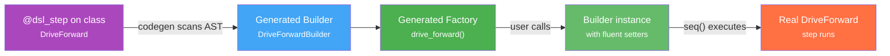

# Steps DSL

Steps are the building blocks of every mission. Each step is a single action: drive forward, turn, move a servo, wait for a sensor. You combine steps into sequences and parallel blocks to build complex behaviors.

> For a complete, always up-to-date list of every available step function and its parameters, see the **[API Reference]()** — specifically the DSL Steps section. This page explains the concepts and patterns behind the DSL, not every individual function.

## How the DSL Works

You never instantiate step classes directly. Instead, you call **factory functions** that return **builder objects**:

```python
# You write this:
drive_forward(25, speed=0.8).until(on_black(Defs.front.right))

# NOT this:
DriveForward(cm=25, speed=0.8, until=OnBlack(Defs.front.right))
```

The underlying classes (`DriveForward`, `TurnLeft`, etc.) are hidden. You interact with clean `snake_case` factory functions.

### The Builder Pattern

Every factory function returns a builder — an object that you can configure with chained method calls before it executes:

```python
# Simple — just parameters
drive_forward(25)

# Chained — add a stop condition
drive_forward(speed=0.8).until(on_black(Defs.front.right))

# Multiple chains
drive_forward(25).on_anomaly(lambda step, dt: print(f"Slow: {dt}s")).skip_timing()
```

Builders are steps themselves — you can place them directly into `seq([...])` without calling `.build()`. When the mission runs, the builder constructs the real step and executes it.

### How It's Built: Annotations and Code Generation

Under the hood, the DSL is powered by two decorators and a code generator:



**1. `@dsl_step`** — Marks a step class for code generation. Applied to the internal class:

```python
@dsl_step(tags=["motion", "drive"])
class DriveForward(MotionStep):
    def __init__(self, cm: float = None, speed: float = 1.0, until: StopCondition = None):
        ...
```

The decorator marks the class as hidden from the DSL discovery system (e.g., the API reference listing) and registers it for the code generator. The class still exists — you can find it if you search for it — but you're expected to use the generated factory function instead.

**2. Code generator** — At build time, scans all `@dsl_step` classes via Python's AST. For each one, it generates:
- A **Builder class** (`DriveForwardBuilder`) with fluent setter methods for every `__init__` parameter (`.cm()`, `.speed()`, `.until()`)
- A **factory function** (`drive_forward()`) with the same signature as the original `__init__`, decorated with `@dsl` for metadata

**3. `@dsl`** — Applied to the generated factory function. Attaches metadata (name, tags) used by the API reference and BotUI to discover and display available steps.

The generated files are named `*_dsl.py` and sit alongside the original source. You never edit them — they're regenerated on every build.

### Available Builder Methods

Every builder inherits these methods from `StepBuilder`:

| Method | What It Does |
|--------|-------------|
| `.until(condition)` | Add a stop condition (motion steps) |
| `.on_anomaly(callback)` | Register a timing anomaly watchdog |
| `.skip_timing()` | Exclude from timing instrumentation |
| Per-parameter setters | One for each `__init__` parameter (e.g., `.cm()`, `.speed()`) |

## Stop Conditions

Many steps accept a `.until(condition)` clause that controls when the step finishes. Conditions can be combined with `|` (OR), `&` (AND), and `>` (THEN), and grouped with parentheses for complex logic:

```python
drive_forward(speed=0.8).until(on_black(Defs.front.right))
drive_forward(speed=1.0).until(on_black(Defs.front.right) | after_cm(50))
drive_forward(speed=1.0).until(
    after_cm(5) > (on_black(Defs.front.left) & on_black(Defs.front.right))
)
```

See **[Stop Conditions]()** for the full reference — all available conditions, operators, parenthesized grouping, and common patterns.

For the full, always up-to-date list of every available step function and its parameters, see the **[API Reference]()** — specifically the DSL Steps section.
