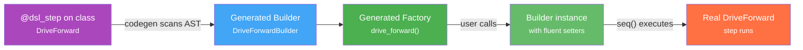
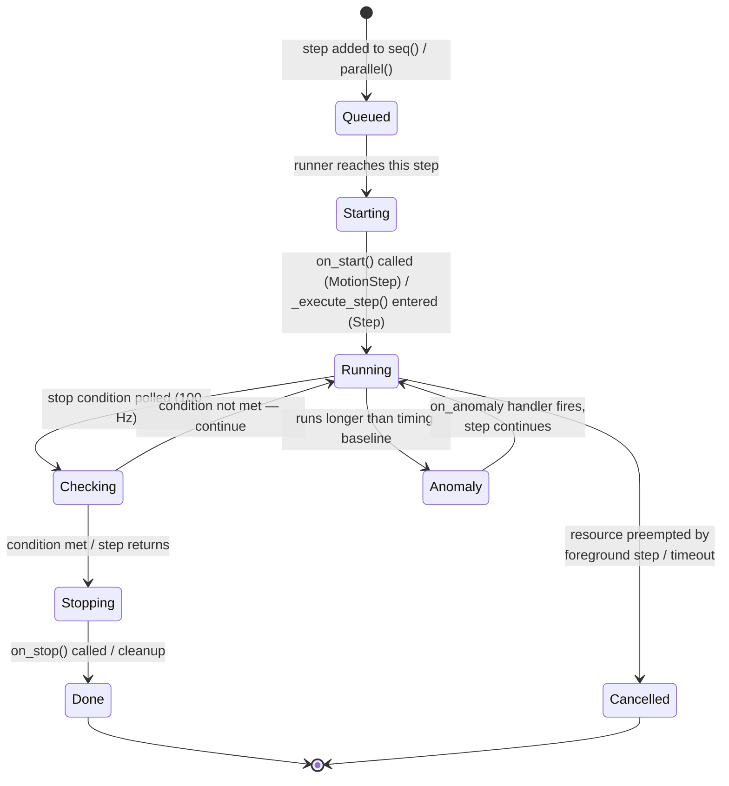

# Steps DSL

## Concept: What a Step Is

A **step** is the atomic unit of a mission — a single, self-contained action. Driving 25 cm forward is a step. Turning 90 degrees is a step. Moving a servo to a named position is a step. Waiting for a sensor is a step.

Steps are composable: `seq([...])` runs them one after another; `parallel(...)` runs them simultaneously. The mission system is nothing more than a large tree of nested steps executed by the framework.

You never interact with step classes directly. Instead, you call **factory functions** that return **builder objects**. This is the DSL layer.

> For a complete, always up-to-date list of every available step function and its parameters, see the **[API Reference]()** — specifically the DSL Steps section. This page explains the concepts and patterns behind the DSL, not every individual function.

## How the DSL Works

You never instantiate step classes directly. Instead, you call **factory functions** that return **builder objects**:

```python
# You write this:
drive_forward(25, speed=0.8).until(on_black(Defs.front.right))

# NOT this:
DriveForward(cm=25, speed=0.8, until=OnBlack(Defs.front.right))
```

The underlying classes (`DriveForward`, `TurnLeft`, etc.) are hidden. You interact with clean `snake_case` factory functions.

### The Builder Pattern

Every factory function returns a builder — an object that you can configure with chained method calls before it executes:

```python
# Simple — just parameters
drive_forward(25)

# Chained — add a stop condition
drive_forward(speed=0.8).until(on_black(Defs.front.right))

# Multiple chains — anomaly callback + skip timing
drive_forward(25).on_anomaly(lambda step, robot: robot.warn(f"Slow: {step}")).skip_timing()
```

Builders are steps themselves — you can place them directly into `seq([...])` without calling `.build()`. When the mission runs, the builder constructs the real step and executes it.

### How It's Built: Annotations and Code Generation

Under the hood, the DSL is powered by two decorators and a code generator:



**1. `@dsl_step`** — Marks a step class for code generation. Applied to the internal class:

```python
@dsl_step(tags=["motion", "drive"])
class DriveForward(MotionStep):
    def __init__(self, cm: float = None, speed: float = 1.0, until: StopCondition = None):
        ...
```

The decorator marks the class as hidden from the DSL discovery system (e.g., the API reference listing) and registers it for the code generator. The class still exists — you can find it if you search for it — but you're expected to use the generated factory function instead.

**2. Code generator** — At build time, scans all `@dsl_step` classes via Python's AST. For each one, it generates:
- A **Builder class** (`DriveForwardBuilder`) with fluent setter methods for every `__init__` parameter (`.cm()`, `.speed()`, `.until()`)
- A **factory function** (`drive_forward()`) with the same signature as the original `__init__`, decorated with `@dsl` for metadata

**3. `@dsl`** — Applied to the generated factory function. Attaches metadata (name, tags) used by the API reference and BotUI to discover and display available steps.

The generated files are named `*_dsl.py` and sit alongside the original source. You never edit them — they're regenerated on every build.

> **Project-owned steps can use the same codegen infrastructure.** If you create a class in `src/steps/` and annotate it with `@dsl_step`, running `raccoon codegen` generates a `*_dsl.py` file for it too. Your mission code then imports from that generated file, just as it does for raccoon's own built-in steps. See the [Custom Steps]() page for the full pattern.

### Available Builder Methods

Every builder inherits these methods from `StepBuilder`:

| Method | What It Does |
|--------|-------------|
| `.until(condition)` | Add a stop condition (motion steps) |
| `.on_anomaly(callback_or_step)` | Register a timing anomaly handler (see below) |
| `.skip_timing()` | Exclude from timing instrumentation |
| Per-parameter setters | One for each `__init__` parameter (e.g., `.cm()`, `.speed()`) |

#### `.on_anomaly()` — Timing Anomaly Handler

`.on_anomaly()` registers a handler that fires when the step takes longer than its expected baseline (as measured by the timing database). It accepts **either** an async callback or a step instance directly:

**Callback form** — receives `(step: Step, robot: GenericRobot)`:

```python
import asyncio
from raccoon import *

async def slow_step_handler(step, robot):
    # step is the Step instance that ran slowly
    # robot is the GenericRobot — use it to access hardware/logging
    robot.warn(f"Step ran slowly: {step}")

drive_forward(25).on_anomaly(slow_step_handler)
```

The callback signature is `Callable[[Step, GenericRobot], Awaitable[Any]]` — the second argument is always a `GenericRobot`, not a timing value.

**Step form** — run a step when the anomaly fires:

```python
# Play a sound whenever this drive step runs longer than expected
drive_forward(25).on_anomaly(play_sound())
```

Passing a step directly is syntactic sugar — the framework wraps it in a callback that calls `step.run_step(robot)`.

## Step Lifecycle

Understanding the step lifecycle is critical when writing custom steps and diagnosing timing anomalies:



Key points:
- **`seq([...])`**: only one step is in `Running` at a time. The next step does not enter `Starting` until the current one reaches `Done`.
- **`parallel(...)`**: all tracks enter `Starting` together. The parallel block reaches `Done` only when all tracks have finished.
- **`background()`**: the step enters `Starting` and `Running` immediately, but the sequence does not wait for it — the next step in `seq()` starts. The background step may be `Cancelled` if a later foreground step claims the same resource.

## Stop Conditions

Many steps accept a `.until(condition)` clause that controls when the step finishes. Conditions can be combined with `|` (OR), `&` (AND), and `+` (THEN), and grouped with parentheses for complex logic:

```python
drive_forward(speed=0.8).until(on_black(Defs.front.right))
drive_forward(speed=1.0).until(on_black(Defs.front.right) | after_cm(50))
drive_forward(speed=1.0).until(
    after_cm(5) + (on_black(Defs.front.left) & on_black(Defs.front.right))
)
```

See **[Stop Conditions]()** for the full reference — all available conditions, operators, parenthesized grouping, and common patterns.

## Control Flow Steps

The control flow steps documented in [Missions]() — `if_then()`, `background()`, `wait_for_background()`, `timeout()`, `timeout_or()`, `start_watchdog()`, `feed_watchdog()`, `stop_watchdog()`, and the `run_if_env()` family — are all first-class steps. They can be placed anywhere in a `seq([...])` or `parallel(...)` block, passed to `defer()`, used as branches inside `if_then()`, or combined with stop conditions.

For a full explanation of each, see the **[Missions — Control Flow]()** section.

For the full, always up-to-date list of every available step function and its parameters, see the **[API Reference]()** — specifically the DSL Steps section.

## Related Pages

- **[Custom Steps]()** — writing function-based and class-based custom steps, including `MotionStep`
- **[Stop Conditions]()** — full reference for `.until()` conditions and operators
- **[Missions]()** — composing steps into missions with `seq()`, `parallel()`, `background()`, and control flow
