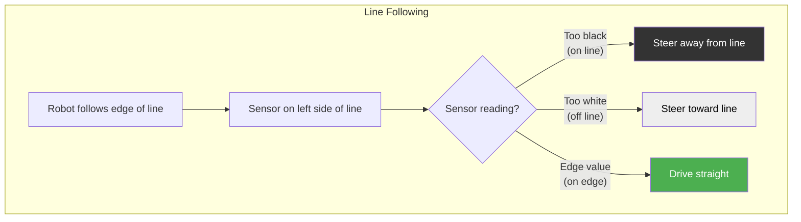
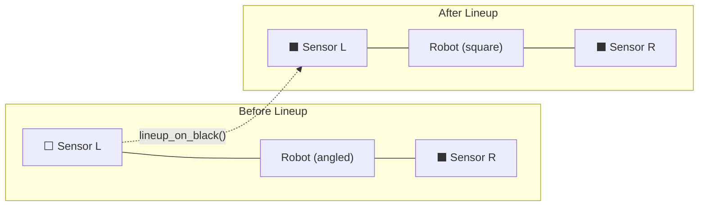

# Sensors

LibSTP supports four sensor types: **IR line sensors**, **digital sensors**, **analog sensors**, and a **camera** interface. All sensors are declared in `defs.py` and accessed throughout your mission code.

## IR Sensors (Line Detection)

IR sensors are the primary tool for line following and line detection. They measure surface reflectivity — black surfaces absorb light (high value), white surfaces reflect it (low value).

### Declaration

```python
from libstp import IRSensor, SensorGroup

front_right_ir = IRSensor(port=0)
front_left_ir = IRSensor(port=1)

# Group sensors for convenience methods
front = SensorGroup(left=front_left_ir, right=front_right_ir)
rear = SensorGroup(right=rear_right_ir)   # Single sensor groups work too
```

### Calibration

IR sensors need calibration to distinguish black from white on your specific game table. Calibration stores two thresholds per sensor:

```yaml
# racoon.calibration.yml
root:
  ir-calibration:
    default:
      white_tresh: 1469.84
      black_tresh: 2490.58
    default_port0:
      white_tresh: 543.45
      black_tresh: 3647.12
```

Run calibration during setup:
```python
calibrate_sensors()     # Interactive calibration via BotUI
```

Or as part of the setup mission (see [Calibration]()).

### Using IR Sensors in Steps

The most common way to use IR sensors is through **stop conditions** and **SensorGroup shortcuts**:

```python
# Stop conditions
drive_forward(speed=0.8).until(on_black(Defs.front.right))
drive_forward(speed=0.8).until(on_white(Defs.front.right))
drive_forward(speed=0.8).until(on_black(Defs.front.right, threshold=0.9))

# SensorGroup shortcuts (the easiest way)
Defs.front.drive_until_black()              # Drive forward → black
Defs.front.drive_over_line()                # Drive forward over a line
Defs.front.strafe_left_until_black()        # Strafe until black
Defs.front.strafe_right_until_black()       # Strafe until black
Defs.front.follow_right_edge(cm=50)         # Follow right edge of line
Defs.front.lineup_on_black()                # Square up on a line

# Using a specific sensor from the group
Defs.front.strafe_left_until_black(sensor=Defs.front.right)
```

### Line Following Explained



Line following works by keeping a sensor on the edge between black and white. A PID controller continuously adjusts steering to hold the sensor at the calibrated edge value.

### Lineup (Line Alignment)

Lineup aligns the robot square on a line using one or two sensors:



```python
# Dual sensor: both sensors find the line
forward_lineup_on_black(Defs.front.left, Defs.front.right)
backward_lineup_on_black(Defs.front.left, Defs.front.right)

# Single sensor: one sensor finds the line, robot pivots to align
forward_single_lineup(
    Defs.front.right,
    entry_threshold=0.9,          # When to start correcting
    exit_threshold=0.7,           # When to consider "on line"
    correction_side=CorrectionSide.RIGHT,
    forward_speed=0.5,
)
```

## Digital Sensors

Digital sensors return `True` (pressed) or `False` (released). Used for buttons, limit switches, and bump sensors.

### Declaration

```python
from libstp import DigitalSensor

button = DigitalSensor(port=10)           # Wombat's built-in button
arm_down_limit = DigitalSensor(port=0)    # Limit switch
arm_up_limit = DigitalSensor(port=1)      # Limit switch
```

### Usage in Steps

```python
# Wait until pressed
wait_for_digital(Defs.arm_down_limit, pressed=True)

# Use as stop condition
set_motor_velocity(Defs.arm_motor, -100).until(
    on_digital(Defs.arm_down_limit)
)

# Wait for the Wombat button
wait_for_button()
```

### Example: Motor with Limit Switch

Drive a motor until it hits a limit switch:

```python
def lower_arm():
    return seq([
        set_motor_velocity(Defs.arm_motor, -100),
        wait_for_digital(Defs.arm_down_limit),
        motor_passive_brake(Defs.arm_motor),
    ])
```

## Analog Sensors

Raw analog readings from the Wombat's analog ports. Values depend on the sensor type and wiring.

### Declaration

```python
from libstp import AnalogSensor

light_sensor = AnalogSensor(port=2)
distance_sensor = AnalogSensor(port=3)
```

### Usage in Steps

```python
# Stop conditions
drive_forward(speed=0.5).until(on_analog_above(Defs.distance_sensor, 2000))
drive_forward(speed=0.5).until(on_analog_below(Defs.distance_sensor, 500))

# Read in custom code
run(lambda robot: print(f"Light: {robot.defs.light_sensor.read()}"))
```

## Camera Sensor

The camera interface provides access to the Raccoon camera system for object detection.

### Declaration

```python
from libstp import CamSensor

cam = CamSensor()
```

Camera functionality depends on the `raccoon-cam` and `object-detector` services running on the robot. See the Raccoon platform documentation for camera setup.

## ET Sensor (Distance)

The ET (electro-topographic) sensor is a distance/range finder. It wraps an analog input but has a distinct type for clarity:

```python
from libstp import ETSensor

distance = ETSensor(port=3)
```

Use it like an analog sensor — read raw values with `distance.read()` or use it with `on_analog_above()` / `on_analog_below()` conditions.

## Sensor Groups in Depth

`SensorGroup` is a convenience wrapper that pre-binds common step patterns to your sensors. It accepts `left` and/or `right` IR sensors:

```python
front = SensorGroup(left=front_left_ir, right=front_right_ir)
```

### Available SensorGroup Methods

| Method | What It Does |
|--------|-------------|
| `.drive_until_black()` | Drive forward until any sensor sees black |
| `.drive_over_line()` | Drive forward through a line to the other side |
| `.lineup_on_black()` | Align both sensors on a black line |
| `.follow_right_edge(cm)` | Follow the right edge of a line |
| `.follow_right_until_black()` | Follow line until right sensor sees black |
| `.strafe_left_until_black()` | Strafe left until a sensor sees black |
| `.strafe_right_until_black()` | Strafe right until a sensor sees black |
| `.strafe_left_until_black(sensor=...)` | Use a specific sensor |

All methods return step objects that work in `seq([...])` and `parallel(...)` just like any other step.

## Stall Detection

You can detect when a motor is stalling (trying to move but physically blocked):

```python
# Drive forward until the motor stalls (e.g., hit a wall)
drive_forward(speed=0.3).until(
    stall_detected(Defs.front_left_motor, threshold_tps=10, duration=0.25)
)
```

Parameters:
- `threshold_tps`: Speed below this (ticks per second) counts as stalling
- `duration`: Must stall for this many seconds to trigger
