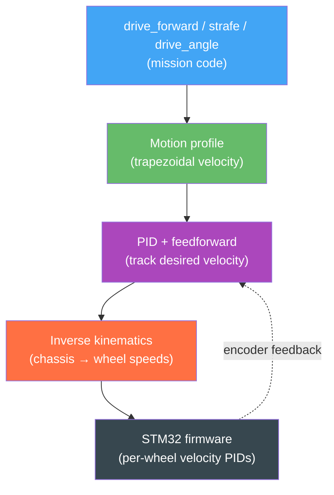
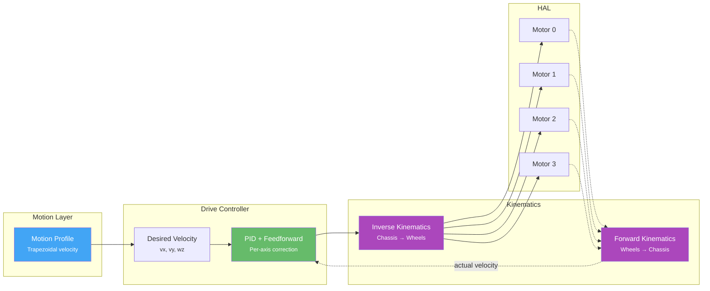

# Drive System

The drive system translates high-level velocity commands ("go forward at 0.2 m/s") into individual motor speeds. It handles PID control, feedforward compensation, and kinematics — all at 100 Hz.

You rarely interact with the drive system directly. The [Steps DSL]() calls it for you. This page explains how it works under the hood, how to use `drive_angle()` for diagonal mecanum motion, the `heading=` parameter for drift-free long drives, the low-level `ChassisVelocity` API for custom steps, and how to tune the system when your robot isn't driving straight or overshooting targets.

## Concept: From Command to Wheels

When you call `drive_forward(50)`, a chain of layers converts that intent into physical motor commands:



On a real Wombat the Pi-side PID is bypassed — the STM32 runs its own inner velocity loop. On a mock/simulator the Pi-side PID is active. Either way, your step code stays the same. See [Motion Flow and Kinematics]() for the full control-stack breakdown.

## Architecture



## Velocity Control

The drive controller operates on three axes:

| Axis | Symbol | Unit | Direction |
|------|--------|------|-----------|
| Forward | `vx` | m/s | Positive = forward |
| Lateral | `vy` | m/s | Positive = right |
| Angular | `wz` | rad/s | Positive = counter-clockwise |

Each axis has its own PID controller and feedforward term:

```python
vel_config = ChassisVelocityControlConfig(
    vx=AxisVelocityControlConfig(
        pid=PidGains(kp=0.001, ki=0.86, kd=0.0002),
        ff=Feedforward(kS=0.0, kV=1.0, kA=0.0),
    ),
    vy=AxisVelocityControlConfig(
        pid=PidGains(kp=0.0, ki=0.0, kd=0.0),
        ff=Feedforward(kS=0.0, kV=1.0, kA=0.0),
    ),
    wz=AxisVelocityControlConfig(
        pid=PidGains(kp=0.0, ki=0.0, kd=0.0),
        ff=Feedforward(kS=0.0, kV=1.0, kA=0.0),
    ),
)
```

### PID Gains

- **kp** (proportional): Corrects based on current error. Higher = more aggressive correction.
- **ki** (integral): Corrects for accumulated error over time. Eliminates steady-state offset.
- **kd** (derivative): Dampens oscillation. Reacts to rate of change of error.

### Feedforward

Feedforward predicts what motor command is needed *before* the error happens:

- **kS** (static friction): Minimum voltage to overcome friction. Applied whenever the robot is moving.
- **kV** (velocity): Scales velocity command to motor voltage. Usually 1.0.
- **kA** (acceleration): Compensates for inertia during acceleration.

For most robots, `kV=1.0` with zero PID is a reasonable starting point. Add PID only if the robot doesn't track the target velocity accurately.

## Kinematics

Kinematics defines the relationship between chassis velocity and wheel speeds.

The overview on this page is enough for tuning and basic setup. For the full control/data flow, forward and inverse formulas, and the exact role of `Drive`, `IKinematics`, and `MotorAdapter`, see [Motion Flow and Kinematics]().

### Differential Drive

Two motors, one on each side:

```python
from raccoon import DifferentialKinematics

kinematics = DifferentialKinematics(
    left_motor=defs.front_left_motor,
    right_motor=defs.front_right_motor,
    wheel_radius=0.0345,     # meters
    wheelbase=0.16,          # distance between wheel centers, meters
)
```

- Both wheels forward → robot drives forward
- Left faster than right → robot turns right
- Wheels opposite directions → robot spins in place
- **Cannot strafe sideways**

Inverse kinematics:

```text
w_left  = (vx - wz * wheelbase / 2) / wheel_radius
w_right = (vx + wz * wheelbase / 2) / wheel_radius
```

Forward kinematics:

```text
vx = (w_left + w_right) * wheel_radius / 2
wz = (w_right - w_left) * wheel_radius / wheelbase
vy = 0
```

### Mecanum Drive

Four mecanum wheels that enable omnidirectional movement:

```python
from raccoon import MecanumKinematics

kinematics = MecanumKinematics(
    front_left_motor=defs.front_left_motor,
    front_right_motor=defs.front_right_motor,
    back_left_motor=defs.rear_left_motor,
    back_right_motor=defs.rear_right_motor,
    track_width=0.2,        # side-to-side distance, meters
    wheel_radius=0.0375,    # meters
    wheelbase=0.125,        # front-to-back distance, meters
)
```

Wheel spin patterns for common motions:

| Motion | FL | FR | BL | BR |
|--------|----|----|----|----|
| Drive forward | forward | forward | forward | forward |
| Strafe right (`vy > 0`) | forward | backward | backward | forward |
| Spin CCW | backward | forward | backward | forward |
| **Full omnidirectional movement** | | | | |

For strafing right, front-left and back-right spin forward; front-right and back-left spin backward. This produces a net rightward translation with no rotation.

`MecanumKinematics` accepts an optional `velocity_command_gain` parameter (a per-axis gain for efficiency compensation, calibrated by `auto_tune()`):

```python
kinematics = MecanumKinematics(
    ...
    velocity_command_gain=(1.0, 1.0, 1.0),  # (vx, vy, wz) scaling
)
```

The mecanum model defines:

```text
L = (wheelbase + track_width) / 2
```

Inverse kinematics:

```text
w_fl = (vx + vy - L * wz) / wheel_radius
w_fr = (vx - vy + L * wz) / wheel_radius
w_bl = (vx - vy - L * wz) / wheel_radius
w_br = (vx + vy + L * wz) / wheel_radius
```

Forward kinematics:

```text
vx = (w_fl + w_fr + w_bl + w_br) * wheel_radius / 4
vy = (w_fl - w_fr - w_bl + w_br) * wheel_radius / 4
wz = (-w_fl + w_fr - w_bl + w_br) * wheel_radius / (4 * L)
```

### Sign conventions and wheel ordering

The kinematics layer uses the same chassis-space convention as the underlying library:

- `vx` = forward in m/s
- `vy` = right in m/s
- `wz` = counter-clockwise in rad/s

For mecanum, wheel ordering is:

1. front-left
2. front-right
3. back-left
4. back-right

Those conventions are assumed consistently by the kinematics models, drive layer, and odometry.

### Measuring Wheel Radius and Wheelbase

**Wheel radius**: Measure the wheel diameter with calipers and divide by 2. Convert to meters.

**Wheelbase** (differential): Measure the distance between the center of the left wheel contact patch and the center of the right wheel contact patch. Convert to meters.

**Track width** (mecanum): Distance between left and right wheel centers. **Wheelbase** (mecanum): Distance between front and rear wheel centers.

Getting these values wrong will cause the robot to over- or under-turn and drive inaccurate distances.

## Arc Motion

Arc steps drive the robot along a circular arc — forward motion combined with simultaneous turning. They are essential for smooth cornering without a full stop.

### `drive_arc_left` / `drive_arc_right`

Drive forward while turning left or right through the specified angle:

```python
from raccoon.step.motion import drive_arc_left, drive_arc_right

# Quarter-circle turn to the left (CCW) with 30 cm radius
drive_arc_left(radius_cm=30, degrees=90)

# Gentle sweep to the right (CW) at half speed
drive_arc_right(radius_cm=50, degrees=45, speed=0.5)
```

Parameters:

| Parameter | Type | Default | Description |
|-----------|------|---------|-------------|
| `radius_cm` | `float` | required | Turning radius in cm (measured from arc centre to robot centre) |
| `degrees` | `float` | required | Arc angle — how many degrees the robot rotates |
| `speed` | `float` | `1.0` | Fraction of max speed, 0.0–1.0 |

The arc length travelled is `2 * pi * radius_cm * (degrees / 360)` cm. A 90° arc with 30 cm radius travels about 47 cm along the curve.

### `strafe_arc_left` / `strafe_arc_right`

Mecanum robots only. The robot strafes laterally while simultaneously rotating, tracing a circular arc:

```python
from raccoon.step.motion import strafe_arc_left, strafe_arc_right

# Strafe arc: move laterally while turning left (CCW)
strafe_arc_left(radius_cm=30, degrees=90)

# Strafe arc: move laterally while turning right (CW)
strafe_arc_right(radius_cm=50, degrees=45, speed=0.5)
```

These require a mecanum or omni-wheel drivetrain capable of lateral motion. Internally the step derives the lateral velocity from the angular velocity as `vy = |omega| * radius` to produce coordinated acceleration along the arc.

### `drive_arc_segment`

Instead of specifying radius and arc angle separately, `drive_arc_segment` lets you specify the desired **heading change** and **travel distance** along the arc. The radius is computed automatically:

```text
radius = distance_cm / radians(|heading_degrees|)
```

```python
from raccoon.step.motion import drive_arc_segment

# Curve left by 10 degrees over 25 cm of travel
drive_arc_segment(heading_degrees=10, distance_cm=25)

# Curve right by 30 degrees over 40 cm at half speed
drive_arc_segment(heading_degrees=-30, distance_cm=40, speed=0.5)
```

Parameters:

| Parameter | Type | Description |
|-----------|------|-------------|
| `heading_degrees` | `float` | Positive = left/CCW, negative = right/CW |
| `distance_cm` | `float` | Distance along the arc path (always positive) |
| `speed` | `float` | Fraction of max speed, 0.0–1.0 (default 1.0) |

`drive_arc_segment` is the idiomatic factory for fixed-curve motion when you know how far you want to travel rather than the turning radius. It raises `ValueError` if `heading_degrees` is zero (which would imply infinite radius — use `drive_forward` instead) or if `distance_cm` is not positive.

## Heading Hold During Linear Motion

Every linear drive step (`drive_forward`, `drive_backward`, `strafe_left`, `strafe_right`) accepts an optional `heading=` parameter. When supplied, the controller locks the robot to that **absolute heading** (degrees from the heading reference) for the duration of the step, instead of holding whatever heading the robot happened to have at the start.

This is the correct tool for long drives where small drift would accumulate enough to miss a target:

```python
# Without heading= : holds the heading at step start (relative mode)
# After 200 cm of drift the robot may be 5–10° off
drive_backward(cm=200)

# With heading=180 : locks to 180° absolute for the entire drive
# Drift is corrected actively by IMU feedback
drive_backward(cm=200, heading=180)
```

**When to use `heading=`:**
- Drives longer than about 50 cm on a mecanum robot (lateral drift couples into rotation)
- Any drive that follows a wall-align or `mark_heading_reference()` where you want that orientation maintained
- Inside `smooth_path()` per-segment to avoid explicit `turn_to_heading` steps between segments

**Prerequisites:** `mark_heading_reference()` must have been called before any step that uses `heading=`. The value is interpreted in the same frame as `turn_to_heading_right()` / `turn_to_heading_left()`.

**Real example (adapted from the conebot, ramp-return mission):**

```python
from raccoon import *
from src.hardware.defs import Defs

class M050DriveToStartingBoxMission(Mission):
    def sequence(self):
        return seq([
            switch_calibration_set("upper"),        # elevated surface thresholds
            drive_backward(cm=30),
            turn_to_heading_right(180),
            drive_backward(cm=200, heading=180),    # 200 cm: heading hold prevents drift
        ])
```

The `heading=` parameter is also accepted as a builder method:

```python
drive_forward(25).heading(90)   # equivalent to drive_forward(25, heading=90)
```

## Diagonal Motion (`drive_angle`)

`drive_angle()` drives a mecanum robot in any body-frame direction — not just forward, backward, or sideways. The angle is measured in the robot frame from forward, clockwise:

```
     0° = forward
    90° = pure right
  -90° = pure left  (or 270°)
   180° = backward
```

```python
from raccoon.step.motion import drive_angle

# Drive forward-right at 45 degrees for 30 cm
drive_angle(45, cm=30)

# Drive backward-left at 130° until sensor fires
drive_angle(130).until(on_black(Defs.front.left))

# Full parameter form
drive_angle(angle_deg=90, cm=20, speed=0.7)
```

Parameters:

| Parameter | Type | Default | Description |
|-----------|------|---------|-------------|
| `angle_deg` | `float` | required | Travel angle in degrees (0 = forward, 90 = right, 180 = backward, -90 = left) |
| `cm` | `float \| None` | `None` | Distance to travel. Omit for condition-only mode. |
| `speed` | `float` | `1.0` | Fraction of max speed, 0.0–1.0 |
| `until` | `StopCondition` | `None` | Stop condition for early termination |

Either `cm` or `until` must be provided — passing neither raises `ValueError`.

**Requires** a mecanum or omni-wheel drivetrain. Calling `drive_angle` on a differential robot raises an error.

Convenience variants `drive_angle_left(angle_deg)` and `drive_angle_right(angle_deg)` exist for clarity — left takes a positive angle measured to the left, right takes a positive angle measured to the right. Both wrap `drive_angle()` internally.

**Real example (adapted from the packingbot):**

```python
# Fixed-distance diagonal approach
drive_angle(120, 19)                                      # backward-left 19 cm

# Condition-only diagonal — stops at first black line
drive_angle(angle_deg=110).until(on_black(Defs.front.left))
```

## Low-Level Drive API (`ChassisVelocity`)

In normal mission code you never need to touch the drive API directly — step builders handle it. But when writing a custom `MotionStep` (for example a heading-hold controller), you can command the drive layer directly:

```python
from raccoon.foundation import ChassisVelocity
from raccoon.step.motion.motion_step import MotionStep

class HoldHeading(MotionStep):
    def on_start(self, robot):
        from raccoon.robot.heading_reference import HeadingReferenceService
        self._service = robot.get_service(HeadingReferenceService)
        self._max_w = robot.motion_pid_config.angular.max_velocity

    def on_update(self, robot, dt):
        error_deg = self._service.compute_turn(self._target_deg)
        import math
        w = self._kp * math.radians(error_deg)
        w = max(-self._max_w, min(self._max_w, w))
        robot.drive.set_velocity(ChassisVelocity(0, 0, w))  # vx, vy, wz
        robot.drive.update(dt)
        return False  # never finishes — use inside parallel()
```

The three key methods on `robot.drive`:

| Method | Description |
|--------|-------------|
| `robot.drive.set_velocity(ChassisVelocity(vx, vy, wz))` | Set desired body-frame velocity (m/s, m/s, rad/s) |
| `robot.drive.update(dt)` | Advance the controller by `dt` seconds — must be called every `on_update` tick |
| `robot.drive.hard_stop()` | Immediately command zero velocity |

`ChassisVelocity(vx, vy, wz)` uses the same axes as the rest of the system: `vx` = forward, `vy` = right, `wz` = counter-clockwise. This is the complete production-code pattern from the conebot's `HoldHeading` step — the only place in competition code where the low-level drive API is called directly.

## Speed Mode

`set_speed_mode()` toggles the firmware's BEMF closed-loop velocity control on or off. In normal mode (SpeedMode disabled), the STM32 measures wheel velocity via back-EMF and uses it to maintain accurate cm distances and angles. SpeedMode disables these measurements, granting roughly 10% additional top speed at the cost of distance and angle precision.

```python
from raccoon.step.motion import set_speed_mode, drive_forward
from raccoon.step.condition import on_black

seq([
    set_speed_mode(True),                              # engage SpeedMode
    drive_forward(speed=1.0).until(on_black(sensor)),  # sensor-terminated only
    set_speed_mode(False),                             # return to normal mode
])
```

**When SpeedMode is active:**
- All motion steps must terminate via a sensor condition (`.until(...)`), time limit, or stall detection
- Distance-based or angle-based goals raise `std::logic_error` — the controller has no velocity feedback to honour them
- Use `set_speed_mode(False)` before any step that uses a distance or angle target

Parameters:

| Parameter | Type | Default | Description |
|-----------|------|---------|-------------|
| `enabled` | `bool` | required | `True` = SpeedMode on (BEMF off), `False` = return to normal |
| `timeout_s` | `float` | `0.5` | Max seconds to wait for firmware ACK before raising |

The step publishes an LCM command, waits for the firmware's acknowledgement on the retained `raccoon/feature/bemf_enabled` channel, then updates the library's internal speed-mode flag. If no ACK arrives within `timeout_s` it raises `RuntimeError` to prevent library and firmware state from diverging.

## Motion PID Config

The motion PID controls *how accurately the robot follows planned trajectories* (distance and heading). This is separate from the velocity PID above.

```python
motion_pid_config = UnifiedMotionPidConfig(
    # Library defaults — replace with your robot's tuned values
    distance=PidConfig(
        kp=2.0, ki=0.0, kd=0.5,       # library defaults
        integral_max=10.0,
        integral_deadband=0.01,
        derivative_lpf_alpha=0.3,
        output_min=-10.0, output_max=10.0,
    ),

    heading=PidConfig(
        kp=2.0, ki=0.0, kd=0.3,       # library defaults
        integral_max=10.0,
        integral_deadband=0.01,
        derivative_lpf_alpha=0.3,
        output_min=-10.0, output_max=10.0,
    ),

    # Maximum velocities and accelerations (set by auto_tune / characterize_drive)
    linear=AxisConstraints(
        max_velocity=0.2368,       # m/s (your robot's top speed)
        acceleration=0.2798,       # m/s²
        deceleration=2.0532,       # m/s² (can be higher than accel)
    ),
    angular=AxisConstraints(
        max_velocity=2.9424,       # rad/s
        acceleration=7.6122,       # rad/s²
        deceleration=16.1491,      # rad/s²
    ),
    lateral=AxisConstraints(       # Only for mecanum
        max_velocity=0.2209,
        acceleration=0.6485,
        deceleration=0.4498,
    ),

    # Tolerances: when to consider "arrived"
    # Library defaults: 10 mm distance, ~2° angle
    distance_tolerance_m=0.01,    # 10 mm (library default)
    angle_tolerance_rad=0.035,    # ~2 degrees (library default)
    velocity_ff=1.0,
)
```

> **Defaults vs. tuned values:** The library's built-in defaults are `distance_tolerance_m=0.01` (10 mm) and `angle_tolerance_rad=0.035` (~2°), with PID gains `kp=2.0, kd=0.5` (distance) and `kp=2.0, kd=0.3` (heading). The values in your `raccoon.project.yml` are specific to your robot and are written there by `auto_tune()`. Do not copy hardcoded values from one robot's config to another — run `auto_tune()` on each robot instead.

### Axis Constraints

`AxisConstraints` define the robot's physical limits. The motion planner uses these to create trapezoidal velocity profiles:



- `max_velocity`: The fastest the robot will ever go. Set this conservatively — it's the speed at `speed=1.0`.
- `acceleration`: How quickly the robot ramps up to max velocity.
- `deceleration`: How quickly the robot slows down. Can be higher than acceleration (braking is usually faster).

These values are measured automatically by the `calibrate()` and `auto_tune()` steps.

## Auto-Tuning

LibSTP includes automatic tuning steps that measure your robot's actual performance and set the PID gains, axis constraints, and tolerances.

### `auto_tune()` — Full Pipeline

`auto_tune()` runs the complete calibration pipeline in sequence:

```python
# In your setup mission:
auto_tune()
```

The full signature has roughly 20 parameters:

```python
auto_tune(
    # Which axes to tune (auto-detected by default)
    vel_axes=None,
    characterize_axes=None,
    motion_axes=None,

    # Toggle individual phases (all True by default unless noted)
    tune_bemf_velocity=True,      # per-motor ticks_to_rad vs. calibration board
    tune_vel_lpf=True,            # IIR velocity filter alpha
    tune_static_friction=True,    # kS per motor
    tune_firmware_pid=True,       # STM32 MAV-mode inner velocity PID
    tune_encoder_cal=False,       # IMU encoder cal (superseded by bemf, disabled)
    tune_characterize=True,       # max velocity / accel / decel per axis
    tune_velocity=True,           # chassis velocity-command gain
    tune_motion=True,             # distance/heading PID via real trials
    tune_tolerances=True,         # distance/angle tolerances from residuals

    # BEMF sweep parameters
    pwm_min_percent=30,
    pwm_max_percent=90,
    pwm_steps=6,
    sweeps=2,

    # Characterization parameters
    characterize_trials=3,
    characterize_power_percent=100,

    # Persistence and confirmation
    persist=True,         # write results to raccoon.project.yml
    step_confirm=True,    # pause for button press before each phase
)
```

**Key `auto_tune()` facts:**

- `persist=True` (default) writes all tuned values to `raccoon.project.yml`. This modifies your project configuration file, which is intentional — the values are loaded on every subsequent run.
- `step_confirm=True` (default) pauses before each phase and asks for a button press. This gives you time to position the robot correctly between phases.
- The BEMF velocity phase (`tune_bemf_velocity`) requires a **calibration board** connected and providing ground-truth position — this is the phase that benefits most from accurate positioning.
- Run `auto_tune()` on a flat surface with at least 1 m clearance in every direction.

### Individual Tuning Phases

You can run phases individually when you only need to re-tune one aspect:

```python
from raccoon.step.motion import (
    auto_tune_vel_lpf,
    auto_tune_static_friction,
    auto_tune_bemf_velocity,
    auto_tune_firmware_pid,
    auto_tune_velocity,
    auto_tune_motion,
)

# Re-run only the velocity LPF (e.g., after changing motors)
auto_tune_vel_lpf()

# Re-run only the static friction measurement
auto_tune_static_friction()

# Re-run only the motion PID on selected axes
auto_tune_motion(axes=["linear", "angular"])
```

All individual phase factories accept `persist=True` (default), which writes their results to `raccoon.project.yml` just like the full `auto_tune()` pipeline.

## Common Tuning Issues

| Symptom | Likely Cause | Fix |
|---------|-------------|-----|
| Robot curves when it should drive straight | Unequal wheel calibration or `inverted` flag wrong | Re-run `calibrate()`, check motor `inverted` |
| Robot overshoots target distance | `deceleration` too low or `distance.kp` too high | Increase deceleration, reduce kp |
| Robot oscillates at target | `distance.kp` too high or `distance.kd` too low | Reduce kp, increase kd |
| Turns over/undershoot | `wheelbase` measurement wrong or `heading.kp` wrong | Re-measure wheelbase, tune heading PID |
| Robot is sluggish | `max_velocity` too low or `acceleration` too low | Increase values or re-run characterization |
| Robot jerks when starting | `kS` (static friction feedforward) too low | Increase kS |
| SpeedMode motions don't stop | Distance/angle goal used while SpeedMode is active | Add `.until(condition)` or call `set_speed_mode(False)` first |

## Related Pages

- [Sensors]() — stop conditions that terminate drive steps
- [Odometry]() — how heading reference and pose tracking work
- [Motion Flow and Kinematics]() — full control-stack breakdown
- [Smooth Path and Spline Motion]() — velocity-continuous multi-segment paths with `heading=` per segment
- [Localization and Resync]() — correcting drift at known landmarks
