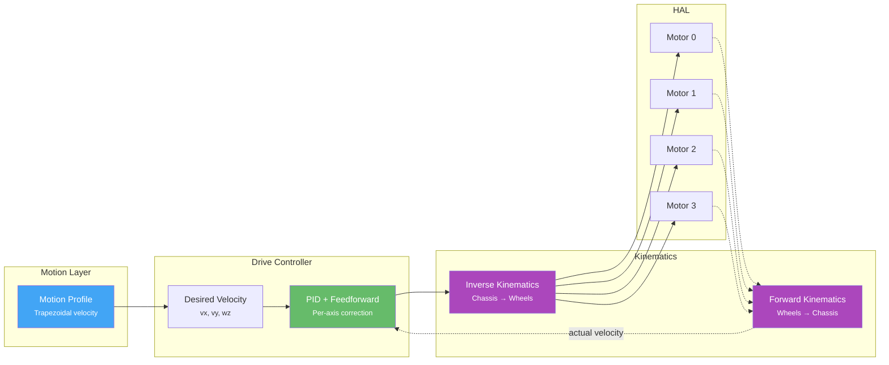

# Drive System

The drive system translates high-level velocity commands ("go forward at 0.2 m/s") into individual motor speeds. It handles PID control, feedforward compensation, and kinematics — all at 100 Hz.

You rarely interact with the drive system directly. The [Steps DSL]() calls it for you. This page explains how it works under the hood, and how to tune it when your robot isn't driving straight or overshooting targets.

## Architecture



## Velocity Control

The drive controller operates on three axes:

| Axis | Symbol | Unit | Direction |
|------|--------|------|-----------|
| Forward | `vx` | m/s | Positive = forward |
| Lateral | `vy` | m/s | Positive = right |
| Angular | `wz` | rad/s | Positive = counter-clockwise |

Each axis has its own PID controller and feedforward term:

```python
vel_config = ChassisVelocityControlConfig(
    vx=AxisVelocityControlConfig(
        pid=PidGains(kp=0.001, ki=0.86, kd=0.0002),
        ff=Feedforward(kS=0.0, kV=1.0, kA=0.0),
    ),
    vy=AxisVelocityControlConfig(
        pid=PidGains(kp=0.0, ki=0.0, kd=0.0),
        ff=Feedforward(kS=0.0, kV=1.0, kA=0.0),
    ),
    wz=AxisVelocityControlConfig(
        pid=PidGains(kp=0.0, ki=0.0, kd=0.0),
        ff=Feedforward(kS=0.0, kV=1.0, kA=0.0),
    ),
)
```

### PID Gains

- **kp** (proportional): Corrects based on current error. Higher = more aggressive correction.
- **ki** (integral): Corrects for accumulated error over time. Eliminates steady-state offset.
- **kd** (derivative): Dampens oscillation. Reacts to rate of change of error.

### Feedforward

Feedforward predicts what motor command is needed *before* the error happens:

- **kS** (static friction): Minimum voltage to overcome friction. Applied whenever the robot is moving.
- **kV** (velocity): Scales velocity command to motor voltage. Usually 1.0.
- **kA** (acceleration): Compensates for inertia during acceleration.

For most robots, `kV=1.0` with zero PID is a reasonable starting point. Add PID only if the robot doesn't track the target velocity accurately.

## Kinematics

Kinematics defines the relationship between chassis velocity and wheel speeds.

### Differential Drive

Two motors, one on each side:

```python
from libstp import DifferentialKinematics

kinematics = DifferentialKinematics(
    left_motor=defs.front_left_motor,
    right_motor=defs.front_right_motor,
    wheel_radius=0.0345,     # meters
    wheelbase=0.16,          # distance between wheel centers, meters
)
```

- Both wheels forward → robot drives forward
- Left faster than right → robot turns right
- Wheels opposite directions → robot spins in place
- **Cannot strafe sideways**

### Mecanum Drive

Four mecanum wheels that enable omnidirectional movement:

```python
from libstp import MecanumKinematics

kinematics = MecanumKinematics(
    front_left_motor=defs.front_left_motor,
    front_right_motor=defs.front_right_motor,
    back_left_motor=defs.rear_left_motor,
    back_right_motor=defs.rear_right_motor,
    track_width=0.2,        # side-to-side distance, meters
    wheel_radius=0.0375,    # meters
    wheelbase=0.125,        # front-to-back distance, meters
)
```

- All wheels forward → robot drives forward
- All wheels inward → robot strafes right
- Diagonal pattern → robot drives at an angle
- **Full omnidirectional movement**

### Measuring Wheel Radius and Wheelbase

**Wheel radius**: Measure the wheel diameter with calipers and divide by 2. Convert to meters.

**Wheelbase** (differential): Measure the distance between the center of the left wheel contact patch and the center of the right wheel contact patch. Convert to meters.

**Track width** (mecanum): Distance between left and right wheel centers. **Wheelbase** (mecanum): Distance between front and rear wheel centers.

Getting these values wrong will cause the robot to over- or under-turn and drive inaccurate distances.

## Motion PID Config

The motion PID controls *how accurately the robot follows planned trajectories* (distance and heading). This is separate from the velocity PID above.

```python
motion_pid_config = UnifiedMotionPidConfig(
    # How accurately the robot reaches target distance
    distance=PidConfig(
        kp=7.875, ki=0.0, kd=0.0,
        integral_max=10.0,
        integral_deadband=0.01,
        derivative_lpf_alpha=0.5,
        output_min=-10.0, output_max=10.0,
    ),

    # How accurately the robot maintains heading
    heading=PidConfig(
        kp=7.875, ki=0.0, kd=0.0625,
        integral_max=10.0,
        integral_deadband=0.01,
        derivative_lpf_alpha=0.5,
        output_min=-10.0, output_max=10.0,
    ),

    # Maximum velocities and accelerations
    linear=AxisConstraints(
        max_velocity=0.2368,       # m/s (your robot's top speed)
        acceleration=0.2798,       # m/s^2
        deceleration=2.0532,       # m/s^2 (can be higher than accel)
    ),
    angular=AxisConstraints(
        max_velocity=2.9424,       # rad/s
        acceleration=7.6122,      # rad/s^2
        deceleration=16.1491,    # rad/s^2
    ),
    lateral=AxisConstraints(       # Only for mecanum
        max_velocity=0.2209,
        acceleration=0.6485,
        deceleration=0.4498,
    ),

    # Tolerances: when to consider "arrived"
    distance_tolerance_m=0.005,    # 5mm
    angle_tolerance_rad=0.017,     # ~1 degree
    velocity_ff=1.0,
)
```

### Axis Constraints

`AxisConstraints` define the robot's physical limits. The motion planner uses these to create trapezoidal velocity profiles:



- `max_velocity`: The fastest the robot will ever go. Set this conservatively — it's the speed at `speed=1.0`.
- `acceleration`: How quickly the robot ramps up to max velocity.
- `deceleration`: How quickly the robot slows down. Can be higher than acceleration (braking is usually faster).

These values are measured automatically by the `calibrate()` and `auto_tune()` steps.

## Auto-Tuning

LibSTP includes automatic tuning steps that measure your robot's actual performance and set the PID gains and axis constraints:

```python
# In your setup mission:
auto_tune()
```

This drives the robot through a series of test maneuvers, measures the response, and updates the configuration. Run it on a flat surface with enough room (at least 1m in each direction).

## Common Tuning Issues

| Symptom | Likely Cause | Fix |
|---------|-------------|-----|
| Robot curves when it should drive straight | Unequal wheel calibration or `inverted` flag wrong | Re-run `calibrate()`, check motor `inverted` |
| Robot overshoots target distance | `deceleration` too low or `distance.kp` too high | Increase deceleration, reduce kp |
| Robot oscillates at target | `distance.kp` too high or `distance.kd` too low | Reduce kp, increase kd |
| Turns over/undershoot | `wheelbase` measurement wrong or `heading.kp` wrong | Re-measure wheelbase, tune heading PID |
| Robot is sluggish | `max_velocity` too low or `acceleration` too low | Increase values or re-run characterization |
| Robot jerks when starting | `kS` (static friction feedforward) too low | Increase kS |
