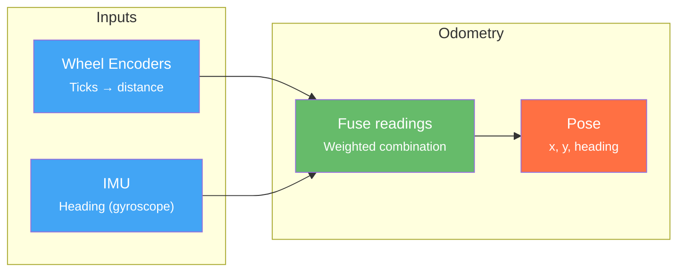
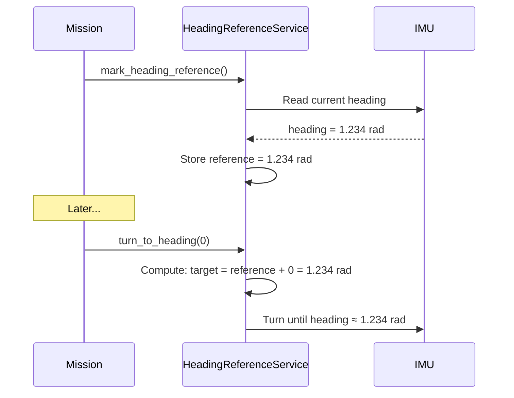

# Odometry

Odometry tracks the robot's position and heading on the field. It answers the question: "Where am I, and which way am I facing?" The motion system uses odometry to know when the robot has traveled 25 cm or turned 90 degrees.

## How It Works



The odometry system integrates two data sources:
1. **Wheel encoders**: Motor tick counts converted to distance via calibration. Gives x/y displacement.
2. **IMU gyroscope**: Measures angular velocity. Integrated over time to get heading. Much more accurate for heading than wheel-based estimation.

## Odometry Types

### FusedOdometry

Combines wheel encoder velocity (derived from back-EMF) with IMU heading. This is the recommended default.

```python
from libstp import FusedOdometry, FusedOdometryConfig

odometry = FusedOdometry(
    imu=defs.imu,
    kinematics=kinematics,
    config=FusedOdometryConfig(bemf_trust=1.0),
)
```

**`bemf_trust`** (0.0–1.0): How much to trust the wheel encoder velocity vs. other sources. At `1.0`, wheel velocity is fully trusted. Lower values blend in other estimates. Start at `1.0` and reduce if you see drift.

### Stm32Odometry

Uses the STM32 firmware's built-in odometry calculation. This runs on the microcontroller and may have lower latency.

```python
from libstp import Stm32Odometry

odometry = Stm32Odometry(imu=defs.imu, kinematics=kinematics)
```

Use `Stm32Odometry` if you're using the STM32 firmware's native encoder processing. Use `FusedOdometry` if you want more control over the fusion parameters.

## Pose

The odometry output is a `Pose` — a position (x, y) and heading:

```
Pose:
  position: (x, y) in meters, relative to start
  heading: radians, 0 = initial heading, positive = counter-clockwise
```

The pose is relative to where the robot was when it started. There's no absolute field positioning — odometry only tracks relative movement.

## Heading Reference

The heading reference system lets you mark a known heading and then turn relative to it later. This is useful when you align against a wall (known orientation) and then want to make precise turns.

```python
seq([
    # Align against wall — now we know our heading
    wall_align_backward(accel_threshold=0.3),
    mark_heading_reference(),        # Save this heading as "0 degrees"

    # Later in the mission...
    drive_forward(50),
    turn_to_heading(0),              # Return to the wall-aligned heading
    turn_to_heading(-90),            # Face 90° clockwise from wall
    turn_to_heading(180),            # Face the opposite direction
])
```

### How `mark_heading_reference()` works



The heading reference is stored as a `RobotService` — it persists across missions within a single run.

### When to Use Heading References

- After wall-aligning, mark the reference. All subsequent `turn_to_heading()` calls will be relative to that wall.
- If you need to face the same direction at multiple points in a mission.
- When cumulative turn errors would otherwise build up.

```python
# Bad: cumulative error
turn_right(90)
drive_forward(50)
turn_left(90)       # Might not be exactly back to original heading

# Good: absolute heading
mark_heading_reference()
turn_right(90)
drive_forward(50)
turn_to_heading(0)  # Guaranteed back to reference heading
```

## Odometry Accuracy

Odometry drifts over time. Every measurement has small errors that accumulate:

| Source | Error Type | Impact |
|--------|-----------|--------|
| Wheel slip | Position drift | Robot thinks it traveled further/shorter than it did |
| Wheel diameter variation | Scale error | All distances are off by a constant factor |
| IMU gyro drift | Heading drift | Slow rotation of coordinate frame |
| Uneven surfaces | Position + heading | Bumps cause encoder miscounts |

### Mitigating Drift

1. **Calibrate regularly**: Run `calibrate(distance_cm=50)` at the start of every match. This measures the actual ticks-per-cm for your robot on that surface.
2. **Use wall alignment**: `wall_align_backward()` + `mark_heading_reference()` resets heading drift.
3. **Use line detection**: `drive_until_black()` and `lineup_on_black()` provide absolute position references from the game table.
4. **Keep missions short**: Less driving = less accumulated error.
5. **Don't rely on pure odometry for long distances**: After driving 2+ meters, re-align using a wall or line.
