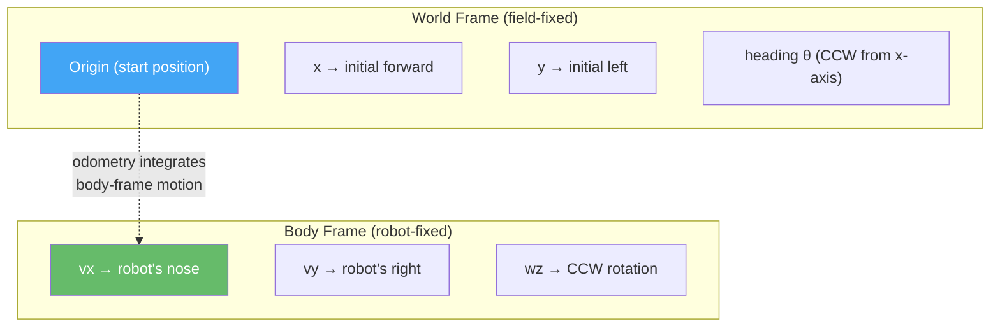
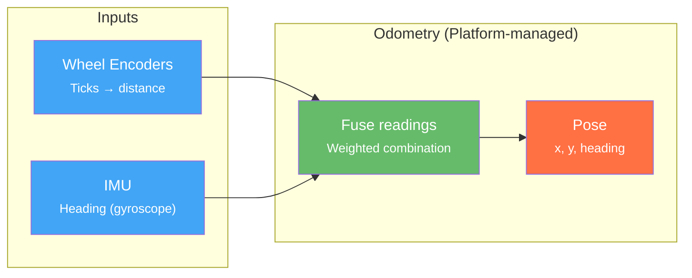
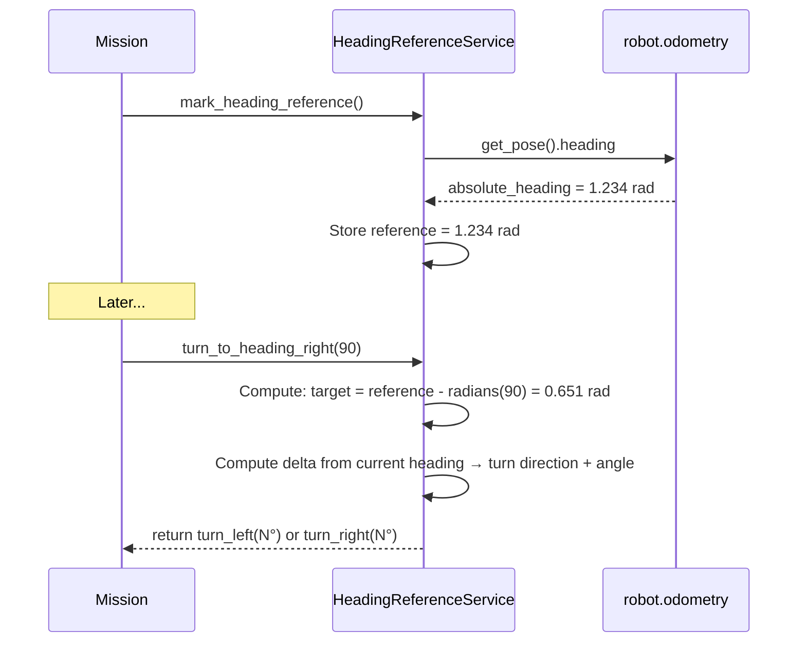

# Odometry

Odometry tracks the robot's position and heading on the field. It answers the question: "Where am I, and which way am I facing?" The motion system uses odometry to know when the robot has traveled 25 cm or turned 90 degrees.

## Concept: Coordinate Frames

Understanding odometry requires keeping two frames clear:

**Body frame** — fixed to the robot. `vx` points out the robot's nose, `vy` points to the robot's right, `wz` is counter-clockwise rotation looking down from above. This is what `drive_forward` and `strafe_right` operate in: commands are always relative to where the robot is currently pointing.

**World frame** — fixed to the field. Origin is where the robot started (or the configured `start_pose`). `x` increases in the robot's initial forward direction, `y` increases to the robot's initial left. Heading is measured CCW from the initial forward direction.



Odometry is the bridge: it integrates body-frame incremental motion (from wheel encoders + IMU gyro) into a running world-frame pose estimate. **It accumulates drift** — errors in each increment add up over time. Use wall-align, line detection, or [Localization Resync]() to correct accumulated drift at known landmarks.

## How It Works



The odometry system integrates two data sources:
1. **Wheel encoders**: Motor tick counts converted to distance via calibration. Gives x/y displacement.
2. **IMU gyroscope**: Measures angular velocity. Integrated over time to get heading. Much more accurate for heading than wheel-based estimation.

## Odometry Architecture

**You do not create odometry objects.** The platform (wombat or mock) creates and manages the concrete odometry implementation (`WombatOdometry` on hardware, `MockOdometry` in simulation) and injects it into the robot as `robot.odometry`. The interface type is `IOdometry`.

This is intentional: odometry is tightly coupled to the hardware platform. On the Wombat, odometry fuses wheel encoder data from the STM32 firmware with IMU heading. The details of that fusion are platform-specific and hidden behind the `IOdometry` interface.

Your code accesses odometry through steps and the robot object, not by constructing odometry instances directly:

```python
# Access the current pose in a custom step or run() callback
pose = robot.odometry.get_pose()
heading_rad = robot.odometry.get_heading()
absolute_heading_rad = robot.odometry.get_absolute_heading()
```

## Pose

The odometry output is a `Pose` — a position (x, y) and heading:

```
Pose:
  position: (x, y) in meters, relative to start
  heading: radians, 0 = initial heading, positive = counter-clockwise
```

The pose is relative to where the robot was when it started. There's no absolute field positioning — odometry only tracks relative movement.

## Odometry Source Selection

The robot has two potential odometry sources at runtime:

| Source | Constant | Description |
|--------|----------|-------------|
| Internal | `OdometrySource.INTERNAL` | STM32 firmware encoder + IMU fusion (always available) |
| Calibration board | `OdometrySource.CALIBRATION_BOARD` | External calibration board providing ground-truth position (requires hardware) |

Use `set_odometry_source()` to switch between them:

```python
from raccoon.hal import OdometrySource
from raccoon.step.motion import set_odometry_source

# Prefer the calibration board when it is connected
set_odometry_source(OdometrySource.CALIBRATION_BOARD)

# Return to internal odometry
set_odometry_source(OdometrySource.INTERNAL)
```

Setting a preferred source does not force it to be active — the HAL resolves the active source from the preference and hardware availability. If the calibration board is not connected when `CALIBRATION_BOARD` is preferred, `get_active_source()` will still report `INTERNAL`.

You can inspect and query sources in a `run()` callback:

```python
run(lambda robot: (
    print(f"Preferred: {robot.odometry.get_preferred_source().name}"),
    print(f"Active:    {robot.odometry.get_active_source().name}"),
    print(f"Board connected: {robot.odometry.is_source_available(OdometrySource.CALIBRATION_BOARD)}"),
))
```

You can also read a source without changing the active source:

```python
# Read the calibration board passively while internal odometry is still active
board_pose = robot.odometry.get_pose_from_source(OdometrySource.CALIBRATION_BOARD)
```

## Heading Reference

The heading reference system lets you mark a known heading and then turn relative to it later. This is useful when you align against a wall (known orientation) and then want to make precise turns throughout the mission.

```python
seq([
    # Align against wall — now we know our heading
    wall_align_backward(accel_threshold=0.3),
    mark_heading_reference(),        # Save this heading as "0 degrees"

    # Later in the mission...
    drive_forward(50),
    turn_to_heading_right(0),        # Return to the wall-aligned heading
    turn_to_heading_right(90),       # Face 90° clockwise from wall
    turn_to_heading_left(90),        # Face 90° counter-clockwise from wall
])
```

> **`turn_to_heading()` does not exist.** The API uses two separate functions with the direction in the name: `turn_to_heading_right(degrees)` and `turn_to_heading_left(degrees)`. Both always accept positive degree values.

### `mark_heading_reference()`

Captures the robot's current absolute IMU heading and stores it as a reference point. All subsequent `turn_to_heading_right()` / `turn_to_heading_left()` calls compute their target relative to this stored reference.

```python
mark_heading_reference()    # basic: capture current heading as 0°
```

Full signature:

```python
mark_heading_reference(
    origin_offset_deg=0.0,         # offset added to the captured heading
    positive_direction="left",     # which direction counts as positive
)
```

Parameters:

| Parameter | Default | Description |
|-----------|---------|-------------|
| `origin_offset_deg` | `0.0` | Degrees added to the captured heading when defining the origin. Use this to make 0° mean "forward on the board" regardless of how the robot starts. For example, if the robot always starts 30° clockwise from the board's forward direction, pass `origin_offset_deg=-30` so that 0° maps to the board's forward direction. |
| `positive_direction` | `"left"` | `"left"` means counter-clockwise angles are positive (standard mathematical convention). `"right"` flips the sign so clockwise angles are positive. |

The reference uses the raw IMU heading, which is unaffected by odometry resets that occur during normal motion steps. Multiple calls overwrite the previous reference. The reference is stored as a `RobotService` and persists across missions within a single run.

Place `mark_heading_reference()` right after `wait_for_light()` — the heading origin is captured once before the robot moves:

```python
seq([
    wait_for_light(),
    mark_heading_reference(),    # origin = robot's current facing direction
    # ... rest of mission
])
```

**Using `origin_offset_deg` for coordinate flips:**

`origin_offset_deg` is most useful on ramp robots that descend a ramp and need to track headings relative to the lower surface. When the robot is at the top of the ramp pointing backward (180° from its initial orientation), you can bake in the flip:

```python
# At the top of the ramp, robot is pointing 180° from its initial direction.
# Baking in -180 makes turn_to_heading_right(0) mean "face the direction
# I was heading before the ramp" rather than "face my initial start direction".
mark_heading_reference(origin_offset_deg=-180)
```

This is real-world usage from the packingbot: `mark_heading_reference(origin_offset_deg=-180)` recorded just before the ramp descent, so all `turn_to_heading_*` calls below used the inverted frame naturally.

### `turn_to_heading_right(degrees)`

Turn to face a heading measured **clockwise** from the origin. Automatically chooses the shortest physical rotation:

```python
turn_to_heading_right(0)      # return to origin heading
turn_to_heading_right(90)     # face 90° clockwise from origin
turn_to_heading_right(180)    # face opposite to origin
```

Parameters:

| Parameter | Type | Default | Description |
|-----------|------|---------|-------------|
| `degrees` | `float` | required | Positive degrees clockwise from the heading origin |
| `speed` | `float` | `1.0` | Fraction of max angular speed, 0.0–1.0 |
| `force_direction` | `"left"` \| `"right"` \| `None` | `None` | Override shortest-path selection (use when an obstacle blocks one direction) |

### `turn_to_heading_left(degrees)`

Turn to face a heading measured **counter-clockwise** from the origin. Automatically chooses the shortest physical rotation:

```python
turn_to_heading_left(0)       # return to origin heading
turn_to_heading_left(90)      # face 90° counter-clockwise from origin
turn_to_heading_left(180)     # face opposite to origin
```

Parameters are identical to `turn_to_heading_right()` except that the angle convention is counter-clockwise.

> **Shortest path:** Both functions compute the physically shortest rotation to the target heading, not the rotation in the named direction. The direction in the name (`_right` / `_left`) sets the **angle sign convention** (clockwise vs. counter-clockwise from origin), not the physical direction of the turn. Use `force_direction` to override when needed.

### How the Heading Reference Service Works



`HeadingReferenceService` reads heading from `robot.odometry.get_pose().heading`. It does not communicate with the IMU directly — the IMU is an internal source that the odometry layer uses, but the service sees only the `IOdometry` interface.

### `HeadingReferenceService.compute_turn()` — For Custom Steps

When writing a custom `MotionStep` that needs to know the current heading error, call `compute_turn()` on the service directly instead of reading raw odometry angles:

```python
from raccoon.robot.heading_reference import HeadingReferenceService

# Inside on_start():
self._service = robot.get_service(HeadingReferenceService)

# Inside on_update():
error_deg = self._service.compute_turn(target_deg=0.0)
# Returns signed degrees: positive = robot needs to turn CCW to reach target
# Normalized to [-180, 180] for shortest-path; pass force_direction to override
```

`compute_turn(target_deg, force_direction=None)` reads the current world heading via the same odometry source that motion controllers use, so the computed error and the executed feedback share one frame. See [Drive System]() for the full `HoldHeading` example using this API.

### When to Use Heading References

- After wall-aligning, mark the reference. All `turn_to_heading_*()` calls will be relative to that wall orientation.
- When you need to face the same direction at multiple points in a mission.
- When cumulative turn errors would otherwise build up over many turns.

```python
# Bad: cumulative error builds up
turn_right(90)
drive_forward(50)
turn_left(90)       # Might not be exactly back to original heading

# Good: absolute heading — guaranteed to return to reference
mark_heading_reference()
turn_right(90)
drive_forward(50)
turn_to_heading_right(0)    # Exactly back to reference heading
```

## Odometry Accuracy

Odometry drifts over time. Every measurement has small errors that accumulate:

| Source | Error Type | Impact |
|--------|-----------|--------|
| Wheel slip | Position drift | Robot thinks it traveled further/shorter than it did |
| Wheel diameter variation | Scale error | All distances are off by a constant factor |
| IMU gyro drift | Heading drift | Slow rotation of coordinate frame |
| Uneven surfaces | Position + heading | Bumps cause encoder miscounts |

### Mitigating Drift

1. **Calibrate regularly**: Run `calibrate(distance_cm=30)` at the start of every match. This measures the actual ticks-per-cm for your robot on that surface.
2. **Use wall alignment**: `wall_align_backward()` + `mark_heading_reference()` resets heading drift.
3. **Use line detection**: `drive_until_black()` and `lineup_on_black()` provide absolute position references from the game table.
4. **Keep missions short**: Less driving = less accumulated error.
5. **Don't rely on pure odometry for long distances**: After driving 2+ meters, re-align using a wall or line.
6. **Use localization resync steps**: If the robot has a `Localization` service enabled, use `resync_at_start_pose()`, `find_line_resync()`, or `align_to_wall_resync()` to inject absolute pose observations and correct accumulated drift. See [Localization and Resync]().

## Related Pages

- [Drive System]() — `heading=` parameter and low-level ChassisVelocity API
- [Sensors]() — IR sensors as absolute position landmarks
- [Smooth Path]() — per-segment `heading=` for drift-free multi-segment paths
- [Localization and Resync]() — particle-filter world-pose and resync steps
