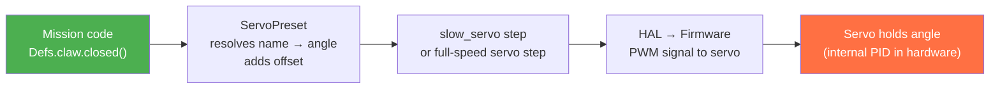

# Servos

## Concept

A servo is a position-controlled actuator. Unlike a motor, which you command with velocity or torque, a servo accepts an angle in degrees and the firmware holds the output shaft at that angle. The internal feedback loop is entirely in the servo hardware — raccoon only needs to send the target angle.

`ServoPreset` wraps a raw `Servo` with a dictionary of named angles. Each key in the dictionary becomes a callable method on the preset object, so mission code reads as intent (`Defs.claw.open()`) rather than raw numbers (`servo(Defs.claw, 30)`).



The key design choice: **all angle arithmetic happens at build time** (when the step is constructed), not at runtime. The firmware only receives the final degree value.

## Declaration

### Plain Servo

```python
from raccoon.hal import Servo

my_servo = Servo(port=0)
```

Use plain servos when you only need one or two positions, or when you compute angles dynamically.

### Servo with Presets (Recommended)

```python
from raccoon.hal import Servo
from raccoon.step.servo import ServoPreset

claw = ServoPreset(
    Servo(port=2),
    positions={"closed": 135, "open": 30}
)

arm = ServoPreset(
    Servo(port=1),
    positions={
        "down": 10,
        "above_pom": 55,
        "up": 105,
        "start": 160,
        "high_up": 165,
    }
)
```

`ServoPreset` creates callable methods for each position name.

### Servo Offsets

`ServoPreset` supports an `offset` parameter that shifts all positions by a fixed number of degrees:

```python
claw = ServoPreset(
    Servo(port=2),
    positions={"closed": 135, "open": 30},
    offset=5   # Adds 5 degrees to every position
)
```

This is useful when replacing a broken servo. A new servo mounted on the same shaft may land a few teeth off from the original, causing all positions to be shifted by the same amount. Since all positions are just angle values, adding a constant offset shifts every position by the same amount — no need to re-tune each angle individually.

**Real-world use: mechanical assembly compensation.** The clawbot's shoulder servo is mounted with an unavoidable 22.4-degree physical offset due to how the joint spline engages at assembly time. Rather than adjusting every named position by 22.4 degrees, the team used `offset=22.4`:

```yaml
# config/servos.yml (adapted from the clawbot)
arm_sholder:
  type: Servo
  port: 1
  offset: 22.4      # Compensates for spline engagement offset at assembly
  positions:
    max_down: 195.3
    _0deg: 169.2
    p90deg: 69
    max_up: 20
```

This way all named angles describe the arm's actual joint angle, and the hardware reality is absorbed in `offset` — no magic-number subtraction sprinkled through mission code.

**Position names starting with `_` are allowed.** Names like `_0deg`, `_20deg`, `_45deg`, `_90deg` are valid Python identifiers and become callable methods: `Defs.arm_sholder._0deg()`. The underscore prefix signals an angle-based name rather than a functional one.

**Object-specific names make mission code self-documenting.** Rather than overloading a single `open` and `closed`, you can name by the object being gripped:

```yaml
# conebot servos.yml (real example)
claw_servo:
  type: Servo
  port: 1
  positions:
    closed: 154
    half_open: 70
    open: 55
    botguy_open: 90       # wider grip for the botguy figurine
    botguy_closed: 130    # tighter grip for the botguy figurine
```

Mission code then reads `Defs.claw_servo.botguy_closed()` instead of a raw number or an ambiguous `closed()`.

> **Tip:** When choosing your servo angles, try to avoid values very close to 0 or 180. Keeping some margin (e.g. 10–170) leaves room to apply a positive or negative offset when a servo needs to be swapped at competition — without hitting the physical limits.

## What The Software Allows vs What The Hardware Tolerates

This distinction matters a lot:

- the software servo API accepts arbitrary degree values
- the step layer does **not** clamp commands to `0..180`
- the HAL stores the exact commanded degree value and forwards it to the platform

So yes, you can command values below `0` or above `180` if your mechanism and servo happen to tolerate it.

That does **not** mean it is safe or repeatable.

### Overtravel / beyond-180 operation

Some hobby servos can physically rotate beyond the nominal `0..180` range, and some mechanisms are intentionally tuned to use that extra travel. In practice:

- two supposedly identical servos will often not tolerate the same extra travel
- end-stop behavior changes across manufacturers and even between units
- using negative angles or angles above `180` increases the risk of gear strain, buzzing, overheating, and self-damage
- replacing a servo mid-competition may invalidate all the extra-range values you tuned before

Treat overtravel as a hardware-specific calibration trick, not as a portable semantic range.

Recommended rule:

- use conservative in-range values for normal robots
- only use out-of-range values when you have physically tested that exact servo + linkage
- leave safety margin instead of tuning right against a hard stop

### Offset is not a safety system

`offset` is only a constant angle shift. It is useful when a replacement servo is mounted a few teeth differently than the old one.

It does **not** guarantee:

- safe operation near hard stops
- that two servos share the same usable overtravel
- that a servo with the same model number has the same real zero point

If you are already relying on `-10` or `195` degree style commands, a changed offset can push the mechanism into a stop much more easily.

## Usage in Missions

### Preset Servos

```python
# Move to a named position (auto-waits for travel time)
Defs.claw.open()
Defs.claw.closed()
Defs.arm.up()
Defs.arm.down()

# With speed control (degrees per second) — returns a slow servo step
Defs.arm.up(300)           # Move to "up" at 300 deg/s
Defs.claw.closed(120)      # Move to "closed" at 120 deg/s
```

When called without an argument, the servo moves at full speed. When called with a number, it moves at that speed in degrees per second — useful for gentle or controlled movements.

### Plain Servo

```python
# Move to a specific angle
servo(Defs.my_servo, 90)      # Move to 90 degrees
servo(Defs.my_servo, 0)       # Move to 0 degrees
```

### Shake Servo

Oscillate between two angles — useful for shaking objects loose:

```python
shake_servo(Defs.claw_servo, duration=2.0, angle_a=30, angle_b=135)
```

### Slow Servo

Move to a position at a controlled speed (degrees per second) — useful for gentle placement.
The default easing is `Easing.EASE_IN_OUT` (smoothstep: 3t² − 2t³), which gives gentle acceleration
and deceleration. You can select a different curve with the `easing` parameter:

```python
from raccoon.step.servo import slow_servo, Easing

# Default: ease-in-ease-out at 60 deg/s
slow_servo(Defs.my_servo, angle=90, speed=60.0)

# Constant speed — no acceleration/deceleration
slow_servo(Defs.my_servo, angle=90, speed=45.0, easing=Easing.LINEAR)

# Fast start, gentle stop
slow_servo(Defs.my_servo, angle=90, speed=80.0, easing=Easing.EASE_OUT)
```

**How interpolation is applied:**

For the four built-in `Easing` enum members (`LINEAR`, `EASE_IN`, `EASE_OUT`, `EASE_IN_OUT`),
`slow_servo` calls `servo_ref.set_smooth_position()` and the **firmware** handles the easing
curve entirely on the STM32. The Python side only sets the target and waits — no per-tick Python
loop runs.

If you pass a **custom Python callable** instead of an `Easing` member, the Python side steps
through intermediate positions at ~10 Hz (100 ms per tick), calling your function with normalised
time `t ∈ [0, 1]` and commanding the interpolated angle each tick.

#### Easing enum

| Variant | Curve | When to use |
|---------|-------|-------------|
| `Easing.LINEAR` | Constant speed | Mechanisms where you want a predictable, uniform rate |
| `Easing.EASE_IN` | Slow start, fast end (quadratic) | Build-up moves where momentum matters |
| `Easing.EASE_OUT` | Fast start, slow end (quadratic) | Soft landings — place objects gently |
| `Easing.EASE_IN_OUT` | Smoothstep (3t²−2t³) — **default** | General-purpose: natural, fluid motion |
| `Easing.EASE_IN_OUT_COSINE` | Cosine-based ease-in-out | Similar to smoothstep, slightly softer peaks |

You can also pass any Python callable with signature `(t: float) -> float` for fully custom curves.

Import: `from raccoon.step.servo import Easing` (also exported from top-level `raccoon`).

#### Parameters of `slow_servo`

| Parameter | Type | Default | Description |
|-----------|------|---------|-------------|
| `servo` | `Servo` or `ServoPreset` | required | The servo to move |
| `angle` | `float` | required | Target angle in degrees |
| `speed` | `float` | `60.0` | Movement speed in degrees per second |
| `easing` | `Easing` or callable | `Easing.EASE_IN_OUT` | Interpolation curve |

### Disable All Servos

Turn off all servo outputs (servos go limp):

```python
fully_disable_servos()
```

## Builder Pattern and Step Chaining

Every servo step factory (`slow_servo`, `shake_servo`, `fully_disable_servos`) returns a
**builder object**, not a plain Step. The builder lets you chain optional modifiers before the step
is executed:

```python
from raccoon.step.servo import slow_servo, Easing

# All arguments in one call
slow_servo(Defs.arm, angle=90, speed=45.0)

# Equivalent: chain .angle() and .speed() after construction
slow_servo().servo(Defs.arm).angle(90).speed(45.0)

# Add an anomaly callback (called if the step takes unexpectedly long)
slow_servo(Defs.arm, angle=90, speed=45.0).on_anomaly(
    lambda step, duration: print(f"Servo move took {duration:.2f}s")
)

# Skip timing instrumentation for this step
slow_servo(Defs.arm, angle=90).skip_timing()
```

All builder methods return `self`, so you can chain freely. The step is built and run lazily when
it is added to a `seq()` or `parallel()` and executed by the mission runner.

The same pattern applies to `shake_servo()` and `fully_disable_servos()`.

### ServoPreset runtime properties

`ServoPreset` exposes three read-only runtime properties:

```python
from raccoon.hal import Servo
from raccoon.step.servo import ServoPreset

arm = ServoPreset(Servo(port=1), positions={"down": 10, "up": 105}, offset=5)

# Raw Servo device for direct hardware access
arm.device          # Servo(port=1)

# Current mounting offset in degrees
arm.offset          # 5.0

# Position name → angle mapping (before offset is applied)
arm.positions       # {"down": 10, "up": 105}

# The offset is added when the position is called, not when .positions is read
arm.up.value        # 110.0  (105 + offset 5)
```

Use `arm.device` when you need to call raw HAL methods (`enable()`, `disable()`) directly.
Use `arm.positions` to inspect the configured angles programmatically — e.g. to verify that the
YAML was parsed correctly during a setup check.

`ServoPreset` also exposes a `get_position()` method that returns the currently commanded angle:

```python
# Read the current angle — useful in defer() guards
current_angle = Defs.arm_servo.get_position()
```

This is particularly useful inside a `defer()` factory to check whether the servo has already moved
before issuing a redundant command:

```python
from raccoon import defer, seq

def safe_arm_lower():
    """Lower the arm only if it is not already at the down position."""
    def _build():
        if Defs.arm_servo.get_position() > 150:
            return Defs.arm_servo.down()
        return seq([])   # already down — do nothing
    return defer(_build)
```

## Servo Power States

Servo power/control on Wombat has more than one useful state.

### Normal enabled state

Any regular servo step such as `servo(...)`, `slow_servo(...)`, `ShakeServo`, or a `ServoPreset` position automatically enables the target servo before sending the command.

When a servo is re-enabled, the HAL preserves the last commanded angle and re-applies it.

### Per-servo disable

The raw HAL also exposes:

```python
Defs.claw.device.disable()
Defs.claw.device.enable()
```

or for plain servos:

```python
my_servo.disable()
my_servo.enable()
```

This is low-level hardware control, not a high-level mission step. Use it when you need direct access, for example during experiments or calibration tooling.

### Fully disabled / limp mode

`fully_disable_servos()` sends the platform into the fully-disabled servo mode for every servo port:

- no PWM signal is sent
- the servos stop actively holding position
- the mechanism can be moved freely by hand

This is the best way to make an arm or claw go limp intentionally.

That is useful for:

- manual mechanism setup
- releasing servo load at the end of a run
- avoiding holding current and heat while idle
- calibration workflows

The next normal servo command will re-enable the affected servo automatically.

### Safety note

A limp servo is no longer holding the mechanism. Arms, claws, or linkages may fall under gravity as soon as power is removed. Use this deliberately, especially on multi-link arms.

## Real-World Patterns

### Grab and Release

```python
# From ConeBot: grab a cone
seq([
    Defs.claw.open(),
    Defs.arm.down(),
    Defs.claw.closed(120),     # Close at 120 deg/s (controlled grip)
    Defs.arm.up(120),          # Lift at 120 deg/s
    Defs.claw.open(60),        # Release slowly at 60 deg/s
])
```

### Parallel Servo + Drive

Move servos while the robot is driving:

```python
# From PackingBot: prepare arm while turning
parallel(
    turn_right(90),
    seq([
        Defs.pom_arm.above_pom(),
        Defs.pom_grab.open(),
    ]),
)
```

### Servo Initialization in Setup

Always home your servos in the setup mission so they're in a known position:

```python
class M000SetupMission(SetupMission):
    def sequence(self) -> Sequential:
        return seq([
            Defs.claw.closed(),
            Defs.arm.up(),
            Defs.shield.down(),
            Defs.grabber.closed(),
            # ... rest of setup
        ])
```

## Finding Servo Angles

To find the right angle values for each position:

1. Open **BotUI → Sensors & Actors** on the robot's touchscreen
2. Use the servo slider to move the servo manually
3. Note the angle when it's in the position you want
4. Enter that angle in your `ServoPreset` positions

Repeat for each named position. The angles depend on how the servo is mounted — there's no universal "up" or "down" angle.

If you are probing the safe range of a mechanism:

1. start conservatively, away from hard stops
2. approach limits in small increments
3. listen for buzzing or stalling
4. back off and keep margin instead of using the absolute maximum travel

Do not assume that because one servo tolerated `190` degrees, the replacement one will too.

## Timing Considerations

Servo steps **block** until the servo reaches its target position. When called without a speed argument, the servo moves at full speed and the step estimates travel time based on the angle difference. When called with a speed (degrees per second), it uses a slow servo step that controls the movement rate:

```python
Defs.arm.down()        # Full speed, auto-estimated travel time
Defs.arm.down(60)      # 60 deg/s — slower, more controlled
```

Use a slower speed for heavy or delicate mechanisms where full-speed movement could cause problems (slamming, overshooting, dropping objects).

## Related Pages

- [Motor Steps]() — direct motor control for mechanism motors not using the drive system
- [Configuration Reference → servos.yml]() — how to declare servos and positions in YAML
- [Calibration]() — the setup-mission flow including servo homing
