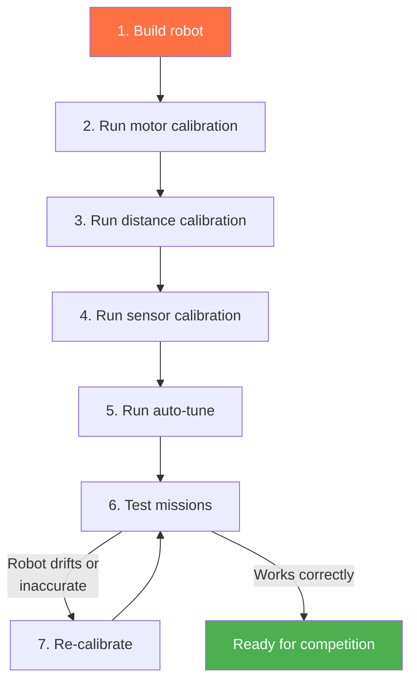

# Calibration

Calibration measures your robot's actual hardware characteristics and stores correction factors. Without calibration, `drive_forward(25)` might actually drive 22 cm or 28 cm. After calibration, it drives 25 cm (within a few mm).

## What Gets Calibrated

| What | Why | How |
|------|-----|-----|
| **Motor ticks-to-rad** | Encoders report ticks, the SDK needs radians | `calibrate()` — drives a known distance |
| **Distance scaling** | Compensates for wheel diameter and surface grip | `calibrate_distance(distance_cm=50)` |
| **IR sensor thresholds** | Every sensor reads differently; every surface is different | `calibrate()` or `calibrate_sensors()` |
| **Motor deadzone** | Minimum power to overcome static friction | `calibrate_deadzone()` |
| **Axis constraints** | Max velocity, acceleration, deceleration | `auto_tune()` — characterizes the robot |

## Calibration Workflow



### Step 1: Unified Calibration (Recommended)

The `calibrate()` step is an all-in-one calibration that handles both distance and IR sensor calibration in a single guided flow:

```python
calibrate(distance_cm=50)
```

This step uses the BotUI to guide you through the process:
1. The robot drives a known distance while continuously sampling IR sensors
2. You measure the actual distance driven and enter it via the BotUI
3. The system calculates per-wheel `ticks_to_rad` correction factors
4. IR sensor thresholds are computed from the samples using K-Means clustering

Run this on a flat, smooth surface that includes both black and white areas (e.g., a game board with black lines). Make sure the robot has room to drive forward (at least 50 cm).

### Individual Calibration Steps (Alternative)

If you only need to calibrate one thing, use the individual steps:

```python
calibrate_distance(distance_cm=50)    # Distance only
calibrate_sensors()                    # IR sensors only
```

### Step 4: Auto-Tune (Optional but Recommended)

Measures the robot's dynamic characteristics — maximum velocity, acceleration, and deceleration for each axis:

```python
auto_tune(
    vel_axes=["vx"],                              # Tune velocity PID
    tune_velocity=True,                            # Tune velocity PID
    tune_motion=True,                              # Tune motion PID
    characterize_axes=["linear", "angular"],       # Measure physical limits
    characterize_trials=3,                         # Repetitions per test
)
```

Auto-tune drives the robot through test maneuvers and measures the response. It needs about 1m of clear space in each direction.

## How IR Sensor Calibration Works

IR sensor calibration uses a **K-Means clustering** approach to automatically distinguish black from white surfaces. This technique is based on the research paper [*Applied Machine Learning in Sensor Calibration — A Clustering Technique*](/papers/liu-xie-jiang-2025-ml-sensor-calibration.pdf) by Abigail Liu, Aaron Xie, and Oliver Jiang (Los Altos Community Team 0399, GCER 2025).

### The Problem

IR sensors return raw analog values that vary between sensors, surfaces, and environmental conditions. To make decisions like "am I on a black line?", the system needs a threshold separating black readings from white readings.

Traditional approaches — such as taking a fixed percentile of the data — are vulnerable to skewed samples. If the robot spends most of its calibration drive on white surface with only a brief pass over black, a percentile-based threshold can land in the wrong place. The paper demonstrates that percentile methods achieve only 92–98% accuracy and are susceptible to false positives in skewed data.

### The Solution: K-Means Clustering (k=2)

Instead of relying on percentiles, the calibration system uses **K-Means clustering with k=2** to separate sensor readings into two natural groups: one for white and one for black.

**Sampling:** During calibration, the robot drives across the game surface while IR sensors are sampled at **10 ms intervals** (100 Hz). Each sensor accumulates a list of raw analog readings as the robot passes over both white and black areas.

**Clustering:** The collected samples are fed into a 1D K-Means algorithm:

1. **Initialize** two centroids at the minimum and maximum of the data
2. **Assign** each data point to its nearest centroid
3. **Recompute** each centroid as the mean of its assigned points
4. **Repeat** for up to 10 iterations (convergence is typically reached within 5, since the data is semi-sorted from the WHITE→BLACK→WHITE driving pattern)
5. **Return** the two centroids in ascending order — the lower one becomes the **white threshold**, the higher one the **black threshold**

```
Samples:  [180, 195, 210, 185, 2800, 3100, 2950, 190, 205, ...]
                 └── white cluster ──┘  └── black cluster ──┘  └── white ──┘

K-Means centroids:  white = 193.5,  black = 2950.0
```

### Why Clustering Works Better

The paper compares three calibration algorithms:

| Algorithm | Approach | Success Rate | Handles Skewed Data? |
|-----------|----------|:------------:|:--------------------:|
| 90th percentile | Use 90th percentile as BLACK threshold | 92% | No |
| Median of 80% range | Average 10th/90th percentile medians | 98% | No |
| **K-Means clustering** | Cluster into two groups, threshold at midpoint | **100%** | **Yes** |

The key advantage is robustness to **skewed data distributions**. If the robot's calibration drive crosses a black line only briefly, 90% of the samples may be white. Percentile methods get confused — they might place the "black" threshold at a white reading. K-Means correctly identifies even a small cluster of black readings and separates it from the white cluster.

### Validation

After clustering, the calibration is validated before being accepted:

- **Minimum range check:** The overall spread of readings must exceed 500 units. If all readings are similar, the sensor likely didn't see both surfaces.
- **Minimum separation check:** The two centroids must be at least 700 units apart *and* at least 25% of the total data range. This prevents accepting calibrations where the clusters aren't meaningfully distinct.

If validation fails, the BotUI shows a warning and lets you retry.

### Soft Classification

After calibration, the IR sensor doesn't just return "black" or "white" — it also provides a **probability** via linear interpolation between the two thresholds:

```
probabilityOfBlack:
    value <= white_threshold  →  0.0
    value >= black_threshold  →  1.0
    otherwise                 →  (value - white) / (black - white)
```

This enables more nuanced line-following behavior (e.g., proportional control) rather than binary on/off decisions.

## Distance Calibration

Distance calibration corrects for differences in wheel diameter, encoder resolution, and surface grip. The process works in four phases:

1. **Prepare** — Place the robot at a starting mark
2. **Drive** — The robot drives forward a known distance (default 30 cm) while recording encoder ticks per wheel
3. **Measure** — You measure the *actual* distance traveled and enter it via the BotUI
4. **Compute** — For each drive motor, the system calculates a corrected `ticks_to_rad` ratio:

```
theta_rad = measured_distance / wheel_radius
new_ticks_to_rad = theta_rad / abs(delta_ticks)
```

Each wheel is calibrated independently, which also corrects for slight differences between left and right motors that would otherwise cause drift.

### Exponential Moving Average (EMA)

Calibration values are smoothed across runs using an **exponential moving average**:

```
new_baseline = old_baseline * alpha + measured_value * (1 - alpha)
```

With the default `ema_alpha=0.7`, the baseline converges toward the true value over multiple calibration runs rather than jumping to each new measurement. This filters out one-off measurement errors while still adapting to real changes (like new wheels).

## Typical Setup Mission

```python
class M00SetupMission(Mission):
    def sequence(self) -> Sequential:
        return seq([
            # Home servos
            Defs.claw.closed(),
            Defs.arm.up(),

            # Calibrate
            calibrate(distance_cm=50),
        ])
```

The setup mission runs before the match start signal. Use it to calibrate and verify that sensors and servos are working.

## Calibration Data Storage

Calibration values are automatically persisted so the system can remember them between runs, removing the need to recalibrate every time you restart your program.

**Distance calibration** (per-wheel `ticks_to_rad`) is stored in `raccoon.project.yml` alongside the motor definitions.

**IR sensor thresholds** are stored in `racoon.calibration.yml`:

```yaml
root:
  ir-calibration:
    default:
      white_tresh: 1469.84
      black_tresh: 2490.58
    default_port0:
      white_tresh: 543.45
      black_tresh: 3647.12
    default_port4:
      white_tresh: 1451.85
      black_tresh: 3550.00
```

The naming scheme uses the calibration set name and port:
- `default` — Global default thresholds for the "default" set
- `default_port0` — Per-port override (port 0) in the "default" set
- `upper_port4` — Port 4 in calibration set "upper"

These files are managed automatically by the calibration system. You should not edit them by hand — just run `calibrate()` again if you need new values.

## Calibration Sets

If your robot operates on surfaces at different heights (e.g., a ramp vs. the ground), sensors may need different thresholds. Use calibration sets:

```python
# During setup: calibrate both surfaces
calibrate(
    distance_cm=50,
    calibration_sets=["default", "upper"],
)

# During missions: switch between sets
seq([
    switch_calibration_set("default"),        # Ground level
    Defs.front.drive_until_black(),

    drive_forward(50),                         # Drive up a ramp

    switch_calibration_set("upper"),           # Elevated surface
    Defs.front.follow_right_edge(30),
])
```

## When to Re-Calibrate

- **Different surface**: Game tables vary. Calibrate on the actual competition surface.
- **Changed wheels or motors**: Any mechanical change invalidates motor calibration.
- **Battery level**: Very low batteries can affect motor performance. Re-calibrate if behavior changes.
- **Between matches**: Quick sensor calibration takes 30 seconds and prevents surprises.

## Calibration Tips

1. **Calibrate on the actual game table** if possible. Table surface affects both IR sensor readings and wheel grip.
2. **Use fresh batteries** during calibration. Low batteries = different motor characteristics.
3. **Calibrate distance on a straight, flat section** with clear markings at the measured distance.
4. **Drive over both black and white areas** during sensor calibration. The robot needs to see both surfaces to form two clusters.
5. **Commit calibration files** to your repository so teammates can use the same values (but re-calibrate on the competition table).
