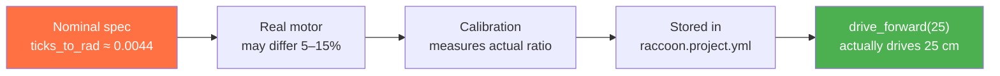
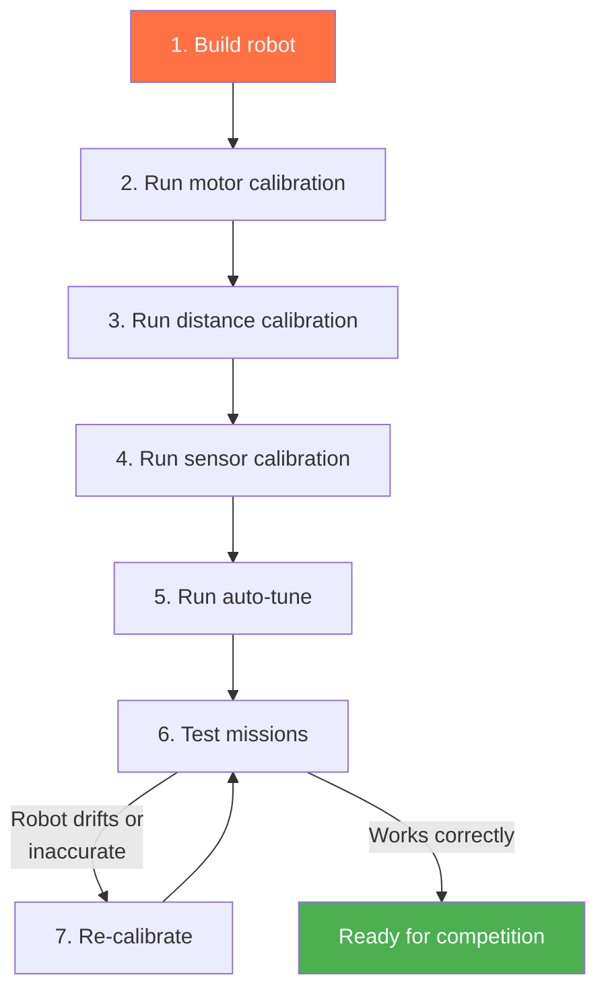
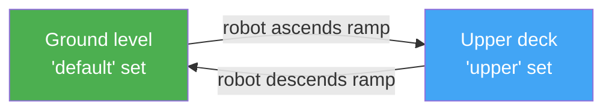

# Calibration

## Concept: Why Calibration Exists

Every physical motor and sensor is slightly different. Without calibration:

- Two motors with the same model number have different `ticks_to_rad` ratios — the robot drifts left or right when it should drive straight.
- Every IR sensor has a different baseline due to LED brightness variation — what reads as 1500 on one sensor reads as 2200 on another.
- The game table surface at the competition venue is different from the surface you practiced on.

Calibration bridges the gap between the nominal hardware specification and the actual hardware in front of you. It measures the real characteristics and stores correction factors. After calibration, `drive_forward(25)` reliably drives 25 cm on the real robot on the real table.



There are three calibration targets: **distance** (motor encoding), **IR sensors** (surface thresholds), and **control loop** (PID gains, velocity profiles). Each has a specific step or command.

## What Gets Calibrated

| What | Why | How |
|------|-----|-----|
| **Motor ticks-to-rad** | Encoders report ticks, the SDK needs radians | `calibrate()` — drives a known distance |
| **Distance scaling** | Compensates for wheel diameter and surface grip | `calibrate_distance(distance_cm=50)` |
| **IR sensor thresholds** | Every sensor reads differently; every surface is different | `calibrate()` or `calibrate_sensors()` |
| **Motor static friction (kS)** | Measures the minimum PWM to overcome static friction; stored as `ff.kS` | `calibrate_deadzone()` — interactive: operator watches wheel and confirms motion |
| **Analog sensor reference** | Stores a raw sensor reading at a reference distance for use with `drive_to_analog_target()` | `calibrate_analog_sensor()` |
| **Wait-for-light threshold** | Calibrates the start-lamp sensor for reliable `wait_for_light()` detection | `calibrate_wait_for_light()` |
| **Axis characterization + full tuning pipeline** | Max velocity/accel/decel, velocity PID, motion PID, static friction, BEMF calibration, tolerances | `auto_tune()` — runs up to 8 phases |

## Calibration Workflow



### Step 1: Unified Calibration (Recommended)

The `calibrate()` step is an all-in-one calibration that handles both distance and IR sensor calibration in a single guided flow:

```python
calibrate(distance_cm=50)
```

This step uses the BotUI to guide you through the process:
1. The robot drives a known distance while continuously sampling IR sensors
2. You measure the actual distance driven and enter it via the BotUI
3. The system calculates per-wheel `ticks_to_rad` correction factors
4. IR sensor thresholds are computed from the samples using K-Means clustering

Run this on a flat, smooth surface that includes both black and white areas (e.g., a game board with black lines). Make sure the robot has room to drive forward (at least 50 cm).

### Individual Calibration Steps (Alternative)

If you only need to calibrate one thing, use the individual steps:

```python
calibrate_distance(distance_cm=50)    # Distance only
calibrate_sensors()                    # IR sensors only
```

#### `calibrate_sensors()` parameters

| Parameter | Type | Default | Description |
|-----------|------|---------|-------------|
| `calibration_time` | `float` | `5.0` | How long (seconds) to sample each surface. Longer = more stable thresholds. |
| `allow_use_existing` | `bool` | `True` | If `True`, offers to reuse the previously stored calibration instead of re-sampling. |
| `calibration_sets` | `list[str]` | `["default"]` | Named calibration sets to calibrate. Pass multiple names to calibrate several surface types in one run. |

```python
# Longer sampling for noisy tables
calibrate_sensors(calibration_time=8.0)

# Calibrate two surface heights in a single flow
calibrate_sensors(
    calibration_time=6.0,
    calibration_sets=["default", "upper"],
)

# Always re-measure — never reuse stored values
calibrate_sensors(allow_use_existing=False)
```

### Step 4: Auto-Tune (Optional but Recommended)

`auto_tune()` runs a multi-phase pipeline that measures and tunes the robot's hardware from the
ground up. By default all validated phases are enabled. The simplest call is:

```python
from raccoon.step.motion import auto_tune

auto_tune()
```

That single call runs all eight default phases in sequence, pausing for a confirmation tap on the
touchscreen before each phase.

**The 8 default phases:**

| Phase | Name | What it does |
|-------|------|-------------|
| 1 | `vel_lpf` | Tunes the per-motor IIR velocity-filter alpha to minimise noise + lag |
| 2 | `static_friction` | Sweeps PWM to find the kS threshold per motor |
| 3 | `firmware_pid` | Tunes the STM32 MAV-mode inner velocity PID (step-response + CHR method) |
| 4 | `bemf_velocity` | Calibrates per-motor `ticks_to_rad` against the calibration board (requires board connected) |
| 5 | `characterize` | Measures max velocity, acceleration, deceleration per axis against the calibration board |
| 6 | `velocity` | Tunes per-axis chassis velocity-command gain so commanded == achieved body velocity |
| 7 | `motion` | Tunes distance/heading PID via real `LinearMotion`/`TurnMotion` trials (Hooke-Jeeves) |
| 8 | `tolerances` | Derives position/angle tolerances from motion-phase residuals |

Phases 4 and 5 require the **calibration board** to be connected for external ground-truth odometry.
Allow roughly 1 m of clear space in every direction.

**Overriding axis names** — when passing `characterize_axes` or `motion_axes`, use the string
values the code understands:

- Forward motion axis: `"forward"` (not `"linear"` — that name is not recognised and will be
  silently ignored)
- Lateral motion axis (mecanum only): `"lateral"`
- Rotation axis: `"angular"`

```python
# Selective characterization — differential drive robot
auto_tune(
    characterize_axes=["forward", "angular"],   # "forward", not "linear"
    characterize_trials=3,
)

# Skip motion PID (re-run only the inner control loop phases)
auto_tune(
    tune_motion=False,
    tune_tolerances=False,
)
```

**All parameters of `auto_tune()`:**

| Parameter | Default | Description |
|-----------|---------|-------------|
| `vel_axes` | auto | Override velocity axis list (`"vx"`, `"vy"`, `"wz"`) |
| `characterize_axes` | auto | Override characterize axis list (`"forward"`, `"lateral"`, `"angular"`) |
| `motion_axes` | auto | Override motion-parameter list (`"distance"`, `"lateral"`, `"heading"`) |
| `tune_bemf_velocity` | `True` | BEMF→rad calibration against calibration board |
| `tune_vel_lpf` | `True` | Velocity-filter alpha per motor |
| `tune_static_friction` | `True` | Static friction kS per motor |
| `tune_firmware_pid` | `True` | STM32 MAV-mode velocity PID |
| `tune_encoder_cal` | `False` | IMU encoder calibration (superseded by `bemf_velocity`) |
| `tune_characterize` | `True` | Max velocity/accel/decel per axis |
| `tune_velocity` | `True` | Chassis velocity-command gain |
| `tune_motion` | `True` | Distance/heading motion PID |
| `tune_tolerances` | `True` | Position/angle tolerances from residuals |
| `pwm_min_percent` | `30` | Lowest PWM for BEMF sweep |
| `pwm_max_percent` | `90` | Highest PWM for BEMF sweep |
| `pwm_steps` | `6` | PWM levels in BEMF sweep |
| `sweeps` | `2` | Number of BEMF sweep repetitions to pool |
| `characterize_trials` | `3` | Trials per axis in characterize phase |
| `characterize_power_percent` | `100` | Raw PWM for characterize trials |
| `persist` | `True` | Write results to `raccoon.project.yml` |
| `step_confirm` | `True` | Pause for touchscreen confirmation before each phase |

Auto-tune drives the robot through test maneuvers and measures the response. It needs about 1 m of clear space in each direction.

## How IR Sensor Calibration Works

IR sensor calibration uses **K-Means clustering (k=2)** to automatically separate sensor readings into white and black groups. During the calibration drive, sensors are sampled at 100 Hz. The collected readings are clustered, and the two centroids become the white and black thresholds. This approach achieves 100% accuracy even with skewed data (e.g., brief passes over black lines), compared to 92–98% for percentile-based methods.

For a full explanation of the algorithm, validation checks, and the research behind it, see [IR Sensor Calibration (K-Means)]().

## Distance Calibration

Distance calibration corrects for differences in wheel diameter, encoder resolution, and surface grip. The process works in four phases:

1. **Prepare** — Place the robot at a starting mark
2. **Drive** — The robot drives forward a known distance (default 30 cm) while recording encoder ticks per wheel
3. **Measure** — You measure the *actual* distance traveled and enter it via the BotUI
4. **Compute** — For each drive motor, the system calculates a corrected `ticks_to_rad` ratio:

```
theta_rad = measured_distance / wheel_radius
new_ticks_to_rad = theta_rad / abs(delta_ticks)
```

Each wheel is calibrated independently, which also corrects for slight differences between left and right motors that would otherwise cause drift.

### Exponential Moving Average (EMA) — Parameter Exists, Not Yet Applied

The `calibrate()` and `calibrate_distance()` steps accept an `ema_alpha` parameter:

```python
calibrate(distance_cm=50, ema_alpha=0.7)
```

The idea behind it: smooth each new measurement into the stored baseline using an EMA formula
(`new = old * alpha + measured * (1 - alpha)`), so a single bad run would not override a
well-converged baseline.

**Current status:** `ema_alpha` is accepted and stored without error, but the smoothing is **not
currently applied** when writing to `raccoon.project.yml`. The `_update_yaml_calibration()` function
writes the new `ticks_to_rad` result directly, without blending it against the old value. Setting
`ema_alpha=0.3` or any other value has no effect on the stored calibration.

As a result, every calibration run fully replaces the previous value regardless of `ema_alpha`.
The parameter is effectively a no-op in the current release. Do not rely on it for measurement
smoothing — if you want stable calibration values, run the calibration step multiple times and
verify consistency yourself.

## Typical Setup Mission

```python
class M000SetupMission(SetupMission):
    def sequence(self) -> Sequential:
        return seq([
            # Home servos
            Defs.claw.closed(),
            Defs.arm.up(),

            # Calibrate both distance and IR sensors in one pass
            calibrate(distance_cm=50),
        ])
```

The setup mission runs before the match start signal. The `wait_for_light()` gate is injected automatically by `SetupMission` after `sequence()` returns — you do not call it yourself.

### Competition Setup Mission — Full Flow

Real competition bots do more in setup: release servos for manual positioning, release mechanism motors, and calibrate multiple surface types. Here is the complete conebot setup mission (a production example from competition):

```python
# src/missions/m000_setup_mission.py (adapted from the conebot)
from raccoon import *
from src.hardware.defs import Defs

class M000SetupMission(SetupMission):
    def sequence(self) -> Sequential:
        return seq([
            fully_disable_servos(),           # 1. Go limp — operator repositions mechanisms
            wait_for_button("Move Servos"),   # 2. Operator physically sets starting positions

            motor_off(Defs.cone_container_motor),  # 3. Release motor for manual container positioning

            # 4. Home servos to known starting positions
            Defs.claw_servo.closed(),
            Defs.cone_arm_servo.container_pos(),

            # 5. Calibrate distance and IR sensors for two surface types in one pass
            calibrate(
                distance_cm=50,
                calibration_sets=["default", "upper"],
            ),
            switch_calibration_set("default"),     # 6. Activate ground-level thresholds for mission start

            # 7. Move to competition starting pose
            Defs.cone_arm_servo.handl_hight(),
            Defs.cone_arm_servo.container_pos(),
        ])
```

Key points in this flow:

- `fully_disable_servos()` + `wait_for_button()` gives the operator a safe window to adjust mechanisms before homing.
- `motor_off()` prevents a mechanism motor from fighting the operator during manual setup.
- `calibrate(calibration_sets=["default", "upper"])` runs both surface calibrations back-to-back in one guided flow.
- `switch_calibration_set("default")` ensures the right thresholds are active at competition start.

The setup mission runs before the match start signal. `wait_for_light()` is injected automatically after `sequence()` returns.

## Calibration Data Storage

Calibration values are automatically persisted so the system can remember them between runs, removing the need to recalibrate every time you restart your program.

**Distance calibration** (per-wheel `ticks_to_rad`) is stored in `raccoon.project.yml` alongside the motor definitions.

**IR sensor thresholds** are stored in `racoon.calibration.yml`:

```yaml
root:
  ir-calibration:
    default:
      white_tresh: 1469.84
      black_tresh: 2490.58
    default_port0:
      white_tresh: 543.45
      black_tresh: 3647.12
    default_port4:
      white_tresh: 1451.85
      black_tresh: 3550.00
```

The naming scheme uses the calibration set name and port:
- `default` — Global default thresholds for the "default" set
- `default_port0` — Per-port override (port 0) in the "default" set
- `upper_port4` — Port 4 in calibration set "upper"

These files are managed automatically by the calibration system. You should not edit them by hand — just run `calibrate()` again if you need new values.

## Calibration Sets

If your robot operates on surfaces at different heights (e.g., a ramp vs. the ground), sensors may need different thresholds. The reason is physical: an IR sensor held at the same angle detects different signal levels when the surface-to-sensor distance changes by even a few millimetres — and the thresholds for "black" vs "white" shift accordingly.



During setup, calibrate both surfaces. During missions, call `switch_calibration_set()` just before the robot transitions to a new surface:

```python
# During setup: calibrate both surfaces in one guided flow
calibrate(
    distance_cm=50,
    calibration_sets=["default", "upper"],
)
switch_calibration_set("default")  # Start with ground-level thresholds

# In the ramp mission: switch just before ascending
switch_calibration_set("upper"),   # Elevated surface
# ... line-follow on the ramp ...

# After descending:
switch_calibration_set("default"), # Back to ground-level thresholds
```

### Real-World Multi-Zone Calibration (clawbot)

The clawbot operates on both the main game table and a raised platform. The `racoon.calibration.yml` file stores separate per-port thresholds for each set:

```yaml
# racoon.calibration.yml (real values from the clawbot)
root:
  ir-calibration:
    default_port0:
      white_tresh: 256.269348
      black_tresh: 3444.55005
    default_port3:
      white_tresh: 259.686859
      black_tresh: 3335.55005
    upper_port0:
      white_tresh: 1671.15479   # ← substantially higher on elevated surface
      black_tresh: 2878.54712
    upper_port3:
      white_tresh: 1172.46533
      black_tresh: 3536.78955
```

Notice that `white_tresh` on `upper_port0` is 1671 vs 256 on the ground surface — a 6x difference. Without separate calibration sets, line following on the ramp would be unreliable. The calibration system stores these automatically; you do not edit the YAML by hand.

`switch_calibration_set()` is a step that can appear anywhere in a mission sequence — not just at the start. Call it at the exact point where the robot transitions to a different surface.

## Skipping Calibration (--no-calibrate)

Running interactive calibration before every test is time-consuming during development. The
`--no-calibrate` flag tells every calibration step to skip the interactive flow and load the
previously stored values instead:

```bash
raccoon run --no-calibrate
```

Internally, this sets `LIBSTP_NO_CALIBRATE=1` in the environment. Every calibration step checks
this flag via `is_no_calibrate()` before presenting its UI:

```python
from raccoon.no_calibrate import is_no_calibrate

if is_no_calibrate():
    # Stored values will be loaded automatically — no user interaction
    pass
```

**You do not need to call `is_no_calibrate()` directly in normal robot code.** All built-in
calibration steps (`calibrate()`, `calibrate_sensors()`, `calibrate_wait_for_light()`,
`calibrate_analog_sensor()`, `calibrate_deadzone()`) already respect the flag. When the flag is
active and stored calibration data exists, the step completes instantly by loading the persisted
values. If no stored data exists, the interactive flow runs anyway.

Use `--no-calibrate` during:
- Development runs where the robot is already well-calibrated
- Testing mission logic without driving on a calibration surface
- Situations where you want to preserve a known-good calibration set

Do **not** use it at competition if you have not calibrated on the actual competition table —
stored values from a different surface will be wrong.

## Analog Sensor Calibration

`calibrate_analog_sensor()` captures a reference raw reading from any `AnalogSensor` at a
specific robot position. The stored reference is later used by `drive_to_analog_target()` to
reproduce that exact sensor-to-object distance during a mission.

```python
from raccoon.step.calibration import calibrate_analog_sensor

# Position the robot at the target distance, then run this step
calibrate_analog_sensor(robot.defs.et_sensor)

# Use a named set for multiple reference positions on the same sensor
calibrate_analog_sensor(robot.defs.et_sensor, set_name="near")
calibrate_analog_sensor(robot.defs.et_sensor, set_name="far")
```

**How it works:**

1. The BotUI prompts the operator to position the robot at the reference location.
2. The sensor is sampled for `sample_duration` seconds at 100 Hz.
3. The mean and standard deviation of the readings are computed.
4. The BotUI shows the result and asks for confirmation. The operator can retry if the values
   look unreliable.
5. On confirmation, the result is persisted in `racoon.calibration.yml` under the
   `analog-sensor` section.

**Parameters of `calibrate_analog_sensor()`:**

| Parameter | Type | Default | Description |
|-----------|------|---------|-------------|
| `sensor` | `AnalogSensor` | required | The analog sensor to calibrate (e.g. an `ETSensor`) |
| `set_name` | `str` | `"default"` | Label for this calibration point. Use different names for multiple reference positions. |
| `sample_duration` | `float` | `3.0` | Seconds to sample the sensor. Longer = more stable mean. |

Supports `--no-calibrate`: if a stored reading exists and the flag is active, the step completes
immediately without any UI interaction.

## Wait-for-Light Sensor Calibration

`calibrate_wait_for_light()` calibrates the analog sensor used to detect the competition
start lamp. Because the ambient light level varies between venues, the midpoint threshold between
"lamp off" and "lamp on" must be measured on site.

```python
from raccoon.step.calibration import calibrate_wait_for_light

calibrate_wait_for_light(robot.defs.wait_for_light_sensor)
```

**Interactive flow:**

1. **Cover the sensor** — BotUI prompts the operator to block all light from the sensor.
   The system records the "dark" reading (`light_off`).
2. **Expose to lamp** — BotUI prompts the operator to point the sensor at the start lamp.
   The system records the "bright" reading (`light_on`).
3. **Confirm** — BotUI shows both values and the computed midpoint threshold. The operator can
   retry either measurement if the values look wrong.
4. On confirmation, the threshold is applied to the sensor via `set_threshold()` and the
   `WFLCalibrationResult` is stored for the session.

```python
# Access the calibration result from within a custom step
result = robot.step_state.get(CalibrateWaitForLight)
# result.light_off, result.light_on, result.threshold
```

Like all calibration steps, this step respects `--no-calibrate`: when the flag is active,
the UI is skipped and the previously stored threshold is used.

## Individual Auto-Tune Phase Steps

`auto_tune()` runs all phases in a single guided pipeline. For advanced tuning workflows —
for example, re-running only the inner velocity loop after a motor swap — you can invoke each
phase individually:

```python
from raccoon.step.motion import (
    auto_tune_vel_lpf,
    auto_tune_static_friction,
    auto_tune_firmware_pid,
    auto_tune_bemf_velocity,
    auto_tune_velocity,
    auto_tune_motion,
)
```

| Function | Phase | Typical use |
|----------|-------|-------------|
| `auto_tune_vel_lpf()` | 1 — Velocity filter | Re-run after changing motor firmware or encoder |
| `auto_tune_static_friction()` | 2 — Static friction kS | Re-run after lubricating or cleaning drivetrain |
| `auto_tune_firmware_pid()` | 3 — STM32 velocity PID | Re-run after firmware update or motor replacement |
| `auto_tune_bemf_velocity()` | 4 — BEMF → ticks_to_rad | Re-run whenever `calibrate_distance()` results shift; requires calibration board |
| `auto_tune_velocity()` | 6 — Chassis velocity gain | Re-run after wheel wear or surface change |
| `auto_tune_motion()` | 7 — Motion PID | Re-run after any drive geometry change |

Each function accepts `persist=True` (default) to write results back to `raccoon.project.yml`.
All return a builder, so you can chain `.on_anomaly()` or `.skip_timing()`:

```python
# Re-tune only the motion PID, no heading axis
auto_tune_motion(axes=["distance"])

# Re-run BEMF calibration with more sweeps for better accuracy
auto_tune_bemf_velocity(sweeps=5)

# Tune firmware PID and dump step-response CSVs to a custom directory
auto_tune_firmware_pid(csv_dir="/home/pi/tune_data")
```

**`auto_tune_vel_lpf(persist=True)`** — Tunes the IIR velocity-filter alpha per motor. Collects
BEMF samples at steady velocity and replays them through filters with varying alpha, picking the
alpha that minimises a weighted noise + lag score.

**`auto_tune_static_friction(persist=True)`** — Sweeps PWM from a low starting value upward.
The first PWM level where the median BEMF exceeds the motion threshold is recorded as `kS`.

**`auto_tune_firmware_pid(persist=True, max_bemf_speeds=None, csv_dir="/tmp/auto_tune")`** —
Records a BEMF step response per motor, fits a first-order plant model, derives CHR PID gains,
and pushes them to the STM32. Optionally dumps per-motor step-response CSVs for offline analysis.

**`auto_tune_bemf_velocity(persist=True, pwm_min_percent=30, pwm_max_percent=90, pwm_steps=6, sweeps=3)`** —
Drives the chassis at multiple open-loop PWM levels and compares BEMF ticks against ground-truth
distance from the calibration board to compute `ticks_to_rad` per motor. Requires calibration
board connected. More `sweeps` stabilise the fit at low speeds.

**`auto_tune_velocity(axes=None, persist=True)`** — Commands a mid-range body velocity and
measures the achieved velocity against the calibration board. Derives a per-axis correction gain
so that commanded body velocity equals the actually-achieved velocity (important for mecanum robots
where roller slip means the chassis travels less than the ideal kinematics predict).

**`auto_tune_motion(axes=None, persist=True)`** — Tunes distance and heading PID gains via real
`LinearMotion` and `TurnMotion` trials. Uses Hooke-Jeeves coordinate descent on kp and kd. Linear
trials automatically return to the start position between runs, so the robot stays near its
starting point during the entire phase.

## The `analog_sensors` List: Required for IR Calibration

The code generator produces a class-level `analog_sensors` list on `Defs`. This list must include every `IRSensor` (and `AnalogSensor`) that participates in IR calibration. The calibration infrastructure uses it to discover which sensors to sample:

```python
# src/hardware/defs.py (auto-generated by codegen)
class Defs:
    front_left_light_sensor = IRSensor(port=0)
    front_right_light_sensor = IRSensor(port=1)
    rear_left_light_sensor = IRSensor(port=2)
    wait_for_light_sensor = IRSensor(port=11)

    analog_sensors = [
        front_left_light_sensor,
        front_right_light_sensor,
        rear_left_light_sensor,
        wait_for_light_sensor,
    ]
```

If a sensor is missing from `analog_sensors`, the calibration step silently skips it — no error, no threshold stored — and subsequent `on_black()` / `over_line()` conditions on that sensor will use stale or zero thresholds. Add every IR sensor your missions use to this list.

The list is generated automatically by the codegen tool from your `hardware.yml`. If you add a new sensor to `hardware.yml` and regenerate `defs.py`, the list is updated automatically. If you edit `defs.py` by hand, update the list manually.

## When to Re-Calibrate

- **Different surface**: Game tables vary. Calibrate on the actual competition surface.
- **Changed wheels or motors**: Any mechanical change invalidates motor calibration.
- **Battery level**: Very low batteries can affect motor performance. Re-calibrate if behavior changes.
- **Between matches**: Quick sensor calibration takes 30 seconds and prevents surprises.

## Calibration Tips

1. **Calibrate on the actual game table** if possible. Table surface affects both IR sensor readings and wheel grip.
2. **Use fresh batteries** during calibration. Low batteries = different motor characteristics.
3. **Calibrate distance on a straight, flat section** with clear markings at the measured distance.
4. **Drive over both black and white areas** during sensor calibration. The robot needs to see both surfaces to form two clusters.
5. **Commit calibration files** to your repository so teammates can use the same values (but re-calibrate on the competition table).
6. **Run `--no-calibrate` during development** to skip the interactive flow and load the last stored values. Run the full calibration on competition day.

## Related Pages

- [Servos]() — servo homing in the setup mission
- [Motor Steps]() — `motor_off()` used in setup to release mechanisms
- [Configuration Reference]() — where calibration values are stored in YAML
- [IR Sensor Calibration (K-Means)]() — how the clustering algorithm works
