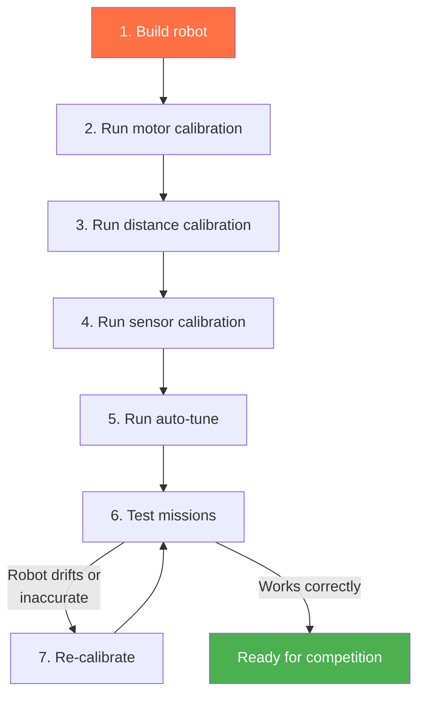

# Calibration

Calibration measures your robot's actual hardware characteristics and stores correction factors. Without calibration, `drive_forward(25)` might actually drive 22 cm or 28 cm. After calibration, it drives 25 cm (within a few mm).

## What Gets Calibrated

| What | Why | How |
|------|-----|-----|
| **Motor ticks-to-rad** | Encoders report ticks, the SDK needs radians | `calibrate()` — drives a known distance |
| **Distance scaling** | Compensates for wheel diameter and surface grip | `calibrate_distance(distance_cm=50)` |
| **IR sensor thresholds** | Every sensor reads differently; every surface is different | `calibrate_sensors()` or through BotUI |
| **Motor deadzone** | Minimum power to overcome static friction | `calibrate_deadzone()` |
| **Axis constraints** | Max velocity, acceleration, deceleration | `auto_tune()` — characterizes the robot |

## Calibration Workflow



### Step 1: Unified Calibration (Recommended)

The `calibrate()` step is an all-in-one calibration that handles both distance and IR sensor calibration in a single guided flow:

```python
calibrate(distance_cm=50)
```

This step uses the BotUI to guide you through the process:
1. IR sensor calibration — place sensors over white and black surfaces
2. Distance calibration — the robot drives a known distance and measures encoder ticks
3. Results are saved to `racoon.calibration.yml`

Run this on a flat, smooth surface. Make sure the robot has room to drive forward (at least 50 cm).

### Individual Calibration Steps (Alternative)

If you only need to calibrate one thing, use the individual steps:

```python
calibrate_distance(distance_cm=50)    # Distance only
calibrate_sensors()                    # IR sensors only
```

The BotUI guides you to place each sensor over white and black surfaces. The measured thresholds are saved per sensor port.

You can also calibrate through **BotUI → Settings → Calibration** without code.

### Step 4: Auto-Tune (Optional but Recommended)

Measures the robot's dynamic characteristics — maximum velocity, acceleration, and deceleration for each axis:

```python
auto_tune(
    vel_axes=["vx"],                              # Tune velocity PID
    tune_velocity=True,                            # Tune velocity PID
    tune_motion=True,                              # Tune motion PID
    characterize_axes=["linear", "angular"],       # Measure physical limits
    characterize_trials=3,                         # Repetitions per test
)
```

Auto-tune drives the robot through test maneuvers and measures the response. It needs about 1m of clear space in each direction.

## Typical Setup Mission

```python
class M00SetupMission(Mission):
    def sequence(self) -> Sequential:
        return seq([
            # Home servos
            Defs.claw.closed(),
            Defs.arm.up(),

            # Calibrate
            calibrate(distance_cm=50),

            # Optional: test lineup in a loop
            loop_forever(seq([
                wait_for_button(),
                Defs.front.lineup_on_black(),
            ])),
        ])
```

The setup mission runs before the match start signal. Use it to calibrate and verify that sensors and servos are working.

## Calibration Data Storage

Calibration values are stored in `racoon.calibration.yml`:

```yaml
root:
  ir-calibration:
    default:
      white_tresh: 1469.84
      black_tresh: 2490.58
    default_port0:
      white_tresh: 543.45
      black_tresh: 3647.12
    default_port4:
      white_tresh: 1451.85
      black_tresh: 3550.00
```

The file uses a naming scheme:
- `default` — Global default thresholds
- `default_port0` — Per-port overrides (port 0)
- `upper_port4` — Calibration set "upper", port 4

## Calibration Sets

If your robot operates on surfaces at different heights (e.g., a ramp vs. the ground), sensors may need different thresholds. Use calibration sets:

```python
# During setup: calibrate both surfaces
calibrate(
    distance_cm=50,
    calibration_sets=["default", "upper"],
)

# During missions: switch between sets
seq([
    switch_calibration_set("default"),        # Ground level
    Defs.front.drive_until_black(),

    drive_forward(50),                         # Drive up a ramp

    switch_calibration_set("upper"),           # Elevated surface
    Defs.front.follow_right_edge(30),
])
```

## When to Re-Calibrate

- **Different surface**: Game tables vary. Calibrate on the actual competition surface.
- **Changed wheels or motors**: Any mechanical change invalidates motor calibration.
- **Battery level**: Very low batteries can affect motor performance. Re-calibrate if behavior changes.
- **Between matches**: Quick sensor calibration takes 30 seconds and prevents surprises.

## Calibration Tips

1. **Calibrate on the actual game table** if possible. Table surface affects both IR sensor readings and wheel grip.
2. **Use fresh batteries** during calibration. Low batteries = different motor characteristics.
3. **Calibrate distance on a straight, flat section** with clear markings at the measured distance.
4. **Keep the robot stationary** during sensor calibration. Movement affects readings.
5. **Commit calibration files** to your repository so teammates can use the same values (but re-calibrate on the competition table).
