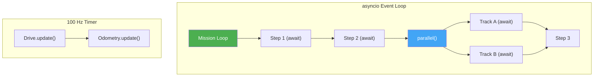
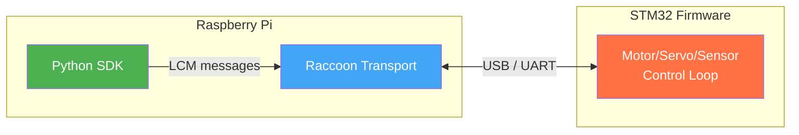

# Advanced Topics

This page covers the internals and advanced features you'll need when building complex competition robots.

## Async Execution Model

Missions run inside Python's `asyncio` event loop. Every step is an `async` function. This is what makes `parallel(...)` and `do_while_active(...)` possible — they use asyncio concurrency, not threads.



You don't need to understand asyncio to write missions — `seq()` and `parallel()` handle it. But if you're writing custom steps, know that:

- `_execute_step(self, robot)` must be `async`
- Use `await asyncio.sleep(duration)` instead of `time.sleep()`
- Never block the event loop with synchronous I/O or long computations

### No Threads — This Is Critical

> **The SDK is NOT thread-safe. Never use threads.** Do not use `threading`, `Thread`, `concurrent.futures`, or any other threading mechanism. This is a deliberate design decision, not a limitation.

**Why no threads?** The robot spends ~90% of its time busy-waiting (polling sensors, waiting for motors to reach a position, sleeping between control loop iterations). Threads would be overkill and introduce race conditions. Instead, `asyncio` schedules everything as coroutines on a single thread — essentially acting as a cooperative CPU scheduler. Each coroutine runs until it hits an `await`, then yields control so other coroutines can run.

This design is what makes safe shutdown possible. When the 120-second timer fires, the framework cancels the running mission by cancelling its asyncio task. Because everything is cooperative and single-threaded, the cancellation happens cleanly at the next `await` point — no motor is left spinning, no half-finished operation corrupts state. With threads, you'd have race conditions between the shutdown logic and the mission code, and motors could keep running after the robot is supposed to stop.

**The golden rule: always yield control with `await`.**

```python
# CORRECT — yields control, other coroutines can run
await asyncio.sleep(0.1)

# WRONG — blocks the entire event loop, nothing else runs
import time
time.sleep(0.1)   # NEVER do this!
```

If you block the event loop with `time.sleep()`, synchronous network calls, or heavy computation:
- The 100 Hz control loop stops updating → the robot jerks or drifts
- `parallel()` tracks freeze → only one track runs at a time
- The shutdown timer can't fire → the robot won't stop at 120 seconds
- UI screens stop responding → the touchscreen freezes

### The 100 Hz Control Loop

Motion steps run a fixed-rate loop at 100 Hz (every 10ms):

```python
class MotionStep:
    async def run_step(self, robot):
        self.on_start(robot)
        while True:
            dt = self._calculate_dt()
            if self.on_update(robot, dt):   # Returns True when done
                break
            await asyncio.sleep(0.01)       # Yield to event loop
        self.on_stop(robot)
```

The `on_update()` method is called every 10ms. It must return quickly (< 1ms). If it takes too long, the control loop falls behind and motion becomes jerky.

## Resource Conflict Detection

The step framework tracks which hardware resources each step uses. When you create a `parallel(...)` block, the framework validates that no two tracks use the same resource *before* execution starts.

```python
# This will raise an error at startup:
parallel(
    drive_forward(50),        # Uses resource "drive"
    turn_right(90),           # Also uses resource "drive" — CONFLICT!
)
```

Resources are declared in `required_resources()`:

```python
class DriveForward(MotionStep):
    def required_resources(self):
        return frozenset({"drive"})

class SetServoPosition(Step):
    def required_resources(self):
        return frozenset({f"servo:{self.servo.port}"})
```

Resource format: `"<type>"` or `"<type>:<qualifier>"`. The wildcard `"servo:*"` conflicts with any `"servo:<N>"`.

This is a compile-time safety net. It catches common mistakes like accidentally driving and turning simultaneously, or moving two mechanisms that share a motor.

## Robot Services

Services are lazily-instantiated singletons attached to the robot. They persist across missions within a single run and provide a place for stateful logic that doesn't belong in missions or steps.

### When to Use a Service

Not every piece of logic needs a service. Use one when:

- **State persists across missions.** A mission runs, stores a result, and a later mission needs that result. Steps are stateless — they execute and return. Services hold onto data for the entire run.
- **Multiple hardware components work together as a single mechanism.** If a motor, a sensor, and a servo need to be coordinated (e.g. a drum collector that spins a motor while reading a light sensor to count pockets), that coordination logic belongs in a service — not spread across individual steps.
- **Calibration produces thresholds used later.** A calibration step collects samples and computes thresholds. The service stores those thresholds so subsequent steps can use them without recalibrating.

If your logic is stateless and only touches one hardware component, a plain step function is simpler and sufficient.

### Creating a Service

Services extend `RobotService` and receive the robot instance in their constructor:

```python
from libstp import RobotService


class CounterService(RobotService):
    def __init__(self, robot):
        super().__init__(robot)
        self.count = 0

    def increment(self):
        self.count += 1
        return self.count
```

Access a service from any step via `robot.get_service()`. The first call creates the instance; subsequent calls return the same one (lazy singleton):

```python
run(lambda robot: robot.get_service(CounterService).increment())
```

### Example: Combined Hardware Mechanism

A drum collector robot uses a motor to rotate a drum and a light sensor to detect pocket positions. The `DrumMotorService` owns both pieces of hardware and provides higher-level operations:

```python
from libstp import RobotService, Motor, AnalogSensor

class DrumMotorService(RobotService):
    def __init__(self, robot):
        super().__init__(robot)
        self._blocked_threshold = None
        self._pocket_threshold = None
        self._current_index = 0

    @property
    def motor(self) -> Motor:
        return self.robot.defs.drum_motor

    @property
    def light_sensor(self) -> AnalogSensor:
        return self.robot.defs.drum_light_sensor

    @property
    def is_calibrated(self) -> bool:
        return self._blocked_threshold is not None

    @property
    def midpoint(self) -> float:
        """Midpoint between blocked and pocket thresholds."""
        return (self._blocked_threshold + self._pocket_threshold) / 2

    @property
    def current_index(self) -> int:
        return self._current_index

    def apply_calibration(self, blocked, pocket):
        """Store thresholds computed during calibration."""
        self._blocked_threshold = blocked
        self._pocket_threshold = pocket

    async def advance(self, count=1):
        """Spin motor forward, counting pocket transitions on the sensor."""
        # Uses stored thresholds to detect transitions
        ...

    async def go_to(self, index):
        """Navigate to a specific pocket by shortest path."""
        ...
```

Properties give the service a clean interface: `motor` and `light_sensor` provide convenient access to the hardware without exposing `self.robot.defs` to callers, `is_calibrated` and `midpoint` derive values from internal state, and `current_index` exposes read-only tracking. Steps that use the service only see the properties and methods — never the raw internals.

The calibration step calls `apply_calibration()`, and later mission steps call `advance()` or `go_to()` — all sharing the same thresholds and position tracking through the service.

### Where to Put Services

Services live in `src/service/`:

```
src/
├── service/
│   ├── __init__.py
│   └── drum_motor_service.py
├── missions/
├── steps/
└── hardware/
```

### Call Flow

The typical pattern is **mission → step → service**:

1. **Missions** define the sequence of what happens and when.
2. **Steps** are the atomic operations that missions compose (drive, servo move, sensor read).
3. **Services** provide the stateful logic and hardware coordination that steps call into.

Steps should call service methods rather than managing state themselves. This keeps steps reusable and testable — the state lives in one place.

### Built-in Services

The `HeadingReferenceService` is a built-in service that stores the marked heading reference. You can create your own services for any cross-mission state.

## Robot Geometry

The `RobotGeometry` mixin provides methods for computing sensor positions, wheel positions, and distances relative to the robot's center of rotation:

```python
class Robot(GenericRobot):
    width_cm = 23.5
    length_cm = 29.6
    rotation_center_forward_cm = 3.7
    rotation_center_strafe_cm = 0.0

    _sensor_positions = {
        defs.front_right_ir: SensorPosition(
            forward_cm=14.2,      # 14.2 cm in front of rotation center
            strafe_cm=-3.55,      # 3.55 cm to the right
            clearance_cm=0,       # Height above ground
        ),
    }
    _wheel_positions = {
        defs.front_left_motor: WheelPosition(forward_cm=6.25, strafe_cm=10.0),
    }
```

The geometry system uses these to compute:
- Distance between two sensors
- Sensor offset from rotation center
- Angle a sensor makes from center
- Used by lineup and line-following to compensate for sensor placement

## Raccoon Transport (IPC)

Raccoon Transport is the inter-process communication layer between the Python SDK and the Wombat's STM32 firmware. It uses LCM (Lightweight Communications and Marshalling) for message passing.



The transport provides:
- **Publish/Subscribe**: Send commands and receive sensor data
- **Reliable delivery**: Messages are retransmitted if lost
- **Retain**: Last-known values are cached for late subscribers
- **Channels**: Typed message channels for motors, servos, sensors, IMU, etc.

You don't interact with Raccoon Transport directly unless you're building platform-level extensions. The HAL layer wraps it for you.

## Logging

LibSTP uses spdlog (C++) and Python's logging for diagnostics:

```python
import libstp.foundation as logging

# Set log level for specific source files
logging.set_file_level("stm32_odometry.cpp", logging.Level.trace)
logging.set_file_level("drive.py", logging.Level.trace)
logging.set_file_level("linear_motion.cpp", logging.Level.trace)
logging.set_file_level("libstp.step.base", logging.Level.debug)
```

Log levels (from most to least verbose): `trace`, `debug`, `info`, `warn`, `error`, `critical`.

Enable verbose logging when debugging motion issues — the drive system, odometry, and motion planner log detailed telemetry at `trace` level.

> **Warning:** Setting motion-related files (e.g. `drive.py`, `linear_motion.cpp`, `stm32_odometry.cpp`) to `trace` level produces a high volume of log output. This significantly drops the control loop update rate, causing noticeably worse driving behavior — the robot may steer erratically or overshoot targets. Use `trace` on motion files only for stationary debugging or short diagnostic runs, not during actual competition missions. For normal operation, `info` or `debug` is sufficient.

## Timing Instrumentation

Every step is automatically timed. The framework tracks:
- Execution duration per step
- Anomalies (steps that take unexpectedly long)

Register an anomaly callback on any step:

```python
drive_forward(25).on_anomaly(lambda step, duration: print(f"Slow: {duration}s"))
```

Or skip timing for steps where you don't care:

```python
wait_for_button().skip_timing()
```

## Simulation Support

Steps can export simulation data via `to_simulation_step()`. This is used by the Botball Simulator to visualize mission execution without real hardware.

The mock platform driver (`libstp-platforms/mock/`) returns simulated sensor values and accepts motor commands without real hardware. Use it for testing mission logic on your laptop.

## Build and Deploy

### Building LibSTP

LibSTP cross-compiles from an x86 host to ARM64 (Raspberry Pi) using Docker:

```bash
cd /path/to/library
bash build.sh           # Builds ARM64 .whl inside Docker
```

The output is a Python wheel in `build-docker/`. The build uses:
- CMake 3.15+ with Ninja
- scikit-build-core for Python packaging
- pybind11 2.13.6 for C++/Python bindings
- ccache for incremental builds

### Deploying to the Robot

```bash
RPI_HOST=192.168.100.237 bash deploy.sh
```

This copies the wheel to the Raspberry Pi and installs it via pip. Environment variables:

| Variable | Default | Purpose |
|----------|---------|---------|
| `RPI_HOST` | (required) | Raspberry Pi IP address |
| `RPI_USER` | `pi` | SSH username |
| `RPI_DIR` | `/home/pi/python-libs` | Install directory |
| `BUILD_TYPE` | `Release` | CMake build type |

### Installing Locally (for development)

```bash
pip install .
```

This builds the native extensions and installs the Python package locally. Useful for running tests against the mock driver.
