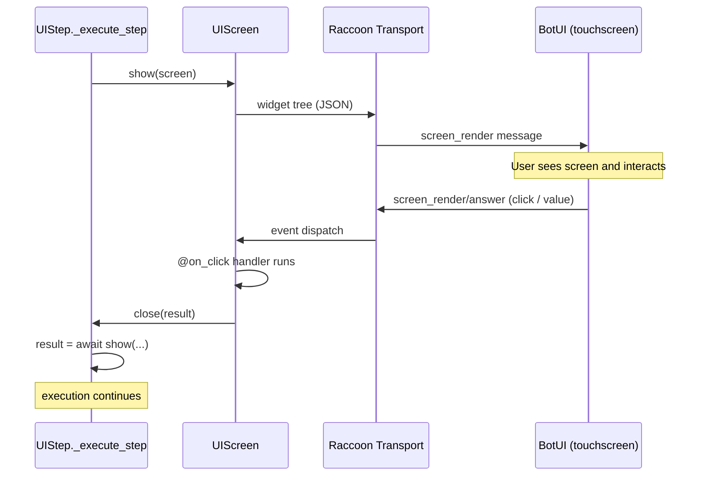
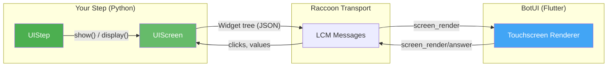
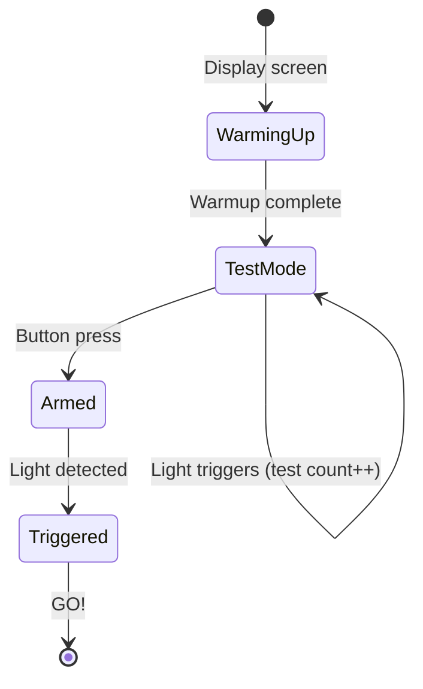

# UI Steps & Screens

The Wombat controller has a touchscreen. `raccoon` lets you display custom screens on it — progress indicators, sensor readings, confirmation dialogs, input forms, and live visualizations. This is how calibration wizards, wait-for-button prompts, and debug dashboards work under the hood.

You can use the built-in screens for common tasks, or build your own custom screens with a full widget toolkit.

## Concept: How Screens Work

A `UIStep` is an async step that shows a screen, waits for user interaction, and then continues. The screen itself is a Python object that builds a widget tree; `raccoon` serializes that tree to JSON and sends it to the BotUI Flutter app running on the Wombat touchscreen. Events (button taps, slider changes) come back the same way and fire your `@on_click` / `@on_change` handlers.

The most important rule: **`await self.show(screen)`** suspends the step until `screen.close(result)` is called. This makes user interaction feel synchronous — your step code reads top-to-bottom, each `show()` waits for its answer, and then execution continues.



## Architecture



Your Python code sends a widget tree to BotUI via Raccoon Transport. BotUI renders it on the touchscreen. When the user taps a button or changes an input, BotUI sends the event back. Your screen's event handlers react to it.

## Quick Helpers (One-Liners)

The fastest way to show UI — no custom screens needed. These are methods on `UIStep`:

```python
from raccoon import UIStep

class MyMissionStep(UIStep):
    async def _execute_step(self, robot):
        # Simple message with OK button
        await self.message("Calibration complete!")

        # Yes/No confirmation — returns True or False
        confirmed = await self.confirm("Ready to start?")

        # Number input — returns the entered value
        distance = await self.input_number("Enter distance", unit="cm",
                                           min_value=10, max_value=200)

        # Text input
        name = await self.input_text("Enter robot name")

        # Slider input — returns float | None (None if user cancels)
        speed = await self.input_slider("Set speed", min=0, max=100, default=50)
        if speed is not None:
            robot.drive.set_speed(speed / 100.0)

        # Multiple choice — returns the selected option
        choice = await self.choose("Pick a strategy",
                                   options=["Aggressive", "Safe", "Custom"])

        # Wait for physical button press
        await self.wait_for_button("Press button to continue...")
```

Each helper displays a pre-built screen, waits for the user to interact, and returns the result. Use these when you need a quick interaction without building a custom screen.

## Built-In Screens

`raccoon` ships with ready-to-use screens for common patterns. Import them from `raccoon.ui.screens`:

### Message & Confirmation

```python
from raccoon.ui.screens import MessageScreen, ConfirmScreen

class MyStep(UIStep):
    async def _execute_step(self, robot):
        # Message with custom icon
        await self.show(MessageScreen(
            title="Done!",
            message="All POMs collected successfully.",
            button_label="Continue",
            icon_name="check_circle",
        ))

        # Confirmation dialog — returns True (confirmed) or False (cancelled)
        confirmed = await self.show(ConfirmScreen(
            title="Dangerous Action",
            message="This will reset calibration. Continue?",
            confirm_label="Yes, reset",
            cancel_label="Cancel",
        ))
        if confirmed:
            # ... reset calibration
            pass
```

**`ConfirmScreen` constructor parameters:**

| Parameter | Type | Default | Description |
|-----------|------|---------|-------------|
| `title` | `str` | — | **Required.** Screen title. |
| `message` | `str` | — | **Required.** Body text. |
| `confirm_label` | `str` | `"Confirm"` | Label on the confirmation button. |
| `cancel_label` | `str` | `"Cancel"` | Label on the cancel button. |
| `confirm_style` | `str` | `"success"` | Button style: `"success"`, `"danger"`, `"primary"`, etc. |
| `icon_name` | `str` | `"help_outline"` | Material icon name. |
| `icon_color` | `str` | `"blue"` | Icon color. |

**Return type:** `bool` — `True` when the user taps the confirm button, `False` when they tap cancel. The physical Wombat button acts as the confirm button (`_primary_button_id = "confirm"`).

> **Common mistake:** `result = await self.show(ConfirmScreen(...))` then `result.confirmed` raises `AttributeError: 'bool' object has no attribute 'confirmed'`. The result is already the boolean — use `if result:` or `if confirmed:` directly.

### Progress & Status

```python
from raccoon.ui.screens import ProgressScreen, StatusScreen

class MyStep(UIStep):
    async def _execute_step(self, robot):
        # Show progress while doing work
        async with self.showing(ProgressScreen(
            message="Calibrating motors...",
            show_spinner=True,
            show_progress=True,
        )) as ctx:
            for i in range(100):
                ctx.screen.progress = i          # 0-100 integer, shown as percentage
                ctx.screen.message = f"Motor {i // 25 + 1} of 4..."
                ctx.screen.status = f"{i}% complete"  # optional subtitle line
                await ctx.screen.refresh()
                await asyncio.sleep(0.05)

        # Show a status indicator (non-blocking — has no close button)
        await self.display(StatusScreen(
            message="Robot ready",
            icon_name="rocket_launch",
            icon_color="green",
            status="All systems go",
        ))
        await asyncio.sleep(2)
        await self.close_ui()
```

### Input Screens

```python
from raccoon.ui.screens import NumberInputScreen, SliderInputScreen, ChoiceScreen

class MyStep(UIStep):
    async def _execute_step(self, robot):
        # Number with keypad
        result = await self.show(NumberInputScreen(
            title="Distance Calibration",
            prompt="Measure how far the robot actually drove:",
            unit="cm",
            initial_value=50.0,
            min_value=1.0,
            max_value=500.0,
        ))
        measured = result.value   # NumberInputResult

        # Slider
        result = await self.show(SliderInputScreen(
            title="Sensitivity",
            prompt="Adjust IR threshold:",
            min=0, max=4095, default=2000,
        ))
        threshold = result.value  # SliderInputResult

        # Multiple choice — choices are (id, label) or (id, label, description) tuples
        # Returns the selected id string, or None if cancelled
        selected = await self.show(ChoiceScreen(
            title="Calibration Set",
            message="Which surface are you calibrating for?",
            choices=[
                ("ground", "Ground level", "Default table surface"),
                ("upper", "Upper platform", "Elevated surface"),
                ("ramp", "Ramp", "Angled surface"),
            ],
            cancel_label="Cancel",
        ))
        if selected == "ground":
            pass  # handle ground surface
        elif selected == "upper":
            pass  # handle upper platform
```

**`ChoiceScreen` return type:** `str | None` — the `id` string from the selected tuple (first element), or `None` if the user tapped the cancel button. The result is a plain string; there is no `.choice` attribute.

**`ChoiceScreen` constructor parameters:**

| Parameter | Type | Default | Description |
|-----------|------|---------|-------------|
| `title` | `str` | — | **Required.** Screen title. |
| `message` | `str` | — | **Required.** Prompt text above the choices. |
| `choices` | `list[tuple]` | — | **Required.** List of `(id, label)` or `(id, label, description)` tuples. Each `id` must be unique. |
| `cancel_label` | `str \| None` | `"Cancel"` | Label for the cancel button. Pass `None` to hide the cancel button entirely. |

### Wait-for-Button Screen

```python
from raccoon.ui.screens import WaitForButtonScreen

class MyStep(UIStep):
    async def _execute_step(self, robot):
        await self.show(WaitForButtonScreen(
            message="Place robot on the starting line",
            icon_name="sports_score",
            icon_color="blue",
        ))
```

## Building Custom Screens

For anything beyond the built-in screens, create your own by extending `UIScreen`.

### Minimal Example

```python
from raccoon import UIStep, UIScreen
from raccoon.ui.widgets import *
from raccoon.ui.events import on_click


class GreetingScreen(UIScreen):
    title = "Hello!"

    def build(self):
        return Center(children=[
            Text("Welcome to my robot", size="large", bold=True),
            Spacer(height=16),
            Text("Press the button to start the mission"),
            Spacer(height=24),
            Button("start", "Start Mission", style="success"),
        ])

    @on_click("start")
    async def on_start(self):
        self.close("started")


class MyStep(UIStep):
    async def _execute_step(self, robot):
        result = await self.show(GreetingScreen())
        # result == "started"
```

### Screen with Typed Results

Screens can return typed results using generics:

```python
from dataclasses import dataclass

@dataclass
class CalibrationResult:
    white_value: float
    black_value: float
    confirmed: bool


class CalibrationScreen(UIScreen[CalibrationResult]):
    title = "Sensor Calibration"
    _primary_button_id = "confirm"   # Physical button triggers this

    def __init__(self, port: int):
        super().__init__()
        self.port = port
        self.white_value = 0.0
        self.black_value = 0.0

    def build(self):
        return Column(children=[
            SensorValue(port=self.port, sensor_type="analog"),
            SensorGraph(port=self.port, sensor_type="analog", max_points=100),
            Divider(),
            Row(children=[
                Button("read_white", "Read White", style="secondary"),
                Button("read_black", "Read Black", style="secondary"),
            ]),
            Spacer(height=16),
            ResultsTable(rows=[
                ("White", f"{self.white_value:.0f}"),
                ("Black", f"{self.black_value:.0f}"),
            ]),
            Spacer(height=16),
            Row(children=[
                Button("cancel", "Cancel", style="secondary"),
                Button("confirm", "Confirm", style="success"),
            ]),
        ])

    @on_click("read_white")
    async def on_read_white(self):
        self.white_value = await self.read_sensor(self.port)
        await self.refresh()   # Re-render with new value

    @on_click("read_black")
    async def on_read_black(self):
        self.black_value = await self.read_sensor(self.port)
        await self.refresh()

    @on_click("confirm")
    async def on_confirm(self):
        self.close(CalibrationResult(
            white_value=self.white_value,
            black_value=self.black_value,
            confirmed=True,
        ))

    @on_click("cancel")
    async def on_cancel(self):
        self.close(CalibrationResult(
            white_value=0, black_value=0, confirmed=False,
        ))
```

### Screen with Live Updates

Screens can update in real time while background work runs:

```python
import asyncio

class LiveSensorScreen(UIScreen):
    title = "Sensor Monitor"

    def __init__(self, ports):
        super().__init__()
        self.ports = ports
        self.values = {p: 0 for p in ports}

    def build(self):
        rows = []
        for port in self.ports:
            rows.append(Row(children=[
                Text(f"Port {port}", bold=True),
                SensorValue(port=port, sensor_type="analog"),
            ]))
        rows.append(Spacer(height=24))
        rows.append(Button("done", "Done", style="primary"))
        return Column(children=rows)

    @on_click("done")
    async def on_done(self):
        self.close(self.values)


class MonitorStep(UIStep):
    async def _execute_step(self, robot):
        # Display screen without blocking — mission continues
        screen = LiveSensorScreen(ports=[0, 1, 2])
        result = await self.show(screen)
```

## Widget Reference

All widgets are imported from `raccoon.ui.widgets`.

### Display Widgets

| Widget | Purpose | Key Parameters |
|--------|---------|---------------|
| `Text(text)` | Text display | `size` ("small", "medium", "large", "title"), `color`, `bold`, `muted`, `align` |
| `Icon(name)` | Material icon | `size`, `color` — see [Material Icons](https://fonts.google.com/icons) for names |
| `Spacer(height)` | Vertical space | `height` in pixels |
| `Divider()` | Horizontal line | `thickness`, `color` |
| `StatusBadge(text)` | Colored pill | `color`, `glow` (boolean) |
| `StatusIcon(icon)` | Icon in circle | `color`, `animated` (boolean) |
| `HintBox(text)` | Highlighted box | `icon`, `style` ("normal", "prominent") |
| `DistanceBadge(value)` | Distance display | `unit`, `color` |
| `ResultsTable(rows)` | Key-value table | `rows` — list of `(label, value)` tuples |

### Input Widgets

| Widget | Purpose | Key Parameters |
|--------|---------|---------------|
| `Button(id, label)` | Clickable button | `style` ("primary", "secondary", "success", "danger", "warning"), `icon`, `disabled` |
| `Slider(id)` | Slider control | `min`, `max`, `value`, `label`, `show_value` |
| `Checkbox(id, label)` | Toggle | `value` (boolean) |
| `Dropdown(id, options)` | Select menu | `value`, `label` |
| `NumericKeypad()` | Touch keypad | 0–9, decimal, backspace |
| `NumericInput(id)` | Number display | `value`, `unit`, `min_value`, `max_value` |
| `TextInput(id)` | Text field | `value`, `label`, `placeholder` |

### Visualization Widgets

| Widget | Purpose | Key Parameters |
|--------|---------|---------------|
| `SensorValue(port)` | Large sensor reading | `sensor_type` ("analog", "digital") — live updates automatically |
| `SensorGraph(port)` | Real-time line graph | `sensor_type`, `max_points` |
| `LightBulb(is_on)` | Animated light bulb | Boolean state |
| `AnimatedRobot(moving)` | Robot animation | `size` — shows spinning wheels when `moving=True` |
| `CircularSlider(id)` | Circular control | `min`, `max`, `value`, `label` |
| `ProgressSpinner()` | Loading spinner | `size`, `color` |
| `PulsingArrow(direction)` | Directional arrow | `direction` ("up", "down", "left", "right") |
| `RobotDrivingAnimation(target_distance)` | Driving visualization | Shows robot moving with distance counter |
| `MeasuringTape(distance)` | Tape animation | `distance` in cm |
| `CalibrationChart(samples)` | Scatter/line chart | `thresholds`, `height` |

### Layout Widgets

| Widget | Purpose | Key Parameters |
|--------|---------|---------------|
| `Row(children)` | Horizontal layout | `align`, `spacing` |
| `Column(children)` | Vertical layout | `align`, `spacing` |
| `Center(children)` | Center content | Centers both horizontally and vertically |
| `Card(children)` | Card container | `title`, `padding` |
| `Split(left, right)` | Side-by-side layout | `ratio` — tuple of ints, e.g. `(1, 1)` or `(5, 3)` |
| `Expanded(child)` | Fill available space | `flex` weight |
| `Container(children)` | Colored backdrop | `bg_color` (hex or named color), `padding` (px); fills all available space |

## Event Decorators

Bind screen methods to user interactions:

```python
from raccoon.ui.events import (
    on_click,         # Button tapped
    on_change,        # Input value changed
    on_slider,        # Slider moved
    on_submit,        # Form submitted
    on_keypad,        # Keypad key pressed
    on_button_press,  # Physical Wombat button pressed
    on_screen_tap,    # Screen tapped anywhere
)


class MyScreen(UIScreen):
    title = "Events Demo"

    def build(self):
        return Column(children=[
            Button("go", "Go!", style="success"),
            Slider("speed", min=0, max=100, value=50, label="Speed"),
            NumericKeypad(),
            NumericInput("distance", value=0, unit="cm"),
        ])

    @on_click("go")
    async def handle_go(self):
        speed = self.get_value("speed")
        self.close(speed)

    @on_slider("speed")
    async def handle_speed(self, value):
        # Called every time slider moves
        pass

    @on_keypad()
    async def handle_key(self, key):
        # key is "0"-"9", ".", or "back"
        current = self.get_value("distance") or ""
        if key == "back":
            current = current[:-1]
        else:
            current += key
        self.set_value("distance", current)
        await self.refresh()

    @on_button_press()
    async def handle_physical_button(self):
        # Physical button on the Wombat
        self.close("button")
```

## Display Modes

### Blocking (`show`)

The most common pattern. Shows a screen and waits for `close()` to be called:

```python
result = await self.show(MyScreen())
# Execution pauses here until the screen calls self.close(result)
```

### Non-Blocking (`display` + `pump_events`)

Show a screen while doing background work. You must pump events manually:

```python
screen = StatusScreen(message="Working...")
await self.display(screen)

for i in range(100):
    await self.pump_events()  # Handle any UI events
    screen.message = f"Step {i}/100"
    await screen.refresh()
    await asyncio.sleep(0.1)

await self.close_ui()
```

### Context Manager (`showing`)

Cleaner syntax for non-blocking display:

```python
async with self.showing(ProgressScreen(message="Calibrating...")) as ctx:
    for i in range(100):
        ctx.screen.progress = i        # 0-100 integer
        await ctx.screen.refresh()
        await asyncio.sleep(0.05)
# Screen automatically closed when exiting the context
```

### Background Task (`run_with_ui`)

Show a screen while running a coroutine. Screen stays visible until the task completes:

```python
# Callable form — function called internally
result = await self.run_with_ui(
    ProgressScreen("Running diagnostics..."),
    self.run_diagnostics,   # async method / callable
)

# Coroutine form — pass a coroutine object directly
result = await self.run_with_ui(
    ProgressScreen("Calibrating..."),
    self.do_calibration()   # already-created coroutine
)
```

Both forms are supported. Pass either a callable (it will be called with no arguments) or an already-created coroutine object.

## The `_primary_button_id` Pattern

Set `_primary_button_id` on your screen to link the physical Wombat button to a specific on-screen button. When the user presses the physical button, it triggers the click handler for that button:

```python
class MyScreen(UIScreen):
    _primary_button_id = "confirm"   # Physical button = clicking "confirm"

    def build(self):
        return Column(children=[
            Text("Ready?"),
            Button("confirm", "OK", style="success"),
        ])

    @on_click("confirm")
    async def on_confirm(self):
        self.close(True)
```

This is important for screens that need to work without touching the screen — the physical button acts as a universal "OK".

## Accessing the Robot from Screens

Screens have access to the robot instance via `self.robot`:

```python
class DiagnosticsScreen(UIScreen):
    def build(self):
        return Column(children=[
            Text("Motor Diagnostics", size="large"),
            Button("test", "Run Test"),
        ])

    @on_click("test")
    async def on_test(self):
        # Read sensor directly
        value = await self.read_sensor(0, sensor_type="analog")

        # Access robot hardware
        motor = self.robot.defs.front_left_motor
        # ... use motor ...
```

`read_sensor(port, sensor_type="analog")` is a convenience method that reads a sensor value from within a screen. The `sensor_type` parameter defaults to `"analog"`, so `await self.read_sensor(0)` is enough for most cases.

### Widget State: `get_value` / `set_value`

Screens track input widget values automatically. Access them with:

```python
# Read the current value of an input widget
speed = self.get_value("speed_slider")

# Set a widget's value programmatically
self.set_value("distance_input", "42.5")
await self.refresh()  # Re-render to show the new value
```

Values are automatically updated when users interact with input widgets (sliders, text inputs, keypads, etc.).

## Patterns from Real Competition Code

### Calibration Loop with Retry

From the actual calibration system — measure, confirm, retry if needed:

```python
class CalibrateStep(UIStep):
    async def _execute_step(self, robot):
        while True:
            # Step 1: Measure on a custom screen (white / black surfaces)
            white = await self.show(MeasureScreen(port=0, surface="white"))
            black = await self.show(MeasureScreen(port=0, surface="black"))

            # Step 2: Confirm — ConfirmScreen is UIScreen[bool] and returns
            # a plain bool. Its constructor takes (title, message, ...) —
            # there are no white_value/black_value parameters.
            confirmed = await self.show(ConfirmScreen(
                title="Save Calibration?",
                message=f"White={white.value:.0f}  Black={black.value:.0f}. Save?",
                confirm_label="Save",
                cancel_label="Re-measure",
            ))

            if confirmed:
                # Save and exit
                store_calibration(white.value, black.value)
                break
            # Otherwise loop and re-measure
```

> **Important:** `ConfirmScreen` is typed `UIScreen[bool]`. `await self.show(ConfirmScreen(...))` returns a plain `bool` — `True` when the user taps the confirm button, `False` when they tap cancel. There is no `.confirmed` attribute on the result; using `result.confirmed` raises `AttributeError`.

### Wait-for-Light with State Machine

The competition start light detection uses a multi-state UI:



The screen updates in real time showing the current state, raw sensor value, baseline, and threshold — all while running a Kalman filter for robust detection.

### Driving with Visual Feedback

Show an animation while the robot drives:

```python
class DriveWithFeedback(UIStep):
    async def _execute_step(self, robot):
        screen = ProgressScreen(message="Driving to target...")
        async with self.showing(screen) as ctx:
            # Run a drive step while showing progress
            await drive_forward(50).run_step(robot)
        await self.show(MessageScreen(
            title="Arrived!",
            message="Robot reached the target.",
            icon_name="check_circle",
        ))
```

## Setup Timer Integration

During a `SetupMission` — the mission that runs before the competition starts — raccoon automatically injects a countdown timer into every rendered screen. The timer shows the remaining setup time in seconds and is visible on all `UIScreen` instances without any extra code in your screens.

Two public functions let you control the timer programmatically:

```python
from raccoon.ui.step import set_setup_timer_paused, reset_setup_timer
```

### `set_setup_timer_paused(paused: bool)`

Pause or resume the countdown.

- `set_setup_timer_paused(True)` — freezes the timer. Elapsed time stops accumulating. The displayed value stays constant.
- `set_setup_timer_paused(False)` — resumes from where it was paused.
- **No-op** when called outside a `SetupMission` (e.g. in a regular mission or tests). Safe to call unconditionally.

**When to use:** The Wait-for-Light step pauses the timer while armed so that the remaining setup time is not consumed during the countdown wait.

### `reset_setup_timer()`

Restart the countdown from its full configured duration (`SetupMission.setup_time`) and un-pause.

- **No-op** outside a `SetupMission`.

**When to use:** If the user aborts and re-enters the setup flow, call `reset_setup_timer()` so they see the full timer again.

### How the timer works

The timer state is stored in a `ContextVar` (`_active_setup_timer`) set by `SetupMission.setup_timer_context()`. Because it is a `ContextVar`, the value is automatically available to any screen rendered in that async context — you do not pass it explicitly. Outside a `SetupMission`, the var is `None` and the timer is simply not rendered.

```python
# Example: pause timer during a critical measurement
from raccoon.ui.step import set_setup_timer_paused

class WaitForLightStep(UIStep):
    async def _execute_step(self, robot):
        # Freeze timer while waiting for the start light
        set_setup_timer_paused(True)
        await self.show(WaitForButtonScreen("Waiting for light..."))
        # Resume when done
        set_setup_timer_paused(False)
```

---

## Competition Pattern: Calibration Surface Selection

Competition robots that traverse ramps or multiple surfaces need the operator to confirm which calibration set to activate before the match. A `ChoiceScreen` inside the setup mission handles this cleanly:

```python
from raccoon import UIStep, switch_calibration_set
from raccoon.ui.screens import ChoiceScreen, MessageScreen

class SelectSurfaceStep(UIStep):
    """Let the operator choose the starting surface before arming."""
    async def _execute_step(self, robot):
        surface = await self.show(ChoiceScreen(
            title="Starting Surface",
            message="Which surface is the robot currently on?",
            choices=[
                ("default", "Ground level", "Standard table surface"),
                ("upper",   "Upper deck",   "Elevated platform / ramp"),
            ],
        ))
        if surface == "upper":
            switch_calibration_set("upper")
        else:
            switch_calibration_set("default")

        await self.show(MessageScreen(
            title="Ready",
            message=f"Using '{surface}' IR calibration.",
            icon_name="check_circle",
        ))
```

This runs as a step inside `SetupMission.sequence()`. Because the choice is made by a human before arming, it is safe from false positives — and the `ChoiceScreen` return is a plain string (`"default"` or `"upper"`), not a wrapped object.

## When to Use UI Steps

| Situation | Use |
|-----------|-----|
| Quick "press button to continue" | `wait_for_button()` or `self.wait_for_button()` |
| Simple yes/no | `self.confirm("Ready?")` |
| Show a message | `self.message("Done!")` |
| Get a number from the user | `self.input_number("Enter distance", unit="cm")` |
| Sensor dashboard during testing | Custom screen with `SensorValue` + `SensorGraph` |
| Calibration workflow | Custom screen with `read_sensor()` + `ResultsTable` |
| Visual feedback during autonomous | `self.showing(ProgressScreen(...))` context manager |
| Multi-step wizard | Chain multiple `self.show()` calls with different screens |
| Pause setup timer during armed state | `set_setup_timer_paused(True)` / `set_setup_timer_paused(False)` |
| Select calibration surface before arming | `ChoiceScreen` in `SetupMission.sequence()` |

> **Tip:** Start with the quick helpers (`message`, `confirm`, `input_number`). Only build custom screens when you need live sensor data, complex layouts, or multi-step flows.
