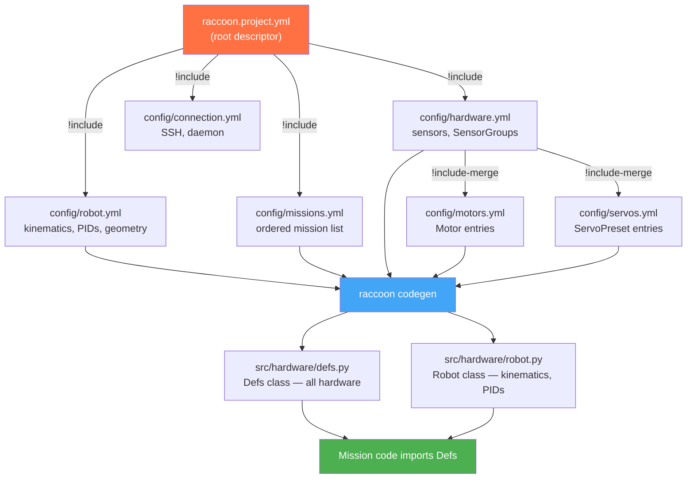

## Concept: Config → Code Pipeline

raccoon configuration is not read at runtime. The YAML files are processed by the code generator (codegen), which produces `src/hardware/defs.py` and `src/hardware/robot.py`. The generated Python files contain the actual hardware objects — typed, instantiated, and named. The YAML is the source of truth; the Python is the output.



The `!include-merge` directive is how `hardware.yml` keeps motors and servos in separate focused files while presenting them as a single flat namespace to the codegen. Keys prefixed with `_` (e.g. `_motors`, `_servos`) are merge-anchor keys — they are consumed by the loader and do not produce hardware attributes in `Defs`. Every other key becomes an attribute.

This page is a complete reference for every key in every configuration file. All paths are relative to the project root.

## File layout and include graph

```
raccoon.project.yml
  ├── config/robot.yml         (robot: key)
  ├── config/missions.yml      (missions: key)
  ├── config/hardware.yml      (definitions: key)
  │   ├── config/motors.yml    (!include-merge)
  │   └── config/servos.yml    (!include-merge)
  └── config/connection.yml    (connection: key)
```

`raccoon.project.yml` is the root file. It uses `!include` to delegate each top-level section to the files listed above. `config/hardware.yml` in turn uses `!include-merge` for motors and servos, which means all motor and servo entries are promoted to the same level as the sensor definitions.

---

## `raccoon.project.yml`

The root project descriptor. Only a handful of keys live here directly; the rest are delegated.

| Key | Type | Description |
|-----|------|-------------|
| `name` | `string` | Human-readable project name. Displayed in the raccoon CLI and web IDE. Set once at `raccoon create`. |
| `uuid` | `string` | A unique identifier for the project (UUID v4). Used by the raccoon daemon to route commands to the correct project on the Pi. Set once at `raccoon create`, never change manually. |
| `format_version` | `integer` | Schema version of this project file. Written by `raccoon migrate` and checked by `raccoon run` against `raccoon-lib.MIN_FORMAT_VERSION`. Projects at an older version than the library requires will not run until `raccoon migrate` is executed. Omit or leave at `0` for newly-created projects. |
| `robot` | `!include` | Delegates to `config/robot.yml`. The entire robot subsystem configuration lives there. |
| `missions` | `!include` | Delegates to `config/missions.yml`. The ordered list of missions. |
| `definitions` | `!include` | Delegates to `config/hardware.yml`. All hardware object definitions. |
| `connection` | `!include` | Delegates to `config/connection.yml`. SSH and daemon connection settings. |
| `simulation` | `mapping` | **Optional.** Overrides simulator defaults used by the Web-IDE's simulation mode. See the `simulation:` section below. |

### `simulation:` (optional)

Configures the Web-IDE simulator that runs when you use the `simulate=real` run configuration. When this block is absent, the simulator uses an empty table scene and falls back to `robot.physical.start_pose` for the starting position.

```yaml
simulation:
  scene: empty_table.ftmap          # path to a .ftmap file (project-relative or absolute)
  start_pose:                       # overrides robot.physical.start_pose for simulation only
    x_cm: 0.0
    y_cm: 0.0
    theta_deg: 0.0
```

| Key | Type | Default | Description |
|-----|------|---------|-------------|
| `simulation.scene` | `string` | *(empty table)* | Path to a `.ftmap` file used as the simulation arena. Can be project-relative or absolute. |
| `simulation.start_pose.x_cm` | `float` | from `physical.start_pose.x_cm` | Simulation-only starting X position (cm). Overrides `physical.start_pose` for simulation runs only. |
| `simulation.start_pose.y_cm` | `float` | from `physical.start_pose.y_cm` | Simulation-only starting Y position (cm). |
| `simulation.start_pose.theta_deg` | `float` | from `physical.start_pose.theta_deg` | Simulation-only starting heading (degrees). |

This block is intentionally separate from `physical.start_pose` so you can place the robot at a different starting position in simulation without affecting real-robot runs.

---

## `config/robot.yml`

Top-level robot configuration. Maps directly to the generated `Robot` class in `src/hardware/robot.py`.

### `shutdown_in`

| Attribute | Value |
|-----------|-------|
| Type | `integer` |
| Default | `120` |
| Required | Yes |

Number of seconds after program start after which `GenericRobot` will automatically shut down the running mission sequence. Prevents the robot from running indefinitely if something goes wrong. Set to `0` to disable.

---

### `drive`

Container for the drive subsystem. All motion steps read their kinematics and velocity control from here.

#### `drive.kinematics`

Specifies the kinematic model that maps chassis velocities to per-wheel commands.

| Key | Type | Default | Description |
|-----|------|---------|-------------|
| `type` | `string` | — | **Required.** Kinematic model. Supported values: `differential`, `mecanum`. |
| `wheel_radius` | `float` | — | **Required.** Wheel radius in metres. Used to convert angular wheel velocity (rad/s) to linear velocity (m/s). |
| `wheelbase` | `float` | — | **Required for differential and mecanum.** Distance between the left and right wheel contact patches in metres. For mecanum this is the front-to-back axle distance. |
| `track_width` | `float` | — | **Required for mecanum only.** Left-to-right distance between wheel contact patches in metres. |
| `left_motor` | `string` | — | **Required for differential.** Name of the left drive motor as it appears in `definitions`. Translated to `defs.<name>` in generated code. |
| `right_motor` | `string` | — | **Required for differential.** Name of the right drive motor as it appears in `definitions`. |
| `front_left_motor` | `string` | — | **Required for mecanum.** Name of the front-left motor in `definitions`. |
| `front_right_motor` | `string` | — | **Required for mecanum.** Name of the front-right motor in `definitions`. |
| `back_left_motor` | `string` | — | **Required for mecanum.** Name of the back-left motor in `definitions`. |
| `back_right_motor` | `string` | — | **Required for mecanum.** Name of the back-right motor in `definitions`. |

The `type` value is case-insensitive. `DifferentialKinematics` is instantiated as `DifferentialKinematics(left_motor, right_motor, wheelbase, wheel_radius)` and `MecanumKinematics` as `MecanumKinematics(front_left_motor, front_right_motor, back_left_motor, back_right_motor, wheelbase, track_width, wheel_radius)`.

Example — differential drive:

```yaml
drive:
  kinematics:
    type: differential
    wheel_radius: 0.03
    wheelbase: 0.16
    left_motor: left_motor
    right_motor: right_motor
```

#### `drive.vel_config`

Per-axis chassis velocity control configuration. Each axis has a PID controller and a feedforward term that together compute the motor command voltage.

The three axes are:

- `vx` — forward/backward linear velocity (m/s)
- `vy` — lateral (strafe) velocity (m/s); only relevant for mecanum
- `wz` — angular (yaw) velocity (rad/s)

Each axis block has the same structure:

```yaml
vel_config:
  vx:
    pid:
      kp: 0.0
      ki: 0.0
      kd: 0.0
    ff:
      kS: 0.0
      kV: 1.0
      kA: 0.0
  vy:
    pid: { kp: 0.0, ki: 0.0, kd: 0.0 }
    ff:  { kS: 0.0, kV: 1.0, kA: 0.0 }
  wz:
    pid: { kp: 0.0, ki: 0.0, kd: 0.0 }
    ff:  { kS: 0.0, kV: 1.0, kA: 0.0 }
```

**`pid` sub-keys** (maps to `PidGains`):

| Key | Type | Default | Description |
|-----|------|---------|-------------|
| `kp` | `float` | `0.0` | Proportional gain. |
| `ki` | `float` | `0.0` | Integral gain. |
| `kd` | `float` | `0.0` | Derivative gain. |

**`ff` sub-keys** (maps to `Feedforward`):

| Key | Type | Default | Description |
|-----|------|---------|-------------|
| `kS` | `float` | `0.0` | Static friction compensation. Added as a constant offset whenever the commanded velocity is non-zero. |
| `kV` | `float` | `1.0` | Velocity feedforward coefficient. Scales the commanded velocity to produce the open-loop motor command. `1.0` means the motor command equals the setpoint directly when no error exists. |
| `kA` | `float` | `0.0` | Acceleration feedforward coefficient. |

The `vel_config` is translated into a `ChassisVelocityControlConfig` struct at code-generation time.

---

### `odometry` (deprecated — platform-managed)

> **Note:** The `odometry:` key in `robot.yml` is **silently ignored** by the code generator. Odometry is now platform-managed: the runtime selects and configures the odometry implementation automatically based on the detected hardware. You do not need to specify this section, and any values you set (type, `bemf_trust`, `imu_ready_timeout_ms`, etc.) have **no effect**.
>
> If your project's `robot.yml` still contains an `odometry:` block, you will see this message in the codegen log:
> ```
> Ignoring 'robot.odometry' in config: odometry is now platform-managed
> and no longer codegen-emitted. You can remove this section from robot.yml.
> ```
>
> You can safely delete the entire `odometry:` block from your `robot.yml`. The robot will continue to work correctly.

---

### `motion_pid`

Unified configuration for the position/heading PID controllers used by all drive-based motion steps (`Drive`, `Turn`, `DriveAngle`, etc.). **Required.**

This entire block maps to the `UnifiedMotionPidConfig` C++ struct.

#### Distance PID (`motion_pid.distance`)

Controls convergence toward a position target (linear or 2-D).

| Key | Type | Default | Description |
|-----|------|---------|-------------|
| `kp` | `float` | `2.0` | Proportional gain (velocity per metre of error). |
| `ki` | `float` | `0.0` | Integral gain. |
| `kd` | `float` | `0.0` | Derivative gain. |
| `integral_max` | `float` | `10.0` | Maximum accumulated integral value (anti-windup). |
| `integral_deadband` | `float` | `0.01` | Error magnitude below which the integrator stops accumulating. |
| `derivative_lpf_alpha` | `float` | `0.1` | Low-pass filter coefficient for the derivative term. `0.1` = heavy filtering; `1.0` = no filtering. |
| `output_min` | `float` | `-10.0` | Minimum PID output (velocity command, m/s or rad/s). |
| `output_max` | `float` | `10.0` | Maximum PID output. |

#### Heading PID (`motion_pid.heading`)

Controls convergence toward an angular target.

Same sub-keys as `distance` (`kp`, `ki`, `kd`, `integral_max`, `integral_deadband`, `derivative_lpf_alpha`, `output_min`, `output_max`).

Scaffold defaults: `kp: 3.0`, all others matching the distance block.

#### Velocity feedforward

| Key | Type | Default | Description |
|-----|------|---------|-------------|
| `velocity_ff` | `float` | `1.0` | Scalar multiplied by the profiled velocity target and added directly to the PID output as open-loop feedforward. `1.0` means full feedforward. |

#### Convergence tolerances

| Key | Type | Default | Description |
|-----|------|---------|-------------|
| `distance_tolerance_m` | `float` | `0.01` | Position error below which the robot is considered to have reached its linear target (metres). |
| `angle_tolerance_rad` | `float` | `0.02` | Heading error below which the robot is considered to have reached its angular target (radians). |

#### Linear saturation handling

When the drive command saturates the actuators, the controller de-rates its output to prevent integral windup.

| Key | Type | Default | Description |
|-----|------|---------|-------------|
| `saturation_derating_factor` | `float` | `0.85` | Multiplier applied to the output scale when saturation is detected. Values below `1.0` cause the controller to back off. |
| `saturation_min_scale` | `float` | `0.1` | Minimum scale the de-rating is allowed to reach. Prevents the controller from going completely silent. |
| `saturation_recovery_rate` | `float` | `0.02` | Per-cycle increment to the output scale during recovery from saturation. |
| `saturation_hold_cycles` | `integer` | `5` | Number of consecutive unsaturated cycles required before recovery begins. |
| `saturation_recovery_threshold` | `float` | `0.95` | Output scale at which the robot is considered to have fully recovered from saturation. |

#### Heading-specific saturation handling

| Key | Type | Default | Description |
|-----|------|---------|-------------|
| `heading_saturation_derating_factor` | `float` | `0.85` | Same as `saturation_derating_factor` but applied to heading-axis saturation only. |
| `heading_min_scale` | `float` | `0.25` | Minimum heading output scale. Higher than the linear minimum because heading corrections are always needed. |
| `heading_recovery_rate` | `float` | `0.05` | Per-cycle recovery rate for heading saturation. |
| `heading_saturation_error_rad` | `float` | `0.01` | Heading error below which saturation de-rating engages for the heading axis. |
| `heading_recovery_error_rad` | `float` | `0.005` | Heading error threshold for considering heading saturation fully recovered. |

#### Motion profile constraints

These three sub-blocks are **populated automatically by `raccoon calibrate step-response`** and should not be edited manually. They are commented out in the scaffold until characterization is run.

```yaml
motion_pid:
  linear:
    max_velocity: 0.0   # m/s
    acceleration: 0.0   # m/s²
    deceleration: 0.0   # m/s²
  lateral:
    max_velocity: 0.0
    acceleration: 0.0
    deceleration: 0.0
  angular:
    max_velocity: 0.0   # rad/s
    acceleration: 0.0   # rad/s²
    deceleration: 0.0   # rad/s²
```

Each sub-block maps to `AxisConstraints`:

| Key | Type | Description |
|-----|------|-------------|
| `max_velocity` | `float` | Physical speed ceiling for the axis. The motion profiler will not request more than this. |
| `acceleration` | `float` | Maximum acceleration rate used to ramp up from rest. |
| `deceleration` | `float` | Maximum deceleration rate used to ramp down to the target. |

When all three values in a block are `0.0` the profiler for that axis is disabled and the PID controller drives directly without trapezoidal profiling.

---

### `physical`

Geometric description of the robot body. Used to compute sensor positions relative to the robot center and to populate `_wheel_positions` in the generated `Robot` class for collision and pose reasoning.

| Key | Type | Default | Description |
|-----|------|---------|-------------|
| `width_cm` | `float` | `15.0` | Robot body width in centimetres (left-to-right). |
| `length_cm` | `float` | `15.0` | Robot body length in centimetres (front-to-back). |
| `rotation_center.x_cm` | `float` | `width_cm / 2` | X position of the point the robot rotates around, measured from the left edge in centimetres. |
| `rotation_center.y_cm` | `float` | `length_cm / 2` | Y position of the rotation centre, measured from the rear edge in centimetres. |
| `start_pose.x_cm` | `float` | `30.0` | Starting X position on the game field in centimetres. Used for absolute pose tracking when a field map is available. |
| `start_pose.y_cm` | `float` | `20.0` | Starting Y position on the game field in centimetres. |
| `start_pose.theta_deg` | `float` | `0.0` | Starting heading in degrees. `0` = facing right (+X), `90` = facing up (+Y). The scaffold template ships with `90.0` as a preset value, but the code default when `start_pose` is absent is `0.0`. |
| `table_map` | `mapping` | — | **Optional.** Path to a `.ftmap` file used for on-robot localization. When present, the code generator emits a `table_map` class attribute on the generated `Robot` class (accessible as `Robot.table_map`), allowing steps to query field-relative coordinates. |
| `sensors` | `list` | `[]` | List of sensor placement descriptors. Each entry has `name`, `x_cm`, `y_cm`, and optionally `clearance_cm`. The `name` must match a key in `definitions`. |

**Sensor entry sub-keys:**

| Key | Type | Description |
|-----|------|-------------|
| `name` | `string` | Must match a sensor key in `definitions`. |
| `x_cm` | `float` | Sensor X position from the robot's left edge in centimetres. |
| `y_cm` | `float` | Sensor Y position from the robot's rear edge in centimetres. |
| `clearance_cm` | `float` | Vertical distance the sensor sits above the floor (default `0`). Used for line-detection geometry compensation. |

#### `start_pose` — initial localization estimate

`start_pose` sets where the robot thinks it is at the start of the run. This is the initial odometry estimate, not a physical constraint — the robot does not drive to this position. It tells the localization system where on the field to begin tracking.

When `table_map` is also specified, `start_pose` initialises the field-relative pose for absolute coordinate queries. Without `table_map`, `start_pose` only affects the initial pose returned by `robot.odometry.get_pose()`.

```yaml
physical:
  width_cm: 23.5
  length_cm: 29.6
  rotation_center:
    x_cm: 11.75    # geometric center left-to-right
    y_cm: 14.8     # offset front-to-back
  start_pose:
    x_cm: 30.0     # 30 cm from left edge of field
    y_cm: 20.0     # 20 cm from bottom edge
    theta_deg: 90.0  # facing toward +Y (up the field)
  table_map:
    path: config/2026-game-table.ftmap
  sensors:
    - name: front_left_ir_sensor
      x_cm: 7.8
      y_cm: 29.6   # front edge of robot
    - name: front_right_ir_sensor
      x_cm: 15.7
      y_cm: 29.6
    - name: rear_left_ir_sensor
      x_cm: 7.8
      y_cm: 0.0    # rear edge
```

`start_pose.theta_deg` convention: `0.0` faces the +X direction (right), `90.0` faces +Y (up in the standard field coordinate system). The scaffold ships with `90.0` because most robots start facing up the field.

---

## `config/hardware.yml`

Defines all hardware objects. Every key (other than `_motors` and `_servos`) maps to one attribute on the generated `Defs` class. Keys must be valid Python identifiers.

`hardware.yml` also contains the lines:

```yaml
_motors: !include-merge 'motors.yml'
_servos: !include-merge 'servos.yml'
```

These merge all motor and servo definitions from the separate files directly into the `definitions` namespace.

### Required entry: `button`

Every project must define a hardware entry named `button` of type `DigitalSensor`. The calibration and wait-for-light steps use `button` as the confirmation input. The code generator will reject a project that lacks this entry.

```yaml
button:
  type: DigitalSensor
  port: 10
```

### Built-in entry: `imu`

An `IMU` entry named `imu` is always generated, even if not listed in `hardware.yml`. If an `imu` key is present, any extra parameters in it are forwarded to the `Imu()` constructor. If absent, `imu = Imu()` is emitted with no arguments.

```yaml
imu:
  type: IMU
```

### Hardware type: `DigitalSensor`

Maps to `libstp.hal.DigitalSensor`.

| Key | Type | Default | Description |
|-----|------|---------|-------------|
| `type` | `string` | — | Must be `DigitalSensor`. |
| `port` | `integer` | — | **Required.** Hardware port number. |

### Hardware type: `AnalogSensor`

Maps to `libstp.hal.AnalogSensor`.

| Key | Type | Default | Description |
|-----|------|---------|-------------|
| `type` | `string` | — | Must be `AnalogSensor`. |
| `port` | `integer` | — | **Required.** Hardware port number. |

All `AnalogSensor` instances are also collected into the `Defs.analog_sensors` list, which is used by the analog-channel calibration steps.

### Hardware type: `IRSensor`

Maps to `raccoon.sensor_ir.IRSensor` (subclass of `AnalogSensor`).

| Key | Type | Default | Description |
|-----|------|---------|-------------|
| `type` | `string` | — | Must be `IRSensor`. |
| `port` | `integer` | — | **Required.** Hardware port number (analog channel). |

IR sensor calibration data (`whiteThreshold`, `blackThreshold`, `whiteMean`, `blackMean`, `whiteStdDev`, `blackStdDev`) is stored in the process-wide `CalibrationStore` keyed by port number — it is **not** a YAML key. There is no `calibrationFactor` field. Use `raccoon calibrate servos` to interactively calibrate servos; IR sensor thresholds are captured live via the `WFLMeasureScreen`/`DistanceMeasureScreen` calibration workflows.

### Hardware type: `SensorGroup`

Maps to `libstp.step.motion.sensor_group.SensorGroup`. Binds a pair of IR sensors together with shared defaults for threshold, speed, and line-follow PID. At least one of `left` or `right` is required.

| Key | Type | Default | Description |
|-----|------|---------|-------------|
| `type` | `string` | — | Must be `SensorGroup`. |
| `left` | `string` | — | Name of the left sensor in `definitions`. Referenced as a bare attribute (`defs.name`), not a string. |
| `right` | `string` | — | Name of the right sensor in `definitions`. |
| `threshold` | `float` | `0.7` | Default confidence threshold (0.0–1.0) for black/white classification. |
| `speed` | `float` | `1.0` | Default motion speed fraction (0.0–1.0) for sensor-triggered moves. |
| `follow_speed` | `float` | `0.8` | Default speed used by line-following steps. |
| `follow_kp` | `float` | `0.5` | Proportional gain for the line-follow PID controller. |
| `follow_ki` | `float` | `0.02` | Integral gain for the line-follow PID. |
| `follow_kd` | `float` | `0.0` | Derivative gain for the line-follow PID. |

Example:

```yaml
front:
  type: SensorGroup
  left: front_left_ir_sensor
  right: front_right_ir_sensor
  threshold: 0.6
  follow_kp: 0.6
```

### Special hardware entry: `wait_for_light_sensor`

The key name `wait_for_light_sensor` is reserved. When `hardware.yml` contains an entry with exactly this name, the code generator treats it specially: in addition to generating the normal hardware attribute, it also emits `Defs.wait_for_light_mode` and optionally `Defs.wait_for_light_drop_fraction` as companion attributes.

```yaml
wait_for_light_sensor:
  type: IRSensor
  port: 11
  mode: auto              # optional — "auto" (default) or "legacy"
  drop_fraction: 0.35     # optional — threshold drop fraction for detection
```

| Key | Type | Default | Description |
|-----|------|---------|-------------|
| `type` | `string` | — | Must be `IRSensor`. |
| `port` | `integer` | — | **Required.** Analog port number for the light sensor. |
| `mode` | `string` | `"auto"` | Detection algorithm. `"auto"` uses an adaptive Kalman-filter approach; `"legacy"` uses a fixed-threshold comparison. |
| `drop_fraction` | `float` | — | **Optional.** Fraction by which the signal must drop from baseline to count as a light trigger. When absent, the default in the Wait-for-Light step is used. |

The `mode` and `drop_fraction` keys are consumed entirely by the code generator; they are stripped from the hardware object constructor call and emitted as separate `Defs` class attributes instead:

```python
# Generated output (simplified):
class Defs:
    wait_for_light_sensor = IRSensor(11)
    wait_for_light_mode = "auto"
    wait_for_light_drop_fraction = 0.35   # only if drop_fraction was set
```

These attributes are read by the built-in Wait-for-Light step and calibration screens; you do not need to pass them manually.

---

## `config/motors.yml`

Defines drive and auxiliary motor objects. All entries are merged into the `definitions` namespace by `hardware.yml`. Each key must be a valid Python identifier and must match the name referenced in `drive.kinematics`.

### Motor entry

Maps to `libstp.hal.Motor`.

| Key | Type | Default | Description |
|-----|------|---------|-------------|
| `type` | `string` | — | Must be `Motor`. |
| `port` | `integer` | — | **Required.** Hardware port number (0–3 on the Wombat). |
| `inverted` | `bool` | `false` | When `true`, all velocity and position commands are negated before sending to hardware. Use this to correct for motors mounted in reverse. |
| `calibration` | `mapping` | See below | Motor calibration data. Sub-keys are described below. |

#### `calibration` sub-keys

These map directly to fields on the C++ `MotorCalibration` struct in `raccoon-lib/modules/libstp-foundation/include/foundation/motor.hpp`.

| Key | Type | C++ default | Description | Written by |
|-----|------|-------------|-------------|-----------|
| `ticks_to_rad` | `float` | `2π / 1440 ≈ 0.004363` | Converts raw encoder tick counts to radians of shaft rotation. Must be strictly positive. The scaffold placeholder `0.00002` is wrong for most hardware; run `raccoon calibrate ticks` to measure the real value. | `raccoon calibrate ticks` |
| `vel_lpf_alpha` | `float` | `0.5` | IIR low-pass filter coefficient for the BEMF-derived velocity estimate. `1.0` = no filtering (raw); `0.0` = frozen. Must be in `[0, 1]`. Lower values smooth velocity at the cost of lag. | `raccoon calibrate autotune` |
| `bemf_offset` | `float` | `0.0` | Per-motor BEMF zero-offset (ADC counts) subtracted on the STM32 before integrating encoder ticks. Corrects for drift so the tick integral stays proportional to wheel angle. | `raccoon calibrate autotune` |
| `pid.kp` | `float` | `1.0` | Proportional gain for the optional per-motor velocity PID loop. The `pid` block is **optional** — omit it entirely to disable per-motor closed-loop control. | `raccoon calibrate autotune` |
| `pid.ki` | `float` | `0.0` | Integral gain for the per-motor velocity PID. | `raccoon calibrate autotune` |
| `pid.kd` | `float` | `0.0` | Derivative gain for the per-motor velocity PID. | `raccoon calibrate autotune` |
| `static_friction_pct` | `float` | `0.0` | Minimum open-loop PWM duty (as a percent) required to overcome motor stiction, measured during the autotune static-friction phase. `0.0` = unmeasured / not applied. | `raccoon calibrate autotune` |

> **What does NOT exist on `MotorCalibration`:**
> - `ff.kS`, `ff.kV`, `ff.kA` — there is no `ff` (feedforward) sub-object at the per-motor level. Chassis-level feedforward lives under `drive.vel_config.vx.ff` / `wz.ff` in `robot.yml`, not inside each motor's `calibration` block.
> - `bemf_scale` — not a field in the C++ struct; the struct has `bemf_offset` only.
> - `ticks_per_revolution` — not a runtime field; the struct uses `ticks_to_rad` directly.

Minimal scaffold entry:

```yaml
left_motor:
  type: Motor
  port: 0
  inverted: false
  calibration:
    ticks_to_rad: 0.00002
    vel_lpf_alpha: 1.0
```

After running `raccoon calibrate ticks` and `raccoon calibrate autotune`:

```yaml
left_motor:
  type: Motor
  port: 0
  inverted: false
  calibration:
    ticks_to_rad: 0.004363      # written by: raccoon calibrate ticks
    vel_lpf_alpha: 0.8           # written by: raccoon calibrate autotune
    bemf_offset: -0.0041         # written by: raccoon calibrate autotune
    static_friction_pct: 3.2     # written by: raccoon calibrate autotune
    pid:                         # optional — only present after autotune
      kp: 0.12
      ki: 0.0
      kd: 0.0
```

**Real asymmetric values are normal.** The examplebot's two drive motors had calibrated values of `1.741e-05` (left) and `1.712e-05` (right) — a ~1.7% difference. This is within the normal manufacturing tolerance for hobbyist motors, and the per-motor `ticks_to_rad` exactly corrects for it so the robot drives straight. Do not assume both motors should have the same value; if you enter the same value for both, you may see the robot drift.

**The most common mistake** is entering a raw tick count rather than `2 * pi / ticks_per_revolution`. If you have a motor with 1440 ticks per revolution, `ticks_to_rad = 2 * pi / 1440 ≈ 0.004363`. The scaffold placeholder `0.00002` is wrong for most hardware — always run `raccoon calibrate ticks` to measure the real value.

---

## `config/servos.yml`

Defines servo hardware objects with optional named positions. All entries are merged into the `definitions` namespace by `hardware.yml`.

### Servo entry

Maps to `libstp.hal.Servo` wrapped in `libstp.step.servo.preset.ServoPreset` when `positions` is specified.

| Key | Type | Default | Description |
|-----|------|---------|-------------|
| `type` | `string` | — | Must be `Servo`. |
| `port` | `integer` | — | **Required.** Servo port number (0–5 on the Wombat). |
| `positions` | `mapping` | — | Optional. A mapping from position name to servo angle in degrees. When present, the entry is wrapped in a `ServoPreset` and each key becomes a callable attribute on `Defs` (e.g., `Defs.arm_servo.up()`). |
| `offset` | `float` | `0` | Angle offset in degrees added to every position value. Useful when a servo is remounted slightly off from its original alignment without needing to update each position individually. Only effective when `positions` is also specified. |

The `port` is the only argument passed to the underlying `Servo` constructor. The `positions` and `offset` keys are consumed by `ServoPreset` at the wrapper level and are not forwarded to the hardware object.

Example:

```yaml
arm_servo:
  type: Servo
  port: 0
  offset: 0
  positions:
    up: 30
    down: 160

claw_servo:
  type: Servo
  port: 1
  positions:
    open: 30
    closed: 135
```

Generated code (simplified):

```python
class Defs:
    arm_servo = ServoPreset(Servo(0), positions={'up': 30, 'down': 160}, offset=0)
    claw_servo = ServoPreset(Servo(1), positions={'open': 30, 'closed': 135})
```

Usage in a mission:

```python
seq([
    Defs.arm_servo.up(),
    Defs.claw_servo.open(),
    Defs.claw_servo.closed(speed=120),   # eased motion at 120 deg/s
])
```

---

## `config/missions.yml`

An ordered YAML list of missions to run. The code generator uses this to produce the `missions`, `setup_mission`, and `shutdown_mission` attributes on the `Robot` class.

### Entry formats

**Normal mission** (runs in sequence with others):

```yaml
- MyMission
```

**Typed mission** (dict with a single key):

```yaml
- SetupMission: setup
- AnotherMission: normal
- TeardownMission: shutdown
```

The value is one of three strings:

| Type | Description |
|------|-------------|
| `normal` | Added to `Robot.missions` list. Presented to the user for selection at runtime. |
| `setup` | Assigned to `Robot.setup_mission`. Runs automatically before any normal mission is selected. Only one setup mission is allowed; if multiple are listed, the last one wins. |
| `shutdown` | Assigned to `Robot.shutdown_mission`. Runs automatically after the program ends (timeout or explicit shutdown). |

If a bare string entry (without a type key) is used, it is treated as `normal`.

Each mission class name is converted to snake_case to derive the source filename. `DriveToBoxMission` → `src/missions/drive_to_box_mission.py`.

### Mission Numbering

The conventional mission naming is three-digit zero-padded: `M000` (setup), `M010`–`M990` (game missions), `M999` (shutdown). The gaps between decade numbers (`M010`, `M020`, …) leave room for inserting missions later without renumbering the entire set.

Arbitrary three-digit numbers between `001` and `998` are valid. Inserting `M025` between `M020` and `M030` is perfectly legal — the execution order is determined entirely by the order in `missions.yml`, not by the numeric prefix:

```yaml
# Real example — conebot inserted M001, M025, M027 after initial numbering
- M000SetupMission: setup
- M001DriveDownRampMission     # inserted later without renaming M010
- M010DriveToConeMission
- M020CollectConeMission
- M025CollectSecondConeMission # inserted between M020 and M030
- M040DriveToRampMission
- M999ShutdownMission: shutdown
```

### Temporarily Disabling Missions

Use YAML comments to disable a mission without deleting its source file. This is a common competition workflow when you want to skip a mission for a specific run configuration without losing the code:

```yaml
- M020CollectConeMission
#- M025CollectSecondConeMission   ← disabled for this run
- M040DriveToRampMission
```

Remove the `#` to re-enable. The source file `src/missions/m025_collect_second_cone_mission.py` remains untouched.

The scaffold generates:

```yaml
- SetupMission: setup
```

---

## `config/connection.yml`

Controls how `raccoon` connects to the robot over the network and copies files via SSH/SFTP.

| Key | Type | Default | Description |
|-----|------|---------|-------------|
| `pi_address` | `string` | `192.168.4.1` | IP address or hostname of the Wombat controller. When connected to the Wombat's Wi-Fi hotspot, the default `192.168.4.1` is correct. |
| `pi_port` | `integer` | `8421` | TCP port on which the raccoon daemon (`raccoon server`) is listening on the Pi. |
| `pi_user` | `string` | `pi` | SSH username used for SFTP file transfers. |
| `remote_path` | `string` | *(empty)* | Absolute path on the Pi where the project is deployed. When empty, raccoon uses a default path derived from the project UUID. |
| `auto_connect` | `bool` | `true` | When `true`, raccoon CLI commands that require a connection (`run`, `sync`, `calibrate`, etc.) will attempt to connect automatically without prompting. Set to `false` to always require an explicit `raccoon connect`. |

---

## Calibration commands

raccoon has four calibration subcommands. Run them in order for a newly-built robot.

| Command | What it does |
|---------|-------------|
| `raccoon calibrate ticks` | Phase 1 — measure encoder ticks per revolution from a physical rotation jig. Writes `ticks_to_rad` for each motor. |
| `raccoon calibrate autotune` | Phase 2 — run `auto_tune()` as a mission step on the robot. Measures `vel_lpf_alpha`, `bemf_offset`, `static_friction_pct`, and optionally `pid.*` for each motor. |
| `raccoon calibrate servos` | Phase 3 — interactively jog servos to find their named positions. Writes `offset` values to `config/servos.yml`. |
| `raccoon calibrate step-response` | Records motor step-response data (CSV + plot). Used to manually fit motion profile constraints. Does **not** write values automatically — review the plot and set `motion_pid.linear.*` / `angular.*` manually. |

> **Commands that do not exist:** `raccoon calibrate rpm`, `raccoon calibrate motors`, `raccoon calibrate sensors`, and `raccoon calibrate characterize_drive` are not registered in the CLI and will produce a "No such command" error. Use the commands listed above.

## Calibration-populated keys summary

Several keys are written back to config files automatically by raccoon calibration commands. These should not be edited by hand unless you know the exact values.

| Config path | Calibration command | What it measures |
|-------------|---------------------|------------------|
| `definitions.<motor>.calibration.ticks_to_rad` | `raccoon calibrate ticks` | Encoder ticks per radian (requires physical rotation measurement jig) |
| `definitions.<motor>.calibration.vel_lpf_alpha` | `raccoon calibrate autotune` | IIR low-pass filter coefficient for the BEMF velocity estimate |
| `definitions.<motor>.calibration.bemf_offset` | `raccoon calibrate autotune` | Per-motor BEMF zero-offset (ADC counts) |
| `definitions.<motor>.calibration.static_friction_pct` | `raccoon calibrate autotune` | Minimum PWM% to overcome motor stiction |
| `definitions.<motor>.calibration.pid.kp` | `raccoon calibrate autotune` | Per-motor velocity PID proportional gain |
| `definitions.<motor>.calibration.pid.ki` | `raccoon calibrate autotune` | Per-motor velocity PID integral gain |
| `definitions.<motor>.calibration.pid.kd` | `raccoon calibrate autotune` | Per-motor velocity PID derivative gain |
| `robot.motion_pid.linear.max_velocity` | Manual (after `raccoon calibrate step-response`) | Measured maximum forward speed (m/s) |
| `robot.motion_pid.linear.acceleration` | Manual (after `raccoon calibrate step-response`) | Measured linear acceleration (m/s²) |
| `robot.motion_pid.linear.deceleration` | Manual (after `raccoon calibrate step-response`) | Measured linear deceleration (m/s²) |
| `robot.motion_pid.lateral.max_velocity` | Manual | Measured maximum strafe speed (m/s) — mecanum only |
| `robot.motion_pid.lateral.acceleration` | Manual | Measured lateral acceleration (m/s²) — mecanum only |
| `robot.motion_pid.lateral.deceleration` | Manual | Measured lateral deceleration (m/s²) — mecanum only |
| `robot.motion_pid.angular.max_velocity` | Manual (after `raccoon calibrate step-response`) | Measured maximum turn speed (rad/s) |
| `robot.motion_pid.angular.acceleration` | Manual (after `raccoon calibrate step-response`) | Measured angular acceleration (rad/s²) |
| `robot.motion_pid.angular.deceleration` | Manual (after `raccoon calibrate step-response`) | Measured angular deceleration (rad/s²) |

---

## Complete Mecanum robot.yml Example

A real mecanum competition robot's `robot.yml` (adapted from the clawbot) showing `start_pose`, sensor positions, and motion PID for two surfaces:

```yaml
# config/robot.yml — mecanum four-wheel competition robot
shutdown_in: 120

drive:
  kinematics:
    type: mecanum
    wheel_radius: 0.024      # metres
    wheelbase: 0.161         # front-to-back axle distance, metres
    track_width: 0.192       # left-to-right wheel distance, metres
    front_left_motor: front_left_motor
    front_right_motor: front_right_motor
    back_left_motor: back_left_motor
    back_right_motor: back_right_motor
  vel_config:
    vx:
      pid: { kp: 0.0, ki: 0.0, kd: 0.0 }
      ff:  { kS: 0.0, kV: 1.0, kA: 0.0 }
    vy:
      pid: { kp: 0.0, ki: 0.0, kd: 0.0 }
      ff:  { kS: 0.0, kV: 1.0, kA: 0.0 }
    wz:
      pid: { kp: 0.0, ki: 0.0, kd: 0.0 }
      ff:  { kS: 0.0, kV: 1.0, kA: 0.0 }

motion_pid:
  distance:
    kp: 2.5
    kd: 0.1
  heading:
    kp: 3.0
    kd: 0.05
  velocity_ff: 1.0
  distance_tolerance_m: 0.012
  angle_tolerance_rad: 0.025
  linear:
    max_velocity: 0.55   # m/s — measured by autotune
    acceleration: 1.2
    deceleration: 1.4
  lateral:
    max_velocity: 0.40
    acceleration: 1.0
    deceleration: 1.2
  angular:
    max_velocity: 4.2    # rad/s
    acceleration: 8.0
    deceleration: 8.0

physical:
  width_cm: 23.5
  length_cm: 29.6
  rotation_center:
    x_cm: 11.75
    y_cm: 14.8
  start_pose:
    x_cm: 30.0            # initial localization estimate — where on the field
    y_cm: 20.0
    theta_deg: 90.0       # facing up the field (+Y direction)
  table_map:
    path: config/2026-game-table.ftmap
  sensors:
    - name: front_left_light_sensor
      x_cm: 7.8
      y_cm: 29.6          # front edge of robot body
    - name: front_right_light_sensor
      x_cm: 15.7
      y_cm: 29.6
    - name: rear_left_light_sensor
      x_cm: 7.8
      y_cm: 0.0           # rear edge
```

Note that `odometry:` is absent — odometry is platform-managed and does not belong in `robot.yml`. If your project's `robot.yml` still contains an `odometry:` block, you can safely delete it.

## Related Pages

- [Calibration]() — which keys are written by calibration and how to run the calibration flow
- [Robot Definition]() — how the generated `defs.py` and `robot.py` use these config values
