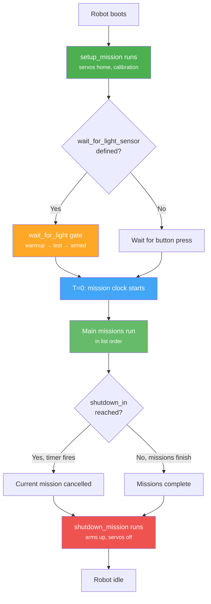

# Making Your Robot Competition Ready

At some point your robot stops being a development toy and has to survive on a real table, in front of real judges, with no laptop tethered to it. Competition mode is different from running from the Web IDE or with `raccoon run`: the robot has to start on a **light signal**, it has to **stop itself after 120 seconds** without anyone pressing a key, and it has to do it reliably whether the Wi-Fi works or not.

This page walks you through the three things you need to turn your development robot into a competition robot:

1. **Wait-for-light** — starting the robot from the competition start lamp
2. **`shutdown_in`** — the automatic emergency stop timer
3. **The shutdown mission** — the safe cleanup that runs when time is up

Each of these is opt-in. Without them, your robot still works — it just won't be legal at competition.

## The Competition Flow

Before touching any config, it helps to understand what the framework does on your behalf when everything is wired up correctly. This is what happens from the moment the robot boots at the table to the moment the match ends:



The three highlighted stages — the **wait-for-light gate**, the **`shutdown_in` timer**, and the **shutdown mission** — are the pieces you explicitly enable. Everything else (running the setup mission, starting the mission clock, executing missions in order) happens automatically.

## Wait for Light

Botball matches start when a lamp above the table turns on. The robot has to detect that lamp and begin its first main mission the instant the light fires — not a second later, not on a false trigger from the overhead ballroom lighting.

The full algorithm (Kalman filter, warmup, test mode, armed state) is covered in the **[Wait for Light algorithm page]()**. This section is just about *enabling* it for competition.

### Hardware: Mount the Sensor Downward

The framework's light-start algorithm expects the sensor to be mounted **facing down** at the table surface, with no black tape or shielding. When the start lamp fires above the robot, light reflects off the table and reaches the sensor. This mount is up to 76% less noisy than a horizontal mount, because the sensor's field of view is dominated by the table (a stable reflector) rather than by people moving around the venue.

Pick a spot on your chassis where:

- The sensor has a clear view of the table below it
- It isn't shaded by any mechanism that moves during the match
- It's over the starting area (not dangling off the edge)

### Definition: Name the Sensor Exactly

The framework looks up the start sensor **by name**. It has to be called exactly `wait_for_light_sensor` in your hardware config — not `start_sensor`, not `light_sensor_1`, not anything else. The pre-start gate finds it by attribute name on your `Defs` class.

In `config/hardware.yml` (included from `raccoon.project.yml`):

```yaml
definitions:
  button:
    type: DigitalSensor
    port: 10
  wait_for_light_sensor:        # Exact name required
    type: AnalogSensor
    port: 2
  # ... other sensors
```

Once this entry exists and the code is regenerated, the framework automatically inserts the light-start gate between your setup mission and your first main mission. You don't call `wait_for_light()` yourself — the framework does it.

> **Omitting the sensor:** If `wait_for_light_sensor` is not defined, the robot will fall back to starting on a physical button press. That's fine for development on your desk, but at competition you need the lamp signal — the judges won't let you touch the robot after placing it.

### Exclude It from Calibration

The wait-for-light sensor is usually a raw light-dependent resistor or photodiode pointed at the table — not an IR line sensor. It doesn't need the black-vs-white threshold that `calibrate()` computes for line sensors. Exclude it explicitly:

```python
seq([
    Defs.arm.up(),
    Defs.claw.closed(),
    calibrate(distance_cm=50, exclude_ir_sensors=[
        Defs.wait_for_light_sensor,
    ]),
])
```

If you forget this, `calibrate()` will try to find a black/white threshold for the downward-facing sensor, which never sees a black line — it will either pick nonsense values or slow the calibration down waiting for a transition.

### Using It at the Table

Because the gate runs automatically, the workflow on match day is:

1. Power on the robot. The setup mission runs — servos move to their home positions, calibration completes.
2. The UI enters **warmup** — the Kalman filter is building its baseline of ambient light (about 1 second).
3. The UI enters **test mode** — cover/uncover the sensor, or toggle a flashlight above it, to verify detection works. The test counter ticks up on each successful trigger. **The robot will not start during test mode**, so you can freely experiment.
4. Once you see successful triggers, press the button. The gate transitions to **armed**. A small "needs clear" gate prevents an immediate false start if the lamp is still on.
5. Place the robot in its start position and step back.
6. The judge turns on the start lamp. The gate fires, the mission clock starts at T=0, and your first main mission begins.

If the test mode never triggers, something is wrong: the sensor isn't seeing the lamp, the `drop_fraction` is too high, or the sensor is shielded. **Fix it in test mode, not in the armed state.** That's what test mode exists for.

### Manually Tuning Sensitivity

The defaults work for most setups. If your venue has dim overhead lighting or the start lamp is unusually weak, you may need to make the detector more sensitive. This is done by calling `wait_for_light()` manually with custom parameters — but you only need this if the automatic gate isn't detecting the lamp.

```python
# More sensitive — triggers on a 10% drop instead of 15%
wait_for_light(Defs.wait_for_light_sensor, drop_fraction=0.10, confirm_count=2)
```

See the **[Wait for Light algorithm page]()** for the full parameter reference.

## The `shutdown_in` Timer

Every Botball match has a hard time limit. If your robot is still driving when the clock hits zero, you can knock over your own scoring, hit the partner robot, or damage the game elements. The rules require the robot to stop on its own.

The framework enforces this with a single config value: `shutdown_in`.

### Enabling It

`shutdown_in` lives in `config/robot.yml`:

```yaml
shutdown_in: 120      # seconds
```

That's all you need. The framework arms a timer the moment the mission clock starts (after the wait-for-light gate fires) and when the timer expires, **it cancels whatever mission is currently running and jumps straight to the shutdown mission**. The mission code doesn't need to check the clock — the cancellation happens automatically at the next `await` point, cleanly, without leaving motors spinning.

### Choosing a Value

For standard Botball matches, `120` is the right number — it matches the 2-minute match length. Some tournaments run shorter or longer matches; check your specific event's rules.

| Value | Meaning |
|-------|---------|
| `120` | Standard Botball match length (2 minutes) |
| `60` | Short-format or timed practice runs |
| `0` | **Disabled** — the robot runs until missions finish or you power it off. Only use during development. |

Setting `shutdown_in: 0` is useful when you're debugging a long-running mission on your bench and don't want the timer to kill it mid-test. **Never leave it at 0 when you travel to competition** — a forgotten zero is the kind of mistake that ends a match with a disqualification.

### Why It's Cooperative, Not Forcible

The shutdown timer relies on the single-threaded asyncio model (see **[Advanced Topics → No Threads]()**). When the timer fires, the framework cancels the running mission's asyncio task. Because every step yields control at its `await` points, the cancellation propagates within a few milliseconds — no motor is left spinning, no half-finished operation corrupts state.

This is **why you must never use `time.sleep()` or block the event loop** in custom steps. If a step doesn't yield, the cancellation can't propagate, and the shutdown timer can't actually stop the robot. The 120-second timer depends on cooperative scheduling to work at all. A single synchronous `time.sleep(5)` in your code means 5 seconds of the shutdown timer being unable to fire.

## The Shutdown Mission

When the timer fires, the framework hands control to a special mission — the **shutdown mission**. Its job is to leave the robot in a safe state: arms up, claws off motors, no limbs sticking into other robots' paths.

### Writing One

A shutdown mission is just a regular `Mission` subclass with a short, safe sequence:

```python
from raccoon import *
from src.hardware.defs import Defs


class M99ShutdownMission(Mission):
    def sequence(self) -> Sequential:
        return seq([
            # Lift anything that could snag another robot
            Defs.arm.up(),
            Defs.claw.open(),

            # Release all servo holding torque
            fully_disable_servos(),
        ])
```

Rules of thumb for shutdown missions:

- **Keep it short.** There's no hard time limit after the main timer expires, but long shutdown missions are a code smell — if you need 30 seconds of recovery, something is wrong with your main mission.
- **No driving.** Do not add `drive_forward()` or similar to the shutdown mission. If the main timer fires while you're mid-drive, the last thing you want is *more* driving.
- **No sensor waits.** Don't use `wait_for_digital()` or any blocking condition — if the sensor never fires, the shutdown mission hangs forever.
- **`fully_disable_servos()` at the end.** This removes holding torque so servos don't burn out if the robot sits there waiting for someone to retrieve it.

### Registering It

In `config/missions.yml`:

```yaml
- M00SetupMission: setup
- M99ShutdownMission: shutdown
- M01DriveToConeMission
- M02CollectConeMission
```

The tag `shutdown` is what makes it a shutdown mission. Only one shutdown mission is allowed per robot — if you list multiple, the last one wins. If you don't list one at all, **no shutdown cleanup runs when the timer fires** — the current mission is simply cancelled and the robot goes idle with whatever state the cancellation left it in. This is usually fine (the cancellation already stops motors), but you won't get the "arms up" safety.

## The Competition-Ready Checklist

Before you travel, walk through this list once. Every item here is something we've seen teams forget at the table.

### Hardware Config

- [ ] `wait_for_light_sensor` is defined in `config/hardware.yml` with the **exact** name.
- [ ] The sensor is physically mounted **facing down** and isn't shadowed by any moving part.
- [ ] The sensor is excluded from `calibrate(..., exclude_ir_sensors=[...])`.
- [ ] `button` is defined and physically reachable for the test-mode → armed transition.

### Robot Config

- [ ] `shutdown_in: 120` in `config/robot.yml` (or your event's match length).
- [ ] `shutdown_in` is **not** `0`.

### Missions

- [ ] `SetupMission: setup` is listed first in `config/missions.yml`.
- [ ] A `ShutdownMission: shutdown` is listed.
- [ ] The shutdown mission has no drive steps, no sensor waits, and ends with `fully_disable_servos()`.
- [ ] Main missions are listed in the order you want them to execute.

### Testing on the Bench

- [ ] Run the full program from `raccoon run`. The setup mission finishes, then the UI enters warmup → test mode.
- [ ] Cover and uncover the light sensor (or shine a flashlight above it). The test counter should tick up on every trigger. If it doesn't, fix the sensor position or lower `drop_fraction`.
- [ ] Press the button. The UI should transition to "armed".
- [ ] Simulate the start light (flashlight works). The main missions should start immediately.
- [ ] Let the program run to completion. Verify the shutdown mission runs after the main missions finish.
- [ ] Now run it again, but this time set `shutdown_in: 10` temporarily and confirm the shutdown mission fires when the timer expires mid-mission. **Put it back to 120 before traveling.**

### At the Table

- [ ] Power on the robot. Setup mission runs.
- [ ] Test mode activates. Test the light detection from the actual starting position, with the actual lamp — **not** with a flashlight. Ambient lighting at the venue is different from your workshop.
- [ ] Confirm at least 2–3 successful test triggers before arming.
- [ ] Press the button to arm. Do not touch the robot again.
- [ ] Match starts. The robot runs. 120 seconds later, the shutdown mission fires and the robot safes itself.

## Related Topics

- **[Wait for Light algorithm]()** — the Kalman filter, warmup, test mode, and armed state in detail.
- **[Advanced Topics → Async Execution Model]()** — why the `shutdown_in` timer depends on cooperative scheduling.
- **[Synchronizing Two Robots]()** — the mission clock that `shutdown_in` counts against is the same clock that `wait_for_checkpoint()` uses.
- **[Configuration Reference → `shutdown_in`]()** — the full config schema entry.
