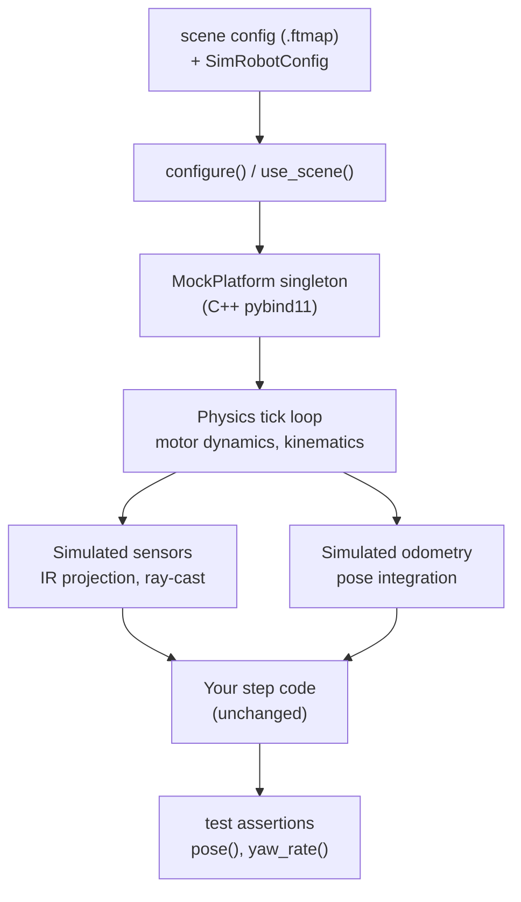

# Simulator And Testing

## Concept: What the Simulator Is (and Isn't)

The raccoon simulator is a **physics-backed mock HAL**. It replaces the hardware abstraction layer (motors, encoders, analog sensors, IMU) with simulated equivalents driven by a C++ physics engine. Your mission code and step code run completely unchanged — the same `drive_forward(30)` that drives a real robot drives the simulated robot. The simulator doesn't know or care that it's being tested.

What the simulator **does model:**
- Differential and mecanum drivetrain kinematics
- Motor dynamics (first-order time constant, back-EMF feedback)
- IR line sensors: computes readings by projecting sensor positions onto the scene geometry
- Distance sensors: ray-cast against scene walls
- Odometry: integrates simulated wheel velocities exactly as the hardware odometry does

What the simulator **does not model:**
- IMU noise, gyroscope drift, or heading error — heading in the sim is perfect
- Servo dynamics or load — servos reach their target instantly
- Battery voltage sag, motor heating, or mechanical slop
- Camera or time-of-flight sensors
- Physical collisions that affect the robot's trajectory (walls stop the robot but don't impart realistic forces)

The simulator is most useful for **unit-testing motion primitives**, verifying that a drive step travels roughly the right distance, and regression-testing odometry. It is not a substitute for real-robot tuning of PID gains.



The raccoon stack ships a real simulator and a real pytest integration layer. You can write tests that run your robot code against a simulated table map and verify position, sensor readings, and motion behavior — without a physical robot.

This page covers the full `raccoon.testing.sim` API, all pytest fixtures, the bundled scenes, and patterns for writing effective simulator tests.

## Architecture Overview

There are three distinct layers:

- **`raccoon.sim`** (C++ pybind11 bindings) — the core simulator: physics, collision, sensor projection. This is the low-level layer.
- **`raccoon.testing.sim`** — high-level Python API wrapping `raccoon.sim` with ergonomic helpers for configuring the sim, reading state, and advancing time.
- **`raccoon.testing.pytest_plugin`** — auto-loaded pytest plugin that exposes fixtures. No conftest.py boilerplate needed.

> **Deprecation note:** Historically the testing API was accessible at `raccoon.step.sim`. That path remains as a deprecation shim and will be removed in a future release. Always import from `raccoon.testing.sim`.

## Build Requirement

Sim-backed tests only work when `raccoon` was built with the mock driver bundle:

```bash
pip install -e . --config-settings=cmake.define.DRIVER_BUNDLE=mock
```

The plugin checks this at startup. If the installed wheel was not built with mock support, all simulator fixtures are automatically skipped with a clear message. You do not need to mark your tests — the skip is unconditional and explains how to fix the build.

## Pytest Fixtures

The plugin provides five fixtures. Three cover the common test pattern; two provide project metadata and configuration overrides.

### `robot` — Project Robot Instance

Instantiates the project's generated `src.hardware.robot.Robot` class backed by the mock HAL. Function-scoped — a fresh instance per test so mutable state (calibration caches, motion history) does not leak between tests.

Skips with a helpful message if `raccoon.sim.mock` is not available.

### `scene` — Scene Factory

A callable factory that enters a `use_scene` context for the duration of the current test. Call it once per test to attach a map and set the robot's starting pose:

```python
def test_drives_30cm(robot, scene, run_step):
    scene("empty_table.ftmap", start=(20, 50, 0))
    run_step(drive_forward(cm=30), robot)
    ...
```

The scene is automatically detached at the end of the test. Calling `scene` twice in one test replaces the previous scene.

`scene` accepts:
- A bare scene name (resolved against project scenes dir, then bundled scenes)
- A keyword `start=(x, y, theta)` tuple — position in cm, heading in radians
- An optional `robot=SimRobotConfig` override to use geometry other than the project default
- `auto_tick=True/False` — whether sim time advances automatically with wall time (default: `True`)
- `auto_tick_max_step_sec` — maximum time step for auto-tick (default: `0.05` s)

### `run_step` — Synchronous Step Runner

A synchronous wrapper that awaits `step.run_step(robot)` with a configurable timeout. Tests stay synchronous — no `pytest-asyncio` dependency needed for the common case.

```python
def test_turn(robot, scene, run_step):
    scene("empty_table.ftmap", start=(100, 50, 0))
    run_step(turn_left(90), robot)
    p = pose()
    assert abs(p.theta - math.pi / 2) < 0.05
```

`run_step(step, robot, timeout=10.0)` — the default timeout is 10 seconds. If the step does not complete within the timeout, `asyncio.TimeoutError` is raised. Increase the timeout for long-running steps.

If you need multiple awaits sharing one event loop, write the test as `async def` with `pytest-asyncio` — `run_step` is the simple path for the common one-step-per-test case.

### `project_info` — Session-Scoped Project Metadata

Session-scoped. Discovers and returns a `ProjectInfo` object containing:
- `root` — the project's root `Path` (where `raccoon.project.yml` lives)
- `sim_config` — a `SimRobotConfig` derived from the project's YAML, matching the robot's hardware geometry

This fixture fails with a clear error if the test is not run from inside a raccoon project directory. It is available automatically — you rarely need to request it directly, but it underpins the other fixtures.

### `robot_sim_config` — Per-Test Geometry Override

Function-scoped. Returns a fresh copy of `project_info.sim_config` that you can mutate per test. Use it to attach sensors or modify geometry without affecting other tests:

```python
def test_with_line_sensor(robot_sim_config, robot, scene, run_step):
    # Add a line sensor to the sim before the scene is attached
    robot_sim_config.line_sensors.append(
        LineSensorMount(analog_port=2, forward_cm=9.0, strafe_cm=0.0, name="front_ir")
    )
    scene("single_line.ftmap", start=(50, 30, 0), robot=robot_sim_config)
    run_step(drive_forward(cm=30), robot)
    ...
```

The `scene` fixture picks up `robot_sim_config` automatically if you do not pass `robot=` explicitly. Mutate it before calling `scene`.

## The `raccoon.testing.sim` API

These are the functions and classes you import directly when writing tests. All are exported from `raccoon.testing.sim`.

### `configure(scene, *, robot=None, start=(0,0,0), auto_tick=True, auto_tick_max_step_sec=0.05)`

Attach a fresh simulator to the MockPlatform singleton. After this call:
- Motor commands issued through any HAL `Motor` drive the simulated chassis
- `OdometryBridge::readOdometry` reports simulated pose
- Sensor reads return simulated values based on the scene geometry

`scene` can be a bare name string (resolved via the same lookup as the `scene` fixture) or an absolute `Path`.

`robot` is a `SimRobotConfig`. If `None`, a default `SimRobotConfig()` is used (18×18 cm differential drive matching a typical Botball wombat).

`auto_tick=True` means the simulator advances its physics with wall time automatically. Set `auto_tick=False` and call `tick(dt)` manually for fully deterministic tests that must not depend on wall-clock timing.

### `detach()`

Disconnect any attached simulator. The mock HAL returns to reporting zero odometry and no sensor readings. Call this in test teardown when using `configure`/`detach` manually (the `use_scene` context manager handles this automatically).

### `use_scene(scene, *, robot=None, start=(0,0,0), auto_tick=True, auto_tick_max_step_sec=0.05)`

Context manager version of `configure`/`detach`. The sim is attached for the duration of the `with` block and detached on exit, even if an exception is raised.

```python
from raccoon.testing.sim import use_scene, pose
import pytest

def test_drives_to_wall():
    with use_scene("wall_box.ftmap", start=(50, 50, 0)):
        # run test code here
        result_pose = pose()
        assert result_pose.x == pytest.approx(50.0, abs=2.0)
```

### `pose()` → `Pose2D`

Returns the simulator's current ground-truth pose. This is the "true" position the physics engine knows about — not the odometry estimate the robot code computes. It is ideal for test assertions.

`Pose2D` has three fields:
- `x` — position in cm (positive = right in world coordinates)
- `y` — position in cm (positive = up / forward in world coordinates)
- `theta` — heading in radians (0 = facing right, positive = counter-clockwise)

```python
from raccoon.testing.sim import pose

p = pose()
assert p.x == pytest.approx(80.0, abs=2.0)
assert p.y == pytest.approx(50.0, abs=2.0)
```

### `yaw_rate()` → `float`

Returns the simulator's current angular velocity in rad/s. Useful for asserting that a turn step has the expected rate or that the robot has stopped rotating.

### `tick(dt_seconds)`

Manually advance the simulation by `dt_seconds`. Only meaningful when `auto_tick=False`. Use this for fully deterministic tests — you control the exact time steps so results don't depend on the host machine's scheduler:

```python
from raccoon.testing.sim import configure, detach, tick, pose

def test_deterministic():
    configure("empty_table.ftmap", auto_tick=False, start=(0, 50, 0))
    try:
        for _ in range(100):
            tick(0.01)   # 100 × 10 ms = 1 second of physics
        p = pose()
        assert p.x == pytest.approx(expected_x, abs=1.0)
    finally:
        detach()
```

## Configuring the Simulator Robot Geometry

`SimRobotConfig` is a dataclass that describes the robot's physical properties to the simulator. Its defaults match a typical Botball wombat with a differential drivetrain. Override only the fields that differ on your robot — they must agree with whatever `Drive` / `DifferentialKinematics` / `MecanumKinematics` were constructed with, so the sim physics matches what the motion controllers expect.

```python
from raccoon.testing.sim import SimRobotConfig, LineSensorMount, DistanceSensorMount
```

### Chassis Geometry

| Field | Default | Description |
|-------|---------|-------------|
| `width_cm` | `18.0` | Robot width in cm |
| `length_cm` | `18.0` | Robot length in cm |
| `rotation_center_forward_cm` | `0.0` | Rotation center offset from geometric center, forward axis |
| `rotation_center_strafe_cm` | `0.0` | Rotation center offset from geometric center, lateral axis |
| `wheel_radius_m` | `0.03` | Wheel radius in meters |
| `track_width_m` | `0.15` | Distance between left and right wheels in meters |
| `wheelbase_m` | `0.15` | Wheelbase (front/rear wheel spacing) in meters |

### Drivetrain

| Field | Default | Description |
|-------|---------|-------------|
| `drivetrain` | `"diff"` | `"diff"` for differential drive, `"mecanum"` for mecanum |
| `left_motor_port` | `0` | Motor port for left wheel (diff only) |
| `right_motor_port` | `1` | Motor port for right wheel (diff only) |
| `left_motor_inverted` | `False` | Invert left motor direction (diff only) |
| `right_motor_inverted` | `False` | Invert right motor direction (diff only) |
| `fl/fr/bl/br_motor_port` | `0/1/2/3` | Motor ports for mecanum front-left/front-right/back-left/back-right |
| `fl/fr/bl/br_motor_inverted` | `False` | Motor inversion per wheel (mecanum) |

### Motor Physics

| Field | Default | Description |
|-------|---------|-------------|
| `max_wheel_velocity_rad_s` | `30.0` | Maximum wheel angular velocity in rad/s |
| `motor_time_constant_sec` | `0.05` | Motor first-order time constant (lag), in seconds |
| `ticks_to_rad` | `2π/1440` | Encoder ticks to radians conversion factor |
| `motor_calibration_by_port` | `{}` | Per-port (gain, offset) tuples for motor linearization |

### Simulation Fidelity Knobs

These parameters add physical effects to make the sim more realistic. All default to `0.0` (ideal, no friction or noise):

| Field | Default | Description |
|-------|---------|-------------|
| `viscous_drag_coeff` | `0.0` | Velocity-proportional drag on wheel motion |
| `coulomb_friction_rad_s2` | `0.0` | Constant friction opposing motion (deadband) |
| `bemf_noise_stddev` | `0.0` | Standard deviation of Gaussian noise added to back-EMF velocity feedback |

Tune these if your sim-vs-real accuracy is poor. Start with `viscous_drag_coeff` (typically 0.02–0.1 for a real robot) and `motor_time_constant_sec` (0.05–0.15 depending on motor specs).

### Attaching Sensors

Add sensors to the sim by populating `line_sensors` and `distance_sensors` on your `SimRobotConfig`. Sensors are positioned in robot-local coordinates (`forward_cm` along the heading axis, `strafe_cm` laterally).

#### `LineSensorMount`

Simulates an IR line sensor that reads scene line geometry:

```python
LineSensorMount(
    analog_port=2,       # HAL analog port the sensor is wired to
    forward_cm=9.0,      # Position forward from rotation center
    strafe_cm=0.0,       # Position left (negative) or right (positive)
    name="front_ir",     # Optional label for debugging
)
```

#### `DistanceSensorMount`

Simulates a distance sensor (e.g. IR rangefinder) that raycasts against scene walls:

```python
DistanceSensorMount(
    analog_port=3,
    forward_cm=9.0,       # Position on the chassis
    strafe_cm=0.0,
    mount_angle_rad=0.0,  # Pointing direction relative to robot heading (0 = forward)
    max_range_cm=100.0,   # Maximum sensing range
    name="front_dist",
)
```

### Example: Full Custom Config

```python
from raccoon.testing.sim import SimRobotConfig, LineSensorMount, DistanceSensorMount

cfg = SimRobotConfig(
    width_cm=20.0,
    length_cm=22.0,
    wheel_radius_m=0.034,
    track_width_m=0.16,
    motor_time_constant_sec=0.08,
    viscous_drag_coeff=0.03,
    line_sensors=[
        LineSensorMount(analog_port=2, forward_cm=10.0, strafe_cm=-4.0, name="left_ir"),
        LineSensorMount(analog_port=3, forward_cm=10.0, strafe_cm=4.0, name="right_ir"),
    ],
    distance_sensors=[
        DistanceSensorMount(analog_port=4, forward_cm=11.0, strafe_cm=0.0, name="front_dist"),
    ],
)
```

## Bundled Reference Scenes

The raccoon wheel ships three ready-to-use `.ftmap` scenes:

| Scene | Dimensions | Contents | Use for |
|-------|-----------|----------|---------|
| `empty_table.ftmap` | 200×100 cm | No lines or obstacles | Drive/turn smoke tests, basic odometry checks |
| `single_line.ftmap` | 200×100 cm | One horizontal black line across the middle | Line following, lineup, sensor tests |
| `wall_box.ftmap` | **100×100 cm** | A box of internal walls (four segments forming a 40×40 cm square at the center) | Collision detection, wall alignment tests |

> **Note:** `wall_box.ftmap` is a 100×100 cm table — **half the size** of the other two bundled scenes (200×100 cm). The scene coordinate range is different. Double-check your start position when using this scene.

## Scene Resolution

Scene names are resolved in this order:

1. **Absolute path** — if the name is an absolute path and the file exists, use it directly
2. **`<project>/scenes/<name>`** — project-local scenes override bundled ones
3. **Bundled package scenes** — scenes shipped with the raccoon wheel

This means you can shadow a bundled scene by dropping a file with the same name into your project's `scenes/` directory.

## Test Structure Expectations

The pytest plugin requires the toolchain-generated project layout:

- `raccoon.project.yml` at the project root (used to discover the project)
- `src/hardware/robot.py` with a `Robot` class
- `src/hardware/defs.py` with a `Defs` class

Run pytest from the project root directory. The plugin adds the root to `sys.path` automatically if it is not already there.

## Debugging

### `RACCOON_TESTING_NO_EXIT_SHORTCUT=1`

By default, when the mock driver bundle is loaded, the plugin calls `os._exit(exitstatus)` at the end of the test session. This bypasses the normal interpreter shutdown to avoid a known segfault in the pybind11 MockPlatform singleton's destruction ordering.

If you are debugging test-session teardown and need the normal interpreter shutdown (e.g. to run teardown hooks or check for resource leaks), set:

```bash
RACCOON_TESTING_NO_EXIT_SHORTCUT=1 pytest
```

This disables the shortcut. Be aware that the segfault may occur in this mode — it is harmless (just an ugly error at the very end) but can confuse CI systems that treat any crash as a failure.

## Complete Example

```python
import math
import pytest
from raccoon import drive_forward, turn_left, LineSide
from raccoon.testing.sim import (
    LineSensorMount,
    SimRobotConfig,
    pose,
    use_scene,
)


def test_drives_30cm_forward(robot, scene, run_step):
    """Robot starts at (20, 50) heading right; after driving 30 cm it should be near x=50."""
    scene("empty_table.ftmap", start=(20, 50, 0))
    run_step(drive_forward(cm=30), robot)
    p = pose()
    assert p.x == pytest.approx(50.0, abs=2.0)
    assert p.y == pytest.approx(50.0, abs=2.0)


def test_turn_90_degrees(robot, scene, run_step):
    """After a left turn the heading should be ~pi/2."""
    scene("empty_table.ftmap", start=(100, 50, 0))
    run_step(turn_left(90), robot)
    assert abs(pose().theta - math.pi / 2) < 0.05


def test_with_custom_geometry(robot_sim_config, robot, scene, run_step):
    """Override sim geometry per-test by mutating robot_sim_config."""
    robot_sim_config.line_sensors.append(
        LineSensorMount(analog_port=2, forward_cm=9.0, strafe_cm=0.0)
    )
    scene("single_line.ftmap", start=(50, 25, 0))
    run_step(drive_forward(cm=30), robot)
    p = pose()
    assert p.y == pytest.approx(55.0, abs=3.0)
```
