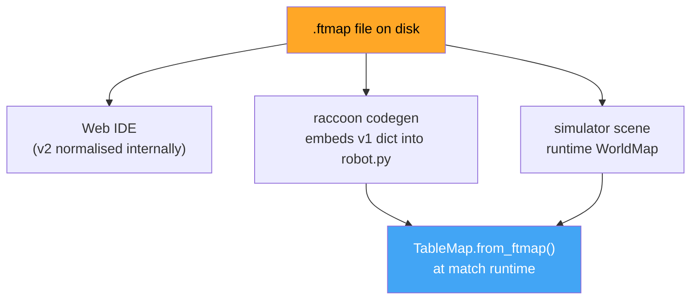

# Table Maps

## Concept: What a Table Map Is and Why It Exists

A **table map** describes the static geometry of the game table: where the black lines are, where the walls are, and the table dimensions. This geometry is used in three distinct places in RaccoonOS:

1. **Runtime sensor simulation:** The IR sensor model reads the map to compute what an IR sensor would see at a given robot position. When localisation or the simulator evaluates `is_on_line()`, it queries the map.
2. **Simulator scenes:** The sim physics engine loads the map as its collision and sensor geometry source.
3. **Localization:** The extended Kalman filter uses map line features as landmarks to correct odometry drift.

`.ftmap` is the shared file format that feeds all three consumers. Understanding the format — and its limitations — matters when you author maps in the Web IDE and need them to work at runtime.



The important part is that not every consumer speaks the exact same shape today. An IDE-saved v2 map will not load directly into the runtime `TableMap.from_ftmap()` binding. Read the compatibility section before moving maps between environments.

`.ftmap` is a real data contract, not just an editor export format.

It sits at the intersection of:

- runtime table geometry (`WorldMap`, exposed in Python as `TableMap`)
- simulator scenes
- localization
- code generation
- Web IDE map editing

The important part is that not every consumer speaks the exact same shape today.

## Canonical runtime types

The runtime geometry implementation is:

- `WorldMap`
- `MapSegment`

Python exposes `WorldMap` as `TableMap`.

Source of truth:

- [WorldMap.hpp](/media/tobias/TobiasSSD/projects/Botball/raccoon/raccoon-lib/modules/libstp-map/include/libstp/map/WorldMap.hpp)
- [map.cpp](/media/tobias/TobiasSSD/projects/Botball/raccoon/raccoon-lib/modules/libstp-map/bindings/map.cpp)

## Runtime `.ftmap` format: v1

The current runtime binding validates:

- `format == "flowchart-table-map"`
- `version == 1`

The accepted in-memory shape is:

```json
{
  "format": "flowchart-table-map",
  "version": 1,
  "table": { "widthCm": 200, "heightCm": 100 },
  "lines": [
    {
      "kind": "line",
      "startX": 50,
      "startY": 50,
      "endX": 150,
      "endY": 50,
      "widthCm": 1.5
    },
    {
      "kind": "wall",
      "startX": 0,
      "startY": 0,
      "endX": 0,
      "endY": 100,
      "widthCm": 0
    }
  ]
}
```

Field meanings:

- `table.widthCm`, `table.heightCm`: table bounds in cm
- `lines[]`: all authored segments
- `kind`: `"line"` or `"wall"`
- `startX/startY/endX/endY`: segment endpoints
- `widthCm`: line thickness or wall thickness

The bindings default missing `kind` to `"line"` when building from Python dicts.

## Coordinate convention split

This is the detail people usually miss:

- on-disk `.ftmap` coordinates use **top-left origin** (Y increases downward — screen convention)
- in-memory `WorldMap` uses **bottom-left origin**, `+X` right, `+Y` up (math convention)

The loader flips Y on ingest (`y_runtime = table_height - y_disk`) so runtime math stays in standard bottom-up field coordinates.

```
On-disk (.ftmap file)          In-memory (WorldMap / TableMap)
┌──────────────────────┐       ┌──────────────────────┐
│(0,0)          (200,0)│       │(0,100)      (200,100)│
│  +X →                │       │  +Y ↑                │
│  +Y ↓                │       │                      │
│                      │       │  +X →                │
│(0,100)      (200,100)│       │(0,0)          (200,0)│
└──────────────────────┘       └──────────────────────┘
```

That is not an implementation accident; it is explicitly documented in the C++ header and in the bundled scene README.

> **Practical consequence:** When you place a line at `startY: 75` in a 100 cm tall `.ftmap`, it appears at `y=25` in runtime coordinates. Robot positions and sensor offsets use the runtime (bottom-left) convention. If your localization drift looks mirrored, check which coordinate system you measured from.

## Runtime map queries

`TableMap` is not just a bag of segments. The runtime binding exposes geometric queries used by sensors and localization:

- `is_on_line`
- `is_on_black_line`
- `is_on_wall`
- `distance_to_nearest_line`
- `distance_to_nearest_wall`
- `sensor_field_position`
- `sensor_is_on_line`
- `sensor_is_on_wall`

It also exposes:

- `segments()`
- `lines()`
- `walls()`
- `all_segments`

Important nuance:

- `walls()` includes synthesized table-border walls
- `all_segments` contains authored segments only

## Sensor projection convention

Sensor offsets use robot-local coordinates:

- `forward_cm`: along robot heading
- `strafe_cm`: 90 degrees CCW from heading

That means positive `strafe_cm` is robot-left in the map module.

This is intentionally preserved bit-for-bit with the earlier Python `table_map` behavior so localization and sensor code do not drift.

## IDE/editor format: v2

The Web IDE frontend already has a richer persistent format:

- same `format: "flowchart-table-map"`
- `version: 2`
- `layers[]`
- `transitions[]`
- optional `activeLayerId`

The v2 shape supports:

- stacked layers
- named layers with optional `zCm`
- transitions/ramps/portals between layers

This is defined in:

- [http-service.ts](/media/tobias/TobiasSSD/projects/Botball/raccoon/toolchain/web-ide/src/app/services/http-service.ts)

## Important compatibility reality

Today:

- runtime `WorldMap` binding accepts v1
- Web IDE accepts v1 and v2, then normalizes to v2 internally
- IDE backend also normalizes maps to v2

So "the IDE can edit it" does **not** automatically mean "the runtime `TableMap.from_ftmap(...)` binding accepts the exact same structure."

That split must be kept in mind when moving maps between:

- editor persistence
- project YAML
- simulator materialization
- runtime table map construction

## Codegen behavior

`robot.physical.table_map` may be either:

- a file path string
- an inline map object

During local codegen:

- if `table_map` is a string, the CLI loads the `.ftmap` file with `json.load`
- replaces the path with the parsed object
- then emits `TableMap.from_ftmap(...)` into generated robot code

That means codegen expects the runtime-consumable dict shape by the time the generator runs.

If a path was not resolved to a dict, codegen treats that as an error.

## Project config implications

This is the practical contract:

- file-path form is convenient for authored map files
- generated runtime code receives an inline dict
- runtime `TableMap.from_ftmap(...)` is the final constructor

So if you are debugging a project map issue, check all three layers:

1. the `.ftmap` file on disk
2. the normalized/embedded `robot.physical.table_map`
3. the runtime binding's expected format version

## Using Your Game Table Map in a Project

In `config/robot.yml`, reference your `.ftmap` file as a path:

```yaml
physical:
  width_cm: 23.5
  length_cm: 26
  table_map: config/2026-game-table.ftmap   # relative to project root
  rotation_center:
    x_cm: 11.75
    y_cm: 13.0
```

During `raccoon codegen`, the CLI loads the `.ftmap` file, converts it to a v1 runtime dict, and embeds it as a literal in the generated `robot.py`. The robot binary then constructs `TableMap.from_ftmap(...)` from that embedded dict at startup.

Because the map is embedded at codegen time, **you must re-run `raccoon codegen` after editing the `.ftmap` file** for the change to take effect on the robot. Transferring only the `.ftmap` file to the Pi without regenerating will have no effect.

> **Authoring workflow:** Edit the `.ftmap` in the Web IDE. Save it to `config/2026-game-table.ftmap`. Run `raccoon codegen`. Deploy. The embedded map in `robot.py` now matches your edits.

## Bundled scenes

The scene fixtures in `raccoon-lib/scenes/` are v1 format and are the reference files for the runtime schema:

| Scene | Table dimensions | Contents |
|-------|-----------------|----------|
| `empty_table.ftmap` | 200×100 cm | No lines or obstacles |
| `single_line.ftmap` | 200×100 cm | One 1.5 cm wide horizontal line across the middle |
| `wall_box.ftmap` | **100×100 cm** | Four wall segments forming a 40×40 cm box at the center |

> **`wall_box.ftmap` is 100×100 cm**, not 200×100 like the other two bundled scenes. When writing sim tests using this scene, use start positions within the 0–100 cm range on both axes or the robot will start outside the table boundary.

## What still matters for future cleanup

The ecosystem is in a transitional state:

- runtime map binding is still v1-oriented
- IDE/editor persistence is already v2-oriented

So any future "map format" change must answer a concrete question first:

- is this a runtime compatibility change
- an editor-storage change
- or only an IDE-side normalization change

If those are not kept separate, table-map bugs become very hard to diagnose.
