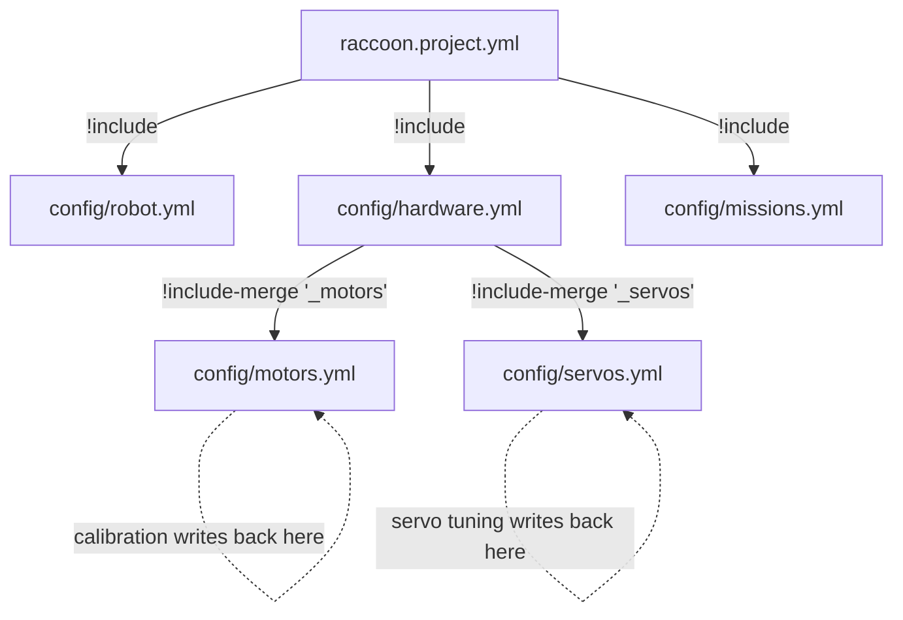

# YAML Includes

## Concept: Why Config Is Split Across Files

RaccoonOS projects split configuration across several files not just for tidiness, but because **different tools own different files**:

- `raccoon.project.yml` — the root; references all sections via `!include`
- `config/robot.yml` — motion PID, kinematics, shutdown timer; edited by the IDE PID tuner
- `config/hardware.yml` — sensor, motor, servo definitions; the codegen reads this to generate `defs.py`
- `config/motors.yml` / `config/servos.yml` — merged into `hardware.yml` via `!include-merge`; calibration steps write directly to these files
- `config/missions.yml` — mission order; the mission list editor writes here

The loader resolves the full tree transparently so your Python code can read `["definitions", "left_motor", "calibration", "ticks_to_rad"]` without caring which physical file stores it. The **write-back** system preserves ownership — a calibration update writes to `motors.yml`, not `raccoon.project.yml`, even though the read path went through the root.



Raccoon project configuration is not just split across files for convenience. The loader is explicitly include-aware, recursive, and write-aware.

This matters because tools like `raccoon wizard`, calibration steps, IDE routes, and programmatic config updates all rely on the same ownership rules.

Source of truth:

- [project_yaml.py](/media/tobias/TobiasSSD/projects/Botball/raccoon/raccoon-lib/python/raccoon/project_yaml.py)

## Two tags exist

### `!include`

`!include` delegates a value to another YAML file.

Example:

```yaml
robot: !include 'config/robot.yml'
missions: !include 'config/missions.yml'
definitions: !include 'config/hardware.yml'
connection: !include 'config/connection.yml'
```

Semantics:

- the included file replaces the tagged value
- resolution is recursive
- the included file may itself contain more `!include` or `!include-merge` tags

### `!include-merge`

`!include-merge` merges the *top-level keys* of another mapping into the parent mapping.

Example:

```yaml
button:
  type: DigitalSensor
  port: 10

_motors: !include-merge 'motors.yml'
_servos: !include-merge 'servos.yml'
```

Semantics:

- the merge key itself is not kept as a runtime config node
- the included file must resolve to a mapping
- its top-level keys are promoted into the parent mapping

That is why motors and servos appear at the same level as sensor definitions in the resolved `definitions:` map.

#### The Underscore-Prefix Convention

All competition projects use underscore-prefixed merge keys (`_motors`, `_servos`). This is a deliberate convention, not a requirement:

- the leading `_` signals "this key is a merge anchor, not a real hardware definition"
- it prevents confusion if someone scans the `definitions:` namespace — prefixed names stand out as structural keys
- the generated `defs.py` never references these merge keys; they dissolve at resolution time

If you omit the underscore (`motors: !include-merge 'motors.yml'`), the behavior is identical — but the key `motors` would be invisible in the resolved namespace (since `!include-merge` discards it), which can be confusing when reading the file later.

## Resolution depth

The include resolver is fully recursive and supports includes at any nesting depth.

That is not a documentation convention. It is implementation behavior in the library loader.

The resolver also has a recursion cap of **20 levels** to prevent infinite loops. Exceeding this depth raises an error during resolution.

## Read behavior

Read APIs such as `yaml_read(...)` and `read_project_value(...)` resolve through the include graph automatically.

That means callers can ask for a logical property path like:

```python
["robot", "motion_pid", "angular", "max_velocity"]
```

without caring which physical file owns that path.

## Write behavior

Writes are ownership-aware.

The key guarantee is:

- tools update the file that *owns* the target value
- unrelated include structure is preserved
- `!include` and `!include-merge` tags are written back as tags, not flattened away

This is why a calibration step can update `config/motors.yml` even when the caller asked for a path through `raccoon.project.yml`.

### Single-value write

```python
from raccoon.project_yaml import update_project_value

# Writes ticks_to_rad into the file that owns
# definitions.left_motor.calibration.ticks_to_rad
update_project_value(
    project_root,
    ["definitions", "left_motor", "calibration", "ticks_to_rad"],
    0.004363,
)
```

Returns `True` on success.

### Batch write (`yaml_write_many` / `update_project_values`)

When multiple config values need to be updated atomically — for example after a full calibration run — use the batch API. It groups all writes by the physical file that owns each path and performs one file round-trip per file, rather than one per value.

```python
from raccoon.project_yaml import update_project_values

# Atomically update multiple motor calibration keys.
# Values destined for the same physical file are written in a single pass.
update_project_values(project_root, {
    ("definitions", "left_motor", "calibration", "ticks_to_rad"): 0.004363,
    ("definitions", "left_motor", "calibration", "bemf_offset"): -0.0041,
    ("definitions", "right_motor", "calibration", "ticks_to_rad"): 0.004312,
    ("definitions", "right_motor", "calibration", "bemf_offset"): -0.0038,
})
```

The `updates` argument is a `dict[tuple[str, ...], Any]` — key paths as tuples. Returns `True` if all writes succeeded.

`update_project_values` is a thin wrapper around `yaml_write_many(project_root / "raccoon.project.yml", updates)`. If you already have the path to a different root file, call `yaml_write_many` directly:

```python
from raccoon.project_yaml import yaml_write_many
from pathlib import Path

yaml_write_many(Path("config/motors.yml"), {
    ("left_motor", "calibration", "static_friction_pct"): 3.2,
    ("right_motor", "calibration", "static_friction_pct"): 2.8,
})
```

## Why ordering matters

For humans, ordering is style.

For tooling, ownership is what matters:

- `raccoon.project.yml` owns top-level wiring
- `config/hardware.yml` owns the parent mapping for `definitions`
- `motors.yml` and `servos.yml` own the keys merged into `definitions`

If you move keys across files arbitrarily, the loader can still resolve them, but you lose the predictable “one concern per file” structure that the wizard, codegen, and docs assume.

## Practical rules

1. Keep top-level sections in `raccoon.project.yml` as `!include`s.
2. Keep hardware subgroups that naturally flatten into one namespace as `!include-merge`s.
3. Do not hand-flatten everything into one file unless you are prepared to own the maintenance cost.
4. If a tool writes a value to an unexpected file, check which file actually owns that path in the include graph.

## What this page is for

This page is intentionally more technical than the project-structure docs. It exists so advanced users can reason about:

- why write-back landed in a particular file
- why merged keys appear “as if they were local”
- how the IDE and calibration steps update split config safely

