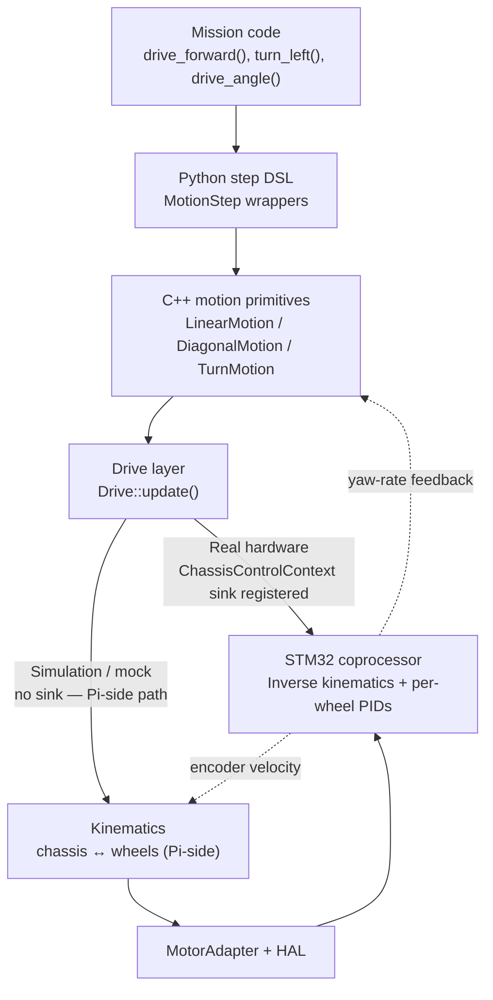

# Motion Flow and Kinematics

This page describes the actual control stack that turns a mission step into motor commands on the robot. The short version is:

1. Python mission code asks for a motion step.
2. The step layer creates a native motion controller with distance, heading, and constraint settings.
3. The motion controller generates chassis-space velocity targets (`vx`, `vy`, `wz`).
4. **On real hardware:** the drive layer forwards the chassis command directly to the STM32 via `ChassisControlContext`. The STM32 runs inverse kinematics and per-wheel velocity PIDs entirely on-MCU. The Pi-side control loop is bypassed.
5. **In simulation/mock:** the drive layer closes the velocity loop on the Pi using encoder-derived chassis velocity and IMU yaw rate, then the kinematics layer converts the corrected command into wheel angular velocities.
6. Motor adapters convert wheel targets into firmware-facing units and send them to the platform.

That separation is deliberate. Motion planning, drive control, wheel geometry, and hardware transport live in different layers so you can change one without rewriting the others.

## Layer Boundaries



## Chassis Coordinate System

All drive and kinematics code uses the same body-frame convention:

- `vx`: forward linear velocity in meters per second
- `vy`: lateral velocity in meters per second, positive to the robot's right
- `wz`: angular velocity in radians per second, positive counter-clockwise

If one part of your robot behaves mirrored, the problem is almost always motor wiring, motor inversion, or a bad geometry value, not a hidden sign flip in the motion stack.

## Motion Layer

The motion layer lives above the drivetrain. Its job is not to talk to wheels directly; its job is to decide what chassis velocity the robot should be trying to achieve right now.

The native motion primitives are:

- `LinearMotion` for straight or purely lateral travel
- `DiagonalMotion` for body-frame travel at an arbitrary angle
- `TurnMotion` for heading changes

Each primitive runs a trapezoidal profile and a profiled PID loop. The profile determines a feasible setpoint trajectory. The PID loop corrects toward that trajectory based on odometry and heading feedback.

The usual mission-facing factories such as `drive_forward`, `strafe_right`, `turn_left`, and `drive_angle` are just Python wrappers around those native controllers.

## Drive Layer

The drive layer accepts a desired chassis velocity and decides how to execute it. Its behaviour is fundamentally different between real hardware and simulation.

### Real Hardware: `ChassisControlContext` Bypass

On a real Wombat robot, the platform bundle registers a sink in `ChassisControlContext` at startup. When `Drive::update()` detects that sink, it **bypasses the entire Pi-side velocity control loop** and forwards the body-frame chassis velocity command (`vx, vy, wz`) directly to the STM32 coprocessor via that sink:

```cpp
// From drive.cpp
if (foundation::ChassisControlContext::instance().command(
        desired_.vx, desired_.vy, desired_.wz))
{
    return {};  // Pi does nothing further — STM32 owns the control loop
}
```

The STM32 then:
1. Applies the inverse kinematics matrix entirely on-MCU.
2. Runs per-wheel velocity PIDs in firmware.

This means on real hardware, **the Pi-side PID parameters for `vx`, `vy`, and `wz` have no effect on robot motion**. Tuning the drive controller configuration changes only the simulation/mock behaviour. The on-MCU loop runs at the STM32's control rate, not at the Pi's update rate.

### Simulation / Mock: Pi-Side Velocity PIDs

When no `ChassisControlContext` sink is registered (mock or simulator mode), execution falls through to the host-side control path. The drive layer runs three independent axis controllers:

- `vx` uses `kinematics.estimate_state().vx`
- `vy` uses `kinematics.estimate_state().vy`
- `wz` uses `imu.get_yaw_rate()`

Each axis uses the same control structure:

```text
u_ff  = kS * sign(ref) + kV * ref + kA * accel_ref
u_p   = kp * (ref - meas)
u_d   = -kd * filtered_meas_derivative
u_cmd = u_ff + u_p + ki * integral + u_d
```

Important current implementation details:

- `accel_ref` is currently `0.0`
- the controller output is not used as an actuator saturation limit
- the result is treated as a corrected chassis velocity command and passed to kinematics

The drive layer in simulation is a chassis-space velocity corrector; on real hardware it is a transparent forwarding layer to the STM32.

### Summary: Where the Loop Runs

| Environment | Pi-side PIDs | STM32-side PIDs | Who does inverse kinematics? |
|-------------|-------------|-----------------|------------------------------|
| Real hardware (Wombat) | **No-op** — bypassed | Yes — active | STM32 firmware |
| Mock / Simulator | Active | Not applicable | Pi (kinematics layer) |

## Kinematics Layer

Kinematics is where robot geometry becomes math. It performs two transforms:

- inverse kinematics: chassis command to wheel angular velocities
- forward kinematics: wheel angular velocities back to estimated chassis velocity

This layer does not plan paths and does not estimate world pose. It stays in robot-local chassis space.

### Differential Drive Math

Parameters:

- `wheel_radius` in meters
- `wheelbase` in meters, measured between the left and right wheel centers

Inverse kinematics:

```text
w_left  = (vx - wz * wheelbase / 2) / wheel_radius
w_right = (vx + wz * wheelbase / 2) / wheel_radius
```

Forward kinematics:

```text
vx = (w_left + w_right) * wheel_radius / 2
wz = (w_right - w_left) * wheel_radius / wheelbase
vy = 0
```

Consequences:

- differential drive has no lateral degree of freedom
- bad `wheelbase` causes systematic turn-angle error
- bad `wheel_radius` causes both distance and angle drift

### Mecanum Drive Math

Parameters:

- `wheelbase` in meters, front to back
- `track_width` in meters, left to right
- `wheel_radius` in meters

The implementation defines:

```text
L = (wheelbase + track_width) / 2
```

Wheel order is fixed:

1. front-left
2. front-right
3. back-left
4. back-right

Inverse kinematics:

```text
w_fl = (vx + vy - L * wz) / wheel_radius
w_fr = (vx - vy + L * wz) / wheel_radius
w_bl = (vx - vy - L * wz) / wheel_radius
w_br = (vx + vy + L * wz) / wheel_radius
```

Forward kinematics:

```text
vx = (w_fl + w_fr + w_bl + w_br) * wheel_radius / 4
vy = (w_fl - w_fr - w_bl + w_br) * wheel_radius / 4
wz = (-w_fl + w_fr - w_bl + w_br) * wheel_radius / (4 * L)
```

Consequences:

- wheel ordering matters everywhere
- wrong `track_width` or `wheelbase` creates coupled rotation/translation error
- wrong motor inversion often looks like "strafing diagonally" or "rotating while translating"

## MotorAdapter and Firmware Boundary

The kinematics layer owns wheel angular velocity targets in radians per second. Those are still robotics-domain units. `MotorAdapter` is the layer that converts them into what the firmware expects.

`MotorAdapter` also handles encoder velocity estimation:

- encoder deltas are converted into wheel angular velocity
- implausible jumps are rejected
- low-pass filtering is applied

So the velocity estimate used by the drive controller is not a raw encoder difference; it is already processed at the motor-adapter boundary.

## Odometry and Feedback Flow

Odometry is related to motion control, but it is not the same thing.

- kinematics reconstructs chassis velocity from wheel feedback
- odometry integrates that motion over time into pose
- IMU contributes heading and yaw-rate information
- motion controllers consume pose and heading to decide whether the robot is on target

That means "my robot reaches the right speed" and "my robot ends at the right place" are different debugging questions.

## Speed Mode

Speed Mode changes a major assumption in the stack.

When Speed Mode is enabled:

- firmware BEMF closed-loop control is disabled
- top speed increases by roughly 10%
- distance- and angle-based motion termination becomes invalid
- motion steps that require encoder-accurate distance or angle goals reject execution

In that mode, the kinematics layer still preserves the wheel-ratio math, but the dominant wheel is scaled to 100% PWM and the others are driven proportionally. Use `until=` stop conditions instead of `cm=` or `degrees=` goals while Speed Mode is active.

## Practical Debugging Heuristics

- If forward distance is wrong but turning is roughly right, suspect `wheel_radius`.
- If turn angle is wrong but straight driving is roughly right, suspect `wheelbase` or `track_width`.
- If mecanum strafing drifts into rotation, check motor order and inversion first.
- If the robot oscillates around a target velocity, reduce drive PID aggressiveness before touching motion PID.
- If the path shape is wrong but wheel math is correct, look at motion constraints and odometry quality.

## Related Pages

- [Drive System]()
- [Odometry]()
- [Configuration Reference]()
