# Arm Kinematics and Code Generation

The arm system is intentionally split across two environments:

- the **toolchain** does the heavy math on the development machine
- the **runtime library** executes pre-solved servo angles on the robot

That design is why the arm feature is practical on the Wombat. The robot does not need `numpy`, `scipy`, or `ikpy` to move to named arm positions during a match.

## The Real Pipeline

```mermaid
graph LR
    A["raccoon.project.yml<br/>definitions.arm: ArmChain"] --> B["raccoon codegen"]
    B --> C["ArmChainGenerator"]
    C --> D["ikpy chain + IK solve"]
    D --> E["joint angles<br/>mathematical space"]
    E --> F["joint_to_servo_deg()<br/>servo command space"]
    F --> G["generated defs.py<br/>ArmPreset(...)"]
    G --> H["runtime mission code<br/>Defs.arm.home()"]
    H --> I["parallel servo steps"]
```



For named positions, inverse kinematics runs during code generation. The generated `defs.py` contains literal servo angles. At runtime, `ArmPreset` only looks up those angles and issues servo steps.

## Why It Works This Way

This split gives you:

- deterministic startup and match-time behavior
- no runtime IK dependency on the robot
- earlier failure for unreachable or unsafe positions
- generated Python stubs that expose named arm positions as methods

The engineering decision here is not "runtime IK is too hard." It is that competition robots benefit more from compile-time validation than from solving the same arm geometry repeatedly during a run.

## ArmChain YAML Shape

The arm lives in `definitions:` as `type: ArmChain`.

```yaml
definitions:
  shoulder_servo:
    type: Servo
    port: 0

  elbow_servo:
    type: Servo
    port: 1

  arm:
    type: ArmChain
    joints:
      - servo: shoulder_servo
        length_cm: 12.5
        joint_range_deg: [0, 90]
        servo_range_deg: [10, 130]
        axis: [0, 1, 0]
        mount_rpy_deg: [0, 0, 0]
      - servo: elbow_servo
        length_cm: 10
        joint_range_deg: [-45, 45]
        servo_range_deg: [150, 30]
        axis: [0, 1, 0]
        offset_cm: [0, 0, 0]

    tip_offset_cm: [2, 0, 0]

    workspace:
      z_min_cm: 2
      z_max_cm: 35
      reach_max_cm: 25

    forbidden_zones:
      - name: hits_chassis
        condition: "shoulder_servo_deg > 75 and elbow_servo_deg < -30"

    positions:
      home: {x: 10, y: 0, z: 15}
      grab: {x: 18, y: 0, z: 5}
```

## Joint Model

Each joint contributes:

- `servo`: reference to an existing servo definition
- `length_cm`: structural link length along the joint's local `+X`
- `joint_range_deg`: valid mathematical joint angle range
- `servo_range_deg`: physical servo command range
- `axis`: rotation axis for IK
- `mount_rpy_deg`: fixed mount orientation of the joint
- `offset_cm`: bracket offset from the previous link end to this joint pivot

Chain order is base to tip. That order must match reality.

## Geometry Composition

The chain builder uses a simple but important rule:

- `length_cm` describes the rigid segment that extends along the joint's local `+X`
- `offset_cm` is an additional bracket translation applied on top of the previous segment end

So if joint `i` has `length_cm = L`, then joint `i+1` defaults to sitting at `[L, 0, 0]` in joint `i`'s output frame unless `offset_cm` adds more translation.

The same composition rule applies at the tip:

- without `tip_offset_cm`, the end effector sits at the end of the last segment
- with `tip_offset_cm`, the final tip position is the last segment end plus that extra offset

## Joint Space vs Servo Space

Inverse kinematics solves for **mathematical joint angles**. Those are not always the angles you can send directly to hardware.

The toolchain therefore applies a per-joint linear mapping:

```text
t = (joint_deg - joint_lo) / (joint_hi - joint_lo)
servo_deg = servo_lo + t * (servo_hi - servo_lo)
```

This handles both normal and inverted servos:

- normal mapping: `joint_range_deg: [0, 90]`, `servo_range_deg: [10, 130]`
- inverted mapping: `joint_range_deg: [0, 90]`, `servo_range_deg: [130, 10]`

If `servo_range_deg` runs backward, the servo is inverted relative to the mathematical joint.

## Workspace Guards

`ArmChainGenerator` checks named positions against `workspace` before accepting them.

Supported guards:

- `z_min_cm`
- `z_max_cm`
- `reach_max_cm`

`reach_max_cm` is computed as:

```text
sqrt(x^2 + y^2 + z^2)
```

These checks happen during code generation, not at runtime.

## Forbidden Zones

Forbidden zones let you reject mechanically dangerous joint combinations even if IK technically converges.

Each zone contains:

- `name`
- `condition`

The condition is evaluated against a restricted context containing:

- `joint_0_deg`, `joint_1_deg`, ...
- `{servo_name}_deg` for each referenced servo

Example:

```yaml
forbidden_zones:
  - name: cable_tension
    condition: "joint_0_deg < 10 and elbow_servo_deg > 40"
```

If a named position solves into a forbidden zone, code generation fails with a descriptive error.

## What `raccoon codegen` Actually Emits

The generated result is an `ArmPreset` expression in `defs.py`:

```python
arm = ArmPreset(
    joints=[shoulder_servo.device, elbow_servo.device],
    positions={
        "home": [92.5, 35.0],
        "grab": [61.2, 148.4],
    },
)
```

That means:

- the YAML `positions:` are Cartesian targets
- the generated `positions=` dict is already in servo command degrees
- runtime arm moves are just multi-servo presets

## Runtime Behavior

At runtime:

- `Defs.arm.home()` returns a step that moves all arm servos in parallel
- `Defs.arm.home(speed=60)` uses eased servo motion at `60 deg/s`
- one-joint arms return a single servo step
- multi-joint arms return a `parallel(...)` step

This is why named positions are cheap and reliable.

## Current State of `arm.to(x, y, z)`

The runtime API exposes `arm.to(x, y, z)`, but that path is not implemented yet.

Current behavior:

- if `ikpy` is missing, it raises an import error with installation guidance
- if `ikpy` is present, it still raises `NotImplementedError`

So today, **named positions are the real production path**. The Web IDE and toolchain can solve FK/IK, but match-time dynamic runtime IK is not the supported control path yet.

## Web IDE Relationship

The Web IDE arm editor uses the same toolchain-side kinematics helpers as code generation:

- chain construction
- forward kinematics
- inverse kinematics
- joint-axis visualization
- link-segment visualization

That is why editing an arm in the Web IDE and generating code from the CLI can stay consistent: they are sharing the same math code, not two separate implementations.

## Common Failure Modes

- `missing 'length_cm'`: a joint is structurally underspecified
- `servo '...' not found in definitions`: the arm references a nonexistent servo
- `IK failed to converge`: target is unreachable or blocked by joint limits
- workspace violation: target is outside allowed `z` or reach limits
- forbidden-zone violation: target solves, but the resulting joint combination is mechanically unsafe

## Practical Authoring Rules

- Keep joints in true kinematic order from base to tip.
- Measure lengths from pivot to pivot, not from plastic edge to plastic edge.
- Use `joint_range_deg` for the mathematical mechanism limit, not just "what the servo seems okay with."
- Use `servo_range_deg` to encode physical servo orientation and inversion.
- Prefer named positions for competition code.
- Use workspace guards and forbidden zones early. They are cheap mechanical safety.

## Related Pages

- [Servos]()
- [Web IDE Advanced Internals]()
- [Configuration Reference]()
