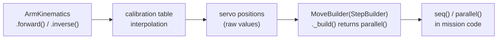

# Arm Kinematics and Code Generation

## Concept: Two Approaches to Arm Control

Moving a robot arm to a useful position requires solving **inverse kinematics (IK)**: given a desired tip position in 3D space, what angles should each joint be at? IK is mathematically expensive and can fail (unreachable target, multiple solutions). Running it on the Wombat at match time would require `ikpy`, add startup latency, and risk in-match failures on unsolvable targets.

RaccoonOS offers two distinct approaches:

1. **Codegen IK (default):** You author named arm positions in YAML as Cartesian coordinates (`{x, y, z}`). The `raccoon codegen` command runs IK offline on your development machine, validates every position against workspace limits and forbidden zones, and emits the solved servo angles directly into `defs.py`. At runtime, the robot just does table lookups — no math, no dependencies, no surprises.

2. **Project-side hand-coded IK (advanced):** For arms whose geometry does not fit the `ArmChain` model, or when runtime IK is genuinely needed (e.g., arm follows a sensor-determined object), you can implement your own kinematics in project Python. This is what the clawbot does.

The key insight is: **most arms only need a handful of named positions** (home, grab, drop, handoff). Pre-solving them at build time costs nothing and gives you compile-time safety.

## The Codegen Pipeline

```mermaid
graph LR
    A["raccoon.project.yml<br/>arm: ArmChain + positions"] --> B["raccoon codegen"]
    B --> C["ArmChainGenerator<br/>builds ikpy chain"]
    C --> D["IK solve per position<br/>Cartesian → joint angles"]
    D --> E["joint_to_servo_deg()<br/>joint space → servo space"]
    E --> F["workspace + forbidden-zone<br/>validation"]
    F --> G["defs.py emits<br/>ArmPreset(positions={...})"]
    G --> H["mission code calls<br/>Defs.arm.home()"]
    H --> I["parallel() servo steps<br/>no math at runtime"]
```



For named positions, inverse kinematics runs during code generation. The generated `defs.py` contains literal servo angles. At runtime, `ArmPreset` only looks up those angles and issues servo steps.

## Why It Works This Way

This split gives you:

- deterministic startup and match-time behavior
- no runtime IK dependency on the robot
- earlier failure for unreachable or unsafe positions
- generated Python stubs that expose named arm positions as methods

The engineering decision here is not "runtime IK is too hard." It is that competition robots benefit more from compile-time validation than from solving the same arm geometry repeatedly during a run.

## Two Definitions: `ArmChain` vs `ArmPreset`

There are two arm-related types you will encounter.

### `ArmChain` — the YAML definition type

`type: ArmChain` is what you write in `raccoon.project.yml`. It describes the physical arm geometry: joints, link lengths, servo mappings, workspace limits, and named target positions in Cartesian space. It is a toolchain artifact — it is read by `raccoon codegen` and never instantiated at runtime.

```yaml
definitions:
  arm:
    type: ArmChain         # ← this tells codegen to treat this entry as an arm
    joints: [...]
    positions:
      home: {x: 10, y: 0, z: 15}
```

### `ArmPreset` — the runtime Python class

`ArmPreset` is what `raccoon codegen` emits into `defs.py`. It holds a list of servo devices and a dictionary mapping position names to pre-solved servo angles (in degrees). At runtime it provides one method per named position:

```python
# Generated by raccoon codegen — do not edit by hand
arm = ArmPreset(
    joints=[shoulder_servo.device, elbow_servo.device],
    positions={
        "home": [92.5, 35.0],   # servo angles in degrees, already solved
        "grab": [61.2, 148.4],
    },
)

# In your mission:
Defs.arm.home()           # returns a parallel servo step
Defs.arm.home(speed=60)   # eased motion at 60 deg/s
Defs.arm.grab()
```

You never construct `ArmPreset` yourself — that is codegen's job. You only call the named-position methods it provides.

### Running Codegen

After editing the `ArmChain` block in `raccoon.project.yml`, regenerate `defs.py` by running:

```bash
raccoon codegen
```

This installs `ikpy` locally (if not already present), builds the kinematic chain, solves IK for every named position, validates against workspace guards and forbidden zones, and overwrites `defs.py` with fresh servo angles.

## ArmChain YAML Shape

The arm lives in `definitions:` as `type: ArmChain`.

```yaml
definitions:
  shoulder_servo:
    type: Servo
    port: 0

  elbow_servo:
    type: Servo
    port: 1

  arm:
    type: ArmChain
    joints:
      - servo: shoulder_servo
        length_cm: 12.5
        joint_range_deg: [0, 90]
        servo_range_deg: [10, 130]
        axis: [0, 1, 0]
        mount_rpy_deg: [0, 0, 0]
      - servo: elbow_servo
        length_cm: 10
        joint_range_deg: [-45, 45]
        servo_range_deg: [150, 30]
        axis: [0, 1, 0]
        offset_cm: [0, 0, 0]

    tip_offset_cm: [2, 0, 0]

    workspace:
      z_min_cm: 2
      z_max_cm: 35
      reach_max_cm: 25

    forbidden_zones:
      - name: hits_chassis
        condition: "shoulder_servo_deg > 75 and elbow_servo_deg < -30"

    positions:
      home: {x: 10, y: 0, z: 15}
      grab: {x: 18, y: 0, z: 5}
```

## Joint Model

Each joint contributes:

- `servo`: reference to an existing servo definition
- `length_cm`: structural link length along the joint's local `+X`
- `joint_range_deg`: valid mathematical joint angle range
- `servo_range_deg`: physical servo command range
- `axis`: rotation axis for IK
- `mount_rpy_deg`: fixed mount orientation of the joint
- `offset_cm`: bracket offset from the previous link end to this joint pivot

Chain order is base to tip. That order must match reality.

## Geometry Composition

The chain builder uses a simple but important rule:

- `length_cm` describes the rigid segment that extends along the joint's local `+X`
- `offset_cm` is an additional bracket translation applied on top of the previous segment end

So if joint `i` has `length_cm = L`, then joint `i+1` defaults to sitting at `[L, 0, 0]` in joint `i`'s output frame unless `offset_cm` adds more translation.

The same composition rule applies at the tip:

- without `tip_offset_cm`, the end effector sits at the end of the last segment
- with `tip_offset_cm`, the final tip position is the last segment end plus that extra offset

## Joint Space vs Servo Space

Inverse kinematics solves for **mathematical joint angles**. Those are not always the angles you can send directly to hardware.

The toolchain therefore applies a per-joint linear mapping:

```text
t = (joint_deg - joint_lo) / (joint_hi - joint_lo)
servo_deg = servo_lo + t * (servo_hi - servo_lo)
```

This handles both normal and inverted servos:

- normal mapping: `joint_range_deg: [0, 90]`, `servo_range_deg: [10, 130]`
- inverted mapping: `joint_range_deg: [0, 90]`, `servo_range_deg: [130, 10]`

If `servo_range_deg` runs backward, the servo is inverted relative to the mathematical joint.

## Workspace Guards

`ArmChainGenerator` checks named positions against `workspace` before accepting them.

Supported guards:

- `z_min_cm`
- `z_max_cm`
- `reach_max_cm`

`reach_max_cm` is computed as:

```text
sqrt(x^2 + y^2 + z^2)
```

These checks happen during code generation, not at runtime.

## Forbidden Zones

Forbidden zones let you reject mechanically dangerous joint combinations even if IK technically converges.

Each zone contains:

- `name`
- `condition`

The condition is evaluated against a restricted context containing:

- `joint_0_deg`, `joint_1_deg`, ...
- `{servo_name}_deg` for each referenced servo

Example:

```yaml
forbidden_zones:
  - name: cable_tension
    condition: "joint_0_deg < 10 and elbow_servo_deg > 40"
```

If a named position solves into a forbidden zone, code generation fails with a descriptive error.

## What `raccoon codegen` Actually Emits

The generated result is an `ArmPreset` expression in `defs.py`:

```python
arm = ArmPreset(
    joints=[shoulder_servo.device, elbow_servo.device],
    positions={
        "home": [92.5, 35.0],
        "grab": [61.2, 148.4],
    },
)
```

That means:

- the YAML `positions:` are Cartesian targets
- the generated `positions=` dict is already in servo command degrees
- runtime arm moves are just multi-servo presets

## Runtime Behavior

At runtime:

- `Defs.arm.home()` returns a step that moves all arm servos in parallel
- `Defs.arm.home(speed=60)` uses eased servo motion at `60 deg/s`
- one-joint arms return a single servo step
- multi-joint arms return a `parallel(...)` step

This is why named positions are cheap and reliable.

## Current State of `arm.to(x, y, z)`

The `ArmPreset` class exposes a `to(x, y, z)` method that appears to promise runtime inverse kinematics. **Do not use it in competition code.** It raises an exception unconditionally.

```python
# This will always fail at runtime — regardless of ikpy installation status
arm.to(x=18, y=0, z=5)
```

Exact behavior when called:

1. If `ikpy` is not installed:
   ```
   ImportError: arm.to() requires ikpy for runtime IK.
   Install it with: pip install ikpy
   For competition use, prefer named positions (pre-solved at codegen time).
   ```
2. If `ikpy` is installed:
   ```
   NotImplementedError: Runtime IK via arm.to() is not yet implemented.
   ```

The method signature is:

```python
def to(self, x: float, y: float, z: float = 0.0, speed: float | None = None) -> Step:
    """Move the arm to a Cartesian position via runtime IK.

    Args:
        x: Target x in cm (forward from the first joint origin).
        y: Target y in cm (lateral).
        z: Target z in cm (vertical). Defaults to 0.
        speed: Optional speed in deg/s for eased motion.
    """
```

**The production path is named positions.** Use the YAML `positions:` block and let `raccoon codegen` solve IK at build time. The Web IDE arm editor uses the same toolchain-side IK code and can help you visualize positions before committing them to YAML.

## Web IDE Relationship

The Web IDE arm editor uses the same toolchain-side kinematics helpers as code generation:

- chain construction
- forward kinematics
- inverse kinematics
- joint-axis visualization
- link-segment visualization

That is why editing an arm in the Web IDE and generating code from the CLI can stay consistent: they are sharing the same math code, not two separate implementations.

## Common Failure Modes

- `missing 'length_cm'`: a joint is structurally underspecified
- `servo '...' not found in definitions`: the arm references a nonexistent servo
- `IK failed to converge`: target is unreachable or blocked by joint limits
- workspace violation: target is outside allowed `z` or reach limits
- forbidden-zone violation: target solves, but the resulting joint combination is mechanically unsafe

## Practical Authoring Rules

- Keep joints in true kinematic order from base to tip.
- Measure lengths from pivot to pivot, not from plastic edge to plastic edge.
- Use `joint_range_deg` for the mathematical mechanism limit, not just "what the servo seems okay with."
- Use `servo_range_deg` to encode physical servo orientation and inversion.
- Prefer named positions for competition code.
- Use workspace guards and forbidden zones early. They are cheap mechanical safety.

## Alternative: Project-Side Hand-Coded IK

When `ArmChain` codegen does not fit your arm — for example, a three-DOF arm with an unusual joint geometry, or a robot where the arm pose needs to respond to a sensor value at runtime — you can implement kinematics entirely in project Python.

The clawbot demonstrates this pattern. The key architecture is:



### What This Looks Like in Practice

```python
# src/kinematics/arm.py (adapted from the clawbot)
from raccoon import servo, slow_servo, parallel, StepBuilder
from src.hardware.defs import Defs

class ArmKinematics:
    def __init__(self, l1=12.5, l2=24.0, z0=13.3):
        self.l1, self.l2, self.z0 = l1, l2, z0

    def forward(self, base_deg, shoulder_deg, elbow_deg):
        """Return (x, y, z) in cm from joint angles."""
        ...

    def inverse(self, x, y, z):
        """Return list of (base, shoulder, elbow) solutions."""
        ...

    def to_servo_values(self, base_deg, shoulder_deg, elbow_deg):
        """Map joint angles to raw servo positions via calibration table."""
        bv = _interp(_base_cal(), base_deg)
        sv = _interp(_shoulder_cal(), shoulder_deg)
        ev = _interp(_elbow_cal(), elbow_deg)
        return bv, sv, ev

    def move_angles(self, base_deg, shoulder_deg, elbow_deg, speed=None):
        """Return a raccoon step — usable directly in seq() or parallel()."""
        bv, sv, ev = self.to_servo_values(base_deg, shoulder_deg, elbow_deg)
        if speed is None:
            return parallel(
                servo(Defs.arm_base, bv),
                servo(Defs.arm_shoulder, sv),
                servo(Defs.arm_elbow, ev),
            )
        return parallel(
            slow_servo(Defs.arm_base, bv, speed),
            slow_servo(Defs.arm_shoulder, sv, speed),
            slow_servo(Defs.arm_elbow, ev, speed),
        )

    def move_to(self, x, y, z, speed=None):
        """Return a MoveBuilder that selects the best IK solution."""
        return MoveBuilder(self, x, y, z, speed)


class MoveBuilder(StepBuilder):
    """Extends StepBuilder so it integrates with seq()/parallel() directly."""

    def upper_arm(self, angle, precision=0.5):
        """Prefer IK solution with upper arm near this angle."""
        self._upper_arm_deg = angle
        return self

    def _build(self):
        bv, sv, ev = self._kin.to_servo_values(*self._select_solution())
        return parallel(
            servo(Defs.arm_base, bv),
            servo(Defs.arm_shoulder, sv),
            servo(Defs.arm_elbow, ev),
        )


arm = ArmKinematics()   # module-level singleton
```

Mission code then reads naturally:

```python
from src.kinematics.arm import arm

seq([
    arm.move_angles(-12, 90, 0),           # direct joint angles
    arm.move_to(20, 0, 15),               # IK, shortest-path solution
    arm.move_to(20, 0, 15).upper_arm(45), # IK, prefer upper arm at 45°
    arm.move_angles(-90, 53, -83, speed=200),  # eased motion
])
```

### Key Design Points

- `MoveBuilder` extends `StepBuilder` — this is what makes `arm.move_to(...)` work inside `seq()` and `parallel()` without any special casing. The framework calls `_build()` at the moment it constructs the step tree.
- Calibration tables (joint angle → servo value) live in `Defs` alongside the hardware definitions. This keeps them co-located with the hardware they describe and survives a full re-calibration.
- The `to_servo_values()` linear interpolation naturally handles non-linear servo linkages: you measure a few reference points (joint angle, servo value) and let the interpolator fill in between.
- `move_angles()` returns a ready-to-use raccoon step; `move_to()` returns a `MoveBuilder` that resolves to a step at build time.

### When to Use Each Approach

| Situation | Use |
|-----------|-----|
| Standard arm, a few named positions | `ArmChain` + codegen — simplest, safest |
| Three or more DOF, complex geometry | Start with `ArmChain` first; fall back to hand-coded IK if codegen fails to converge |
| Arm pose must depend on sensor feedback at runtime | Hand-coded IK with `MoveBuilder(StepBuilder)` |
| Need to interpolate between poses smoothly | Hand-coded IK with your own path planner |

## Related Pages

- [Servos]()
- [Web IDE Advanced Internals]()
- [Configuration Reference]()
