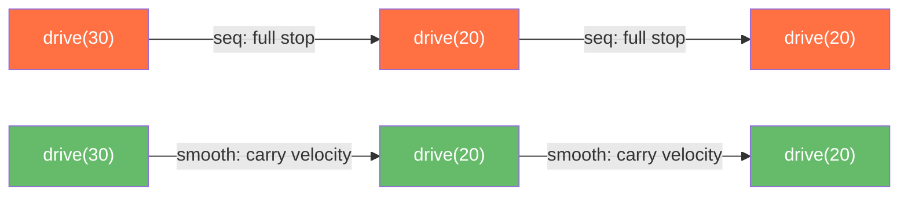

# Smooth Path and Spline Motion

When you chain motion steps with `seq()`, the robot decelerates to zero between every step, then accelerates again. For three `drive_forward` steps this means two unnecessary full stops. `smooth_path()` and `spline()` eliminate those stops, producing continuous fluid motion across all segments.

## Why Smooth Paths Matter



With `seq()`, each stop wastes time decelerating and re-accelerating. With `smooth_path()`, same-type segments carry velocity across boundaries — `drive(30) + drive(20)` completes in the same time as a single `drive(50)`. Cross-type transitions (drive → turn) use a soft stop that smoothly decelerates without resetting PID state.

## `smooth_path()`

`smooth_path()` is the primary path planner for multi-segment motion. It accepts the same motion steps you would pass to `seq()` and executes them with smooth velocity transitions.

### Basic Usage

```python
from raccoon.step.motion import smooth_path, drive_forward, turn_left, turn_right

# Three consecutive forward drives — no stops between them
smooth_path(
    drive_forward(50),
    drive_forward(30),
    drive_forward(20),
)

# Drive, turn, drive — soft transition at type boundaries
smooth_path(
    drive_forward(50),
    turn_left(90),
    drive_forward(30),
)
```

### Supported Step Types

`smooth_path()` understands:

- `drive_forward`, `drive_backward`, `strafe_left`, `strafe_right`
- `turn_left`, `turn_right`
- `turn_to_heading_left`, `turn_to_heading_right` (deferred — resolved at runtime)
- `drive_arc_left`, `drive_arc_right`
- `follow_line`, `follow_line_single`
- `spline()` (embedded spline segment)
- Nested `seq()` — automatically flattened into the motion spine
- `parallel()` with a motion spine — other branches run concurrently as side effects
- `background()` — launched without blocking the motion flow
- Non-drive steps (servos, `run()` actions) — execute at transition points
- Builder variants with `.until()` and `.speed()` — sensor conditions are fully honoured

### Steps with `.until()` Conditions

Stop conditions work inside `smooth_path()`. When a condition fires, the current velocity is immediately carried into the next segment without a deceleration pause:

```python
smooth_path(
    drive_forward(speed=0.8).until(on_black(Defs.front.right)),
    turn_left(90),
    drive_forward(30),
)
```

### Side Actions at Transition Points

Non-drive steps and `background()` steps execute at the boundary between motion segments:

```python
from raccoon.step.motion import smooth_path, drive_forward, turn_right
from raccoon.step import background, run

smooth_path(
    drive_forward(30),
    background(servo_open(Defs.arm_servo)),   # starts in background at this point
    drive_forward(20),
    run(lambda robot: robot.info("at waypoint")),  # executes at this transition
    turn_right(90),
    drive_forward(40),
)
```

### `optimize` — Algebraic Segment Merging

`optimize=True` collapses adjacent same-type, same-direction segments with no conditions into one. This is a compile-time pass:

```python
smooth_path(
    drive_forward(30),
    drive_forward(20),    # merged with above → drive_forward(50)
    turn_left(90),
    drive_forward(10),
    drive_forward(40),    # merged with above → drive_forward(50)
    optimize=True,
)
```

Only same-direction merges are performed. `drive_forward(30) + drive_backward(20)` is not merged — the intent may differ from the net displacement.

### `corner_cut_cm` — Cornering Without Stops

`corner_cut_cm` replaces `linear + turn + linear` triples with smooth circular arcs at the corners. Instead of decelerating for the turn, the robot follows the arc at cruise speed:

```python
smooth_path(
    drive_forward(50),
    turn_left(90),
    drive_forward(40),
    corner_cut_cm=5.0,    # cut 5 cm from each leg, insert arc at corner
)
# Resulting path: drive(45) + arc(R≈5cm, 90°) + drive(35)
```

The arc radius is computed as `R = corner_cut_cm / tan(|theta| / 2)`. For a 90° turn with 5 cm cut, R ≈ 5 cm. The corner cut reduces each straight leg by `corner_cut_cm` to meet the arc tangentially.

Only segments with known endpoints and no `.until()` conditions are eligible. The `MergePass` is automatically enabled when `corner_cut_cm` is set.

> `corner_cut_cm` and `spline=True` are mutually exclusive — choose one strategy for handling corners.

### `spline=True` — Catmull-Rom Smoothing

`spline=True` converts the entire drive/turn sequence into waypoints and follows them with a Catmull-Rom spline instead of the original segments:

```python
smooth_path(
    drive_forward(30),
    turn_left(90),
    drive_forward(40),
    spline=True,
)
```

This is a shortcut for users who have a sequence of steps but want spline-smooth motion without manually listing waypoints. Under the hood it extracts waypoints from the compiled plan and passes them to `SplinePath`.

### Heading Drift Correction

Each linear segment inside `smooth_path()` holds an absolute world-frame heading captured from `robot.localization.get_pose()` at segment start. This means accumulated heading drift is naturally absorbed between segments — you do not need explicit heading correction steps between drives.

### `smooth_path()` Parameters

| Parameter | Type | Default | Description |
|-----------|------|---------|-------------|
| `*steps` | step builders | required | Motion steps to execute smoothly |
| `optimize` | `bool` | `False` | Merge adjacent same-type segments algebraically |
| `corner_cut_cm` | `float \| None` | `None` | Cut this many cm from each leg at corners and insert arcs |
| `spline` | `bool` | `False` | Convert the path to a Catmull-Rom spline |

Prerequisites: `calibrate_distance()` if any segment uses distance-based mode; `mark_heading_reference()` if any segment uses heading hold.

---

## `spline()`

`spline()` drives the robot along a smooth Catmull-Rom spline through a series of waypoints. Every waypoint is visited with continuous velocity; a trapezoidal velocity profile on arc-length provides smooth acceleration and deceleration.

### Basic Usage

```python
from raccoon.step.motion import spline

# S-curve around an obstacle (heading follows spline tangent automatically)
spline((30, 0), (50, 15), (50, 30), (30, 30))

# Gentle curve at half speed
spline((40, 0), (60, 20), speed=0.5)
```

### Waypoint Formats

Waypoints are specified relative to the robot's pose when the step starts.

**2-tuple `(forward_cm, left_cm)`** — heading automatically follows the spline tangent. Works on both differential and mecanum drivetrains.

```python
# forward_cm: cm ahead of start (positive = forward)
# left_cm:    cm to the left (positive = left, negative = right)
spline(
    (20, 0),      # 20 cm straight ahead
    (40, 10),     # 40 cm ahead, 10 cm to the left
    (60, 20),     # 60 cm ahead, 20 cm to the left
)
```

**3-tuple `(forward_cm, left_cm, heading_deg)`** — explicit heading at each waypoint, linearly interpolated along the path. Requires a mecanum or omni-wheel drivetrain (raises `ValueError` on differential robots):

```python
# Robot curves right while rotating left 90° over the path
spline(
    (0, 0, 0),      # start facing forward
    (30, -10, 45),  # midpoint: 30 cm ahead, 10 cm right, facing 45° CCW
    (50, -15, 90),  # endpoint: 50 cm ahead, 15 cm right, facing 90° CCW
)
```

All waypoints in a single call must use the same format (all 2-tuples or all 3-tuples). Mixing raises `ValueError`.

### Final Heading

The `final_heading` parameter sets the robot's desired heading when it arrives at the last waypoint, in degrees. The robot smoothly rotates from its start heading to this target as it follows the path:

```python
# Arrive facing 90° left of start orientation
spline((30, 0), (50, 20), final_heading=90)
```

When `absolute_heading=False` (default), `final_heading` is relative to the robot's start orientation:
- `0` = same as start orientation
- `90` = 90° counter-clockwise from start
- `-90` = 90° clockwise from start

When `absolute_heading=True`, `final_heading` is interpreted as an absolute heading relative to the heading reference (same convention as `drive_forward(heading=...)`).

`final_heading` is ignored when 3-tuple waypoints are used — per-waypoint headings take precedence.

### Absolute Heading Mode

`absolute_heading=True` computes heading errors against the world heading from `robot.localization.get_pose().heading`, which is stable across motion boundaries and is independent of any odometry reset. Use this when the spline is chained after steps that reset odometry:

```python
# Heading tracking remains stable after prior steps reset odometry
spline((30, 0), (50, 20), absolute_heading=True)

# Absolute heading + arrive facing north (heading reference = north)
spline((30, 0), (50, 20), absolute_heading=True, final_heading=0)
```

### `spline()` Parameters

| Parameter | Type | Default | Description |
|-----------|------|---------|-------------|
| `*waypoints` | 2-tuples or 3-tuples | required | Two or more waypoints relative to start pose |
| `speed` | `float` | `1.0` | Fraction of max speed, 0.0–1.0 |
| `absolute_heading` | `bool` | `False` | Use world-frame heading for the heading PID |
| `final_heading` | `float \| None` | `None` | Desired heading in degrees at the last waypoint |

**Raises:**
- `ValueError`: Fewer than 2 waypoints
- `ValueError`: Inconsistent waypoint tuple sizes
- `ValueError`: 3-tuple waypoints on a non-omni drivetrain

Prerequisites: Drive characterization (`auto_tune()` or `characterize_drive()`) must have been run so that axis constraints are populated. `mark_heading_reference()` is required when using `absolute_heading=True` with `final_heading`.

### Examples

```python
from raccoon.step.motion import spline

# Simple S-curve through three waypoints
spline((20, 0), (40, 10), (60, 0))

# Wide curve at reduced speed
spline((50, 0), (80, 20), (100, 10), speed=0.6)

# Arrive facing 90° left
spline((30, 0), (50, 20), final_heading=90)

# Omni: curve while rotating to face 90° left at the end
spline((30, 0, 0), (50, 15, 45), (50, 30, 90))

# After an odometry reset, keep heading stable against the IMU
spline((30, 0), (50, 20), absolute_heading=True)
```

---

## Choosing Between `smooth_path()` and `spline()`

| | `smooth_path()` | `spline()` |
|--|----------------|------------|
| **Input** | Existing step builders | Explicit (x, y) waypoints |
| **Path shape** | Trapezoidal segments with velocity bridging | Smooth Catmull-Rom curve |
| **Corner handling** | Soft stop at type boundaries, optional arc cuts | Continuous curvature through waypoints |
| **Works on** | All drivetrains | Both (3-tuple headings: omni only) |
| **Heading control** | Holds odometry heading per segment | Follows spline tangent or explicit per-waypoint headings |
| **Best for** | Migrating existing `seq()` code; complex side-action timing | Precision curved paths where waypoint coordinates are known |

Use `smooth_path()` when you already have a sequence of steps and want to eliminate stops. Use `spline()` when you know the geometric waypoints and need a smooth curve through them.
