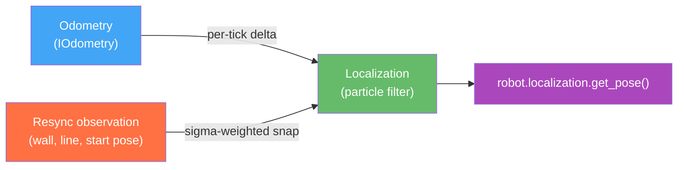

# Localization and Resync

Odometry accumulates drift over time. After driving 2+ meters, small encoder and IMU errors compound into position errors that can derail mission accuracy. The **localization system** maintains a parallel world-pose estimate using a particle filter, and **resync steps** let you inject absolute position observations at known field landmarks to correct accumulated drift in real time.

## How It Works



The particle filter runs in a background thread at 100 Hz. On each tick it:
1. Reads the per-tick odometry delta and propagates the particle cloud forward (predict step)
2. When a resync observation arrives, weights and resamples the cloud (update step)
3. Outputs the weighted-mean pose as the world estimate

The world pose from `robot.localization.get_pose()` is what smooth-path segments use for heading hold and what resync steps report as "current position". It is more stable than raw odometry because it incorporates absolute observations at known landmarks.

## Auto-Wiring

`robot.localization` is **automatically constructed** on first access. You do not instantiate it directly. The auto-wire logic wraps `robot.odometry` with default `LocalizationConfig` settings and the optional `robot.table_map` (for surface-measurement likelihoods):

```python
# This just works — no setup needed
pose = robot.localization.get_pose()
```

The instance is cached in `robot._localization` after the first access. If auto-wiring fails (missing extension, broken odometry), `LocalizationNotWiredError` is raised with the root cause chained via `__cause__`.

## Tuning with `LocalizationConfig`

The default `LocalizationConfig` is adequate for most robots without further tuning. You can customize it by constructing `Localization` manually and assigning it to `robot._localization` in your robot's `__init__`:

```python
from raccoon import Localization, LocalizationConfig

class MyRobot(MissionProtocol):
    def __init__(self):
        super().__init__()
        cfg = LocalizationConfig(
            particle_count=256,                   # more particles = more accurate, more CPU
            process_translation_noise_m=0.003,    # per-tick base translation noise
        )
        self._localization = Localization(self.odometry, cfg, table_map=self.table_map)
```

### `LocalizationConfig` Parameters

All parameters are optional; the defaults are shown below.

| Parameter | Default | Unit | Description |
|-----------|---------|------|-------------|
| `tick_period_ms` | `10` | ms | Background tick period. 10 ms = 100 Hz. Lower = more responsive, higher CPU use. |
| `particle_count` | `128` | count | Number of particles in the filter. More particles improve accuracy at the cost of CPU time. 128 is the practical sweet spot for Wombat; 256 is safe for short missions. |
| `process_translation_noise_m` | `0.002` | m/tick | Base (unconditional) translation noise injected per tick. Prevents the filter from becoming overconfident during stationary periods. |
| `process_translation_noise_per_m` | `0.02` | m/m | Translation noise that scales with how far the robot moved in that tick. Models wheel slip proportional to distance. |
| `process_heading_noise_rad` | `0.01` | rad/tick | Base heading noise per tick. |
| `process_heading_noise_per_rad` | `0.05` | rad/rad | Heading noise that scales with how much the robot rotated in that tick. |
| `observation_injection_ratio` | `0.35` | fraction | Fraction of particles that are re-initialised from the observation distribution on each update step (merges new information with existing estimate). |
| `resample_effective_sample_ratio` | `0.5` | fraction | Resampling is triggered when the effective sample size falls below this ratio times `particle_count`. Lower values = less frequent resampling. |

The most commonly adjusted parameters are `particle_count` (for accuracy) and `process_translation_noise_per_m` (for how much the filter trusts odometry vs. observations).

## Resync Steps

Resync steps inject absolute pose observations into the localization filter at known field positions. Each observation is a **soft snap** — it updates the particle cloud with a Gaussian likelihood centred on the expected pose. The `sigma_xy_cm` and `sigma_theta_deg` parameters control how tightly the filter is snapped to the expected values. Smaller sigma = harder snap.

The step is a no-op if localization is not wired (`robot.localization` raises `LocalizationNotWiredError`) — it logs a warning and continues.

### `resync_at_start_pose()`

Inject the robot's known start pose directly, without any additional motion. Use this at the very beginning of a run to anchor the particle cloud to the known starting position.

```python
from raccoon.step.motion import resync_at_start_pose

# Anchor to the origin (robot started at x=0, y=0, theta=0)
resync_at_start_pose(
    expected_x_cm=0.0,
    expected_y_cm=0.0,
    expected_theta_deg=0.0,
)

# Use current odometric position (no override) — just tighten the filter
resync_at_start_pose()

# Snap only X and Y, leave heading free
resync_at_start_pose(
    expected_x_cm=0.0,
    expected_y_cm=0.0,
    snap_axes=(True, True, False),
)
```

Parameters:

| Parameter | Type | Default | Description |
|-----------|------|---------|-------------|
| `expected_x_cm` | `float \| None` | `None` | Expected X position in cm. `None` = use current odometric X. |
| `expected_y_cm` | `float \| None` | `None` | Expected Y position in cm. `None` = use current odometric Y. |
| `expected_theta_deg` | `float \| None` | `None` | Expected heading in degrees. `None` = use current odometric heading. |
| `snap_axes` | `(bool, bool, bool)` | `(True, True, True)` | Which axes (x, y, theta) to include in the observation. |
| `sigma_xy_cm` | `float` | `1.0` | Position uncertainty standard deviation in cm. Smaller = harder snap. |
| `sigma_theta_deg` | `float` | `5.0` | Heading uncertainty standard deviation in degrees. |

**Typical usage:**

```python
seq([
    wait_for_light(),
    resync_at_start_pose(
        expected_x_cm=0.0,
        expected_y_cm=0.0,
        expected_theta_deg=0.0,
        sigma_xy_cm=1.0,       # 1 cm uncertainty in position
        sigma_theta_deg=3.0,   # 3° uncertainty in heading
    ),
    # ... rest of mission
])
```

### `find_line_resync()`

Drive until an IR sensor detects a line, then inject an observation at that known line position. This is the most useful resync step for Botball — game table lines are precisely positioned and you can rely on them as absolute landmarks.

```python
from raccoon.step.motion import find_line_resync
from raccoon.map import SensorOffset

# Drive until the right sensor hits the known scoring line at Y=50 cm
find_line_resync(
    sensor=Defs.front.right,
    sensor_position=SensorOffset(forward_cm=5.0, strafe_cm=-8.0),  # sensor position on robot
    expected_y_cm=50.0,     # we know this line is at Y=50 cm
    snap_axes=(False, True, False),  # snap only Y (line is horizontal)
    sigma_xy_cm=0.75,       # 0.75 cm uncertainty along the line normal
    threshold=0.7,          # sensor detection threshold
    forward_speed_mps=0.15, # slow approach for accurate detection
    timeout_s=3.0,          # give up after 3 seconds
)
```

Parameters:

| Parameter | Type | Default | Description |
|-----------|------|---------|-------------|
| `sensor` | `IRSensor` | required | The IR sensor to detect the line |
| `sensor_position` | `SensorOffset` | required | Position of the sensor on the robot body (`forward_cm`, `strafe_cm` from robot centre) |
| `expected_x_cm` | `float \| None` | `None` | Expected X when the line is detected. `None` = use current position. |
| `expected_y_cm` | `float \| None` | `None` | Expected Y when the line is detected. `None` = use current position. |
| `expected_theta_deg` | `float \| None` | `None` | Expected heading. `None` = use current. |
| `snap_axes` | `(bool, bool, bool)` | `(False, True, False)` | Which axes to snap. Default: Y only (horizontal line). |
| `sigma_xy_cm` | `float` | `1.0` | Position uncertainty in cm. |
| `sigma_theta_deg` | `float` | `5.0` | Heading uncertainty in degrees. |
| `line_sigma_cm` | `float` | `0.75` | Uncertainty assigned to the line surface measurement specifically. |
| `threshold` | `float` | `0.7` | `probabilityOfBlack()` threshold for triggering detection. |
| `forward_speed_mps` | `float` | `0.15` | Forward drive speed in m/s while searching. |
| `strafe_speed_mps` | `float` | `0.0` | Lateral speed component (for mecanum diagonal approaches). |
| `timeout_s` | `float` | `3.0` | Max time in seconds to drive before giving up. |

**Choosing `snap_axes`:** A vertical line (robot drives left/right across it) is best snapped on X only: `(True, False, False)`. A horizontal line (robot drives forward across it) is best snapped on Y only: `(False, True, False)`. Snap heading only if you are confident the detection gives you a reliable heading reference.

**Example: resync on a horizontal scoring zone boundary**

```python
from raccoon.map import SensorOffset

seq([
    # Drive north until the front sensor crosses the scoring zone line
    find_line_resync(
        sensor=Defs.front.right,
        sensor_position=SensorOffset(forward_cm=8.0, strafe_cm=-6.0),
        expected_y_cm=90.0,           # scoring zone boundary at Y=90 cm
        snap_axes=(False, True, False),
        sigma_xy_cm=0.75,
        forward_speed_mps=0.15,
    ),
    # Continue mission — localization is now anchored at Y=90 cm
    drive_forward(10),
])
```

### `align_to_wall_resync()`

Run a wall-alignment step (drives into a wall until stall), then inject a wall-based observation. This combines `wall_align_*()` with a pose snap in one step.

```python
from raccoon.step.motion import align_to_wall_resync
from raccoon.step.motion.wall_align import WallDirection

# Drive backward into the back wall and snap X position
align_to_wall_resync(
    direction=WallDirection.BACKWARD,
    expected_x_cm=0.0,           # back wall is at X=0
    snap_axes=(True, False, False),
    sigma_xy_cm=0.5,             # wall is very precise: 0.5 cm
    sigma_theta_deg=3.0,
    speed=0.5,
    accel_threshold=0.5,
    settle_duration=0.2,
    max_duration=5.0,
)
```

The `direction` parameter controls which wall-align step runs internally:

| `direction` | Equivalent step | Typical use |
|-------------|----------------|-------------|
| `WallDirection.FORWARD` | `wall_align_forward()` | Align against front wall |
| `WallDirection.BACKWARD` | `wall_align_backward()` | Align against back wall |
| `WallDirection.STRAFE_LEFT` | `wall_align_strafe_left()` | Align against left wall |
| `WallDirection.STRAFE_RIGHT` | `wall_align_strafe_right()` | Align against right wall |

Parameters:

| Parameter | Type | Default | Description |
|-----------|------|---------|-------------|
| `direction` | `WallDirection` | `WallDirection.FORWARD` | Which direction to drive into the wall |
| `expected_x_cm` | `float \| None` | `None` | Expected X when aligned. |
| `expected_y_cm` | `float \| None` | `None` | Expected Y when aligned. |
| `expected_theta_deg` | `float \| None` | `None` | Expected heading. |
| `snap_axes` | `(bool, bool, bool)` | `(True, True, True)` | Which axes to snap. |
| `sigma_xy_cm` | `float` | `1.0` | Position uncertainty in cm. |
| `sigma_theta_deg` | `float` | `5.0` | Heading uncertainty in degrees. |
| `wall_sigma_cm` | `float` | `0.75` | Uncertainty for the wall surface measurement. |
| `sensor_position` | `SensorOffset \| None` | `None` | Position of the bumper/wall sensor on the robot (for likelihood computation). |
| `speed` | `float` | `1.0` | Wall-align drive speed. |
| `accel_threshold` | `float` | `0.5` | Deceleration threshold to detect the wall impact. |
| `settle_duration` | `float` | `0.2` | Seconds to wait after impact for the robot to settle. |
| `max_duration` | `float` | `5.0` | Maximum seconds to drive before giving up. |
| `grace_period` | `float` | `0.3` | Grace period in seconds before stall detection activates. |

**Example: setup sequence with wall-back and start-pose resync**

```python
seq([
    wait_for_light(),

    # Anchor heading at light-on time
    mark_heading_reference(),

    # Align against back wall and snap position
    align_to_wall_resync(
        direction=WallDirection.BACKWARD,
        expected_x_cm=0.0,
        expected_y_cm=0.0,
        expected_theta_deg=0.0,
        snap_axes=(True, True, True),
        sigma_xy_cm=0.5,
        sigma_theta_deg=2.0,
    ),

    # Begin mission
    drive_forward(50),
])
```

## Sigma Values — Practical Guide

The `sigma_*` parameters control the strength of each observation. A lower sigma = a harder snap = the filter trusts this observation more than its own internal estimate.

| Landmark | Typical `sigma_xy_cm` | Notes |
|----------|----------------------|-------|
| Wall (physical contact) | 0.3–0.75 | Very reliable: physical contact is repeatable |
| IR line detection | 0.5–1.0 | Depends on line edge quality and sensor position accuracy |
| Start pose (manual placement) | 1.0–3.0 | Higher if start placement is imprecise |
| Run-to-run start variation | 3.0–5.0 | Large uncertainty: don't rely on this alone |

Start with the defaults (`sigma_xy_cm=1.0`, `sigma_theta_deg=5.0`) and tighten them as you gain confidence in the landmark repeatability.

## Debugging Localization

Enable JSONL recording by setting environment variables before running:

```bash
LIBSTP_RECORD_LOCALIZATION=1 \
LIBSTP_RECORDING_PATH=/tmp/loc_run.jsonl \
raccoon run my_mission.py
```

The recording captures per-tick particle clouds, observations, and world-pose estimates for post-run analysis.
