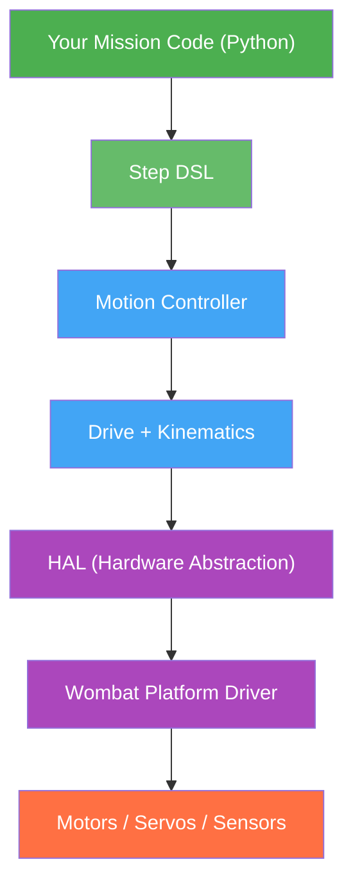

# Programming Guide

This section covers everything you need to program robots with the **LibSTP** SDK — from writing your first mission to tuning low-level motor controllers.

LibSTP is a layered robotics framework: you write missions in Python using a high-level DSL, while the control loops, kinematics, and hardware drivers run in optimized C++ underneath. You don't need to touch C++ to build a competition robot.

## Sections

| Page | What You'll Learn |
|------|-------------------|
| [Architecture Overview]() | The full layer stack, how pieces connect |
| [Project Structure]() | Files, folders, and configuration |
| [Robot Definition]() | Declaring hardware, kinematics, and drive |
| [Missions]() | Writing and sequencing missions |
| [Steps DSL]() | The motion/action building blocks |
| [Stop Conditions]() | Combining conditions with OR, AND, THEN |
| [Custom Steps]() | Writing your own reusable steps |
| [Sensors]() | IR, analog, digital, and camera sensors |
| [Drive System]() | Kinematics, velocity control, PID tuning |
| [Odometry]() | Position tracking and heading reference |
| [Servos]() | Servo control and presets |
| [Calibration]() | Motor and sensor calibration workflow |
| [UI Steps & Screens]() | Touchscreen UI, widgets, custom screens |
| [Advanced Topics]() | Async, timing, transport, debugging |

### Deep Dives

| Page | What It Does |
|------|-------------|
| [Line Following]() | PID-based edge tracking with profiled and directional variants |
| [Lineup]() | Single-pass geometric line alignment |
| [IR Sensor Calibration (K-Means)]() | Clustering-based threshold detection for IR sensors |
| [Wait for Light]() | Kalman-filtered start lamp detection with test/arm workflow |
