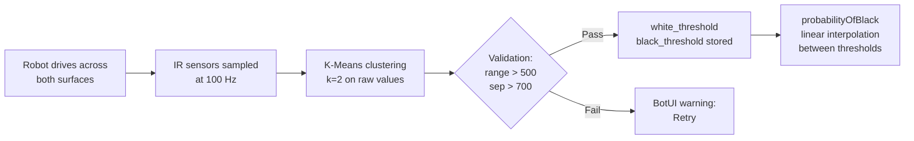

# IR Sensor Calibration — K-Means Clustering

IR sensor calibration uses a **K-Means clustering** approach to automatically distinguish black from white surfaces. This technique is based on the research paper [*Applied Machine Learning in Sensor Calibration — A Clustering Technique*](/papers/liu-xie-jiang-2025-ml-sensor-calibration.pdf) by Abigail Liu, Aaron Xie, and Oliver Jiang (Los Altos Community Team 0399, GCER 2025).

## Concept

You do not need to understand this page to run calibration — the `calibrate()` step handles everything. Come here when:
- calibration fails validation and you want to know why
- a sensor repeatedly triggers on white or misses black, and you want to understand the threshold
- you're working on a robot that crosses surfaces with different reflectivity (requiring multiple calibration sets — see [Calibration]())

The calibration pipeline has three stages:



The output — `probabilityOfBlack()` — is what [line following](), [lineup](), and stop conditions like `on_black()` all consume.

## The Problem

IR sensors return raw analog values that vary between sensors, surfaces, and environmental conditions. To make decisions like "am I on a black line?", the system needs a threshold separating black readings from white readings.

Traditional approaches — such as taking a fixed percentile of the data — are vulnerable to skewed samples. If the robot spends most of its calibration drive on white surface with only a brief pass over black, a percentile-based threshold can land in the wrong place. The paper demonstrates that percentile methods achieve only 92–98% accuracy and are susceptible to false positives in skewed data.

## The Solution: K-Means Clustering (k=2)

Instead of relying on percentiles, the calibration system uses **K-Means clustering with k=2** to separate sensor readings into two natural groups: one for white and one for black.

**Sampling:** During calibration, the robot drives across the game surface while IR sensors are sampled at **10 ms intervals** (100 Hz). Each sensor accumulates a list of raw analog readings as the robot passes over both white and black areas.

**Clustering:** The collected samples are fed into a 1D K-Means algorithm:

1. **Initialize** two centroids at the minimum and maximum of the data
2. **Assign** each data point to its nearest centroid
3. **Recompute** each centroid as the mean of its assigned points
4. **Repeat** for up to 10 iterations (convergence is typically reached within 5, since the data is semi-sorted from the WHITE-BLACK-WHITE driving pattern)
5. **Return** the two centroids in ascending order — the lower one becomes the **white threshold**, the higher one the **black threshold**

```
Samples:  [180, 195, 210, 185, 2800, 3100, 2950, 190, 205, ...]
                 └── white cluster ──┘  └── black cluster ──┘  └── white ──┘

K-Means centroids:  white = 193.5,  black = 2950.0
```

## Why Clustering Works Better

The paper compares three calibration algorithms:

| Algorithm | Approach | Success Rate | Handles Skewed Data? |
|-----------|----------|:------------:|:--------------------:|
| 90th percentile | Use 90th percentile as BLACK threshold | 92% | No |
| Median of 80% range | Average 10th/90th percentile medians | 98% | No |
| **K-Means clustering** | Cluster into two groups, threshold at midpoint | **100%** | **Yes** |

The key advantage is robustness to **skewed data distributions**. If the robot's calibration drive crosses a black line only briefly, 90% of the samples may be white. Percentile methods get confused — they might place the "black" threshold at a white reading. K-Means correctly identifies even a small cluster of black readings and separates it from the white cluster.

## Validation

After clustering, the calibration is validated before being accepted:

- **Minimum range check:** The overall spread of readings must exceed 500 units. If all readings are similar, the sensor likely didn't see both surfaces.
- **Minimum separation check:** The two centroids must be at least 700 units apart *and* at least 25% of the total data range. This prevents accepting calibrations where the clusters aren't meaningfully distinct.

If validation fails, the BotUI shows a warning and lets you retry.

## Soft Classification

After calibration, the IR sensor doesn't just return "black" or "white" — it also provides a **probability** via linear interpolation between the two thresholds:

```
probabilityOfBlack:
    value <= white_threshold  →  0.0
    value >= black_threshold  →  1.0
    otherwise                 →  (value - white) / (black - white)
```

This enables more nuanced line-following behavior (e.g., proportional control) rather than binary on/off decisions. See [Line Following]() for how the PID controller uses these probability values.

## Multiple Calibration Sets

Robots that traverse surfaces with different reflectivity (for example, a white ground floor and a dark-colored elevated deck) need separate calibration sets. The `calibrate_sensors()` step can collect multiple named sets in a single setup phase. Mid-mission, `switch_calibration_set()` activates a different set instantly.

```python
# In SetupMission — collect both sets during setup
calibrate_sensors(calibration_sets=["default", "upper"])
switch_calibration_set("default")   # start on ground surface

# In mission M050 — ascending the ramp
switch_calibration_set("upper")     # ramp surface has different reflectivity

# In mission M080 — after descending
switch_calibration_set("default")
```

Each named set stores independent `white_threshold` and `black_threshold` values per sensor port in `racoon.calibration.yml`. Switching a set takes effect immediately on the next `on_black()` / `probabilityOfBlack()` call.

For how to structure the setup mission and YAML, see [Calibration → Calibration Sets]().
