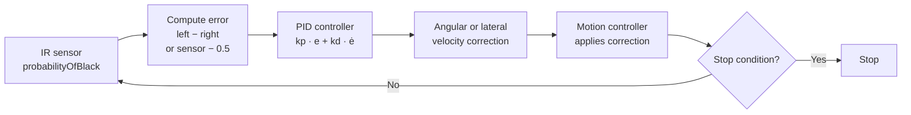

# Line Following

Line following keeps the robot tracking along a black line (or its edge) using PID-controlled steering corrections. The system reads calibrated IR sensor probabilities each control cycle and adjusts the robot's heading or lateral position to stay on course.

## Concept

The core idea is to turn a **sensor position error** into a **velocity correction**:



After [calibration](), each IR sensor returns `probabilityOfBlack()` — a float from 0.0 (pure white) to 1.0 (pure black). The PID controller converts the error signal into a small velocity correction that steers the robot back toward the line on every 10 ms control tick.

The family of line-follow steps covers every combination of:
- **Primary motion direction** — forward, backward (negative speed), or lateral (strafe)
- **Correction axis** — rotation (angular velocity), lateral strafing, or forward/backward
- **Sensor count** — one sensor (edge tracking) or two sensors (differential)

## Quick Start

```python
from raccoon import *
from src.hardware.defs import Defs

# Single-sensor shortcut via SensorGroup: follow the right edge for 50 cm
Defs.front.follow_right_edge(cm=50)

# Two-sensor: follow a line for 50 cm using both sensors
follow_line(
    left_sensor=Defs.front.left,
    right_sensor=Defs.front.right,
    distance_cm=50,
)

# Single-sensor: follow the right edge of a line for 30 cm
follow_line_single(
    sensor=Defs.front.right,
    side=LineSide.RIGHT,
    distance_cm=30,
)

# Follow until another sensor triggers
follow_line(
    left_sensor=Defs.front.left,
    right_sensor=Defs.front.right,
    distance_cm=100,
).until(on_black(Defs.rear.right))
```

## How It Works

### Sensor Error Signal

After [calibration](), each IR sensor provides `probabilityOfBlack()` — a float from 0.0 (pure white) to 1.0 (pure black), linearly interpolated between the calibrated thresholds.

**Two-sensor mode** computes the error as the difference between left and right:

```
error = left.probabilityOfBlack() - right.probabilityOfBlack()
```

- Positive error → left sees more black → steer left
- Negative error → right sees more black → steer right
- Zero → centered on line

**Single-sensor mode** tracks the line *edge* by targeting a reading of 0.5 (half on, half off):

```
error = sensor.probabilityOfBlack() - 0.5
```

The sign is flipped when following the opposite edge (`LineSide.RIGHT`).

### PID Steering

A PID controller converts the sensor error into a steering correction each cycle:

```
correction = Kp * error + Ki * integral(error) + Kd * d(error)/dt
```

| Term | Default | Effect |
|------|:-------:|--------|
| `kp` | 0.4 | Sharpness of response to current error |
| `ki` | 0.0 | Eliminates steady-state drift over time |
| `kd` | 0.1 | Dampens oscillation around the line edge |

Both `follow_line` (two-sensor) and `follow_line_single` (single-sensor) use the same default gains: `kp=0.4, ki=0.0, kd=0.1`. There is no separate single-sensor gain set in the code — both classes start from the same baseline. Tune from these defaults rather than from different starting points.

The correction is applied as an angular velocity override on top of the robot's forward motion. The result is smooth, proportional steering — not bang-bang switching.

### Velocity Profiling

The profiled variants (`follow_line`, `follow_line_single`) use a **trapezoidal velocity profile** for forward motion: the robot accelerates smoothly, cruises at the target speed, then decelerates as it approaches the target distance. This prevents overshoot at the end of a line-follow segment.

## Variants

The system provides two families of line-follow steps:

### Profiled (Forward/Backward)

Best for straight-line following where you know the distance:

```python
follow_line(
    left_sensor=Defs.front.left,
    right_sensor=Defs.front.right,
    distance_cm=50,
    speed=0.5,
)

follow_line_single(
    sensor=Defs.front.right,
    side=LineSide.RIGHT,
    distance_cm=30,
    speed=0.4,
)
```

These use `LinearMotion` with trapezoidal profiling and odometry-based distance tracking.

### Directional (Any Heading + Strafe)

For robots that can move laterally (omni/mecanum wheels), directional variants allow following a line while moving in any direction:

```python
# Follow line while driving forward — correct with rotation
directional_follow_line(
    left_sensor=Defs.front.left,
    right_sensor=Defs.front.right,
    heading_speed=0.5,
    distance_cm=40,
)

# Follow line while driving forward — correct with strafing (heading stays locked)
strafe_follow_line(
    left_sensor=Defs.front.left,
    right_sensor=Defs.front.right,
    speed=0.5,
    distance_cm=40,
)
```

**Angular correction** (`directional_follow_line`) applies the PID output as rotational velocity — the robot rotates to stay on the line.

**Lateral correction** (`strafe_follow_line`) enables `lateral_correction` mode in the underlying motion controller, which instead applies the PID output as lateral (strafe) velocity while the heading is held constant via the motion controller's built-in heading-hold. This is useful when the robot must maintain a specific orientation while following a line, for example to keep a side-mounted mechanism aligned.

## Stopping

Line following stops when either condition is met (whichever comes first):

1. **Distance reached** — the robot has traveled `distance_cm` from the start
2. **Stop condition triggered** — a composable `.until()` condition fires

```python
from raccoon import *
from src.hardware.defs import Defs

# Stop after 50 cm
follow_line(Defs.front.left, Defs.front.right, distance_cm=50)

# Stop when another sensor sees black
follow_line(Defs.front.left, Defs.front.right, distance_cm=100).until(on_black(Defs.rear.right))

# Stop on timeout — no distance needed, just a condition
follow_line(Defs.front.left, Defs.front.right).until(after_seconds(5))
```

> **Important:** At least one of `distance_cm` or `.until()` must be provided. Calling `follow_line()` or `follow_line_single()` without either raises a `ValueError` immediately. There is no "follow forever" fallback mode.

## Parameters

### `follow_line` — Two-Sensor Profiled

| Parameter | Type | Default | Description |
|-----------|------|---------|-------------|
| `left_sensor` | IRSensor | Required | Left sensor, positioned to the left of the line |
| `right_sensor` | IRSensor | Required | Right sensor, positioned to the right of the line |
| `distance_cm` | float | `None` | Distance to follow; required if no `.until()` |
| `speed` | float | `0.5` | Forward speed as fraction of max velocity (0.0–1.0) |
| `kp` | float | `0.4` | Proportional PID gain |
| `ki` | float | `0.0` | Integral PID gain |
| `kd` | float | `0.1` | Derivative PID gain |

### `follow_line_single` — Single-Sensor Profiled

| Parameter | Type | Default | Description |
|-----------|------|---------|-------------|
| `sensor` | IRSensor | Required | The single sensor tracking the edge |
| `distance_cm` | float | `None` | Distance to follow; required if no `.until()` |
| `speed` | float | `0.5` | Forward speed as fraction of max velocity (0.0–1.0) |
| `side` | `LineSide` | `LEFT` | Which edge of the line to track |
| `kp` | float | `0.4` | Proportional PID gain |
| `ki` | float | `0.0` | Integral PID gain |
| `kd` | float | `0.1` | Derivative PID gain |

### `directional_follow_line` / `strafe_follow_line` — Directional Variants

These directional variants accept `heading_speed` and `strafe_speed` separately (independent forward and lateral fractions), rather than a single `speed`. `strafe_follow_line` keeps the heading locked and corrects position via lateral strafing; `directional_follow_line` applies the PID output as angular velocity.

| Parameter | Type | Default | Description |
|-----------|------|---------|-------------|
| `left_sensor` / `right_sensor` | IRSensor | Required | The two sensors straddling the line |
| `heading_speed` | float | `0.0` | Forward/backward fraction (-1.0 to 1.0) |
| `strafe_speed` | float | `0.0` | Lateral fraction (-1.0 to 1.0) |
| `distance_cm` | float | `None` | Distance (euclidean) to follow |
| `kp`, `ki`, `kd` | float | `0.4 / 0.0 / 0.1` | PID gains |

### `strafe_follow_line_single` — Single-Sensor Lateral-Correction Variant

`strafe_follow_line_single` is the single-sensor equivalent of `strafe_follow_line`. The robot drives forward (or backward) while the PID corrects by strafing. This is particularly useful on mecanum robots that need heading-locked forward motion with line tracking.

| Parameter | Type | Default | Description |
|-----------|------|---------|-------------|
| `sensor` | IRSensor | Required | Single sensor tracking the line edge |
| `distance_cm` | float | `None` | Distance to follow; required if no `.until()` |
| `speed` | float | `0.5` | Forward/backward fraction. **Negative = backward** (see note below) |
| `side` | `LineSide` | `LEFT` | Which edge of the line to track |
| `kp`, `ki`, `kd` | float | `0.4 / 0.0 / 0.1` | PID gains |

> **Backward line-following with negative speed.** Setting `speed` to a negative value reverses the primary axis (the robot drives backward) while the PID still corrects laterally. The `sensor` and `side` arguments stay the same — only the speed sign changes. This is the standard mecanum-robot technique for following a line while reversing:
>
> ```python
> # Adapted from packingbot — follow a line while driving backward
> def line_follow_backwards(speed=1.0):
>     return strafe_follow_line_single(
>         Defs.rear.right,
>         speed=-speed,          # negative = primary axis reversed → drive backward
>         side=LineSide.RIGHT,
>         kp=0.5,
>         ki=0.3,
>         kd=0.0,
>     )
>
> line_follow_backwards().until(
>     after_cm(30) + on_black(Defs.front.right) + after_cm(30)
> )
> ```

### `SensorGroup.follow_right_edge` Note

`Defs.front.follow_right_edge(cm=50)` is a **single-sensor** convenience that internally calls `follow_line_single` with `self.right` (the right sensor of the group). Despite the group owning both sensors, only the right one is used. Use `follow_line(Defs.front.left, Defs.front.right, ...)` explicitly if you want the two-sensor variant.

## Lateral (Strafe-Primary) Variants

`LateralFollowLine` and `LateralFollowLineSingle` are the strafe-primary counterparts to `StrafeFollowLine`. Instead of the robot's primary motion being forward while it corrects via strafing, here the robot's primary motion is lateral (strafing) while it corrects via forward/backward motion.

This is useful when the robot must travel sideways along a line — for example, following a line painted parallel to the robot's forward axis while the robot moves across the table laterally.

```python
from raccoon import *
from src.hardware.defs import Defs

# Strafe right along a line (two-sensor), correcting with forward/backward motion
lateral_follow_line(
    left_sensor=Defs.front.left,
    right_sensor=Defs.front.right,
    speed=0.5,          # positive = strafes right
    distance_cm=60,
)

# Strafe left along a line edge (single-sensor)
lateral_follow_line_single(
    sensor=Defs.front.left,
    speed=-0.4,         # negative = strafes left
    side=LineSide.LEFT,
    distance_cm=40,
)
```

| Parameter | Type | Default | Description |
|-----------|------|---------|-------------|
| `left_sensor` / `right_sensor` | IRSensor | Required | Two sensors straddling the line (for `lateral_follow_line`) |
| `sensor` | IRSensor | Required | Single sensor tracking the edge (for `lateral_follow_line_single`) |
| `speed` | float | `0.5` | Lateral speed fraction. Positive = strafe right, negative = strafe left |
| `distance_cm` | float | `None` | Lateral distance to travel before stopping |
| `side` | `LineSide` | `LEFT` | Single-sensor: which edge to track (relative to lateral travel direction) |
| `kp`, `ki`, `kd` | float | `0.4 / 0.0 / 0.1` | PID gains for forward/backward correction |

Sensor labeling for `LateralFollowLine`: when strafing right, `left_sensor` is the front-facing side sensor and `right_sensor` is the rear-facing side sensor. When strafing left, that geometry mirrors automatically.

## `hold_heading=False` — Heading-Float Mode

Both `correct_lateral()` and `correct_forward()` on the `line_follow()` builder accept an optional `hold_heading=False` argument. By default, `hold_heading=True` keeps the robot's heading locked via the motion PID while it corrects position. Setting `hold_heading=False` lets the heading drift freely — useful for slow-speed final alignment moves where heading-hold torque would fight the intended correction motion.

```python
# Adapted from cube-bot m040 — slow alignment using the fluent builder
# hold_heading=False lets the chassis float to avoid fighting the line's geometry
align_step = (
    line_follow()
    .single(Defs.rear.left, side=LineSide.LEFT)
    .move(forward=0.4)
    .correct_lateral(hold_heading=False)
    .pid(kp=0.6, ki=0.3, kd=0.0)
)

# Run for 0.4 s alongside an arm move
parallel(
    align_step.until(after_seconds(0.4)),
    arm.move_angles(base_deg=91, speed=80),
)
```

> **When to use `hold_heading=False`:** At full speed, heading-hold prevents the robot from drifting sideways — keep it on. At slow speed (≤ 0.4), especially when fine-aligning on a line before a pickup, the heading-hold PID may resist the small sideways nudges needed for accurate alignment. Disable it in that case.

The fluent `line_follow()` builder is the only way to access `hold_heading=False`. The simpler `strafe_follow_line_single(...)` factory always uses `hold_heading=True` implicitly.

## All Line-Follow Steps Summary

| Step | Motion direction | Correction method | Sensors |
|------|-----------------|-------------------|---------|
| `follow_line` | Forward | Rotation (angular velocity) | Two |
| `follow_line_single` | Forward | Rotation (angular velocity) | One |
| `directional_follow_line` | Any (heading + strafe) | Rotation (angular velocity) | Two |
| `strafe_follow_line` | Forward | Strafing (heading stays locked) | Two |
| `strafe_follow_line_single` | Forward | Strafing (heading stays locked) | One |
| `lateral_follow_line` | Lateral (strafe primary) | Forward/backward | Two |
| `lateral_follow_line_single` | Lateral (strafe primary) | Forward/backward | One |
| `directional_follow_line_single` | Any (heading + strafe) | Rotation (angular velocity) | One |

## Real-world Example: `follow_line_single` with Compound Stop Condition

Competition robots rarely stop on the very first sensor trigger — start-line tape or brief noise can cause false positives. The standard guard is a minimum-distance condition combined with a sensor trigger using the `&` (AND) operator:

```python
# Adapted from examplebot — follow the left edge, stop at the delivery zone.
# after_cm(20) prevents the start-line tape from triggering a premature stop.
# & requires BOTH conditions to be true simultaneously.
follow_line_single(
    Defs.front.left,
    speed=0.8,
    side=LineSide.LEFT,
    kp=0.5,
    kd=0.1,
).until(after_cm(20) & on_black(Defs.front.right))
```

The `after_cm(20)` acts as a minimum-distance guard — `on_black(Defs.front.right)` can only fire after at least 20 cm have been traveled. The `&` means both conditions must hold in the same control cycle.

## Tips

1. **Start with default PID gains.** Only tune if the robot oscillates (lower `kp`, raise `kd`) or drifts off the line (raise `kp`).
2. **Use two sensors when possible.** Two-sensor following is inherently more stable because the error signal is differential — ambient noise affects both sensors equally and cancels out.
3. **Single-sensor edge tracking works best at moderate speed.** At high speeds the sensor crosses the edge too quickly for accurate readings.
4. **`follow_right_edge` uses only one sensor.** The `SensorGroup.follow_right_edge()` shortcut calls `follow_line_single` with only the right sensor. Use the explicit `follow_line()` factory with both sensors if you want two-sensor behavior.
5. **You must provide `distance_cm` or `.until()`.** Both `follow_line` and `follow_line_single` raise a `ValueError` immediately if neither is provided.
6. **Calibrate on the actual surface.** Line following accuracy depends directly on calibration quality — see [Calibration]().
7. **Use `hold_heading=False` for slow-speed final alignment.** At high speed, heading-hold is essential. At slow alignment speeds (≤ 0.4), it can fight the correction — disable it via the `line_follow()` builder's `.correct_lateral(hold_heading=False)`.
8. **Negative speed in `strafe_follow_line_single` drives backward.** The PID still corrects laterally; only the primary-axis direction reverses. Use a rear-facing sensor with the appropriate `LineSide` to match the robot's new travel direction.
