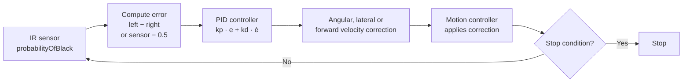
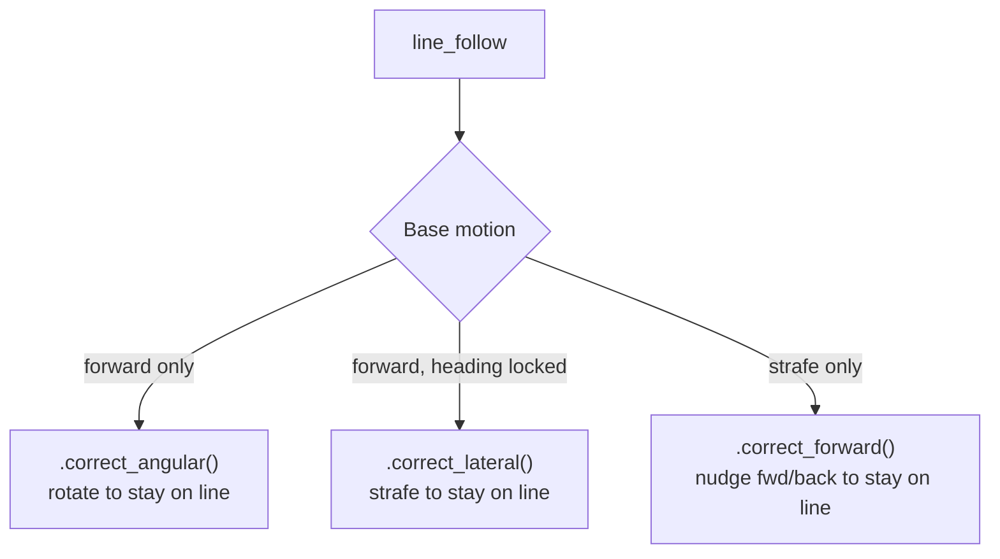

# Line Following

Line following keeps the robot tracking along a black line (or its edge) using PID-controlled steering corrections. The system reads calibrated IR sensor probabilities each control cycle and adjusts the robot's heading or lateral position to stay on course.

## Concept

The core idea is to turn a **sensor position error** into a **velocity correction**:



After [calibration](), each IR sensor returns `probabilityOfBlack()` — a float from 0.0 (pure white) to 1.0 (pure black). The PID controller converts the error signal into a small velocity correction that steers the robot back toward the line on every 10 ms control tick.

Every line follow is defined by three independent choices:

- **Tracking mode** — one sensor (edge tracking) or two sensors (differential)
- **Base motion** — which way the robot drives: forward, backward, or sideways (strafe)
- **Correction axis** — how the PID output is applied: as rotation (`angular`), as sideways motion (`lateral`), or as forward/backward motion (`forward`)

The **`line_follow()` builder** lets you express any combination of these three choices in one readable chain. It is the recommended way to write line-follow steps.

## The `line_follow()` builder

`line_follow()` returns a fluent builder. You chain methods to configure it, then end with a termination method. The builder is itself a step, so it drops straight into `seq([...])` or `parallel(...)`.

```python
from raccoon import *
from src.hardware.defs import Defs

# Two sensors, drive forward 50 cm, steer by rotating
line_follow().dual(Defs.front.left, Defs.front.right).move(forward=0.5).correct_angular().distance_cm(50)
```

Read left to right: *follow a line with two sensors, while driving forward at 0.5, correcting with rotation, for 50 cm.*

### Builder methods

| Method | Purpose | Notes |
|--------|---------|-------|
| `.dual(left_sensor, right_sensor)` | Two-sensor differential tracking | Error = `left.probabilityOfBlack() − right.probabilityOfBlack()` |
| `.single(sensor, side=LineSide.LEFT)` | Single-sensor edge tracking | Error = `sensor.probabilityOfBlack() − 0.5`; `side` picks which edge |
| `.move(forward=0.0, strafe=0.0)` | Base motion fractions (−1.0…1.0) | Negative `forward` = drive backward; `strafe` for omni/mecanum |
| `.forward_speed(v)` / `.strafe_speed(v)` | Set one base-motion axis individually | Equivalent to `.move(...)` per axis |
| `.correct_angular()` | Apply PID output as **rotation** (default) | Requires non-zero base motion |
| `.correct_lateral(hold_heading=True)` | Apply PID output as **sideways** velocity | Base `strafe` must stay 0; `hold_heading=False` lets the chassis float |
| `.correct_forward(hold_heading=True)` | Apply PID output as **forward/backward** velocity | Base `forward` must stay 0 (used for strafe-primary follows) |
| `.pid(kp, ki=0.0, kd=0.1)` | Override the steering PID gains | Defaults `kp=0.4, ki=0.0, kd=0.1` |
| `.distance_cm(value)` | Stop after this odometry distance | At least one of `.distance_cm()` / `.until()` is required |
| `.until(condition)` | Stop when a composable `StopCondition` fires | Combine with `&`, `+` etc. |
| `.correction_sign(value)` | Flip the correction direction | Rarely needed; for mirrored sensor geometry |
| `.on_anomaly(cb_or_step)` / `.skip_timing()` | Inherited step-builder hooks | See [Steps]() |

### Rules the builder enforces (raises `ValueError` immediately)

- Exactly one tracking mode: call **either** `.single(...)` **or** `.dual(...)`, not both, not neither.
- At least one termination: `.distance_cm(...)` and/or `.until(...)`. There is no "follow forever" mode.
- `.correct_angular()` needs non-zero base motion (something to steer).
- `.correct_lateral()` requires the base `strafe` to be 0 (strafe is the correction axis).
- `.correct_forward()` requires the base `forward` to be 0 (forward is the correction axis).

## Quick Start

```python
from raccoon import *
from src.hardware.defs import Defs

# Two-sensor: follow a line forward for 50 cm
line_follow().dual(Defs.front.left, Defs.front.right).move(forward=0.5).correct_angular().distance_cm(50)

# Single-sensor: follow the right edge forward for 30 cm
line_follow().single(Defs.front.right, side=LineSide.RIGHT).move(forward=0.4).correct_angular().distance_cm(30)

# Follow until another sensor sees black (no fixed distance)
line_follow().dual(Defs.front.left, Defs.front.right).move(forward=0.5).correct_angular().until(on_black(Defs.rear.right))

# Distance + early termination (whichever triggers first)
line_follow().dual(Defs.front.left, Defs.front.right).move(forward=0.5).correct_angular().distance_cm(100).until(on_black(Defs.rear.right))
```

## How It Works

### Sensor Error Signal

After [calibration](), each IR sensor provides `probabilityOfBlack()` — a float from 0.0 (pure white) to 1.0 (pure black), linearly interpolated between the calibrated thresholds.

**Two-sensor mode** (`.dual()`) computes the error as the difference between left and right:

```
error = left.probabilityOfBlack() - right.probabilityOfBlack()
```

- Positive error → left sees more black → steer left
- Negative error → right sees more black → steer right
- Zero → centered on line

**Single-sensor mode** (`.single()`) tracks the line *edge* by targeting a reading of 0.5 (half on, half off):

```
error = sensor.probabilityOfBlack() - 0.5
```

The sign is flipped automatically when following the opposite edge (`LineSide.RIGHT`).

### PID Steering

A PID controller converts the sensor error into a steering correction each cycle:

```
correction = kp * error + ki * integral(error) + kd * d(error)/dt
```

| Term | Default | Effect |
|------|:-------:|--------|
| `kp` | 0.4 | Sharpness of response to current error |
| `ki` | 0.0 | Eliminates steady-state drift over time |
| `kd` | 0.1 | Dampens oscillation around the line edge |

Both single- and dual-sensor follows share the same default gains (`kp=0.4, ki=0.0, kd=0.1`) — there is no separate single-sensor gain set in the code. Tune from these defaults with `.pid(...)` rather than from different starting points. The correction is applied smoothly and proportionally (not bang-bang switching), through whichever correction axis you selected.

### Velocity Profiling

Forward/backward base motion uses a **trapezoidal velocity profile**: the robot accelerates smoothly, cruises at the target speed, then decelerates as it approaches the target distance. This prevents overshoot at the end of a line-follow segment when a `.distance_cm()` is set.

## Choosing the Correction Axis

The correction axis is what makes line following flexible across drivetrains:



- **`correct_angular()`** — the robot rotates to stay centered. The classic differential-drive line follow.
- **`correct_lateral()`** — the robot drives forward with its heading locked and corrects by strafing sideways. Useful on omni/mecanum robots that must keep a fixed orientation (e.g. to keep a side-mounted mechanism aligned). Pass `hold_heading=False` to let the heading float during slow final-alignment moves where heading-hold torque would fight the correction.
- **`correct_forward()`** — the robot's primary motion is sideways (strafe) and it corrects by nudging forward/backward. Used to travel *along* a line that runs parallel to the robot's forward axis.

## Named factory shortcuts

For the common combinations there are named factory functions. They are thin presets over the same machinery, handy when you do not need the full builder. Each still returns a builder, so you can chain `.until()` / `.on_anomaly()` on them.

| Factory | Equivalent `line_follow()` chain |
|---------|----------------------------------|
| `follow_line(L, R, distance_cm=d, speed=s)` | `.dual(L, R).move(forward=s).correct_angular().distance_cm(d)` |
| `follow_line_single(sensor, side, distance_cm=d, speed=s)` | `.single(sensor, side).move(forward=s).correct_angular().distance_cm(d)` |
| `directional_follow_line(L, R, heading_speed=h, strafe_speed=t)` | `.dual(L, R).move(forward=h, strafe=t).correct_angular()...` |
| `strafe_follow_line(L, R, speed=s)` | `.dual(L, R).move(forward=s).correct_lateral()...` |
| `strafe_follow_line_single(sensor, speed=s, side=...)` | `.single(sensor, side).move(forward=s).correct_lateral()...` |
| `lateral_follow_line(L, R, speed=s)` | `.dual(L, R).move(strafe=s).correct_forward()...` |
| `lateral_follow_line_single(sensor, speed=s, side=...)` | `.single(sensor, side).move(strafe=s).correct_forward()...` |

```python
# These two are equivalent:
follow_line(Defs.front.left, Defs.front.right, distance_cm=50, speed=0.5)
line_follow().dual(Defs.front.left, Defs.front.right).move(forward=0.5).correct_angular().distance_cm(50)
```

> **Negative speed drives backward.** Setting a negative base `forward` (e.g. `.move(forward=-0.5)`, or `speed=-0.5` on a factory) reverses the primary axis while the PID still corrects on its chosen axis. Use a rear-facing sensor with the matching `LineSide`. This is the standard mecanum technique for following a line while reversing.

## Stopping

Line following stops when either condition is met (whichever comes first): the `.distance_cm()` is reached, or a `.until()` `StopCondition` fires.

Competition robots rarely stop on the very first sensor trigger — start-line tape or brief noise causes false positives. The standard guard is a minimum-distance condition combined with a sensor trigger using `&` (AND):

```python
# Adapted from examplebot — follow the left edge, stop at the delivery zone.
# after_cm(20) prevents the start-line tape from triggering a premature stop;
# & requires BOTH conditions to be true in the same control cycle.
(
    line_follow()
    .single(Defs.front.left, side=LineSide.LEFT)
    .move(forward=0.8)
    .correct_angular()
    .pid(kp=0.5, kd=0.1)
    .until(after_cm(20) & on_black(Defs.front.right))
)
```

## Real-world examples (from the competition bots)

Teams typically wrap the builder in a small project-local helper so missions read cleanly. This pattern (a `src/steps/line_follow_dsl.py` module) appears across the Ecer2026 bots:

```python
# Adapted from the clawbot's src/steps/line_follow_dsl.py
def line_follow_fwd(speed: float = 0.5):
    return (
        line_follow()
        .dual(Defs.front.left, Defs.front.right)
        .move(forward=speed)
        .correct_angular()
    )

def backward_line_follow(speed: float = 1.0):
    # rear sensors, primary axis reversed, lateral correction with floating heading
    return (
        line_follow()
        .single(Defs.rear.right, side=LineSide.RIGHT)
        .move(forward=-speed)
        .correct_lateral(hold_heading=False)
        .pid(kp=0.5, ki=0.3, kd=0.0)
    )

# In a mission — terminate with .until(...)
seq([
    line_follow_fwd().until(after_cm(110)),
    backward_line_follow().until(after_cm(30) + on_black(Defs.front.right)),
])
```

```python
# Adapted from cube-bot m040 — slow final alignment alongside an arm move.
# hold_heading=False lets the chassis float so heading-hold torque does not
# fight the small sideways nudges needed for accurate alignment.
align_step = (
    line_follow()
    .single(Defs.rear.left, side=LineSide.LEFT)
    .move(forward=0.4)
    .correct_lateral(hold_heading=False)
    .pid(kp=0.6, ki=0.3, kd=0.0)
)

parallel(
    align_step.until(after_seconds(0.4)),
    Defs.arm_claw.grab(),   # arm-joint servo preset runs concurrently
)
```

> **When to use `hold_heading=False`:** at full speed, heading-hold prevents the robot from drifting sideways — keep it on (the default). At slow alignment speeds (≤ 0.4), especially when fine-aligning on a line before a pickup, the heading-hold PID can resist the small sideways corrections — disable it then.

## `SensorGroup.follow_right_edge` Note

`Defs.front.follow_right_edge(cm=50)` is a **single-sensor** convenience that internally builds a single-sensor follow using `self.right` (the right sensor of the group). Despite the group owning both sensors, only the right one is used. Use the explicit `line_follow().dual(Defs.front.left, Defs.front.right, ...)` builder if you want two-sensor behavior.

## Tips

1. **Reach for `line_follow()` first.** The builder makes the three choices (tracking / base motion / correction axis) explicit and reads top-to-bottom. Use the named factories only for the simplest forward follows.
2. **Start with default PID gains.** Only call `.pid(...)` if the robot oscillates (lower `kp`, raise `kd`) or drifts off the line (raise `kp`).
3. **Use two sensors when possible.** `.dual()` is inherently more stable because the error signal is differential — ambient noise affects both sensors equally and cancels out.
4. **Single-sensor edge tracking works best at moderate speed.** At high speed the sensor crosses the edge too quickly for accurate readings.
5. **You must provide `.distance_cm()` or `.until()`.** The builder raises `ValueError` immediately if neither is set.
6. **Calibrate on the actual surface.** Line-following accuracy depends directly on calibration quality — see [Calibration]().
7. **Use `correct_lateral(hold_heading=False)` for slow-speed final alignment.** At high speed heading-hold is essential; at slow alignment speeds it can fight the correction.
8. **Negative base `forward` drives backward** while the PID keeps correcting. Pair it with a rear-facing sensor and the matching `LineSide`.
