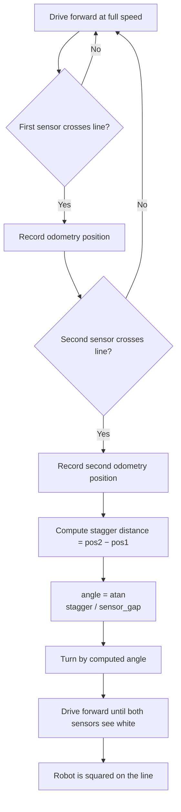

# Lineup (Line Alignment)

Lineup aligns the robot square on a black line. Unlike iterative correction approaches that repeatedly measure and adjust, the lineup algorithm computes the exact correction angle in a **single drive pass** using basic trigonometry. This makes it fast — alignment completes with almost no time lost.

## Concept

The dual-sensor lineup algorithm exploits a simple geometric fact: when the robot approaches a line at an angle, its two sensors do not cross the line at the same time. The distance driven between the two crossings — the **stagger** — directly encodes the misalignment angle.



This is pure geometry — no PID, no tuning, no iteration. One pass gives the exact correction.

## Quick Start

```python
# Dual sensor (recommended): both sensors find the line
forward_lineup_on_black(Defs.front.left, Defs.front.right)
backward_lineup_on_black(Defs.front.left, Defs.front.right)

# Via SensorGroup shortcut
Defs.front.lineup_on_black()

# Single sensor: when only one sensor is available
forward_single_lineup(
    Defs.front.right,
    correction_side=CorrectionSide.RIGHT,
)
```

## Dual-Sensor Lineup

The dual-sensor algorithm is the recommended approach. It uses two IR sensors (left and right) and exploits the **stagger** between their line crossings to compute the robot's angular error.

### How It Works

As the robot drives forward across a line, the two sensors don't hit the line at the same time (unless already perfectly aligned). The sensor closer to the line crosses first. The robot keeps driving until the second sensor crosses. The distance driven between the two crossings — the **stagger** — directly encodes the alignment error.

```
         ┊ line
    L    ┊    R
    ●────┤────●    Robot approaching at angle
         ┊
         ┊
    ─────┼──────
         ┊
    L hits line first
         ┊    then robot drives distance d
         ┊    R hits line
         ┊
    angle = atan(d / sensor_gap)
```

The correction angle is computed from pure geometry:

```
angle = atan(stagger_distance / sensor_gap)
```

Where `sensor_gap` is the known physical distance between the two sensors on the robot.

### Algorithm Phases

The `forward_lineup_on_black` function is composed of three back-to-back steps with no pauses:

1. **Measure** — Drive forward at constant speed. Record odometry when the first sensor crosses the black threshold, then when the second one does. The difference is the stagger distance.
2. **Turn** — Execute a point turn by the computed angle. The sign is determined by which sensor hit first (left first → turn right, right first → turn left).
3. **Clear** — Drive forward at half speed until both sensors see white again, leaving the robot just past the line, squared up and ready.

The measurement phase happens at full approach speed — there is no need to slow down.

Internally, steps 1 and 2 are the core geometry algorithm (exposed as the internal `lineup()` helper). Step 3 is appended by the public factory `forward_lineup_on_black` as a finishing move. If you call `lineup()` directly (it is a hidden DSL function not intended for normal use), you get only the measure + turn, without the clearing drive.

### Why This Works So Well

- **No iteration.** One pass through the line gives the exact correction angle. No PID convergence, no repeated approaches.
- **No tuning.** The algorithm is pure geometry — there are no gains to adjust.
- **Fast.** At 1.0 m/s approach speed, a typical lineup completes in well under a second.
- **Robust.** Works at any initial angle. If the robot is already aligned, the stagger is ~0 and no turn is needed.

## Single-Sensor Lineup

When only one sensor is available, the algorithm uses a different geometric approach: it measures the **apparent line width** as the sensor crosses the line.

### How It Works

A line of known width `W` appears wider when crossed at an angle:

```
apparent_width = W / cos(angle)
```

So the correction angle can be recovered:

```
angle = acos(actual_width / apparent_width)
```

The algorithm drives forward, recording odometry at the **leading edge** (sensor confidence rises above `entry_threshold`) and **trailing edge** (confidence drops below `exit_threshold`). The distance between them is the apparent width.

### Limitation

A single sensor cannot determine which *direction* the robot is skewed — only the magnitude of the skew. You must specify `correction_side` (LEFT or RIGHT) to tell the algorithm which way to turn. If the correction side is wrong, the robot will turn further out of alignment.

Angles below 1 degree are ignored (no correction applied) to avoid unnecessary micro-turns.

## Strafe Lineup

For robots with omnidirectional drive (mecanum or omni wheels), `strafe_lineup_on_black` works the same way as the dual-sensor algorithm but uses lateral movement instead of forward motion. The front and back sensors detect the line while the robot strafes sideways.

```python
strafe_left_lineup_on_black(Defs.left.front, Defs.left.back)
strafe_right_lineup_on_black(Defs.right.front, Defs.right.back)
```

## Parameters

### Public Dual-Sensor Functions

All four public forward/backward variants (`forward_lineup_on_black`, `backward_lineup_on_black`, `forward_lineup_on_white`, `backward_lineup_on_white`) share the same signature:

| Parameter | Type | Default | Description |
|-----------|------|---------|-------------|
| `left_sensor` | IRSensor | Required | Left IR sensor, mounted on the left side of the chassis |
| `right_sensor` | IRSensor | Required | Right IR sensor, mounted on the right side of the chassis |
| `detection_threshold` | float | `0.7` | Sensor confidence (0.0–1.0) needed to register a line hit. Lower values trigger earlier but are more susceptible to noise. |

The approach speed is hard-coded at 1.0 (full speed forward) for the measurement phase and 0.5 for the clearing drive. There is no public `forward_speed` parameter — the speed is not user-configurable on the public API.

### Single-Sensor Additional Parameters

| Parameter | Type | Default | Description |
|-----------|------|---------|-------------|
| `sensor` | IRSensor | Required | The single sensor crossing the line |
| `line_width_cm` | float | `5.0` | Known physical width of the line |
| `entry_threshold` | float | `0.7` | Confidence to detect leading edge |
| `exit_threshold` | float | `0.3` | Confidence to detect trailing edge (should be lower than entry) |
| `correction_side` | `CorrectionSide` | Required | Direction to turn for correction (LEFT or RIGHT) |

## White-Surface Variants

Each forward/backward direction also has a white-surface counterpart that detects a white region instead of a black line:

```python
from raccoon import *
from src.hardware.defs import Defs

# Align on a white line (e.g. tape on a dark background)
forward_lineup_on_white(Defs.front.left, Defs.front.right)
backward_lineup_on_white(Defs.front.left, Defs.front.right)
```

The algorithm is identical — only the detection color is inverted. The clear phase after alignment also inverts: the robot drives until both sensors see black.

## Strafe Lineup Variants

For omni/mecanum robots, strafe lineup variants also have white-surface counterparts:

```python
# Align while strafing right, on a black line
strafe_right_lineup_on_black(Defs.right.front, Defs.right.back)

# Align while strafing right, on a white region
strafe_right_lineup_on_white(Defs.right.front, Defs.right.back)

# Align while strafing left, on a black line
strafe_left_lineup_on_black(Defs.left.front, Defs.left.back)

# Align while strafing left, on a white region
strafe_left_lineup_on_white(Defs.left.front, Defs.left.back)
```

All strafe variants take `front_sensor`, `back_sensor`, and `detection_threshold` (default `0.7`).

## All Lineup Functions Reference

| Function | Direction | Surface | Sensors |
|----------|-----------|---------|---------|
| `forward_lineup_on_black` | Forward | Black | Left + Right |
| `forward_lineup_on_white` | Forward | White | Left + Right |
| `backward_lineup_on_black` | Backward | Black | Left + Right |
| `backward_lineup_on_white` | Backward | White | Left + Right |
| `strafe_right_lineup_on_black` | Strafe right | Black | Front + Back |
| `strafe_right_lineup_on_white` | Strafe right | White | Front + Back |
| `strafe_left_lineup_on_black` | Strafe left | Black | Front + Back |
| `strafe_left_lineup_on_white` | Strafe left | White | Front + Back |
| `forward_single_lineup` | Forward | Black | One |
| `backward_single_lineup` | Backward | Black | One |

## Real-World Usage Pattern

Lineup is typically used immediately before a pickup or delivery to guarantee the robot is square. The pattern is: drive to approximately the right position, then lineup, then proceed:

```python
from raccoon import *
from src.hardware.defs import Defs

class M020DeliverMission(Mission):
    def sequence(self) -> Sequential:
        return seq([
            # Drive roughly to the target
            drive_forward(cm=60),
            turn_right(90),

            # Square up on the delivery line.
            # No tuning needed — geometry handles the correction.
            forward_lineup_on_black(Defs.front.left, Defs.front.right),

            # Now the robot is square — place the object
            Defs.arm_servo.down(),
            Defs.claw_servo.open(),
        ])
```

For mecanum robots, combine strafe lineup with `mark_heading_reference()` to recover any heading drift before the lined-up phase. See [Wall Alignment]() for the analogous heading-reset pattern.

## Tips

1. **Prefer dual-sensor lineup.** It's faster, more accurate, and doesn't require you to know the correction direction.
2. **Mount sensors as far apart as possible.** A wider sensor gap gives better angle resolution — small stagger differences map to larger, more measurable distances.
3. **Use the SensorGroup shortcut** (`Defs.front.lineup_on_black()`) for the most common case.
4. **Lineup works at full speed.** There's no need to slow down before hitting the line. The measurement is taken during continuous motion.
5. **The approach speed is fixed.** The public API hard-codes the approach at 1.0 (full speed) and the post-turn clearing drive at 0.5. There is no way to configure these speeds on the public API — accept them or use the internal `lineup()` helper directly.
