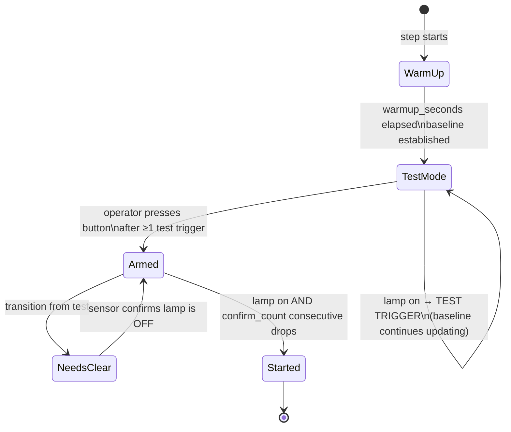

# Wait for Light

In Botball competitions, robots start when a light signal turns on. The robot must detect this light reliably — without false-triggering from ambient changes (people walking past, overhead lighting shifting) and without missing a weak signal. raccoon's `wait_for_light` step solves this using a 1D Kalman filter for baseline tracking and a multi-phase workflow with a built-in test mode.

The approach is based on the paper [*"Comprehensive Light-Start Methods in Botball"*](https://ecer.pria.at/archive/ecer-2024/papers/Comprehensive_Light-Start_Methods_in_Botball.pdf) by James Gosling, Matthias Rottensteiner, and Alexander Müllner (ECER 2023), which compares several noise reduction techniques and proposes the Kalman filter + downward-facing sensor combination used here.

## Concept

The fundamental problem is that a fixed trigger threshold breaks across venues (different lighting conditions). The Kalman-filter approach adapts: instead of "trigger below value X", the step triggers on "drop of N% below the current ambient baseline".



| Phase | What happens |
|-------|-------------|
| **Warm-Up** | Read sensor at ~200 Hz, feed into Kalman filter. Process variance is high so baseline tracks fast. |
| **Test Mode** | Operator can turn the lamp on and off to verify detection. The robot will NOT start. Each successful detection increments a counter shown on screen. |
| **Armed** | After operator confirmation. A `needs_clear` gate prevents instant false-start if lamp is still on from the test phase. |
| **Started** | `confirm_count` consecutive readings drop below `baseline × (1 − drop_fraction)`. Mission begins. |

## The Problem

A light sensor returns a raw analog value that varies with ambient conditions. The start lamp adds brightness, which causes the sensor reading to drop (lower value = more light on a typical LDR). The challenge is distinguishing "the lamp turned on" from "the room got slightly brighter" or "someone's shadow moved."

Naive approaches fail in predictable ways:

- **Fixed threshold** (e.g. "trigger below 2000"): breaks when the room lighting changes between setup and match start, or between venues.
- **Manual calibration** (measure dark/light, compute midpoint): works, but requires operator interaction before every run and is sensitive to the time gap between calibration and match start.
- **Simple delta detection** (trigger on any sudden change): fires on noise spikes.

## How It Works

### Sensor Mounting

The sensor faces **downward** toward the table surface, with no shielding (no black tape, no straw). When the start lamp turns on above the robot, light reflects off the table and reaches the sensor. This downward-facing mount reduces environmental noise by up to 76% compared to a horizontal mount (Gosling et al., 2023), because the sensor's field of view is dominated by the table (a stable reflector) rather than the room.

### Phase 1: Warm-Up (Baseline Establishment)

During a configurable warm-up period (default: 1 second), the step reads the sensor at ~200 Hz and feeds every reading into a 1D Kalman filter. The filter tracks the slowly-changing ambient baseline while smoothing out sensor noise.

The Kalman filter maintains two values:
- **Estimate** — the current best guess of the true ambient reading
- **Error** — how uncertain the estimate is

Each new sensor reading updates both via the standard Kalman predict/update cycle. During warm-up, the process variance is set relatively high (0.01) so the filter adapts quickly to the current lighting conditions.

### Phase 2: Test Mode

After warm-up, the step enters **test mode**. In this mode, the lamp can be turned on and off to verify detection works — but the robot **will not start**. The UI shows "TEST MODE" and counts how many times the lamp was successfully detected.

This is critical at competition: you can verify the sensor picks up the lamp signal from its actual position on the starting board before committing to an armed state. If it doesn't trigger, you can adjust the sensor position or the `drop_fraction` parameter without wasting a run.

While in test mode, the Kalman filter continues updating the baseline on non-triggering readings, keeping it current.

### Phase 3: Armed

Once the operator has confirmed detection works (by pressing the button after at least one successful test trigger), the step transitions to **armed** mode. Now a trigger will actually start the mission.

A key detail: when transitioning from test mode to armed, the step sets a **needs_clear gate**. The gate clears only when the raw sensor reading is at or above the trigger threshold — that is, when the lamp is demonstrably off. This prevents an instant false start if the lamp happens to still be on from the last test trigger. Once the sensor confirms the lamp is off, the gate clears and the step will fire normally on the next lamp-on event.

The Kalman filter's process variance is also reduced (from 0.01 to 0.001) after warm-up, making the baseline more stable — it tracks slow ambient drift but won't chase the lamp signal.

### Trigger Detection

A trigger fires when the raw sensor reading drops below `baseline * (1 - drop_fraction)` for `confirm_count` consecutive samples.

With the defaults (15% drop, 3 consecutive samples at 200 Hz):
- The lamp must cause at least a 15% brightness increase
- This must persist for ~15 ms (3 samples) — effectively instant, but rejects single-sample noise spikes

## Parameters

| Parameter | Default | Effect |
|-----------|---------|--------|
| `drop_fraction` | 0.15 | How much the reading must drop below baseline. Lower = more sensitive, higher = safer |
| `confirm_count` | 3 | Consecutive below-threshold samples needed. Higher = more noise-resistant, slower response |
| `warmup_seconds` | 1.0 | Baseline establishment time. Longer = more stable baseline |
| `poll_interval` | 0.005 | Seconds between reads (~200 Hz). Faster = more responsive |

## Usage

The framework handles wait-for-light automatically when a `wait_for_light_sensor` is defined in your hardware. It runs as part of the pre-start gate — after the setup mission, before the first main mission.

For manual use:

```python
# Default — works for most setups
wait_for_light(Defs.wait_for_light_sensor)

# More sensitive for a weak lamp signal
wait_for_light(Defs.wait_for_light_sensor, drop_fraction=0.10, confirm_count=2)
```

### Excluding from Calibration

The wait-for-light sensor is typically not an IR line sensor — it doesn't need black/white calibration. Exclude it from the standard calibration step:

```python
calibrate(distance_cm=50, exclude_ir_sensors=[
    Defs.wait_for_light_sensor,
])
```

## Competition Workflow

At competition, follow this sequence every time you arm the robot:

1. **Setup mission runs** → servos home, calibration completes
2. **Warm-up phase** (automatic, ~1 s) → Kalman baseline establishes
3. **Test mode starts** → turn the lamp on/off at least once to confirm detection (you'll see the trigger count increment on the BotUI)
4. **Press the button** to arm → `needs_clear` gate waits for the lamp to go off
5. **Match start** → referee turns lamp on → robot starts immediately

> **Competition tip:** If the test trigger count does not increment when you flash the lamp, check the sensor mount. The sensor should face **downward** toward the table surface — this reduces ambient noise by up to 76% compared to an upward or sideways mount. If it still doesn't trigger, lower `drop_fraction` to `0.10` (requires 10% drop instead of 15%).

## Legacy Method

If the automatic method doesn't work for your setup (e.g. the sensor isn't mounted downward, or the lamp signal is too weak for flank detection), there's a manual fallback:

```python
wait_for_light_legacy(Defs.wait_for_light_sensor)
```

This runs the traditional two-step flow: the operator measures the sensor with the lamp off, then with it on, confirms the midpoint threshold, and the robot waits for the reading to cross it. It works, but requires manual interaction before every run.

## Cross-links

- The wait-for-light sensor does not use black/white IR calibration — exclude it from the `calibrate()` step with `exclude_ir_sensors=[Defs.wait_for_light_sensor]`
- `wait_for_light()` is injected automatically by `SetupMission` when `wait_for_light_mode = "auto"` is set in `Defs` — you do not need to call it manually
- See [Calibration]() for the full setup mission lifecycle
