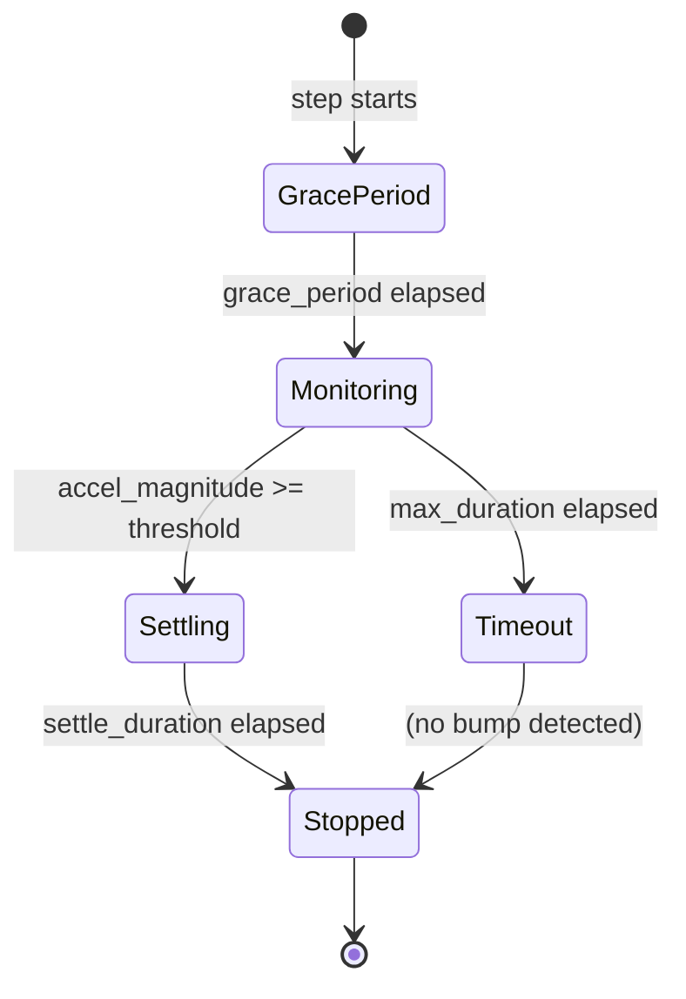

# Wall Alignment

Wall alignment drives the robot into a physical boundary — a wall, a pipe, a divider panel — and uses the IMU's gravity-compensated linear acceleration to detect the moment of impact. Instead of stopping the instant contact is made, the robot keeps pushing for a short settle period, which lets the chassis rotate flush against the surface. The result is a reliable positional reset that requires no sensors, no encoders, and no prior knowledge of the robot's exact heading.

This is one of the most robust re-localization techniques in Botball. Odometry drifts over a full mission, but a wall always stays where it is. Driving into a wall and resetting the heading afterward cancels accumulated heading error completely.

## Concept



The step has four internal phases:

| Phase | What happens |
|-------|-------------|
| **Grace period** | Motors spin up — IMU noise from startup is suppressed |
| **Monitoring** | Each cycle: read `sqrt(ax² + ay²)`, compare to `accel_threshold` |
| **Settling** | Threshold crossed — keep pushing for `settle_duration` seconds so the chassis rotates flush |
| **Stopped** | Drive stops, `bump_result` is populated; or timeout fires as a safety net |

After the step, call `mark_heading_reference()` immediately. This is the entire point: the robot is now flush against a known physical surface, so the heading is exactly known. Locking that into the odometry reference prevents drift from affecting subsequent `turn_to_heading_*()` calls.

## Quick Start

```python
# Align the front of the robot against a wall ahead
wall_align_forward()

# Align the back of the robot, using a lower threshold for a softer impact
wall_align_backward(accel_threshold=0.3)

# Align the left side when strafing (mecanum/omni drive)
wall_align_strafe_left(speed=0.4)
```

## How It Works

### No Heading Correction

Unlike normal drive steps, the wall align steps apply constant velocity **without any heading correction**. The robot drives in a straight line, but if it approaches the wall at a small angle, no correction is applied. This is deliberate: heading correction would fight the wall's physical feedback and prevent the chassis from rotating flush. The angular freedom lets the contact force rotate the robot into full surface contact during the settle period.

### IMU-Based Impact Detection

The IMU provides gravity-compensated linear acceleration in three axes. During normal driving the horizontal (XY) acceleration magnitude stays low — typically well below 0.5 m/s². When the robot hits a wall, the sudden deceleration spike is clearly visible in the linear acceleration signal.

Each control cycle (100 Hz), the step reads the linear acceleration and computes:

```
accel_magnitude = sqrt(ax² + ay²)
```

When `accel_magnitude >= accel_threshold`, a bump has been detected.

### Grace Period

When the robot starts moving from rest, the drive motors cause a brief acceleration transient. Without protection, this startup transient could look like a bump and fire a false detection immediately. The `grace_period` parameter suppresses detection for a configurable window after the step starts (default: 0.3 s), giving the robot time to reach a stable cruising speed before monitoring begins.

### Settle Period

After the first threshold crossing, the step does **not** immediately stop. It continues applying drive velocity for `settle_duration` seconds (default: 0.2 s). During this window:

- The robot pushes against the wall, letting friction and contact force rotate the chassis flush.
- The step tracks the peak acceleration magnitude across all samples in the window — the true impact peak often arrives 1–2 samples after the threshold crossing.
- The IMU heading at impact and the heading at the end of the settle window are both recorded.

When the settle window expires, the step stops and populates `bump_result`.

### BumpResult

After the step completes, `step.bump_result` holds diagnostic information about the impact:

| Field | Description |
|-------|-------------|
| `accel_magnitude` | Peak XY acceleration magnitude at impact in m/s² |
| `impact_angle_deg` | Estimated misalignment angle at impact, computed from the peak accel vector direction. 0° = hit square-on. Positive = wall angled CCW from perpendicular |
| `heading_correction_deg` | How many degrees the robot's heading changed during the settle push — the more reliable alignment metric, derived from the IMU heading rather than a single acceleration sample |

### Safety Timeout

If no impact is detected before `max_duration` seconds elapse, the step finishes anyway with a warning. This prevents a robot from driving indefinitely when the wall is further away than expected or when the threshold is set too high.

### Direction Variants

Four variants cover all standard drive directions. The expected deceleration angle differs per variant, which is used internally to compute `impact_angle_deg`:

| Step | Robot motion | Surface contacted |
|------|-------------|------------------|
| `wall_align_forward` | Forward (+X) | Front |
| `wall_align_backward` | Backward (-X) | Rear |
| `wall_align_strafe_left` | Strafe left (-Y) | Left side |
| `wall_align_strafe_right` | Strafe right (+Y) | Right side |

The strafe variants require a mecanum or omni drivetrain capable of lateral motion.

## Parameters

All four variants share the same parameter set:

| Parameter | Type | Default (forward/backward) | Default (strafe) | Description |
|-----------|------|:--------------------------:|:----------------:|-------------|
| `speed` | float | 1.0 | 0.5 | Drive speed in m/s |
| `accel_threshold` | float | 0.5 | 0.5 | Minimum XY linear-acceleration magnitude (m/s²) to classify as a bump |
| `settle_duration` | float | 0.2 | 0.2 | Seconds to keep pushing after impact, letting the chassis rotate flush |
| `max_duration` | float | 5.0 | 5.0 | Safety timeout in seconds — step finishes even if no bump is detected |
| `grace_period` | float | 0.3 | 0.3 | Seconds to ignore acceleration after starting, suppressing the startup transient |

### Choosing accel_threshold

The threshold is the most important parameter to tune for a specific situation:

- **Default (0.5 m/s²):** Suitable for a hard impact at 1.0 m/s against a rigid wall. The robot decelerates sharply and the spike is clearly above noise.
- **Lower (0.15–0.3 m/s²):** Use when approaching slowly, hitting a soft or yielding object (a pipe, a lightweight divider), or when the robot's mass is small. The drumbot missions use 0.15 when aligning against a thin pipe at 0.3 m/s.
- **Higher (>0.5 m/s²):** Use when driving fast over a rough surface that generates vibration — raising the threshold prevents false triggers from floor bumps.

The noise floor of the IMU at rest is typically 0.05–0.1 m/s². Setting `accel_threshold` below 0.15 is not recommended.

### Choosing settle_duration

- **0.0–0.1 s:** Effectively stop on contact. Use when the robot must not push an object, or when the wall contact is already square and no rotation correction is needed.
- **0.2 s (default):** Enough time for a slightly skewed robot to rotate flush. Suitable for most walls.
- **Longer:** Rarely needed. A longer settle does not improve alignment once the chassis is already flush, and wastes time.

## Usage

### Typical Pattern: Drive Near, Then Align

The most common pattern is to drive most of the distance with odometry, then finish with wall alignment:

```python
from raccoon import *
from src.hardware.defs import Defs

class M020AlignOnBackWall(Mission):
    def sequence(self) -> Sequential:
        return seq([
            turn_right(90),
            # Drive close to the back wall, then let the IMU detect contact
            wall_align_backward(speed=1.0, accel_threshold=0.4, settle_duration=0.1, max_duration=1.0),
            # Heading is now reliable — reset reference
            mark_heading_reference(),

            # Use the aligned heading to strafe-find a line
            strafe_right().until(on_black(Defs.rear.right)),
            strafe_left(speed=0.5).until(on_white(Defs.rear.right)),
            strafe_right(speed=0.3).until(on_black(Defs.rear.right)),
        ])
```

### Aligning Against a Thin Object

When aligning against something narrow like a pipe or post, lower the threshold and the approach speed:

```python
# Approach at 0.3 m/s, very sensitive threshold for a thin pipe
wall_align_forward(speed=0.3, accel_threshold=0.15, settle_duration=0, max_duration=3, grace_period=0.4)
```

A `settle_duration` of 0 makes sense here — pushing a thin pipe further does not help alignment, and may push the object away.

### Reading the Result

After the step, inspect `bump_result` to decide on a recovery action or to log diagnostics:

```python
step = wall_align_forward()
# ... run mission ...
if step.bump_result:
    print(f"Impact: {step.bump_result.accel_magnitude:.2f} m/s²")
    print(f"Heading corrected by: {step.bump_result.heading_correction_deg:.1f}°")
```

## Resetting Heading After Wall Alignment

Wall alignment is only half the job. After the robot is flush against the wall, you must tell the odometry system that this heading is now the reference. Without this step, any `turn_to_heading_*()` call that follows will be relative to the old, drifted origin.

```python
# Adapted from examplebot — collect an object, drive into the wall, reset heading.
class M020CollectObjectMission(Mission):
    def sequence(self) -> Sequential:
        return seq([
            grab_object(),   # arm grabs the object

            # Drive backward into the back wall.
            # accel_threshold=0.3 is more sensitive than the default 0.5 —
            # tune lower on heavier robots, higher on lighter ones.
            wall_align_backward(accel_threshold=0.3),

            # Capture the post-align heading as the new 0° reference.
            # Any drift accumulated during the previous mission is now gone.
            mark_heading_reference(),

            turn_right(degrees=90),   # this now uses the wall-corrected origin
        ])
```

The pattern is always: `wall_align_*()` → `mark_heading_reference()`. Never insert other drive steps between them.

## Tips

1. **Always follow wall alignment with `mark_heading_reference()`.** The whole purpose of wall alignment is to give you a known physical reference. Lock that into the odometry heading immediately after.

2. **Approach speed affects threshold.** A faster approach produces a sharper deceleration spike. At 1.0 m/s the default threshold of 0.5 m/s² works well. At 0.3 m/s, drop the threshold to 0.15–0.3.

3. **Rough or uneven floors can trigger false bumps.** If the robot drives over a cable, a mat edge, or an uneven joint in the game field, the vibration may exceed the threshold. Raise `accel_threshold` slightly, or increase `grace_period` if the false trigger happens early in the move.

4. **Strafe alignment is slower than forward/backward alignment.** Mecanum drive is generally less efficient laterally — use the lower default speed (0.5 m/s) and be prepared to tune the threshold if the wheels generate more lateral vibration noise than expected.

5. **Do not use wall alignment as the primary distance mechanism.** Drive most of the distance with odometry steps, then use wall alignment only for the final contact and heading correction. Relying on the timeout to stop rather than an actual bump means the robot's position is undefined.

6. **`settle_duration=0` is valid.** For situations where any physical push is undesirable (a fragile target, a sensor array, a light pipe), set `settle_duration=0` to stop immediately on contact. The chassis will not rotate flush, but you get the positional reset without damaging anything.
