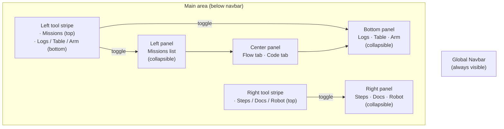

## Interface Overview

The Web IDE is built around a **tool-stripe + panel** layout. Panels are toggled on demand from icon strips on the left and right edges — there is no fixed three-column split. Only the panels you need are open at any time, giving the center editor maximum space.


### Layout structure

```
┌──────────────────────────────────────────────────────────┐
│                     Global Navbar                        │
├───┬──────────────────────────────────┬──────────────┬───┤
│   │  Left tool panel (collapsible)   │              │   │
│ L │  e.g. Missions list              │ Center panel │ R │
│   │                                  │ Flow / Code  │   │
│ S ├──────────────────────────────────┤              │ S │
│ T │  [panel resizer]                 │              │ T │
│ R ├──────────────────────────────────┴──────────────┤ R │
│ I │  Bottom panel (Logs / Table / Arm)              │ I │
│ P │                                                 │ P │
│   │  [bottom panel resizer]                         │   │
└───┴─────────────────────────────────────────────────┴───┘
           Status bar
```

| Area | Contents |
|------|----------|
| **Left tool stripe** | Mission list toggle (top); Logs / Table / Arm panel toggles (bottom) |
| **Left panel** | Missions list — collapsible, resizable |
| **Center** | Tab bar switching between **Flow** (flowchart editor) and **Code** (Python editor) |
| **Right tool stripe** | Steps / Docs / Robot panel toggles |
| **Right panel** | Steps library, Step Docs, or Robot Config — collapsible, resizable |
| **Bottom panel** | Logs, Table Visualization, or Arm Visualizer — collapsible, resizable |
| **Global Navbar** | Settings, Timestamps, Undo/Redo (flowchart tools); run-target dropdown; Run / Debug / Stop buttons; battery indicator |



*Panel layout: stripes on both edges toggle the adjacent panels; only one bottom and one right panel is open at a time.*

All panel widths and the active panel selection are persisted in `localStorage`, so the layout survives page reloads.

### Top bar (Global Navbar)

The navbar is always visible. When a device is connected and reporting hardware status, it shows:

- **Battery voltage** (`X.X V`) if the device reports voltage, or **battery percent** (`X%`) otherwise — displayed with a bolt icon and a tooltip showing the hostname.
- A **polling indicator**: device status is refreshed every **5 seconds**.

There is no raw IP address in the top bar. The IP is configured on the project's home page (before entering the project view), not shown in the editor.

### Center panel: Flow vs Code

The center area has two tabs:

| Tab | Icon | Description |
|-----|------|-------------|
| **Flow** | share-alt | Visual flowchart editor for the selected mission |
| **Code** | code | Full Python code editor (CodeMirror 6) for the mission's generated source |

Click either tab to switch views. Both views refer to the same mission — changes in one are reflected in the other after save/codegen.

### Panel persistence

The IDE stores the following in `localStorage` so your workspace is restored after reload:

| Key | What it stores |
|-----|----------------|
| `webide-active-tool-panel` | Which left panel is open (`missions` or none) |
| `webide-left-panel-width` | Width of the left panel in px |
| `webide-active-right-panel` | Which right panel is open (`steps`, `docs`, `robot`, or none) |
| `webide-right-panel-width` | Width of the right panel in px |
| `webide-active-bottom-panel` | Which bottom panel is open (`logs`, `table`, `arm`, or none) |
| `webide-bottom-panel-height` | Height of the bottom panel in px |

If your panel layout becomes corrupted (panels missing or wrong sizes), open the browser DevTools console and run `localStorage.clear()`, then reload.

---

## Next steps

- [Mission Panel]() — managing missions in the left panel
- [Flowchart Editor]() — editing missions in the center panel
- [Step Library]() — finding and adding steps from the right panel
- [Running a Mission]() — using the Run/Debug controls in the navbar
