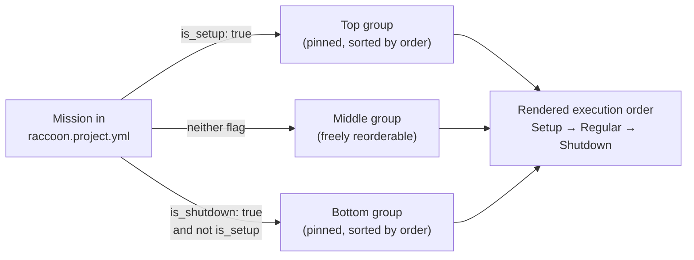

## Mission Panel (Left)

The Mission Panel is your project navigator. It lists every mission in execution order, lets you select which mission to edit in the flowchart, and gives you the controls to add, rename, delete, and reorder missions.

Toggle it open with the list icon at the top of the left tool stripe.

### Opening the panel

Click the **list** icon at the top of the left tool stripe. The panel slides open on the left side of the center editor. Click it again (or the minus button in the panel header) to collapse it.

### Mission list structure

Missions are displayed in execution order, partitioned into three groups:

| Group | Flag | Position in list |
|-------|------|-----------------|
| **Setup missions** | `is_setup: true` | Always at the top |
| **Regular missions** | neither flag | Middle, sorted by `order` number |
| **Shutdown missions** | `is_shutdown: true` | Always at the bottom |



*Partition logic applied by `updateTimelineData()` in `MissionPanel`.*

Any mission can be marked as a setup or shutdown mission — there is no special reserved name. If you need a mission that runs before the match starts, mark it `is_setup: true` via `raccoon create mission --setup <Name>` or by editing `raccoon.project.yml`. Similarly, `is_shutdown: true` marks a mission to run after the match ends.

This is a boolean flag on each mission, not a magic order number. Multiple setup missions are allowed (sorted among themselves by `order`).

### Selecting a mission

Click a mission row to load it into the flowchart editor (and code view). The selected mission is highlighted.

### Adding a mission

Click **+ Add Mission** at the bottom of the panel, or use the plus button in the panel header. A dialog prompts for the new mission's name.

### Renaming and deleting a mission

Right-click any mission to open the context menu:

- **Rename** — opens a rename dialog where you type the new class name. The file is renamed on disk and all references are updated.
- **Delete** — removes the mission from the project. This is irreversible from the UI.

### Reordering missions

Missions can be reordered interactively in the panel. Setup missions are pinned to the top and shutdown missions to the bottom; only the middle group can be freely reordered. The `order` field in `raccoon.project.yml` is updated automatically.

You can also reorder from the CLI:

```bash
raccoon reorder missions
```

### Back to Projects

The **Back to Projects** link inside the Mission Panel navigates to `/projects` (the local projects list), exiting the current project view.

---

## How mission numbering works

Missions in the Web IDE use 3-digit numeric prefixes: `M000`, `M010`, `M020`, …, `M999`. These numbers determine execution order but leave gaps for future insertions — increment by 10 so you can insert `M015` later without renumbering everything.

`M000` is conventionally the setup mission (`is_setup: true`), and `M999` is the shutdown mission (`is_shutdown: true`). All numbers between 001 and 998 are valid for regular missions.

The panel does not enforce gaps — you can use non-decade numbers like `M025` or `M027` when you need to insert between existing missions. The CLI tooling identifies missions by the 3-digit prefix, so always use exactly 3 digits.

See the programming section on [project structure]() for full naming rules.

---

## Cross-references

- [Flowchart Editor]() — editing the selected mission
- [Run Configurations]() — which missions run (and in what order) for a given config
