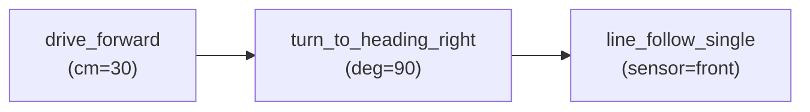

## Flowchart Editor (Center)

The main workspace for building missions visually. Each mission is represented as a flowchart of connected step nodes. Switch to it by clicking the **Flow** tab in the center panel tab bar.

## How it works

The flowchart is a **visual representation of the Python code that will run on the robot**. Each node is one step call; connections between nodes represent execution order (sequential by default). When you save the flowchart, the IDE backend's code generator (`MissionCodeGenerator`) converts the node graph into a Python class with a `sequence()` method containing the matching `seq()` / `parallel()` call tree.



This flowchart generates Python roughly equivalent to:

```python
def sequence(self) -> Sequential:
    return seq([
        drive_forward(cm=30),
        turn_to_heading_right(deg=90),
        line_follow_single(sensor=Defs.front_sensor).until(on_black(Defs.front_sensor)),
    ])
```

**Parallel branches** are represented by two or more nodes that share the same incoming connection — they become a `parallel([seq([...]), seq([...])])` call in Python.

**Important:** The flowchart and the Python file share the same source. If you edit the Python directly in the Code tab and then save the flowchart, your manual Python edits are overwritten. Treat flowchart saves as the authoritative update path.


**Nodes** represent steps (e.g. `calibrate`, `drive_forward`, `wait_for_button`). Each node shows its step name and any editable arguments inline.

**Connections** show execution order — arrows flow top-to-bottom in vertical layout, or left-to-right in horizontal layout.

### Editing

| Action | How |
|--------|-----|
| Add a step | Drag from the Step Library (right panel) onto the canvas, or double-click an empty connection line |
| Connect steps | Drag from the output dot of one node to the input dot of another |
| Edit arguments | Click an argument field directly on the node |
| Select multiple | Click-and-drag a selection rectangle on the canvas |
| Delete | Select one or more nodes and press `Delete` or `Backspace` |
| Navigate | `Arrow keys` to move focus between connected nodes |

### Keyboard shortcuts

| Shortcut | Action |
|----------|--------|
| `Ctrl+Z` / `Cmd+Z` | Undo |
| `Ctrl+Shift+Z` / `Ctrl+Y` / `Cmd+Shift+Z` | Redo |
| `Ctrl+S` / `Cmd+S` | Save the flowchart immediately |
| `Ctrl+K` / `Cmd+K` | Open Settings modal with the Keybindings tab active |
| `Delete` / `Backspace` | Delete selected node(s) |
| `Escape` | Deselect / cancel current operation |

### Flowchart toolbar (inline save indicator)

The flowchart component has a minimal inline toolbar — its only visible element is a **save-status indicator**:

- A spinning icon while saving
- A check icon briefly after a successful save
- No icon when idle

All other controls have moved to the **global navbar** and the **tool stripes**.

### Where the controls actually live

Controls that appear in the flowchart docs (older tutorials) but live elsewhere in the current UI:

| Control | Where it actually is |
|---------|---------------------|
| ⚙ Settings (gear icon) | Global navbar — far left of the flowchart tools section |
| 🕐 Timestamps toggle | Global navbar — clock icon, next to Settings |
| ↩ Undo / ↪ Redo | Global navbar — undo/redo icon buttons |
| ▶ Run / ■ Stop | Global navbar — green Run button (right side) |
| 🐛 Debug | Global navbar — bug icon next to Run |
| Run target selector | Global navbar — chip dropdown left of the Run button |
| Logs / Table / Arm panel toggles | **Left tool stripe** (bottom section) |
| Steps / Docs / Robot panel toggles | **Right tool stripe** |

The legacy **Sim** toggle (previously in the toolbar) is hidden and never shown. Run mode is controlled entirely by the run-target dropdown in the navbar.

### Orientation and auto layout

The flowchart orientation (vertical vs horizontal) and auto-layout setting are controlled from **Settings → Project tab** (⚙ gear in the navbar). Vertical is the default.

### Timestamps

When timestamps are enabled (clock icon in the navbar), each node shows the duration and elapsed time from the last run below its step name. Toggle with the clock icon or `Ctrl+K` opens settings for keybindings (not timestamps).

### Timing Panel

After a run completes, a **Timing Panel** overlay appears inside the flowchart canvas. It shows per-step durations as a list and optionally as a chart. The panel can be dragged to any position within the flowchart area. It is the only genuinely floating element remaining in the flowchart view.

---

## Cross-references

- [Step Library]() — finding steps to drag onto the canvas
- [Python Code Editor]() — viewing and editing the generated Python source
- [Running a Mission]() — running and debugging from the flowchart
- [Architecture]() — how a flowchart save becomes a Python file
