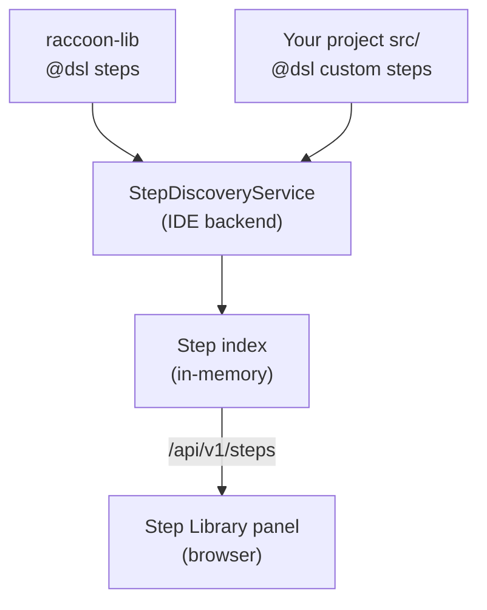

## Step Library (Right)

The Step Library panel lists all steps available to your project — both built-in raccoon steps and any custom steps you have defined locally. Toggle it open with the grid icon at the top of the right tool stripe.

## How step indexing works

The step index is built and served by the **local IDE backend** (your laptop), not the robot. The `StepDiscoveryService` scans two places:

1. The **installed raccoon package** on your machine — all built-in `@dsl`-decorated step functions
2. Your **project's `src/` directory** — any custom step functions you have decorated with `@dsl`

Only functions decorated with `@dsl` or `@dsl_step` appear in the Step Library. Unannotated helper functions are private and never shown.



**Consequence:** Steps are available **offline** — you do not need the robot connected to browse or search. If steps are missing, you need to refresh the index, not connect to the robot.

To build or refresh the index, open **Settings → Project tab** (⚙ gear in the navbar) and click **Refresh** under the Step Indexing section.

### Browsing

Steps are grouped by their **first tag** (`step.tags[0]`). If a step has no tags it is placed in an **Other** group. The groups are:

| Group | Typical contents |
|-------|-----------------|
| `drive` | Straight driving, distance moves |
| `motion` | Turns, arcs, combined moves |
| `sensor` | Sensor reading, line detection |
| `calibration` | Calibrate and tune steps |
| `servo` | Servo angle and position |
| `timing` / `wait` | Delay and wait steps |
| `control` / `concurrent` | Parallel execution, conditionals |
| **Other** | Steps with no tags |

Each group is **collapsible**. Collapse state is persisted in `localStorage`, so the groups you fold stay folded across reloads.

### Searching

Type in the search box at the top of the panel to filter steps. Search matches on **step name only** — it does not search tags or docstrings. Use the **Step Docs** panel (book icon, right tool stripe) for full-text search across docstrings.

### Adding a step to the flowchart

Drag any step from the Step Library onto the flowchart canvas. Drop it:

- **On an existing node** — inserts the new step after that node
- **On a connection line** — inserts the step between the two connected nodes
- **On empty canvas** — creates a disconnected node you can connect manually

You can also trigger an inline step picker by double-clicking an empty connection line in the flowchart.

### Keybinding a step for quick insert

Frequently used steps can be bound to a keyboard shortcut in **Settings → Keybindings tab**. Once bound, pressing the shortcut while the flowchart has focus inserts the step at the current selection point. See [Settings Modal]() for details.

---

## Step Docs Panel (Right)

The **Step Docs** panel is a companion to the Step Library. Toggle it with the book icon in the right tool stripe.

It provides rich documentation for every indexed step, including:

- Full **signature** with parameter names, types, and default values
- **Docstring** broken into prose, `Args:` table, and `Returns:` sections
- **Tags** shown as colour-coded chips
- **Search** across name, tags, brief description, and full docstring simultaneously

### Using Step Docs

1. Click the book icon in the right tool stripe.
2. Type in the search box to find a step. Unlike the Step Library search, the Docs panel searches the step name, all tags, the brief summary, and the full docstring.
3. Click any step row to expand it and read the full parameter table.
4. Click a tag chip to filter the list to only steps with that tag.

### Step Docs search scoring

The Docs panel uses a ranked search algorithm — results are sorted by relevance:

| Match location | Score boost |
|----------------|------------|
| Exact name match | +100 |
| Name starts with query | +60 |
| Query word in name | +30 per word |
| Query word in tags | +20 per word |
| Query word in brief | +8 per word |
| Query word in full docstring | +2 per word |

Steps that do not match all query tokens are excluded entirely.

---

## Making your custom steps appear in the library

Decorate your step factory functions with `@dsl` (imported from `raccoon`):

```python
from raccoon import dsl, seq

@dsl
def my_custom_step(arg1: int, arg2: str = "default"):
    """Do something custom.

    Args:
        arg1: First argument description.
        arg2: Second argument description.
    """
    return seq([
        # ... your step logic
    ])
```

After adding `@dsl` to a function, click **Refresh** in **Settings → Project tab** to update the index. The step will appear in the Step Library under the tag group matching its first `tags` entry (or in **Other** if no tags are defined).

Helper functions you do not want in the UI should remain unannotated — the IDE never shows them.

---

## Cross-references

- [Settings Modal]() — refreshing the step index
- [Flowchart Editor]() — dragging steps onto the canvas
- [Architecture]() — where step indexing fits in the overall system
